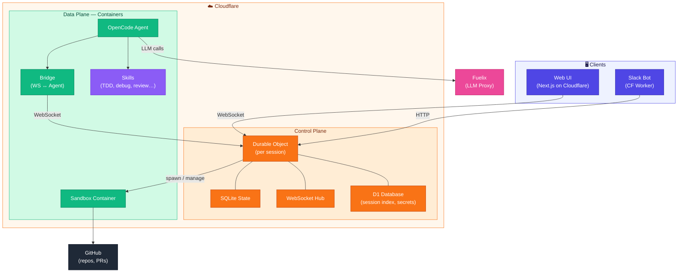

# Architecture Overview

```mermaid
graph TB
    subgraph Clients["🖥 Clients"]
        Web["Web UI<br/>(Next.js on Cloudflare)"]
        Slack["Slack Bot<br/>(CF Worker)"]
    end

    subgraph Cloudflare["☁️ Cloudflare"]
        subgraph CP["Control Plane"]
            DO["Durable Object<br/>(per session)"]
            SQLite["SQLite State"]
            WS["WebSocket Hub"]
            D1["D1 Database<br/>(session index, secrets)"]
        end

        subgraph DP["Data Plane — Containers"]
            Sandbox["Sandbox Container"]
            OC["OpenCode Agent"]
            Bridge["Bridge<br/>(WS ↔ Agent)"]
            Skills["Skills<br/>(TDD, debug, review…)"]
        end
    end

    Fuelix["Fuelix<br/>(LLM Proxy)"]
    GitHub["GitHub<br/>(repos, PRs)"]

    Web -- "WebSocket" --> DO
    Slack -- "HTTP" --> DO
    DO --- SQLite
    DO --- WS
    DO --- D1
    DO -- "spawn / manage" --> Sandbox
    Bridge -- "WebSocket" --> DO
    OC --> Bridge
    OC --> Skills
    OC -- "LLM calls" --> Fuelix
    Sandbox --> GitHub

    %% Styles
    style Web fill:#4F46E5,stroke:#3730A3,color:#fff
    style Slack fill:#4F46E5,stroke:#3730A3,color:#fff

    style DO fill:#F97316,stroke:#C2410C,color:#fff
    style SQLite fill:#F97316,stroke:#C2410C,color:#fff
    style WS fill:#F97316,stroke:#C2410C,color:#fff
    style D1 fill:#F97316,stroke:#C2410C,color:#fff

    style Sandbox fill:#10B981,stroke:#047857,color:#fff
    style OC fill:#10B981,stroke:#047857,color:#fff
    style Bridge fill:#10B981,stroke:#047857,color:#fff
    style Skills fill:#8B5CF6,stroke:#6D28D9,color:#fff

    style Fuelix fill:#EC4899,stroke:#BE185D,color:#fff
    style GitHub fill:#1F2937,stroke:#111827,color:#fff

    style Clients fill:#EEF2FF,stroke:#4F46E5,color:#1E1B4B
    style Cloudflare fill:#FFF7ED,stroke:#F97316,color:#7C2D12
    style CP fill:#FFEDD5,stroke:#F97316,color:#7C2D12
    style DP fill:#D1FAE5,stroke:#10B981,color:#064E3B
```
