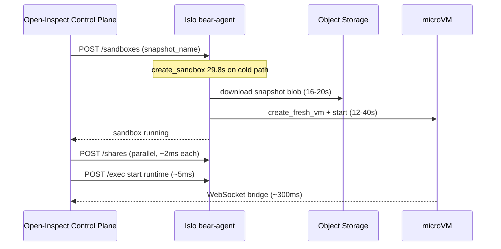

# Islo Sandbox Create Latency — Evidence Report

**Date:** 2026-06-07  
**Reporter:** Open-Inspect / Islo integration team  
**Data source:** ClickHouse Cloud (`islo-prod`), table `otel.otel_traces`, service `bear-agent`  
**Window:** trailing 24 hours unless noted

## Executive summary

Open-Inspect sandbox spawn latency is dominated by **Islo `create_sandbox`**, not by control-plane orchestration. In the trailing 24h:

| `create_sandbox` bucket | Share of creates | p50 | p90 | max |
|-------------------------|------------------|-----|-----|-----|
| **< 1s** | **2,504 (76%)** | 4ms | 658ms | 998ms |
| 1–5s | 242 (7%) | 3.4s | 4.8s | 5.0s |
| 5–20s | 389 (12%) | 7.7s | 13.2s | 19.1s |
| **≥ 20s** | **153 (5%)** | **43.0s** | **49.1s** | **74.4s** |

**Target:** sub-second sandbox availability for interactive sessions.

**Finding:** When a create misses the fast path, latency is almost entirely inside Islo VM provisioning — specifically snapshot object download and microVM boot. Post-create API calls (exec, shares, status) are already sub-10ms at p50.

---

## Observed spawn breakdown (Open-Inspect control-plane steps)

From control-plane logs for session `164e8125…` / sandbox `sandbox-adamgold-flask-dance-1780830240213`:

| Step | Duration | Owner |
|------|----------|-------|
| `create_sandbox` | **29.8s** | Islo |
| `wait_for_running` | 0.19s | Islo API round-trip |
| `create_shares` | 0.20s | Islo |
| `start_runtime` | 3.0s | Open-Inspect (fixed — removed artificial `sleep 2`) |
| **Total spawn → runtime** | **~33.7s** | |

After connected, prompt dispatch is fast (queue ~1ms, processing ~1.3s).

---

## ClickHouse proof — slow `create_sandbox` trace decomposition

For slow creates (≥ 20s), child spans under `create_sandbox` show where time is spent:

| Child span | Typical duration | What it is |
|------------|------------------|------------|
| **`download`** | **16.6–19.5s** | Snapshot blob fetch to bear-runner node |
| **`create_fresh_vm`** | **11.9–13.0s** | microVM boot from restored snapshot |
| Everything else | < 1ms | Routing, admission, disk placement |

### Recent slow creates (last 24h, ≥ 20s)

| Timestamp (UTC) | `create_sandbox` | `download` | `create_fresh_vm` |
|-----------------|------------------|------------|-------------------|
| 2026-06-07 11:47:54 | 43,030ms | — | 43,021ms |
| 2026-06-07 11:46:02 | 28,798ms | 17,206ms | 11,507ms |
| 2026-06-07 11:29:50 | 32,554ms | 19,526ms | 13,013ms |
| 2026-06-07 11:27:33 | 28,645ms | 16,618ms | 11,862ms |
| 2026-06-07 11:25:51 | 39,788ms | — | 39,777ms |

Pattern: cold path ≈ **download + VM boot**. Worst case is VM boot alone at **40–43s** with no local snapshot cache.

---

## ClickHouse proof — create path classification (24h)

Grouped by child spans under each `create_sandbox` trace:

| Path | Creates | p50 | p90 | max |
|------|---------|-----|-----|-----|
| **Cold: snapshot download + VM boot** | 54 | 6.1s | **38.3s** | 74.4s |
| VM boot, no download | 1,016 | 649ms | 10.6s | 51.5s |
| Cached / fast | 2,223 | 3ms | 6.0s | 74.4s |

Only **54 creates** explicitly recorded a `download` child span, but those are the worst offenders. The `vm_boot_no_download` bucket still has p90 **10.6s**.

---

## ClickHouse proof — Islo API latency is NOT the bottleneck

Post-VM API operations (trailing 24h, `bear-agent`):

| Span | Count | p50 | p90 | max |
|------|-------|-----|-----|-----|
| `POST /sandboxes/{name}/exec` | 5,476 | 5.4ms | 8.0ms | 413ms |
| `GET /sandboxes/{name}/exec/{exec_id}` | 18,144 | 1.4ms | 3.9ms | 5.0s |
| `GET /sandboxes/{name}/shares` | 169 | 1.6ms | 59.6ms | 190ms |
| `POST /sandboxes/{name}/shares` | 6 | 2.7ms | 4.1ms | 5ms |
| `GET /sandboxes/{name}` | 2,812 | 1.2ms | 4.2ms | 469ms |

Shares, exec, and status endpoints are already fast. **No additional client-side waiting is needed** before share creation.

---

## ClickHouse proof — VM infrastructure sub-steps (24h)

| Span | p50 | p90 | max |
|------|-----|-----|-----|
| `download` | 3.9s | **26.0s** | 52.1s |
| `create_fresh_vm` | 652ms | **11.5s** | 51.5s |
| `vm.start_runtime` | 394ms | 794ms | 4.2s |
| `snapshot.restore_local` | 1.97s | 9.9s | 20.2s |
| `snapshot.extract_local` | 1.97s | 9.9s | 20.2s |
| `create_vm_disks` | 42ms | 52ms | 1.5s |
| `disk.create_staging` | 27ms | 33ms | 552ms |
| `disk.create_overlay` | 11ms | 16ms | 816ms |
| `cluster.forward.capacity_request` | 3.4ms | 6.2s | 90.0s |

Disk creation is cheap. The expensive work is **snapshot I/O** and **VM boot**.

---

## What Open-Inspect changed on our side

We removed avoidable latency from the control-plane Islo provider:

1. **Removed `wait_for_share_api`** — unnecessary `listShares` probe before `createShare` (was ~200ms per spawn; share API p50 is 1.6ms).
2. **Removed `sleep 2` from `start_runtime`** — replaced with immediate PID check in a single exec (was ~3s per spawn).
3. **Skip `wait_for_running`** when `createSandbox` already returns `status: running`.
4. **Parallelize `create_shares` + `start_runtime`** when tunnel env file is not required.
5. **Parallelize all share creations** (code-server, ttyd, tunnel ports) via `Promise.all`.
6. **Tighter exec/share retry polling** (100ms intervals instead of 500–1000ms).

These changes target the ~3–4s of self-inflicted latency. They do **not** address the 20–74s Islo cold-create path.

---

## Requests for Islo infra

### P0 — Sub-second create for warm snapshots

76% of creates are < 1s. 5% are ≥ 20s (avg **41s**). We need the fast path to be the **default** for production snapshot `open-inspect-runtime-*`.

**Ask:**
- Keep snapshot blobs **pre-positioned** on all bear-runner nodes that accept creates.
- Avoid cross-node `download` on the create hot path (54 cold downloads in 24h, up to 52s each).

### P0 — Cap VM boot time for snapshot restores

`create_fresh_vm` p90 is **11.5s**, max **51.5s**, even without download.

**Ask:**
- Profile snapshot restore boot (`vm.start_runtime` + `create_fresh_vm`) and target **< 500ms** for pre-baked runtime snapshots.
- Investigate why some restores take 40s+ with no download child span.

### P1 — Snapshot locality / warm pool

**Ask:**
- Rendezvous snapshot to the same node that will run the sandbox before create returns.
- Consider a **warm VM pool** from `open-inspect-runtime` snapshot (similar to Modal warm pools).

### P1 — Reduce snapshot size

`download` scales with artifact size. Open-Inspect runtime snapshot includes Python venv, Node, OpenCode, and agent tooling.

**Ask:**
- Confirm compression/delta delivery for snapshot transfer.
- Share expected download times for current snapshot size vs. target size.

### P2 — Observability

**Ask:**
- Add `sandbox.name` to all `bear-agent` span attributes (currently difficult to correlate per-sandbox from ClickHouse).
- Emit explicit span when create blocks on `download` vs. `create_fresh_vm` vs. capacity forwarding.

---

## Reproduction queries

Run against ClickHouse service `19070f41-6d61-4e4a-ade3-63688a0c603f`:

```sql
-- create_sandbox latency distribution (24h)
SELECT
  if(Duration < 1e9, '<1s', if(Duration < 5e9, '1-5s', if(Duration < 20e9, '5-20s', '>=20s'))) AS bucket,
  count() AS creates,
  round(quantile(0.5)(Duration)/1e6, 0) AS p50_ms,
  round(quantile(0.9)(Duration)/1e6, 0) AS p90_ms,
  round(max(Duration)/1e6, 0) AS max_ms
FROM otel.otel_traces
WHERE Timestamp >= now() - INTERVAL 24 HOUR
  AND ServiceName = 'bear-agent'
  AND SpanName = 'create_sandbox'
GROUP BY bucket
ORDER BY bucket;
```

```sql
-- Slow create decomposition (child spans)
WITH slow AS (
  SELECT TraceId, SpanId, Timestamp, Duration
  FROM otel.otel_traces
  WHERE Timestamp >= now() - INTERVAL 24 HOUR
    AND ServiceName = 'bear-agent'
    AND SpanName = 'create_sandbox'
    AND Duration >= 20e9
  ORDER BY Timestamp DESC
  LIMIT 10
)
SELECT s.Timestamp AS root_ts,
  round(s.Duration/1e6, 0) AS create_sandbox_ms,
  c.SpanName AS child_span,
  round(c.Duration/1e6, 0) AS child_ms
FROM slow s
JOIN otel.otel_traces c ON c.TraceId = s.TraceId AND c.ParentSpanId = s.SpanId
WHERE c.ServiceName = 'bear-agent'
  AND c.SpanName IN ('download', 'create_fresh_vm', 'vm.start_runtime', 'snapshot.restore_local')
ORDER BY s.Timestamp DESC, child_ms DESC;
```

```sql
-- Post-create API latency (should stay <10ms p50)
SELECT SpanName,
  count() AS c,
  round(quantile(0.5)(Duration)/1e6, 1) AS p50_ms,
  round(quantile(0.9)(Duration)/1e6, 1) AS p90_ms
FROM otel.otel_traces
WHERE Timestamp >= now() - INTERVAL 24 HOUR
  AND ServiceName = 'bear-agent'
  AND SpanName IN (
    'POST /sandboxes/{name}/exec',
    'GET /sandboxes/{name}/exec/{exec_id}',
    'GET /sandboxes/{name}/shares',
    'POST /sandboxes/{name}/shares'
  )
GROUP BY SpanName
ORDER BY p90_ms DESC;
```

---

## Appendix — Architecture context



**Bottom line:** Open-Inspect can optimize orchestration down to ~100ms after the VM is running. Getting total spawn under 1 second requires Islo to deliver **`create_sandbox` < 1s at p99** for the `open-inspect-runtime` snapshot.
