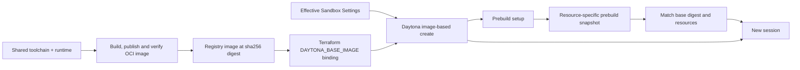

# Daytona OCI base image hard cutover

## Decision and intended behavior

Replace the Terraform-built, resource-sized Daytona **base snapshot** with a
published, immutable OCI runtime image. CPU and RAM are chosen when a new sandbox
is created, from the effective Sandbox Settings. There are no resize calls, legacy
base-snapshot fallbacks, dual launch modes, or SDK-version-dependent switches.

This changes the base artifact, not the repository prebuild artifact: repository
and environment prebuilds remain Daytona filesystem snapshots. A prebuild is made
by launching the OCI runtime with that scope's resource allocation, running setup,
then capturing it. Sessions use a prebuild only when its resource configuration
and base image match; otherwise they launch the OCI image at their own requested
allocation and perform setup normally. Existing sandboxes retain stop/start
semantics and their original allocation. Settings changes affect **new** sandboxes,
not an already-running or resumed sandbox.

## Verified starting point and provider contract

- `packages/daytona-infra/src/toolchain.py` currently builds an SDK `Image` and
  immediately calls `snapshot.create(CreateSnapshotParams(... resources ...))`.
- `terraform/modules/daytona-infra` installs its resource-sized name in
  `DAYTONA_BASE_SNAPSHOT`; both session and prebuild create requests use it.
- The build planner resolves scope Sandbox Settings but carries only timeout into
  `ImageBuildPlan`. The Daytona provider ignores session CPU/RAM settings.
- Repository fingerprints currently cover ordered repository identity and branch
  only. They cannot distinguish resource allocations or base image changes.
- Daytona's pinned Python SDK 0.211.2 translates `CreateSandboxFromImageParams`
  into `POST /sandbox` with `buildInfo.dockerfileContent` and top-level `cpu`,
  `memory`, and optional `disk`. It does **not** send a top-level `image` field.
  A string image becomes an SDK-generated `FROM` Dockerfile.
- CPU and RAM are integral API quantities; RAM uses GiB. Snapshot reads expose
  resource metadata as `cpu` and `mem`. Snapshot-based creates inherit resources.
- Image-based creation can pass through `pending_build`, `building_snapshot`, and
  `pulling_snapshot` before startup. Cold pulls must fit the existing lifecycle
  deadline and emit actionable errors, not be treated as instant readiness.

References: [Daytona scaling](https://www.daytona.io/docs/en/scale/),
[SDK create contract](https://www.daytona.io/docs/en/typescript-sdk/daytona/),
and the installed `daytona==0.211.2` / `daytona-api-client==0.211.2` implementation.
The SDK documentation describes logical inputs; the pinned generated client and
SDK translation establish the REST request shape used by the control plane.

## Architecture and ownership

- `sandbox-images` remains the single owner of dependencies, frozen locks,
  allowlisted build context, runtime environment, and smoke checks.
- `daytona-infra` is a thin OCI publishing/native-verification adapter. It does
  not gain a parallel dependency recipe. Reuse the shared layered Dockerfile with
  a runtime target/overlay rather than duplicating the installer.
- Registry publication belongs to the trusted deployment build step, not
  Terraform local-exec and not the control plane. Terraform accepts a verified
  digest as input. Removing the old module does not delete retained artifacts.
- The control plane owns settings resolution, immutable build configuration,
  compatibility, and lifecycle. Daytona REST owns translation only.

## OCI build, publication, verification and deployment

1. Pack the existing allowlisted Daytona bundle. Never use the whole checkout as
   Docker context. No `.env`, SCM credentials, provider keys, or registry credentials
   enter the context, Dockerfile, layers, or image environment.
2. Build a Linux/amd64 runtime OCI image using the shared installation stages.
   Bake the plan's runtime environment and `SANDBOX_VERSION`; use the production
   Python runtime entrypoint, work directory, and root user. The reference-image
   smoke-test default for other providers must remain unchanged.
3. Publish to a configured `DAYTONA_IMAGE_REPOSITORY` using Docker's authenticated
   credential store. GHCR is the CI default registry, but the build helper accepts
   a registry-qualified repository. Publish a unique candidate tag and obtain the
   pushed manifest digest from build metadata. Deploy only `repository@sha256:...`.
   Do not use a tag lookup as the authoritative digest after push.
4. Create a temporary Daytona sandbox from that exact digest, explicitly selecting
   resources and deferred startup. Verify reported allocation plus the existing
   native smoke test, then delete the sandbox in `finally`. A verification failure
   must not output a deployable result. The registry candidate may remain for
   investigation; its publication is not a traffic switch.
5. Native verification exercises at least the default 2 GiB allocation and a
   different allocation (4 GiB), proving resource-independent launch of one digest.
   Tests for failure paths mock the provider; no implicit live calls in unit tests.
6. Emit the existing `{ "reference": "registry/repository@sha256:..." }` result.
   Manual callers pass it as `daytona_base_image` to Terraform. CI's main-only
   apply job runs this build gate and exports the exact result as
   `TF_VAR_daytona_base_image` before apply. It must not recompute/resolve a tag.
7. `daytona_base_image` becomes the required Daytona Terraform input and
   `DAYTONA_BASE_IMAGE` the Worker binding. Remove the old base snapshot name,
   memory variables, module, bootstrap flow, tests, and workflow assignments.
   Terraform itself no longer builds the Daytona artifact.
8. CI PR jobs build/verify the local container without publishing and without
   production credentials. Only the trusted main deployment job gets packages
   write and registry login. Plans use an explicit configured digest or the
   currently deployed Terraform output; a first deployment needs the apply build
   gate or a manually built digest. Do not invent a placeholder digest for plans.

Registry visibility is an installation choice. A private production image must
remain private. Configure Daytona's organization registry integration with a
read-only pull credential for private images; this credential is not a sandbox
environment variable or a control-plane secret. Document GHCR package access and
retention. Native verification fails clearly if Daytona cannot pull the digest.
No package publication or production Terraform apply is part of this PR task.

## Resource settings and creation contract

One provider-local resource resolver is used by session creation and prebuild
planning. Effective settings keep the existing global/repo/environment precedence.
Unset or explicit null CPU/RAM means Daytona's application default: 1 CPU and
2048 MiB. Defaults are declared once in control-plane code, not duplicated in
Terraform. The deployment no longer needs a memory environment variable.

The generic UI allows fractional CPUs and MiB increments that Daytona cannot
represent. Normalize **up** to positive whole CPU cores and whole GiB, avoiding
under-provisioning (e.g. 0.5 CPU -> 1, 1536 MiB -> 2 GiB). Reject invalid or unsafe
numeric values rather than silently defaulting. Use the normalized allocation for
creation and compatibility. Document rounding; organization quota failures remain
provider errors. Do not invent universal quota limits. Disk/GPU are not new UI
settings in this change and retain provider defaults.

The REST create type is an exclusive union: snapshot create OR image/buildInfo
create. Image references must be fully qualified and digest-pinned; reject
whitespace, newlines, tags-only inputs, and Dockerfile injection. Image create
uses a `FROM <validated digest>` Dockerfile with a known production entrypoint if
the provider requires it. Snapshot create must not carry resource overrides.
Reuse a single helper for this request construction across sessions and builds.

Build sources continue to start dormant with only non-secret environment markers;
bind their provider ID before launching setup via the existing stdin channel.
SCM tokens and repo secrets must not enter the OCI image, buildInfo Dockerfile, or
capturable create environment. Keep capture reservation, retry classification,
ownership checks, cleanup intent, and TTL behavior intact.

## Immutable prebuild compatibility

Keep repository fingerprint semantics intact. Add an internal nullable
`build_configuration_key` field to `image_builds` through a new D1 migration.
For Daytona, its canonical value includes a version discriminator, exact base OCI
digest, and normalized CPU/memory. Other providers leave it null and preserve
their behavior. A null/old key on a Daytona image is a hard-cutover miss.

Resolve settings and this key **once before registration**, capture the settings
in the resolved target, register the key, and use that same target to produce the
build plan. Secrets still load only after registration. Never re-read resources
after writing a key and accidentally launch a different allocation.

The key participates in ready-image stale checks, scheduler rebuild decisions,
and spawn selection. Session selection computes its key from the session's frozen
Sandbox Settings and the current deployment base digest, not newly edited scope
settings. A mismatch is a cache miss, not a failed artifact: fall back to OCI,
leave cleanup to the existing reaper, and do not invalidate another session's
valid snapshot. Validate captured/restored Daytona resource metadata as a second
check; mismatched or missing metadata must not silently run at the wrong size.

CPU/RAM changes need no destructive synchronous invalidation because spawn
matching is authoritative. Schedule a best-effort rebuild for affected enabled
scopes when Sandbox Settings are saved/deleted (global, repo, environment), using
existing workflow/scheduler facilities. The periodic scheduler also detects drift
and retries if a save races an in-flight older build. Do not delete an in-flight
source merely because a setting changed. A build completed with the old key is
safe but cannot match sessions requesting the new key.

Base image digest changes use the same key mechanism: old images are not used for
new sessions, and the scheduler rebuilds. Existing sandbox resume remains in place
and does not pretend to apply new resource settings.

## Hard cutover and operations

1. Prepare the registry repository and pull integration; retain private visibility.
2. Build/publish and native-verify the new OCI digest.
3. Deploy the D1 migration before the new Worker through existing migration order.
4. Deploy the Worker with `DAYTONA_BASE_IMAGE`; there is no fallback to
   `DAYTONA_BASE_SNAPSHOT`. Old Daytona prebuild rows have null compatibility keys
   and are not selected. Do not eagerly delete old snapshots/sandboxes.
5. Rebuild enabled scopes. During rebuilding, sessions launch from OCI at their
   selected resources. Validate two scopes with different memory allocations,
   snapshot metadata, matching snapshot sessions, and mismatched-settings fallback.
6. Remove obsolete deployment variables and old snapshot resources only after
   references are retired. Existing cleanup obligations remain processable even
   without any base-image configuration; cleanup does not create new sandboxes.

Rollback is a deployment operation, not a compatibility layer: revert Worker and
Terraform configuration together to the previous release/artifact if necessary.
The additive database column need not be dropped. Keep prior artifacts through
the observation window. Do not auto-delete registry images used by retained
prebuilds or existing deployments.

## Verification and acceptance criteria

- OCI image has the expected runtime environment, entrypoint and version, and no
  build secrets; shared dependency/installer tests and native-amd64 container CI.
- Publisher tests cover exact pushed digest, failure-before-result, native cleanup,
  private registry failure, command argument boundaries, and no live unit calls.
- REST request tests prove exact SDK-compatible buildInfo/resources and mutually
  exclusive snapshot/image requests; no resource fields on snapshot creation.
- Defaults, nulls, overrides, MiB conversion/rounding, invalid inputs, and same
  resolver use for build/session paths are tested.
- Database integration tests cover registration, readback, stale checks and legacy
  null keys. Selection tests cover matching/mismatching digest/resources, other
  providers, frozen session settings, and fallback without marking an image bad.
- Planner/scheduler tests prove a single resolved settings snapshot drives both
  allocation and key, including settings changes during a build and cron recovery.
- Terraform/workflow tests prove old variables are gone, digest validation,
  publish-before-apply ordering, no PR publication, and the exact verified digest
  reaches the Worker. Full relevant TypeScript/Python and Terraform checks pass.
- Local absence of Docker/provider access is reported honestly; CI local-container
  checks and an explicitly credentialed native deployment gate cover those layers.
- No resizing, no resource-specific base-snapshot fleet, no unrelated provider
  lifecycle changes, and no automatic production deployment from this task.

## Implementation work packages

1. Control plane: OCI REST/config contract, resource resolver, build plan threading,
   compatibility persistence/selection/rebuild and focused/integration tests.
2. Build/deployment: OCI runtime target, publisher/native verifier, Terraform hard
   cutover, trusted CI publication, operator docs and regression tests.
3. Integrate, independently review the contracts and race cases, run required
   checks, and publish a ready-for-review PR with explicit deployment prerequisites
   and verification evidence.
