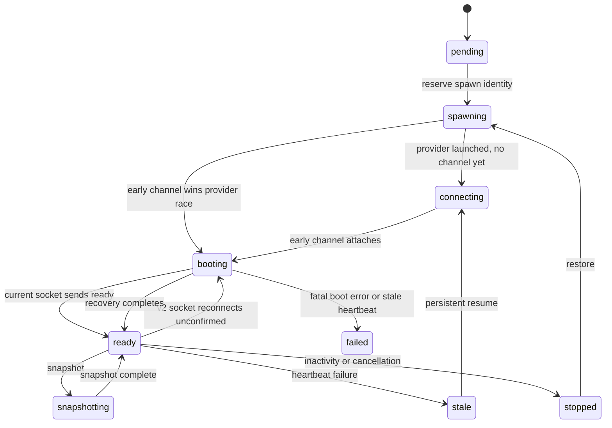

# Early Sandbox Control Channel

## Status

Proposed design. This document replaces a total sandbox boot-duration watchdog with an early,
authenticated control connection, continuous runtime liveness, explicit execution readiness, and
bounded boot phases.

PR #1581 remains a tactical mitigation for the current architecture. Its boot-progress endpoint and
absolute boot deadline are not part of the target architecture described here.

## Summary

The control plane currently starts a connecting watchdog before a sandbox clones repositories, runs
repository hooks, starts OpenCode, and launches the bridge. The bridge connects only after all of
that work finishes. A fixed connecting timeout therefore cannot distinguish a dead runtime from a
healthy but slow boot.

The target model connects the sandbox runtime to the control plane as soon as the supervisor starts,
before repository or OpenCode initialization. That connection proves only that the runtime is alive.
It does not make the sandbox eligible for prompt dispatch. The runtime sends ordinary heartbeats
through the same connection while booting and sends an explicit `ready` event only after repository
boot, managed-skill installation, OpenCode health, restored-session validation, and Git-signing
initialization succeed.

This creates three distinct concepts:

- **Connected**: an authenticated runtime control channel exists.
- **Alive**: that channel continues to deliver heartbeats.
- **Ready**: the runtime has explicitly declared that it can execute prompts.

There is no total boot-duration timeout. A healthy runtime may remain booting as long as its
configured work requires. Dead runtimes are detected by the heartbeat timeout. Stuck boot operations
are detected by phase-specific deadlines. A short attach deadline remains before the first control
connection because that interval represents process launch, not repository boot.

## Decisions

| Area                  | Decision                                                                                                  |
| --------------------- | --------------------------------------------------------------------------------------------------------- |
| Control transport     | Use one sandbox WebSocket for boot liveness, readiness, commands, and events.                             |
| Connection timing     | Start the control connection before repository boot and OpenCode startup.                                 |
| Readiness             | Make the existing runtime `ready` event the authoritative transition for prompt execution.                |
| Prompt gating         | Dispatch only through the active socket after that socket has declared readiness.                         |
| Boot liveness         | Use the existing heartbeat mechanism in both booting and ready states.                                    |
| Boot progress         | Treat phase transitions as diagnostics and UX state, never as timeout extensions.                         |
| Total boot timeout    | Remove it after all individual boot phases are bounded.                                                   |
| Pre-connect timeout   | Retain a short process-attach deadline after provider launch.                                             |
| Provider calls        | Give provider operations explicit provider-specific request/lease deadlines.                              |
| Runtime process model | Start the bridge process early and use a local bidirectional control pipe between supervisor and bridge.  |
| Lifecycle state       | Add `booting`; keep channel readiness as socket-local state recoverable across DO hibernation.            |
| Reconnect policy      | Every newly admitted v2 socket starts unconfirmed and must re-announce its current runtime state.         |
| Compatibility         | Opt in through the launch contract and use a dedicated v2 path; preserve legacy late connect by default.  |
| Protocol ownership    | Define the canonical TypeScript contract in shared and parity-test the Python runtime mirror.             |
| Rollout               | Publish inactive v2 support and compatible images in either order; activate only after both are verified. |

## Problem

### The watchdog measures the wrong interval

For an interactive fresh boot, the runtime currently performs this sequence:

1. Start optional desktop support.
2. Clone or synchronize repositories.
3. Run each repository's setup hook.
4. Wait for tunnel configuration.
5. Run each repository's start hook.
6. Materialize managed skills.
7. Start code-server and the web terminal.
8. Prepare and start OpenCode.
9. Wait for OpenCode health.
10. Start the bridge subprocess.
11. Validate a restored OpenCode session.
12. Fetch and apply Git-signing configuration.
13. Open the sandbox WebSocket.

The control plane's connecting watchdog begins around provider startup, before this sequence. Fresh
multi-repository sessions are the most visible failure case because they cannot use a single-repo
prebuilt image and run setup hooks sequentially. One clone or setup hook can exceed the current
connecting timeout by itself.

### Removing every timeout is not safe

Without another failure detector, deleting the connecting timeout leaves several permanent states:

- the provider creates compute but the supervisor never starts;
- the supervisor crashes before starting the bridge;
- OpenCode never becomes healthy;
- a repository operation waits forever;
- the session retains `spawning` or `connecting` and later spawn attempts skip it;
- one-shot bot prompts remain pending without another user message to re-drive the queue;
- provider compute runs until its provider-enforced sandbox lifetime.

The system needs liveness and operation deadlines. It does not need one wall-clock deadline covering
every kind of startup work.

### Boot-progress polling is a tactical workaround

PR #1581 adds an authenticated HTTP endpoint and a runtime task that posts every 30 seconds. Those
requests prove that the supervisor event loop is alive, but they do not prove that boot work is
advancing. A blocked subprocess can coexist with an indefinitely healthy ping task. The PR therefore
adds a second, absolute 15-minute deadline.

That solves the immediate false timeout but leaves two arbitrary clocks and a boot-only liveness
protocol alongside the existing runtime heartbeat protocol. It also permits a sufficiently large
healthy multi-repository boot to encounter the absolute deadline.

The durable fix is to make the existing control channel available during boot.

## Current Architecture

### Connection currently implies readiness

The sandbox WebSocket authenticator currently performs execution-readiness side effects immediately
after accepting a socket:

- persists sandbox status as `ready`;
- broadcasts `sandbox_status: ready`;
- seeds activity and heartbeat timestamps;
- schedules inactivity monitoring;
- starts processing pending messages.

The later sandbox `ready` event pins repository baselines, records runtime version, persists a
timeline event, and broadcasts metadata. It does not control prompt dispatch.

### The queue is socket-gated

`SessionMessageQueue` checks for an active sandbox socket. It does not independently require:

- a persisted ready state;
- a ready event from the current socket;
- OpenCode health;
- an execution-ready capability.

Moving the current bridge connection earlier without changing this gate would dispatch prompts while
repositories and OpenCode are still booting.

### The bridge has pre-connect execution dependencies

The bridge currently validates a restored OpenCode session and initializes Git signing before
opening its WebSocket. Git signing requires a valid repository manifest and checked-out Git
repositories. The bridge cannot simply be launched earlier without moving those steps behind the
connection.

### One socket owns control and execution

The current WebSocket registry maintains one active sandbox socket. This is a useful invariant and
should remain. The target model does not add separate boot and execution sockets; it changes the
capabilities of one socket over its lifetime.

## Goals

- Establish authenticated sandbox liveness before repository initialization begins.
- Distinguish control-channel connectivity from execution readiness.
- Prevent prompt dispatch until the current socket explicitly becomes ready.
- Use one heartbeat mechanism for booting, ready, reconnecting, and recovering runtimes.
- Remove the total boot-duration deadline.
- Bound every awaited boot phase at the operation that can become stuck.
- Preserve provider-neutral lifecycle and queue behavior.
- Preserve prompt ordering and at-most-one processing message.
- Preserve sandbox identity and token fencing across replacement attempts.
- Preserve WebSocket hibernation and reconnect behavior.
- Support mixed-version publication in either order with a separate activation barrier.
- Improve user-visible boot diagnostics without making diagnostic progress affect liveness.

## Non-Goals

- Removing inactivity, execution, heartbeat, provider request, hook, or sandbox-lifetime timeouts.
- Making setup hooks unbounded.
- Running image-build sandboxes through a session control channel; image builds retain their
  callback and execution-timeout model.
- Exposing repository-hook stdout or secrets to clients.
- Supporting multiple simultaneous sandbox control sockets for one session.
- Redesigning provider snapshot, pause, hibernate, or restore APIs.
- Persisting a complete history of every boot phase transition.
- Adding a durable runtime event outbox; bridge-process death falls back to control-plane liveness
  failure for events not yet acknowledged.

## Terminology

### Provider startup

The control-plane operation that asks Modal, Daytona, E2B, OpenComputer, or Vercel to create,
restore, or resume compute and launch the sandbox entrypoint.

### Attach

The first successful authenticated v2 control-channel connection for one logical sandbox identity.
Attach proves that the runtime process started and can communicate with the control plane.

### Booting

The runtime is attached and alive but cannot accept prompts. Repository synchronization, hooks,
managed-skill installation, OpenCode startup, or execution initialization may still be running.

### Ready

The current control socket has declared that execution dependencies are initialized. The control
plane may dispatch pending prompts through that socket.

### Boot phase

A diagnostic label describing the current initialization operation. A phase is useful for UI,
logging, and phase-specific error messages. It does not extend a deadline.

### Logical sandbox identity

The control-plane-generated sandbox ID and authentication token reserved for one spawn attempt. All
channel admission, phase updates, readiness transitions, provider commits, and failures remain
fenced to this identity.

## Target State Model

The model separates provider lifecycle, channel liveness, and execution capability.

| Dimension            | Values                                                                                       | Authority                                                    |
| -------------------- | -------------------------------------------------------------------------------------------- | ------------------------------------------------------------ |
| Provider lifecycle   | pending, spawning, connecting, warming, booting, ready, snapshotting, stopped, stale, failed | Session DO sandbox row                                       |
| Channel attachment   | absent, attached                                                                             | Active WebSocket registry and hibernation attachment         |
| Channel liveness     | heartbeat timestamp                                                                          | Server receipt time in sandbox row                           |
| Execution capability | unconfirmed, ready                                                                           | Active socket attachment, reflected by coarse sandbox status |
| Boot diagnostics     | phase and phase start time                                                                   | Sandbox row, updated by authenticated runtime events         |

`booting` is added to the shared `SandboxStatus` contract. It means the early control channel is
attached but execution is not ready. `connecting` is narrowed to the interval after provider launch
and before attach.



Channel attachment does not need a separate durable enum. An active socket is attached. On Durable
Object hibernation, the socket's serialized attachment records the logical sandbox ID, protocol
version, and whether that exact socket has declared readiness.

## Target Startup Sequence

```mermaid
sequenceDiagram
    participant CP as Session Control Plane
    participant P as Sandbox Provider
    participant S as Supervisor
    participant B as Bridge / Control Channel
    participant O as OpenCode

    CP->>P: create or restore sandbox
    P->>S: launch entrypoint
    S->>B: start bridge process with local control pipe
    B->>CP: connect /sessions/:id/runtime-control
    CP->>CP: persist booting; seed heartbeat; do not dispatch
    B->>CP: heartbeat(state=booting, phase=repository_sync)
    S->>S: sync repositories and run hooks
    S->>B: local phase updates
    B->>CP: boot_phase transitions
    S->>O: start OpenCode and await health
    S->>B: local execution_dependencies_ready
    B->>B: validate OpenCode session and initialize Git signing
    B->>CP: ready (current socket)
    CP->>CP: mark socket ready and persist sandbox ready
    CP->>B: dispatch pending prompt
    B->>CP: heartbeat(state=ready)
```

### Fresh, restore, and prebuilt boots

All interactive boot modes attach at the same point: immediately after the supervisor starts. Their
later phases differ but their liveness semantics do not.

- **Fresh**: repository sync, setup hooks, start hooks, managed skills, OpenCode, execution init.
- **Snapshot restore**: repository refresh, start hooks, managed skills reconciliation, OpenCode,
  execution init.
- **Prebuilt image**: incremental repository sync, start hooks, managed skills reconciliation,
  OpenCode, execution init.
- **Image build**: no session control channel; retain the build callback and bounded image-build
  execution path.

## Runtime Architecture

### Start the existing bridge process early

The bridge remains a subprocess so its existing restart isolation and log forwarding remain intact.
`SandboxSupervisor` starts `AgentBridgeProcess` before desktop and repository boot instead of after
OpenCode health.

The bridge startup path changes order:

1. Load static session and sandbox connection configuration.
2. Open the v2 control WebSocket.
3. Start heartbeat delivery with state `booting`.
4. Receive shutdown and protocol-management commands.
5. Wait for the supervisor's local execution-ready signal.
6. Validate or clear the restored OpenCode session ID.
7. Fetch and apply Git-signing configuration.
8. Send the authoritative `ready` event.
9. Enable prompt, push, snapshot, and attachment command handling. Shutdown remains boot-safe.

Git signing and restored-session validation move behind the control connection because they require
the repository and OpenCode. A failure in those steps becomes a connected boot failure rather than a
pre-connect retry loop.

### Local supervisor-to-bridge protocol

The supervisor and bridge need a local channel because readiness is determined by work owned by the
supervisor. Use a bidirectional Unix socket pair created by `AgentBridgeProcess` and passed to the
child with `pass_fds`.

The local protocol is newline-delimited JSON with a small internal schema:

```json
{"type":"boot_phase","phase":"repository_sync","startedAt":1787858000.0}
{"type":"execution_dependencies_ready"}
{"type":"execution_dependencies_unavailable","phase":"opencode_restart"}
{"type":"boot_failed","code":"primary_start_failed"}
{"type":"shutdown"}
```

The bridge replies with:

```json
{"type":"execution_ready"}
{"type":"execution_initialization_failed","code":"git_signing_invalid"}
```

This protocol is process-local and Python-only. It is not exported through `@open-inspect/shared`.
Python durations and timestamps retain seconds in names and values.

`AgentBridgeProcess` stores the supervisor's latest desired state. If the bridge crashes and is
restarted, the parent replays the current phase or execution-ready signal. This prevents a restarted
bridge from waiting forever for a one-shot message already sent to its predecessor.

### Fail closed before readiness

Before local execution initialization succeeds, the bridge accepts only:

- control-plane shutdown;
- control-plane stop;
- acknowledgements for runtime events;
- connection-level ping/pong;
- future explicitly classified boot-control commands.

Any prompt or execution command received before readiness is a protocol error. The bridge records a
structured local invariant violation and does not execute it. The control plane must not rely on
this guard or a runtime response for normal flow; queue gating is authoritative and tests prove the
send path is unreachable.

### Heartbeats and phase transitions

The bridge starts heartbeat delivery immediately after v2 attachment. Heartbeats carry the bridge's
current state and optional phase:

```json
{
  "type": "heartbeat",
  "sandboxId": "sandbox-...",
  "timestamp": 1787858000.0,
  "status": "booting",
  "phase": "setup"
}
```

The control plane ignores the runtime timestamp for liveness and stores its own `Date.now()` value.
Phase transitions may be sent immediately for UI responsiveness, while heartbeats repeat the latest
phase for reconnect recovery.

## Control-Plane Architecture

### Fail-closed v2 WebSocket admission

Add a dedicated `/sessions/:id/runtime-control` WebSocket path. It uses the same bearer token and
`X-Sandbox-ID` checks as the current sandbox connection but has different admission side effects. It
must not be represented only by a new `type` query value on `/sessions/:id/ws`: the current old
control plane treats unknown connection types as browser clients and may accept them. An old worker
rejects the dedicated path in the top-level WebSocket router before the request reaches the Durable
Object, so an early runtime can never be mistaken for an execution-ready legacy socket.

Protocol selection is made out of band in the provider launch contract. The control plane sets
`SANDBOX_CONTROL_PROTOCOL_VERSION=2` only when the early-channel activation flag is enabled. A
runtime that receives exactly `2` opens the dedicated path. If the variable is absent, it follows
the existing late bridge startup and `/sessions/:id/ws?type=sandbox` path. Unknown values are fatal
configuration errors; the runtime does not probe or downgrade.

The v2 endpoint has this exact negotiation contract:

- successful authenticated upgrade returns `101` and selects protocol version 2;
- a worker without the route returns a non-`101` response and cannot register the socket;
- `401`, `403`, `404`, `409`, `410`, any other non-`101` response, TLS failure, and timeout are v2
  attach failures, not reasons to retry through the legacy path;
- legacy mode is selected only by absence of the launch-contract variable, never by interpreting a
  network response.

This deliberately avoids runtime capability probing. The spawning control plane knows its own
capabilities and is the only authority allowed to opt a sandbox into v2.

V2 admission:

1. Verify logical sandbox ID and token.
2. Recheck session and sandbox state after asynchronous authentication.
3. Accept and register the socket as the current sandbox control socket.
4. Serialize protocol version, sandbox ID, and `executionReady: false` on the socket.
5. Persist `booting` when the current identity is `spawning`, `connecting`, `booting`, or `ready`,
   including reconnect from `ready`, because the new socket starts unconfirmed. Preserve
   `snapshotting`; reject terminal identities.
6. Seed `last_heartbeat` with server time.
7. Schedule heartbeat monitoring.
8. Do not mark the sandbox ready.
9. Do not process the prompt queue.

The existing `/sessions/:id/ws?type=sandbox` admission path remains unchanged during migration and
represents a legacy late-connecting runtime.

### Make `ready` authoritative

For v2 sockets, the existing `ready` event becomes a lifecycle transition. Handling it must:

1. Verify the sender is still the active socket for the event's logical sandbox identity.
2. Reject readiness from a replaced, detached, stopped, stale, or failed socket.
3. Pin repository baselines and record runtime version as today.
4. Mark the active socket attachment `executionReady: true`.
5. Persist sandbox status `ready` with an identity- and state-fenced update.
6. Persist `ready_at` and clear boot diagnostics that should not survive readiness.
7. Broadcast ready status and access changes.
8. Schedule inactivity monitoring.
9. Submit prompt-queue processing.

The event is idempotent and connection-scoped. A reconnecting runtime that is already
execution-ready sends `ready` once for the new socket, and the same transition safely refreshes that
socket's capability. It does not enter the bridge's retained critical-event buffer and does not add
an ACK timer. If ready processing fails, the control plane closes the captured sender socket; the
normal bridge reconnect path then re-announces current state. This uses the existing ownership split
where the bridge owns reconnect and avoids a second readiness-delivery state machine.

### Gate the queue on execution capability

Split the current socket accessor conceptually:

- `getSandboxControlSocket()` returns an authenticated active control socket in any runtime state.
- `getExecutionSocket()` returns that socket only when its serialized attachment confirms readiness
  and the persisted sandbox status permits execution.

`SessionMessageQueue` must distinguish three outcomes rather than treating a missing execution
socket as a missing sandbox:

| Control socket | Execution socket | Queue action                                                     |
| -------------- | ---------------- | ---------------------------------------------------------------- |
| absent         | absent           | Keep pending and ask lifecycle policy whether a spawn is needed. |
| present        | absent           | Keep pending; the current sandbox is attached but not ready.     |
| present        | present          | Claim and dispatch the next prompt.                              |

This can remain two accessor checks; it does not require a new general-purpose state abstraction.
Lifecycle shutdown, heartbeats, and runtime events use the control socket. `evaluateSpawnDecision`
and `evaluateWarmDecision` also treat `booting` as an in-progress state that cannot be replaced.
Fresh heartbeats keep it live, and the heartbeat alarm, explicit fatal failure, or phase owner moves
it out of `booting`; elapsed boot duration does not.

During the brief socket absence caused by reconnect or readiness revocation, persisted `ready` with
recent liveness retains the existing wait-for-reconnect behavior. A queue wake may ask lifecycle
policy to evaluate spawn, but that policy must not reserve a replacement identity for a live current
attempt.

This double gate is intentional. Socket-local readiness prevents a newly reconnected socket from
inheriting execution capability before it re-announces state. Persisted status prevents a hibernated
or stale socket from reviving a terminal sandbox.

### Pass socket context into event processing

Runtime event processing currently receives the event but not the sending socket. That is sufficient
when `ready` is metadata, but insufficient when it grants execution capability.

The message router must pass an authenticated sender context containing:

- active socket identity;
- logical sandbox ID;
- runtime protocol version;
- current socket attachment.

Only the current active socket may change boot phase or readiness. Event payload identity alone is
not trusted.

### Persistence

Add these nullable columns to the session-local sandbox table:

| Column                     | Purpose                                                               |
| -------------------------- | --------------------------------------------------------------------- |
| `runtime_protocol_version` | Records the latest attached runtime protocol for diagnostics.         |
| `boot_phase`               | Latest user-safe diagnostic phase.                                    |
| `boot_phase_started_at`    | Server receipt time for the current phase, in milliseconds.           |
| `ready_at`                 | Server time when the current sandbox identity became execution-ready. |

`last_heartbeat` remains the single liveness timestamp. The target design does not require
`boot_progress_at`.

Phase values are validated in the shared protocol and stored as text. Unknown values from a future
runtime are rejected at the protocol boundary until the shared contract is upgraded.

## Timeout Ownership

### No total boot-duration deadline

After v2 attach, the control plane does not fail a sandbox because total boot time exceeded a fixed
duration. A runtime that is alive and heartbeating remains booting.

This rule is safe only after every awaited boot operation is either:

- bounded by an explicit phase-specific timeout;
- cancellable by supervisor shutdown; or
- a long-lived monitor entered only after readiness.

### Provider operation lease

Provider create, restore, and resume calls retain provider-specific request deadlines. The persisted
spawn attempt also has an operation lease so a Durable Object interruption cannot leave `spawning`
forever. Its deadline is derived from the provider operation's configured maximum, not from
repository boot expectations.

TypeScript stores these values in milliseconds and names them with an `Ms` suffix.

### Process-attach deadline

Once the provider reports that the sandbox entrypoint was launched, the control plane waits a short,
fixed interval for the first v2 control connection. This deadline detects image, entrypoint,
network, and credential failures before repository work begins.

The initial default may remain 120 seconds, but its name and telemetry must describe attach, not
boot: `RUNTIME_ATTACH_TIMEOUT_MS` and `sandbox.runtime_attach_timeout`.

An early connection may race and arrive before the provider call returns. The identity-fenced
channel transition wins safely, and the late provider result may commit access metadata without
regressing `booting` or `ready`.

Provider failure paths require the same fence. Several current providers launch the entrypoint and
then discover tunnels or apply ancillary configuration before `createSandbox()` returns. For each
provider, the implementation must identify its entrypoint-launched boundary:

- failures before that boundary retain current create-failure cleanup and may fail the attempt;
- failures in optional post-launch access-metadata enrichment return a partial provider result or a
  nonfatal warning and must not destroy attached compute;
- an ambiguous late exception is rechecked against the current logical identity and state before the
  lifecycle manager writes `failed`; an already `booting` or `ready` attempt is not regressed solely
  by provider-call completion;
- provider-local catch blocks must follow the same boundary and must not clean up compute after a
  runtime for that identity may have attached.

The existing provider result type remains the abstraction boundary. Do not add a second provider
lifecycle protocol unless the provider audit proves partial results cannot express the required
access metadata. The provider-operation lease covers the pre-launch operation; post-launch optional
enrichment has its own bounded request.

### Heartbeat timeout

After attach, the existing heartbeat timeout applies in both booting and ready states. Missing
heartbeats mean the control process or network path is unavailable.

- A stale heartbeat while booting fails the boot and invokes retry/cleanup policy.
- A stale heartbeat while ready follows the existing stale/snapshot/provider-stop policy.

### Phase-specific deadlines

Before removing the total boot deadline, audit and test every phase:

| Phase                          | Required bound                                                   |
| ------------------------------ | ---------------------------------------------------------------- |
| Repository clone               | Existing per-repository clone timeout.                           |
| Repository fetch               | Existing per-repository fetch timeout.                           |
| Setup hook                     | Existing configurable per-repository setup timeout.              |
| Tunnel wait                    | Existing tunnel wait timeout.                                    |
| Start hook                     | Existing configurable per-repository start timeout.              |
| Managed skills                 | Bounded control-plane request and filesystem operation handling. |
| Desktop, code-server, terminal | Bounded startup or explicitly best-effort cancellation.          |
| MCP package preparation        | Existing package-install timeout.                                |
| OpenCode health                | Existing health-check timeout.                                   |
| Restored session validation    | Bounded OpenCode request.                                        |
| Git-signing configuration      | Existing broker and Git command timeouts.                        |
| Local bridge readiness IPC     | Bounded request/ack timeout with bridge restart policy.          |

The total duration may be the sum of many valid phase bounds. The control plane must not reconstruct
a global maximum from that sum.

## Reconnect And Recovery

### Control-channel reconnect while booting

The sandbox remains `booting`. A replacement socket starts unconfirmed, sends the latest phase and
heartbeats, and continues waiting for the supervisor's execution-ready state. No prompt dispatch is
possible.

### Reconnect after readiness

A replacement socket also starts unconfirmed. The bridge replays its current execution-ready state
by sending a connection-scoped `ready` event. Queue dispatch resumes only after that event is
accepted for the new socket. A currently processing prompt remains protected by the existing
single-processing-message invariant and bridge prompt-survival behavior.

### OpenCode restart after readiness

When the supervisor detects that OpenCode exited, it sends a local
`execution_dependencies_unavailable` signal before beginning restart backoff. The bridge first
disables its local execution-command handlers, then closes the external WebSocket. Socket removal is
the authoritative, fail-closed readiness revocation; a diagnostic phase or heartbeat is never used
to revoke capability. The bridge reconnects immediately as an unconfirmed v2 control socket, reports
`booting` with phase `opencode_restart`, and cannot receive a new prompt.

This introduces no new external event. If the local signal or bridge action fails, the supervisor's
existing bridge/process failure policy and the control-plane heartbeat timeout remain the fallback.
Existing execution failure is settled through the normal prompt error/completion path. After
OpenCode health and execution initialization recover, the bridge sends connection-scoped `ready`
again.

This closes an existing semantic gap where heartbeats continue reporting ready while OpenCode is
being restarted.

### Bridge restart

The supervisor retains its existing bounded bridge restart policy. Parent-side local-control state
is replayed to the replacement bridge. Repeated bridge failure becomes a connected or attach-time
fatal sandbox error, depending on whether any bridge attached successfully.

### Durable Object hibernation

The serialized WebSocket attachment must include:

```json
{
  "role": "sandbox-control",
  "sandboxId": "sandbox-...",
  "protocolVersion": 2,
  "executionReady": true
}
```

Socket recovery still validates the attachment's sandbox ID against the current sandbox row and
rejects terminal persisted states. Queue dispatch requires both recovered socket readiness and
persisted `ready` status.

## Failure Handling

### Fatal boot operation

The supervisor sends a local `boot_failed` message to the bridge. The bridge forwards a critical,
acknowledged `boot_failed` runtime event and keeps the control channel alive until it receives the
ACK or a bounded shutdown grace period expires. The supervisor does not terminate the bridge before
that grace period completes. `BOOT_FAILURE_ACK_TIMEOUT_SECONDS` bounds each ACK wait. On expiry, the
bridge closes the current WebSocket, reconnects, and lets the existing pending-critical recovery
resend the same event and `ackId`. `BOOT_FAILURE_SHUTDOWN_GRACE_SECONDS` is defined once, exceeds
one ACK/reconnect cycle, and bounds the total failure-reporting delay before local shutdown.

The control-plane handler:

1. Captures the authenticated sending socket and its immutable v2 attachment before dispatch. The
   event's `sandboxId` must match that attachment; a mismatch is a protocol violation and closes the
   sender without an ACK.
2. Rechecks whether that captured sender is still the active socket for the current logical sandbox
   identity. If it has been replaced or the identity has advanced, it performs no lifecycle work and
   ACKs the captured sender as an idempotent no-op if that socket remains open.
3. Accepts the event only while that current attempt is `spawning`, `connecting`, or `booting`. A
   replay for the same identity after it is already terminal is also an idempotent no-op.
4. Atomically marks the accepted attempt `failed`, clears access and execution readiness, and
   persists the allowlisted failure code and phase using server receipt time.
5. Broadcasts the terminal state and schedules provider cleanup plus the existing pending-message
   retry/circuit-breaker path exactly once.
6. Sends the ACK to the captured sender, never a newly active socket, only after durable failure
   processing succeeds. A handler error withholds the ACK, causing replay with the same `ackId`.

The current event processor resolves the registered sandbox socket when sending an ACK; v2 handling
must instead carry sender context through dispatch and reply directly to that captured socket. The
design does not assume generic durable `ackId` deduplication, which does not currently exist. Replay
idempotence comes from the identity- and state-fenced transition: only the first `booting -> failed`
update schedules cleanup and queue redrive. A late duplicate cannot create another attempt or settle
a newer one.

Only `boot_failed` adds the ACK-expiry reconnect policy. This avoids changing retry behavior for
`ready` and existing critical execution and push events. Its timer is canceled when the matching ACK
arrives or the bridge shuts down.

Pending critical events remain bridge-process memory, matching the existing event forwarder. If the
bridge dies during the fatal-reporting grace period, the supervisor does not add a second durable
outbox or restart solely to replay the event; the stale-heartbeat alarm becomes the authoritative
fallback and reaches the same identity-fenced failure and queue-redrive path. “Replayable” therefore
means reconnect-safe within one bridge process, not durable across process death.

The failure event must not include hook output, credentials, URLs with embedded tokens, or provider
response bodies.

### Control channel never attaches

The runtime-attach alarm fails the current attempt, stops provider compute where supported, and
re-drives pending work according to the circuit-breaker policy.

### Heartbeat stops during boot

The heartbeat alarm fails the boot. Diagnostic phase identifies the last operation observed but does
not alter failure timing.

### Phase exceeds its own deadline

The phase owner terminates the owned subprocess or request, records a bounded output tail where
allowed, then applies that phase's existing fatal-versus-warning policy. A bound prevents a stuck
operation; it does not make every timeout fatal. The heartbeat may remain healthy until a fatal
phase begins shutdown.

Preserve this initial behavior matrix:

| Operation outcome                                | Interactive session policy                                                                   |
| ------------------------------------------------ | -------------------------------------------------------------------------------------------- |
| Fresh-session repository sync failure/timeout    | Fatal boot failure through the session control path.                                         |
| Snapshot/prebuilt refresh failure/timeout        | Record the existing warning and continue with the existing checkout.                         |
| Fresh-session setup failure/timeout              | Record the existing warning and continue.                                                    |
| Tunnel wait timeout                              | Record the existing warning and continue without tunnel values.                              |
| Primary repository start failure/timeout         | Fatal boot failure.                                                                          |
| Secondary repository start failure/timeout       | Record the existing warning and continue.                                                    |
| Managed-skill or OpenCode initialization failure | Preserve its existing fatal behavior.                                                        |
| Image-build setup failure                        | Fatal to the image build through its existing callback path; no session `boot_failed` event. |
| Image-build repository sync failure/timeout      | Fatal to the image build through its existing callback path; no session `boot_failed` event. |

An implementation may change this matrix only as a separate product decision with its own tests and
retry analysis. Retry policy must not repeatedly recreate a sandbox for a deterministic
repository-owned warning.

### Ready processing fails

The control plane closes the captured sender socket when authoritative ready processing throws.
Reconnect starts unconfirmed and the bridge sends `ready` again after attachment. Repeated
processing is idempotent; there is no ready-specific ACK or pending-event state.

### Premature prompt arrives

The bridge refuses it without creating an OpenCode session. The control plane returns the claimed
message to pending if a protocol bug allowed it to be claimed, marks the event as an invariant
violation, and does not fail the sandbox solely for that message.

### Provider cleanup

Provider result commits remain fenced by logical sandbox identity and attempt timestamp. Results for
a superseded identity are discarded and explicitly stopped where provider capabilities permit. A
late completion for the still-current attached identity may enrich access metadata but cannot
regress lifecycle state; its post-launch error cannot trigger cleanup of that attached compute. The
target architecture does not weaken PR #1581's superseded-result fencing or PR #1600's retry and
provider-termination behavior.

## Security And Trust Model

- The early channel uses the existing sandbox bearer token and logical sandbox ID.
- Authentication is rechecked after asynchronous hashing before socket admission.
- Stopped, stale, archived, and cancelled lifecycle policy remains authoritative.
- Runtime timestamps are never used for timeout calculations.
- Only server receipt time updates heartbeat, phase start, and ready timestamps.
- Only the current active socket may grant readiness or change phase.
- A stale socket cannot inherit readiness after replacement.
- Phase and failure payloads use allowlisted codes and bounded user-safe messages.
- The local supervisor/bridge socket is created by the parent, passed as an inherited descriptor,
  and is not exposed on a TCP port.
- New wire variants are canonical in `@open-inspect/shared`. The Python runtime necessarily mirrors
  the variants it emits; parity tests cover discriminator values, boot phases, and failure codes.

## Observability

Add or update wide events with canonical correlation fields:

| Event                            | Key fields                                                                    |
| -------------------------------- | ----------------------------------------------------------------------------- |
| `sandbox.runtime_attach`         | `session_id`, `sandbox_id`, `protocol_version`, `duration_ms`, `outcome`      |
| `sandbox.boot_phase`             | `session_id`, `sandbox_id`, `phase`, `previous_phase`, `duration_ms`          |
| `sandbox.execution_ready`        | `session_id`, `sandbox_id`, `boot_duration_ms`, `protocol_version`, `outcome` |
| `sandbox.runtime_attach_timeout` | `session_id`, `sandbox_id`, `timeout_ms`, `provider`                          |
| `sandbox.heartbeat_stale`        | existing fields plus `sandbox_status`, `boot_phase`                           |
| `bridge.local_control`           | `state`, `outcome`, `duration_seconds`                                        |
| `bridge.connect`                 | existing fields plus `protocol_version`, `runtime_state`                      |

Boot-phase metrics are diagnostic. Alerts should focus on attach failures, heartbeat failures, fatal
phase outcomes, and distributions of phase duration rather than total boot duration alone.

Update `docs/DEBUGGING_PLAYBOOK.md` so “sandbox not connecting” separates:

1. provider startup;
2. runtime attach;
3. boot phase;
4. execution readiness;
5. prompt dispatch.

## Protocol Contracts

### Shared runtime events

Extend shared sandbox events with:

- heartbeat `status`: `booting | ready` rather than an unconstrained string;
- optional heartbeat `phase` from a shared boot-phase enum;
- `boot_phase` carrying phase and optional safe detail code;
- existing `ready`, now documented as the authoritative execution-capability transition;
- critical `boot_failed` carrying `ackId`, phase, an allowlisted code, and an optional bounded
  user-safe message.

The initial `BootFailureCode` allowlist is:

- `repository_boot_failed`;
- `primary_start_failed`;
- `managed_skills_failed`;
- `opencode_start_failed`;
- `opencode_health_timeout`;
- `restored_session_validation_failed`;
- `git_signing_failed`;
- `bridge_initialization_failed`;
- `fatal_phase_timeout`;
- `internal_boot_error`.

Cancellation, explicit stop, stale heartbeat, and attach timeout remain control-plane lifecycle
outcomes and are not encoded as `boot_failed`. The optional message has a shared maximum length and
is display-only; retry policy and metrics use the stable code. New codes require a shared-contract
deployment before runtimes emit them.

`@open-inspect/shared` owns the accepted control-plane schema. Python defines the corresponding
emitted-event models because it cannot import TypeScript; parity tests compare the finite enum
values and representative serialized payloads so the mirrors cannot silently drift.

Every event retains `sandboxId` and runtime timestamp for correlation. Server receipt time remains
authoritative for persistence.

### Server commands

No new external command is required for initial rollout. Existing prompts, push, snapshot, and
attachment commands are gated on execution readiness. Shutdown and stop remain valid before
readiness.

If a future command must run during boot, it must be explicitly classified as boot-safe in the
shared contract rather than becoming implicitly available on every connected socket.

## Compatibility And Rollout

### Compatibility matrix

| Control plane | Runtime | Behavior                                                                                        |
| ------------- | ------- | ----------------------------------------------------------------------------------------------- |
| Old           | Old     | Existing late connection and connecting watchdog.                                               |
| New dual-mode | Old     | Legacy `type=sandbox`; admission still means ready.                                             |
| Old           | New     | Launch contract omits v2, so the new runtime uses the legacy late-connect path without probing. |
| New dual-mode | New     | Early control channel, boot heartbeats, explicit readiness.                                     |

The new runtime must not attempt an early connection using the legacy `type=sandbox` discriminator.
An old control plane would accept it and dispatch prompts prematurely. The dedicated route and
launch-contract opt-in make protocol selection fail closed.

There is no response-driven fallback. Authentication failures, route failures, forbidden sandbox
identities, terminal sessions, and malformed protocol configuration fail the selected attempt. Only
a launch without `SANDBOX_CONTROL_PROTOCOL_VERSION` selects legacy behavior.

### Activation and rollback flags

Add a control-plane binding named `ENABLE_EARLY_SANDBOX_CONTROL_CHANNEL`, defaulting to `false`. The
v2 route, schemas, persistence, and handlers are always deployed regardless of the flag. The flag
controls only whether provider launchers add `SANDBOX_CONTROL_PROTOCOL_VERSION=2` for new
interactive attempts. All providers must derive this environment value from the same typed launch
configuration rather than reading the binding independently.

Turning the flag off is the immediate rollback: newly spawned and retried attempts use the legacy
late-connect path. Existing attached v2 attempts continue because the route and handler remain
deployed. Do not roll back the control-plane implementation while any v2 attempt may still run. If
the runtime image itself must be rolled back, disable activation first, wait for newly launched v2
attempts to drain or terminate them explicitly, then restore the prior image.

### Deployment sequence

1. Build `@open-inspect/shared` and all consumers.
2. Publish the dual-mode control plane with the v2 route and
   `ENABLE_EARLY_SANDBOX_CONTROL_CHANNEL=false`, and publish v2-capable provider artifacts. These
   publications may occur in either order because old workers omit the launch variable and new
   workers keep activation disabled.
3. Verify the worker route, legacy behavior, and every selected provider artifact.
4. Raise the sandbox runtime compatibility floor so stale snapshots rebuild or restore through a
   v2-capable image while launches still remain in legacy mode.
5. In a separate activation change, enable v2 for canary sessions or one provider, then expand while
   observing attach, boot-phase, failure, heartbeat, readiness, and queue metrics.
6. Enable v2 for all newly created interactive sandboxes.
7. After the compatibility window, remove legacy readiness-on-admission.
8. Remove boot-progress polling and the total boot-duration deadline only after the bounded-phase
   audit and v2 rollout gates pass.

### Terraform ordering

Current Terraform ordering differs by provider: the worker depends on Daytona, Vercel Sandbox,
OpenComputer, and Modal modules, while E2B explicitly deploys the worker first. This is safe because
publication order is not the protocol barrier. The required barrier is a separate activation apply
after the dual-mode worker and all selected provider artifacts are verified.

Do not reverse dependency edges only for this migration. Keep existing output dependencies and avoid
new cycles. CI must prevent `ENABLE_EARLY_SANDBOX_CONTROL_CHANNEL=true` until worker and artifact
verification gates pass. A failed publication leaves activation false and therefore leaves both old
and new runtime images on the legacy path.

### Relationship to PR #1581

If the early-channel implementation will not ship promptly, PR #1581 may be deployed as a temporary
production mitigation. Its contract should remain explicitly transitional:

- do not expose boot progress as a public product API;
- do not add product behavior that depends on `boot_progress_at`;
- remove the endpoint and runtime loop after v2 rollout;
- leave the SQLite column unused rather than requiring a destructive migration;
- remove the 15-minute absolute boot deadline when the bounded-phase audit is complete.

If early-channel implementation begins immediately, close #1581 in favor of this design to avoid
shipping and later removing a parallel liveness mechanism.

## Testing Strategy

### Shared contracts

- Parse booting and ready heartbeats.
- Reject unknown boot phases.
- Preserve ready-event compatibility.
- Parse only allowlisted `boot_failed` codes and enforce `ackId` plus message bounds.
- Verify old event payloads still parse where compatibility is required.
- Compare TypeScript and Python boot-phase/failure-code mirrors with representative wire payloads.

### Sandbox runtime unit tests

- Bridge connects before repository boot finishes.
- Boot heartbeats continue while repository boot is blocked.
- Supervisor phase transitions reach the bridge over local IPC.
- Bridge refuses prompts before readiness.
- Restored-session validation and Git signing run only after the supervisor's ready signal.
- Ready is sent only after execution initialization succeeds.
- Ready is sent once per connection and re-announced after reconnect without entering the critical
  event buffer.
- Boot failure remains pending until ACK, replays with the same `ackId`, and observes the bounded
  shutdown grace period.
- Missing `boot_failed` ACK on a healthy socket expires its timer, forces reconnect, and replays
  through bind recovery.
- Matching boot-failure ACK and shutdown cancel its timer without leaked tasks.
- Bridge restart replays parent-side boot or ready state.
- Bridge death while reporting a fatal boot falls back to heartbeat-stale failure and queue redrive.
- OpenCode restart locally gates commands, closes the ready socket, reconnects unconfirmed, and
  later restores execution readiness.
- Fresh/image-build sync failures remain fatal while snapshot/prebuilt refresh failures remain
  warnings.
- Image-build mode never starts a session control channel.
- Local IPC and shutdown cancellation are bounded and leave no pending tasks.

### Control-plane unit tests

- V2 admission persists booting and never wakes the queue.
- Legacy admission retains current behavior during migration.
- Ready from the active v2 socket atomically marks ready and wakes the queue.
- V2 admission from `spawning`, `connecting`, `booting`, or `ready` persists `booting`; snapshot
  reconnect preserves `snapshotting` while its socket remains unconfirmed.
- Ready from a replaced socket is rejected.
- Repeated ready is idempotent.
- Ready-handler failure closes the captured sender so reconnect re-announces readiness.
- Queue dispatch requires an execution-ready socket attachment and persisted ready status.
- An attached booting socket keeps the prompt pending and never requests a replacement spawn.
- Spawn and warm decisions skip `booting`; brief ready-socket reconnect retains the existing wait
  policy.
- Boot heartbeat refreshes liveness without refreshing user inactivity.
- Stale boot heartbeat fails the boot.
- Runtime phase updates are identity-fenced and use server time.
- Hibernated socket recovery preserves or rejects readiness correctly.
- The dedicated v2 path cannot enter browser or legacy sandbox admission.
- Missing launch protocol selects legacy mode; malformed or failed v2 negotiation never downgrades.
- Boot failure from the current socket transitions and re-drives once; duplicate, replaced-socket,
  and old-identity events are idempotent no-ops ACKed only to the captured sender.
- Replacing the active socket while a critical event handler awaits cannot route its ACK to the new
  socket.

### Control-plane integration tests

- A pending bot prompt remains pending through early attach and dispatches after ready.
- Seeded timestamps and explicit alarm delivery prove a healthy boot may exceed the former
  120-second and 15-minute limits while heartbeating, without a wall-clock wait.
- A dead runtime fails after attach timeout.
- A connected runtime with stopped heartbeats fails after heartbeat timeout.
- Fresh setup and tunnel timeouts preserve warning-and-continue behavior; primary start timeout
  fails the boot once.
- A control-channel reconnect during boot does not dispatch.
- A reconnect after ready re-announces readiness before queue dispatch.
- Provider result arrival before and after early attach preserves correct state.
- A provider error after early attach cannot regress or clean up the current booting/ready identity.
- DO eviction during boot recovers socket role, phase, and queue gating.
- Old runtime against dual-mode control plane retains existing behavior.
- New runtime launched without the v2 variable uses legacy mode against old and new control planes.
- A v2 route failure leaves the attempt failed and does not open a legacy socket.
- Disabling activation sends all new provider launches through legacy mode while existing v2
  attempts remain connected.

### Provider tests

- Every provider operation has a bounded request or operation lease.
- Early runtime attach may race provider result persistence safely.
- Late provider success and failure paths remain identity- and state-fenced.
- Provider failures before entrypoint launch clean up; optional post-launch metadata failures return
  partial results or warnings without destroying attached compute.
- Every provider receives protocol version 2 only from the shared, enabled launch configuration.
- Explicit-stop providers terminate failed boot compute.
- Modal and other providers without explicit stop retain a documented sandbox-lifetime bound until
  provider termination support exists.

### End-to-end verification

- Fresh multi-repository session with setup longer than two minutes reaches ready.
- A staging/manual exercise confirms multiple valid sequential setup hooks may exceed 15 minutes
  without control-plane failure; routine CI uses seeded time.
- Supervisor crash before attach fails promptly.
- OpenCode health failure reports its phase and never dispatches the prompt.
- Git-signing terminal failure is visible as execution initialization failure while the channel is
  still connected.
- Slack, GitHub, and Linear one-shot prompts survive boot failure and retry policy.

## Implementation Plan

### Phase 0: Confirm invariants and inventory bounds

- Document every awaited startup operation and its timeout/cancellation owner.
- Add missing phase-specific bounds before deleting a total deadline.
- Record baseline metrics for provider startup, attach, repository phases, OpenCode health, and
  ready.
- Decide whether #1581 ships as a temporary mitigation or is superseded before merge.

Exit criteria:

- No interactive boot phase has an unbounded await.
- Provider operation leases and attach timing have named, unit-specific defaults.

### Phase 1: Add dual-mode control-plane semantics

- Add `booting` to shared sandbox status contracts and client rendering.
- Add shared boot-phase, heartbeat, and critical `boot_failed` contracts.
- Add `/sessions/:id/runtime-control` routing before generic WebSocket forwarding and v2 admission
  inside the Durable Object.
- Serialize protocol version and socket readiness in WebSocket attachments.
- Persist v2 admission from `spawning`, `connecting`, `booting`, or `ready` as `booting`; preserve
  `snapshotting` and reject terminal identities.
- Split control-socket and execution-socket accessors.
- Keep legacy admission behavior unchanged.
- Add persistence for protocol version, phase, phase start, and ready time.
- Pass active-socket context through sandbox event processing.
- Make v2 ready handling authoritative, identity-fenced, idempotent, and connection-scoped; close
  the sender on processing failure.
- Handle `boot_failed` with an identity- and state-fenced transition, cleanup, and queue redrive.
- Refactor critical ACK delivery to retain and reply to authenticated sender context instead of
  resolving the current sandbox socket after dispatch.
- Gate queue processing on both control-socket presence and execution readiness so booting does not
  look absent.
- Add `booting` to spawn/warm in-progress decisions and remove total-duration replacement logic.
- Add `ENABLE_EARLY_SANDBOX_CONTROL_CHANNEL` with a false default; implement the common provider
  launch field without enabling it.

Exit criteria:

- A synthetic v2 socket can attach and heartbeat indefinitely without dispatching a pending prompt.
- Its ready event dispatches exactly once.
- All old runtime integration tests continue to pass.

### Phase 2: Start the runtime control channel early

- Add the local Unix socket protocol to `AgentBridgeProcess` and bridge startup.
- Start the bridge before repository boot only when the launch contract specifies protocol 2.
- Connect and heartbeat before OpenCode and Git-signing initialization.
- Send supervisor phase transitions over local IPC.
- Move restored-session validation and initial Git-signing application behind the supervisor ready
  signal.
- Gate bridge command handlers before execution readiness.
- Send connection-scoped ready after every attach when execution dependencies are available.
- Forward fatal boot outcomes as critical, replayable `boot_failed` events before shutdown.
- Add a boot-failure-only ACK timer that forces reconnect without changing ready or existing
  critical-event retry policy.
- Replay current parent state after bridge subprocess restart.
- Preserve legacy late bridge startup when the launch protocol variable is absent; never downgrade
  based on an HTTP or WebSocket response.

Exit criteria:

- New runtime against new control plane follows early attach.
- New runtime against old control plane safely follows legacy late attach.
- No prompt can reach OpenCode before ready in either mode.

### Phase 3: Unify liveness and recovery

- Verify the inactive dual-mode worker and v2-capable artifacts for each selected provider, then
  enable canary activation in a separate change.
- Start heartbeat immediately on v2 connection with booting state.
- Apply heartbeat alarms to booting and ready sandboxes.
- Revoke execution readiness during OpenCode restart by local command gating plus socket close, then
  restore it after health recovery.
- Fence provider completion errors after attach and preserve partial post-launch access metadata.
- Update disconnect, reconnect, hibernation, and replacement-socket behavior.
- Integrate pending-message retry and provider termination behavior from #1600.
- Add phase-aware failure messages and operational dashboards.

Exit criteria:

- Booting and ready reconnect paths pass eviction and race integration tests.
- OpenCode restart cannot receive a newly dispatched prompt until it is ready again.

### Phase 4: Remove the global boot watchdog

- Replace connecting-timeout terminology with provider-operation lease and runtime-attach timeout.
- Delete total boot-duration evaluation and its absolute deadline.
- Remove the boot-progress endpoint, runtime polling task, and alarm re-arming behavior.
- Stop reading or writing `boot_progress_at`; leave an existing column inert.
- Update lifecycle decision tests around attach and heartbeat instead of total boot duration.
- Update architecture, provider, and debugging documentation.

Exit criteria:

- A heartbeating boot is never failed for total elapsed duration.
- A non-attaching runtime and a stale attached runtime both fail within their scoped deadlines.
- Full TypeScript, Python, provider, and integration suites pass.

### Phase 5: Retire legacy readiness-on-admission

- Raise the runtime compatibility floor and rebuild incompatible snapshots/images.
- Remove `type=sandbox` fallback for interactive runtimes.
- Make explicit ready authoritative for every runtime connection.
- Remove transitional branches and compatibility tests.
- Record the accepted architecture in an ADR.

## Implementation Map

### Shared

- `packages/shared/src/types/sessions.ts`: add `booting` status.
- `packages/shared/src/types/sandbox-events.ts`: heartbeat state, boot phase, `boot_failed`, and
  authoritative ready documentation.
- Shared server-message contracts if clients receive a dedicated boot-state update.

### Control plane

- `index.ts`: recognize the dedicated v2 WebSocket path and reject all other upgrade paths before DO
  forwarding.
- `session/connection-authenticator.ts`: dual-mode admission and no v2 readiness side effects.
- `session/websocket-manager.ts`: socket attachment capability and control/execution accessors.
- `session/message-router.ts`: pass active socket context into event processing.
- `session/sandbox-events/processor.ts`: ACK critical `boot_failed` to the captured sender; close
  the captured sender when authoritative ready handling fails.
- `session/sandbox-events/runtime.handler.ts`: phase, heartbeat, and authoritative ready
  transitions.
- `session/message-queue.ts`: distinguish absent, attached-not-ready, and executable sockets.
- `sandbox/lifecycle/manager.ts`: attach timeout, booting heartbeat policy, provider-result races.
- provider launch adapters: thread the centrally selected control protocol version into runtime
  environment without provider-specific capability decisions.
- `sandbox/lifecycle/decisions.ts`: treat `booting` as in progress and remove global boot duration
  after rollout.
- `session/sandbox-repository.ts` and `session/schema.ts`: state and identity-fenced persistence.
- `session/components.ts`: compose the new boundaries without returning logic to `SessionDO`.

### Sandbox runtime

- `supervisor.py`: early bridge start, phase ownership, and ready/unavailable signaling.
- `agent_bridge_process.py`: inherited local socket, current-state replay, bounded local requests.
- `bridge.py`: connect-first lifecycle, boot heartbeat, command gate, authoritative ready.
- `event_forwarder.py`: boot-failure ACK timeout, retained critical events, and reconnect replay.
- `types.py`: Python mirrors for emitted v2 event variants, parity-tested against shared values.
- `git_signing.py`: unchanged implementation, later invocation point.
- `opencode_server.py`: explicit ready/recovering signals and audited phase bounds.

### Web and clients

- Render `booting` separately from provider `spawning` and execution `ready`.
- Show the latest safe phase without estimating completion percentage.
- Keep queued prompts visibly pending while the control channel is attached but not ready.
- Treat unknown historical statuses conservatively at normalization boundaries.

### Provider integrations

- Name and document provider operation leases.
- Verify the entrypoint-launched boundary, post-launch enrichment behavior, and v2 environment
  delivery for every provider.
- Add the Terraform activation binding and enforce a verification gate before the separate
  activation apply.
- Preserve provider-specific cleanup and persistent-resume semantics.

## Alternatives Considered

### Remove the connecting timeout without another liveness channel

Rejected. It strands dead runtimes, pending bot prompts, and provider compute.

### Keep the boot-progress endpoint permanently

Rejected as the target design. It duplicates heartbeat semantics, reports liveness rather than
progress, and requires a second absolute deadline to detect a live but stuck boot.

### Reuse only an HTTP heartbeat during boot

Better than progress terminology, but still creates a second transport and delays bidirectional
shutdown and failure reporting. It does not solve the readiness-on-WebSocket-admission coupling.

### Add separate boot and execution WebSockets

Rejected. Two sockets complicate replacement, hibernation, disconnect policy, authentication, and
event ordering. One socket with explicit capabilities is sufficient.

### Let the supervisor own the external WebSocket

Not selected for the initial design. The bridge already owns reconnect, buffering, acknowledgements,
prompt survival, and command handling. Moving transport into the supervisor would require a second
local protocol for every command and event. Starting the bridge early with a small readiness IPC is
less disruptive.

### Run the bridge in the supervisor process

Viable long-term simplification, but it removes existing subprocess restart isolation and requires a
larger composition refactor. The early-channel model does not depend on process co-location and can
be implemented first.

### Derive one maximum boot duration from repository count

Rejected. It remains an approximation, couples the control plane to repository hook policy, and
cannot account cleanly for user-configured phase limits. Bound operations where they occur instead.

## Risks

- Moving ready semantics may expose assumptions outside the queue that currently equate socket
  presence with readiness.
- A brief fail-closed pause on reconnect may affect latency but prevents premature dispatch.
- The bridge-local IPC adds process coordination and must be carefully shut down and replayed.
- Old runtime snapshots require an explicit compatibility window and retirement plan.
- Provider APIs differ in when “created” means the entrypoint is actually running.
- Post-launch provider errors currently mix fatal create failures with optional metadata enrichment
  and require a provider-by-provider audit.
- A bridge process crash can lose an unacknowledged boot-failure event; heartbeat staleness is the
  intentionally slower fallback rather than a new durable runtime outbox.
- Phase-specific timeout audit may uncover existing unbounded startup work.
- OpenCode restart readiness revocation changes behavior during an active prompt and needs explicit
  settlement tests.

## Acceptance Criteria

The design is complete when all of these invariants hold:

1. A sandbox can attach and heartbeat before repositories exist.
2. Socket attachment alone never claims or dispatches a prompt.
3. Only an explicit ready event from the current socket grants execution capability.
4. A reconnecting socket must re-announce readiness.
5. Runtime liveness uses one heartbeat field in booting and ready states.
6. No total elapsed boot duration causes failure.
7. Every boot phase has its own bound or cancellation owner.
8. A runtime that never attaches fails within the attach deadline.
9. An attached runtime that stops heartbeating fails within the heartbeat deadline.
10. One-shot bot prompts survive boot failure and retry according to circuit-breaker policy.
11. Provider-result and authentication races remain identity- and attempt-fenced.
12. Old runtimes remain safe during the declared compatibility window.
13. Durable Object hibernation cannot recover a stale socket as execution-ready.
14. Image-build behavior remains unchanged.
15. An old control plane cannot admit a v2 attempt as a browser or legacy sandbox socket.
16. Fatal boot events are acknowledged, reconnect-replayable within the bridge process,
    identity-fenced, and trigger retry/cleanup once; bridge death reaches the same outcome through
    heartbeat staleness.
17. Disabling activation returns new attempts to legacy mode without breaking attached v2 runtimes.
18. An attached booting sandbox cannot be mistaken for absence or replaced by queue/warm decisions.
19. Bounded setup and tunnel failures preserve existing warning behavior; only currently fatal
    outcomes fail and retry the sandbox.

## Related Documentation

- `docs/HOW_IT_WORKS.md`
- `docs/DEBUGGING_PLAYBOOK.md`
- `docs/IMAGE_PREBUILD.md`
- `docs/E2B_SANDBOX_PROVIDER.md`
- `docs/OPENCOMPUTER_PROVIDER.md`
- `docs/VERCEL_SANDBOX_PROVIDER.md`
- `docs/SECRETS.md`
- `docs/adr/0002-shared-session-contracts-and-correlation-boundary.md`
- `docs/adr/0003-session-snapshot-handoff.md`
- `packages/control-plane/README.md`
- `packages/modal-infra/README.md`
