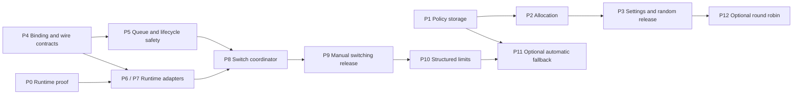

# Provider account rotation — implementation plan

**Status:** Proposed execution plan; no product changes implemented.

**Date:** 2026-09-20.

**Companions:** [Reviewed design](provider-account-rotation.md) ·
[Interactive visual overview](../artifacts/provider-account-rotation-overview.html).

**Source baseline:** Public checkout `222f1c002f1ba9ff7624090e1424b7e556b772f6`. Recheck the
implementation seams against the target branch before starting. This plan incorporates the reviewed
lifecycle/alarm ownership correction; it does not replace the design's contracts.

## 1. Delivery contract

Deliver two independently releasable capabilities:

1. **Random selection at session creation:** opt-in installation policy over an explicit account
   pool; one durable choice per new session/provider slot. Existing defaults migrate to fixed.
2. **Manual switching in an existing session:** same provider, auth mode, model, harness, workspace,
   and conversation. Stop old execution, apply the new account, prove application, and let the user
   continue deliberately.

Supported switching targets are OpenCode/OpenAI, OpenCode/xAI, and Claude Agent/Anthropic, each
enabled only after its own runtime qualification. API-key/legacy-auth migration, cross-provider
switches, and automatic prompt replay are outside this implementation.

**Later, separately enabled:** structured limit recovery, bounded opt-in automatic account
selection, and transactional round robin. Random does not depend on quota telemetry; manual
switching does not depend on reliable error classification.

All work below is unchecked. PR numbers are **suggested work-package IDs**, not existing GitHub PRs
or an instruction to publish them. Split a package further when needed, preserving its acceptance
gate. Owners describe engineering responsibilities, not assigned people. There are no calendar
estimates until the runtime spike establishes feasibility.

## 2. Work packages and dependencies

| ID  | Deliverable                                        | Primary owner                          | Depends on                        | Release boundary                              |
| --- | -------------------------------------------------- | -------------------------------------- | --------------------------------- | --------------------------------------------- |
| P0  | Runtime preservation/quiescence evidence           | Runtime + control plane                | None                              | Required per switching target, not for random |
| P1  | Routing policy schema, store, API compatibility    | Control plane                          | None                              | Dark launch; fixed behavior unchanged         |
| P2  | Stable random allocation across creation paths     | Control plane                          | P1                                | Dark launch                                   |
| P3  | Settings, creation controls, warm-session identity | Web                                    | P1, P2                            | **Random selection release**                  |
| P4  | Versioned binding and credential protocol          | Shared + control plane                 | None                              | Additive compatibility; switching off         |
| P5  | Durable recovery holds and lifecycle ownership     | Control plane                          | P4 contracts                      | Required safety foundation                    |
| P6  | OpenCode quiesce/restart/apply                     | Runtime                                | P4; P0 evidence before enablement | OpenCode capability gated                     |
| P7  | Claude quiesce/reconnect/apply                     | Runtime                                | P4; P0 evidence before enablement | Claude capability gated                       |
| P8  | Switch/resume orchestration and human APIs         | Control plane                          | P4, P5, applicable P6/P7          | End-to-end backend qualification              |
| P9  | Session recovery UI and release qualification      | Web + control plane + runtime          | P8, applicable P0                 | **Manual switching release**                  |
| P10 | Structured provider-limit recovery                 | Shared + runtime + control plane + web | P9                                | Independent provider-specific enablement      |
| P11 | Bounded automatic account fallback                 | Control plane + web                    | P10, P1 policy primitives         | Optional; off by default                      |
| P12 | Durable round-robin allocation                     | Control plane + web                    | P1–P3                             | Optional; independent of P10/P11              |



P1–P3 can proceed alongside the switching work. After agreeing P4 contracts, lifecycle work and the
two runtime adapters can proceed independently. P8 may be developed against fake runtime outcomes,
but cannot ship without P5 and a qualified real adapter. Manual switching need not wait for both
harnesses. Random is **not** a prerequisite for a user explicitly choosing a switch target.

## 3. Detailed implementation backlog

### P0 — Prove runtime feasibility before promising support

**Design reference:** Sections 7 and 11, Phase 0.

**Existing seams:**
[harness contract](../../packages/sandbox-runtime/src/sandbox_runtime/harness/base.py),
[supervisor](../../packages/sandbox-runtime/src/sandbox_runtime/supervisor.py),
[OpenCode service](../../packages/sandbox-runtime/src/sandbox_runtime/opencode_server.py),
[Claude harness](../../packages/sandbox-runtime/src/sandbox_runtime/harness/claude.py).

- [ ] Build a disposable-session probe for each supported harness/provider pair. Record exact
      runtime image, toolchain/SDK version, account pair aliases, and result; never record tokens.
- [ ] Establish a conversation, uncommitted sentinel file, queued message, and accumulated cost.
      Switch A → B inside the same sandbox; verify exact conversation identity, file contents, queue
      order, and aggregate cost after continuation.
- [ ] Verify the next controlled inference uses B's credential **and** account-specific request
      metadata. Successful credential acquisition or a generic health check alone is insufficient.
- [ ] Exercise idle, streaming, vendor retry, and tool execution. Demonstrate bounded cancellation,
      terminal-event draining, and stopped relevant descendants before any new execution.
- [ ] Exercise failed interruption, unavailable target, lost acknowledgement, and suspended-session
      resume. Determine which provider/runtime combinations support preservation-aware retention.
- [ ] Record go/no-go per combination and observed restart latency to inform named deadlines. A
      failure blocks that capability; it does not justify silently starting a fresh conversation.

**Exit evidence:** a reproducible probe and sanitized result matrix. Paid inference/test-account use
requires explicitly selected test resources and approval when implementation reaches this step; this
plan does not authorize production quota-exhaustion experiments. Mock tests can start earlier but do
not satisfy this gate.

### P1 — Add routing policy storage and compatible APIs

**Design reference:** Sections 6 and 10.

**Existing seams:**
[provider defaults store](../../packages/control-plane/src/db/provider-account-defaults.ts),
[account atomic writer](../../packages/control-plane/src/db/model-provider-account-atomic-writer.ts),
[account routes](../../packages/control-plane/src/routes/model-provider-accounts.ts),
[shared account types](../../packages/shared/src/types/provider-accounts.ts),
[global SQL port](../../packages/control-plane/src/db/sql-database.ts).

- [ ] Add shared validated routing DTOs: configured/tombstoned policy, fixed/random mode, revision,
      fixed account or bounded pool membership, and existing unattended mode. Keep strategy out of
      `ProviderAuthMode`; leave explicit-selection request DTOs compatible.
- [ ] Add the next available global SQL migration under `terraform/d1/migrations/`; do not edit
      already-applied migrations. Rebuild default-table constraints if needed, add policy
      membership, and preserve provider/account FKs and uniqueness.
- [ ] Migrate existing policies to configured fixed/revision 1 without changing account or
      unattended behavior. Retain SQL defaults compatible with old fixed-policy insertions.
- [ ] Narrow fixed-default protection to configured fixed policies. Update first-account
      auto-default creation, clear/delete, and recreation to preserve monotonically increasing
      tombstone revisions and never overwrite a configured random policy.
- [ ] Implement revision-CAS policy writes and conditional membership/audit changes in one atomic
      batch. A losing CAS must not delete members or append success audit records.
- [ ] Add the proposed routing GET/PUT endpoints through existing router/RBAC composition. Read uses
      account-read permission; mutation is human manager only. Reject malformed pools atomically.
- [ ] Guard every legacy defaults reader/writer, including DELETE, Make default, and unattended-mode
      updates: non-fixed policies produce the design's upgrade-required result, never a fabricated
      default or accidental downgrade.

**Exit gate:** real D1/workerd and Node SQLite tests prove migration preservation, zero-row CAS
atomicity, stale revision rejection, tombstone ABA protection, first-account behavior, empty live
pool handling, and legacy fixed compatibility. Keep non-fixed writes disabled until all deployed
readers and writers are compatible; schema defaults alone do not make old binaries random-aware.

### P2 — Allocate once, across every creation path

**Existing seams:**
[resolver](../../packages/control-plane/src/session/provider-account-resolution.ts),
[eligibility](../../packages/control-plane/src/model-provider-accounts/selection-policy.ts),
[initialization](../../packages/control-plane/src/session/initialize.ts),
[session index](../../packages/control-plane/src/db/session-index.ts),
[scheduler](../../packages/control-plane/src/scheduler/scheduler.ts),
[child spawn](../../packages/control-plane/src/routes/session-child-spawn.ts).

- [ ] Separate policy resolution from concrete allocation sufficiently to freeze automation policy
      while drawing per session. Keep one resolver/eligibility contract, not bot-specific
      allocators.
- [ ] Preserve precedence: explicit selection → inherited child binding → unattended API-key mode →
      installation selection → existing absent-policy behavior. Invalid pins error without fallback.
- [ ] Select uniformly with an injectable RNG from active, unarchived, compatible explicit members.
      Persist the complete provider snapshot, original selection source, and policy provenance with
      session creation. No quota lookup or decryption of all pool members on this path.
- [ ] Introduce an idempotent allocation/creation claim for the same session ID and immutable
      creation intent. Reuse existing bindings on a matching retry; reject conflicting intent. The
      current `SessionIndexStore.create()` duplicate-ID error and binding upserts are not this
      contract. Do not turn an arbitrary duplicate session ID into permission to
      overwrite/reinitialize a session.
- [ ] Guard selected-account eligibility at the durable write; retry a bounded selection attempt
      only before any binding is committed. After commit, never silently reroll an unavailable
      account.
- [ ] In automation, freeze pins/policy revision for the invocation; retain the existing
      `claimRunSession()` ownership boundary and allocate separately after each successful
      run/session claim. Retries recover that session's prior allocation, not another random draw.
- [ ] Preserve child inheritance; P8 adds serialization with parent switching. No recursive changes
      to already-created children. Confirm Slack/GitHub/Linear still use the central unattended
      path.

**Exit gate:** deterministic zero/one/many-candidate tests; creation rollback leaves no orphan
allocation; same-ID retry preserves binding; a changed intent conflicts; fan-out draws separately;
explicit/inherited/API-key paths never draw; post-selection disable races fail safely. Test full
three-provider snapshots, including unused slots, without claiming token-level balancing.

### P3 — Expose random selection and preserve warm-session identity

**Existing seams:**
[provider settings](../../packages/web/src/components/settings/provider-accounts-settings.tsx),
[account hook](../../packages/web/src/hooks/use-provider-accounts.ts),
[creation controls](../../packages/web/src/components/provider-auth-controls.tsx),
[selection identity](../../packages/web/src/lib/provider-selection.ts),
[warm drafts](../../packages/web/src/hooks/use-warm-draft-session.ts).

- [ ] Add human-authenticated BFF routing endpoints and normalized hook state. Use private/no-store
      responses; mirror server permissions without making the browser an authorization authority.
- [ ] Add Fixed / Random settings, explicit pool checklist, stale-revision conflict handling, and
      save validation. Newly connected accounts are not implicitly enrolled; one-member pools are
      valid.
- [ ] Keep unattended API-key preference separate. Explain that active credentials do not guarantee
      remaining quota and random spreads assignments, not tokens/cost.
- [ ] Rename ambiguous “No account” to “Use installation policy”; retain explicit local pins and
      explain that they bypass random selection.
- [ ] Include policy revision and relevant eligibility identity in warm-draft invalidation. Reuse
      the already allocated warm session on first prompt; never draw in React or mutate its binding.

**Exit gate:** settings/RBAC/BFF tests, zero eligible account UI, stale edit conflicts, old-client
guards, keyboard access, and warm-session tests for first prompt, rerender, policy change,
reconnect, and explicit pin. After the rollout gate in Section 5, random selection can ship
independently.

### P4 — Establish versioned bindings and credential issuance

**Design reference:** Sections 5, 7, and 10;
[shared-contract ADR](../adr/0002-shared-session-contracts-and-correlation-boundary.md).

**Existing seams:** shared account/session/WebSocket/sandbox-event types,
[session index](../../packages/control-plane/src/db/session-index.ts),
[OAuth credential routes](../../packages/control-plane/src/routes/model-provider-accounts.ts),
[Claude credential route](../../packages/control-plane/src/routes/provider-runtime-credentials.ts),
[credential broker](../../packages/control-plane/src/auth/model-provider-account-broker.ts),
[runtime credential client](../../packages/sandbox-runtime/src/sandbox_runtime/credentials/provider_credential_client.py).

- [ ] Add binding revision (existing rows start at 1), latest operation/actor/time, and original
      allocation provenance without conflating token refresh with account switching. Coordinate this
      migration with P2's provenance fields; create each field once regardless of merge order.
- [ ] Add a guarded binding CAS and transactional audit/outbox fact keyed by session/operation.
      Conditional success recording must survive zero-row CAS and batch-failure tests. Reuse
      suitable existing audit infrastructure or add one narrow store, not a second event platform.
- [ ] Define closed, validated switch/progress/ACK/capability DTOs in shared. Include operation,
      provider, binding revision, sandbox generation, and exact harness conversation identity; use
      canonical transport correlation names. Bound IDs, enums, and diagnostic text.
- [ ] Version both credential response paths. Validate the session-bound account, expected binding
      revision, account credential version/lifecycle, and authenticated runtime generation before
      and after refresh/decrypt awaits. Return typed stale-binding errors and sanitized identity
      metadata.
- [ ] Reject sandbox-supplied target-account authority. Validate HTTP runtime generation through
      authenticated persisted state, not a caller's revision header. Keep WebSocket generation plus
      active-socket checks for commands/events.
- [ ] Specify mixed-version behavior: old clients may retain unchanged unswitched sessions; they
      cannot authorize a switch or obtain a compatibility response that bypasses switched-session
      revision requirements. Test the exact compatibility decoder and capability handshake.

**Exit gate:** a delayed A credential request cannot return/reinstall A after B commits; ordinary
refresh leaves binding revision unchanged; stale generation/socket/capability is rejected; no secret
enters browser responses, timeline, logs, or fixtures. New binaries work with fixed legacy state
while switch admission remains disabled.

### P5 — Make queue and lifecycle safety durable

**This package includes the review correction and is not optional hardening.**

**Existing seams:** [session schema](../../packages/control-plane/src/session/schema.ts),
[message queue](../../packages/control-plane/src/session/message-queue.ts),
[stop coordinator](../../packages/control-plane/src/session/execution-stop-coordinator.ts),
[alarm handler](../../packages/control-plane/src/session/alarm/handler.ts),
[earliest alarm scheduler](../../packages/control-plane/src/session/alarm/scheduler.ts),
[lifecycle manager](../../packages/control-plane/src/sandbox/lifecycle/manager.ts),
[runtime composition](../../packages/control-plane/src/session/components.ts).

- [ ] Persist operation, independent recovery hold, applied revision, lifecycle owner/generation/
      attempt, absolute/phase/planned-disconnect deadlines, preservation status, and bounded
      idempotency history in session storage. Apply additive session-local migrations and test
      eviction recovery.
- [ ] Add narrow session-scoped recovery storage/coordinator collaborators through `components.ts`.
      Keep platform adapters thin and reuse the existing lifecycle manager and alarm scheduler; do
      not introduce a new DO class, second lifecycle manager, or background timer loop.
- [ ] Make every dispatch path honor the hold, including queue pumps from completion, reconnect,
      timeout, and Stop. Recheck applied revision after async auth preflight before claim/send. Hold
      removal must never clear independent budget, ordinary stop, or lifecycle fences.
- [ ] Extend Stop with a persisted quiesce-only/fail-paused policy. Immediate delivery failure,
      stop-confirmation timeout, and alarm recovery must all avoid whole-sandbox termination for
      this policy. Normal user Stop semantics remain separately tested.
- [ ] Capture prompt-owned boot message IDs when lifecycle work is admitted. Capture switch-owned
      operation IDs before boot/restart I/O. Return owner/generation-qualified outcomes instead of
      inferring ownership from the queue head at alarm time.
- [ ] Guard **all** destructive lifecycle entry points with current owner/attempt checks before I/O
      and after awaits. A snapshot already awaiting cannot later stop a newly owned generation; an
      already-issued provider stop must settle before switch admission can claim that workspace.
- [ ] Persist bounded planned-disconnect grace before restart. Unexpected loss or expiry yields
      reconciliation, not generic termination. Inactivity defers during active switching without
      falsifying activity timestamps. Reassert the earliest outstanding shared alarm after delivery
      and eviction; retries cannot extend the absolute deadline.
- [ ] Keep preservation authority after deadline expiry and while Stay paused is selected. Add a
      typed preservation result for the recovery-owned retention path: verified persistent
      suspension or successful current-generation/quiescent checkpoint with conversation evidence.
      Void, skipped, failed, old, or in-flight snapshots are not permission to stop.
- [ ] Surface `preservation_unavailable`, known retention limits, and `workspace_unavailable` if
      external expiry/loss occurs. Do not promise indefinite compute. Archive/cancel/security
      revocation fences the operation and retains its distinct authority to terminate.

**Exit gate:** reproduce the reviewed bug with a switch-owned boot while P1/P2 are queued; expiry
must fail/reconcile the switch and leave both messages pending. Also test ordinary prompt-owned boot
failure, alarm/await races, old processing deadlines, failed preservation, competing deadlines,
expiry without destructive fallthrough, and late results after archive or generation replacement.

### P6 — Apply an account in OpenCode without replacing the sandbox

**Existing seams:** [bridge](../../packages/sandbox-runtime/src/sandbox_runtime/bridge.py),
[OpenCode harness](../../packages/sandbox-runtime/src/sandbox_runtime/harness/opencode.py),
[supervisor](../../packages/sandbox-runtime/src/sandbox_runtime/supervisor.py),
[OpenCode service](../../packages/sandbox-runtime/src/sandbox_runtime/opencode_server.py),
[broker plugin](../../packages/sandbox-runtime/src/sandbox_runtime/plugins/provider-token-broker.js).

- [ ] Add typed quiesce/apply operations to the harness boundary and bridge dispatch. Join the old
      prompt task, drain terminal outcome, stop retries, and establish containment of relevant tool
      processes. Stop HTTP success alone must not yield a successful quiescence result.
- [ ] Add a closed supervisor-mediated local OpenCode restart operation, not arbitrary process
      control. Coordinate intentional restarts with the crash watcher so only one server can run.
- [ ] Preserve repository files, OpenCode database, and exact conversation ID. Replace the actual
      OpenCode process and reconstruct token/account-header caches; restarting only the bridge fails
      acceptance. Keep bridge heartbeat alive where possible.
- [ ] Fence credential requests/responses and late refreshes by bound identity/revision. Before ACK,
      force session-bound credential acquisition without inference and prove conversation
      reattachment.
- [ ] Make repeated apply commands return the same qualified outcome. Reconnect advertises applied
      revisions and conversation identity; generic readiness cannot release the control-plane hold.
- [ ] Advertise `providerAccountSwitchV1` only for the supported protocol/harness path. Ensure the
      runtime manifest/image build includes the changed supervisor, harness, and plugin together.

**Exit gate:** bridge-stop, supervisor, harness, and Node plugin tests plus P0 live proof for OpenAI
and xAI separately. No overlapping old/new process, silent fresh session, stale token reinstall, or
false ACK after a restart/credential failure.

### P7 — Apply an account in Claude while preserving the transcript

**Existing seams:**
[Claude harness](../../packages/sandbox-runtime/src/sandbox_runtime/harness/claude.py),
[credential client](../../packages/sandbox-runtime/src/sandbox_runtime/credentials/provider_credential_client.py),
[bridge](../../packages/sandbox-runtime/src/sandbox_runtime/bridge.py).

- [ ] Implement the same quiesce/apply contract: interrupt, drain terminal outcome, disconnect/reap
      old SDK client and relevant descendants, then fetch the committed managed credential again.
- [ ] Rebuild SDK options and reconnect with the persisted exact session ID in the same transcript
      and work directory. Detect missing/mismatched resume identity; fail paused rather than
      creating a fresh conversation.
- [ ] Reset per-query cost baseline without resetting accumulated session cost or exhausted budget.
      Emit one terminal result for the interrupted turn despite late SDK callbacks.
- [ ] Validate binding/generation on credential return and emit the same revision-qualified ACK and
      reconnect projection as OpenCode. Capability remains off without pinned-runtime evidence.

**Exit gate:** Claude harness/credential/bridge tests plus P0 Anthropic proof, including late
events, failed reconnect, missing transcript, cost accounting, and repeated apply.

### P8 — Connect the durable switch state machine and APIs

**Existing seams:** session HTTP routes/handlers and composition, global binding store,
[sandbox runtime events](../../packages/control-plane/src/session/sandbox-events/runtime.handler.ts),
[execution events](../../packages/control-plane/src/session/sandbox-events/execution.handler.ts),
[snapshot reader](../../packages/control-plane/src/session/snapshot-reader.ts),
[child admission](../../packages/control-plane/src/routes/session-child-spawn.ts).

- [ ] Add proposed binding/progress GET, switch POST, and resume POST routes from design Section 10.
      Require human session-lifecycle authority and account-use eligibility; reject plain service,
      viewer, and sandbox callers. Preserve authorization at both external and internal boundaries.
- [ ] After route admission/local checks, synchronously persist the operation/hold/owner before
      asynchronous validation. Duplicate operation + identical intent returns progress; conflicting
      intent or a competing switch returns 409. Restore prior hold state on safe pre-mutation
      rejection.
- [ ] Orchestrate quiesce → prepare target → guarded SQL binding/audit commit → runtime apply →
      qualified ACK. Revalidate session/account/binding after every relevant await. Never commit a
      new binding if old execution cannot be contained.
- [ ] Implement reconciliation at every cross-store cut: SQL may commit before the DO records its
      next phase; use operation/revision identity to recover. A lost ACK retries/probes the same
      operation, never decrements revision or claims automatic rollback.
- [ ] For a suspended session, drive an explicit switch-owned state-preserving boot/resume without
      relying on the held queue to initiate it. Reserve generation/attempt first. Reject unsupported
      preservation paths and old images without mutation; never fall back to a fresh workspace.
- [ ] Accept an ACK only from the authorized generation/socket for the exact operation/revision/
      conversation, with session and account still usable. Persist applied state and remaining hold
      transactionally before relinquishing active lifecycle ownership.
- [ ] Serialize parent binding capture for new children with parent switch admission. Existing
      children remain independent; inheritance is not a new policy draw.
- [ ] Implement explicit Continue/Resume queued work as idempotent intent against an applied
      revision, using ordinary message deduplication/admission. Show/execute either queued work in
      order or a new continuation; never replay the terminalized prompt. An idle no-pending-work
      switch can finish ready for the next newly submitted prompt.
- [ ] Project sanitized desired/applied binding, capability, phase, deadline, retention status, and
      recovery reason into snapshots and Session Event Stream. Make committed audit delivery
      replayable and deduplicated; no credentials or raw provider bodies.

**Exit gate:** D1/workerd and Node session conformance tests cover crash/eviction at every phase,
stale/duplicate commands and ACKs, account disable/reconnect races, child admission, competing tabs,
budget preservation, archive/cancel precedence, and every failure row in Section 4.

### P9 — Deliver the recovery experience and qualify release

**Existing seams:** [session header](../../packages/web/src/components/session-header.tsx),
[snapshot normalization](../../packages/web/src/lib/session-snapshot.ts), session snapshot provider,
existing human-authenticated BFF patterns, and account-list hooks.

- [ ] Display the session's server-projected current/effective account, not installation default.
      Offer manual Switch account even without a classified quota error; list only compatible
      targets as actionable and show unavailable reasons without exposing credentials.
- [ ] Implement Stop and switch as one action. Display progress, paused queue, unsupported runtime,
      unknown apply outcome, no alternative, preservation risk, and actionable retry/reconciliation.
      Accepted HTTP response is not successful account application.
- [ ] Show explicit Continue / Resume queued work / Stay paused semantics. Preserve reload and
      reconnect progress; stale tabs receive current state rather than overwriting it. Do not hide
      independent budget exhaustion or require installation-admin permission to recover an allowed
      session.
- [ ] Add accessible keyboard/focus behavior and tests for permission-limited Settings links,
      competing operations, pending work, and known/unknown reset information (when P10 exists).
- [ ] Run the cross-tier qualification matrix, establish baseline metrics, and prepare operator
      diagnostics/rollback instructions before enabling the first harness.

**Exit gate:** a qualified user can recover a test session without loss of workspace/conversation,
overlapping execution, implicit prompt replay, or billing/auth-mode change. Old images explicitly
remain unsupported. Release evidence names the exact code/image revision and enabled combinations.

### P10–P12 — Follow-ups, not hidden first-release dependencies

| Package                         | Concrete work                                                                                                                                                                                                                                                                                                                         | Exit gate                                                                                                                                                                                                                                          |
| ------------------------------- | ------------------------------------------------------------------------------------------------------------------------------------------------------------------------------------------------------------------------------------------------------------------------------------------------------------------------------------- | -------------------------------------------------------------------------------------------------------------------------------------------------------------------------------------------------------------------------------------------------- |
| P10: Structured limits          | Add validated normalized observations in shared and Python boundaries; preserve them through terminal outcome; atomically persist hard-limit hold before completion pumps the queue; add session-local evidence and banners. Extend Claude/OpenCode stream adapters using pinned structured fixtures, not rendered-string heuristics. | Distinguish hard quota, transient 429, auth, model entitlement, own budget, and unknown; validate bounded reset units/timestamps; stale observations cannot block a new revision; one sandbox cannot poison installation-wide account eligibility. |
| P11: Automatic account fallback | Add explicit opt-in UI/policy; freeze authorized pool/revision with each session; persist episode, attempted set, deadline, and maximum changes; invoke P8 with a policy-authorized system actor, not a sandbox-chosen target. Keep post-failure continuation explicit.                                                               | No A → B → A loop, pool widening, API-key spend change, replay, or unbounded retry after eviction; no candidates/uncertain outcome stops visibly. Explicit pins do not implicitly opt in.                                                          |
| P12: Round robin                | Add mode, stable account ordering, durable policy cursor, and allocation uniqueness; atomically allocate/advance/persist through both SQL adapters with bounded CAS retry. Reuse P2 creation identity and P3 controls.                                                                                                                | Concurrent allocations, retries, disabled/deleted members, policy revisions, and storage failures preserve ordering/idempotency; pins, children, and warm reuse never advance. Do not derive the cursor from `lastUsedAt`.                         |

Shared cooldowns require independent trusted provider evidence and are not included in P10/P11.
Fully autonomous continuation remains a separate design, even if automatic account selection ships.

## 4. Failure-oriented qualification matrix

Use controllable barriers around asynchronous calls, injected clocks/RNGs, and real storage
integration tests. Avoid timing sleeps and statistical fairness assertions. Add cases to the
existing focused suites; introduce only narrow fixtures for the new protocol.

| Inject failure/race                                              | Required durable result                                                               | Main packages |
| ---------------------------------------------------------------- | ------------------------------------------------------------------------------------- | ------------- |
| Pool write loses CAS; later batch statements still execute       | No membership/audit mutation; conflict returned                                       | P1            |
| Disable selected account before creation commit                  | No unusable new allocation; bounded precommit retry/error                             | P2            |
| Same creation/session ID retried after commit                    | Original allocation reused; conflicting intent rejected                               | P2            |
| Credential A refresh awaits while binding changes to B           | Stale response rejected; A cannot reinstall locally                                   | P4, P6, P7    |
| Stop command fails, times out, or returns before tool exit       | Hold retained; no new binding/dispatch; no inherited destructive escalation           | P5–P8         |
| Pending P1/P2 exist when switch-only boot expires                | Switch failed/reconciling; P1/P2 still pending and ordered                            | P5, P8        |
| Snapshot awaits while ownership/generation changes               | Old result cannot stop the newly owned/replaced sandbox                               | P5            |
| Switch arrives after provider stop was issued                    | Wait/re-evaluate surviving workspace; do not pretend the stop was cancelled           | P5, P8        |
| Planned disconnect grace / absolute deadline expires             | Visible reconciliation; no renewed grace or generic destructive cleanup               | P5, P8        |
| Paused retention checkpoint skipped/failed; external hard expiry | No internally authorized stop from failed proof; honest unavailable/retention outcome | P5, P9        |
| Crash after SQL commit before DO phase update                    | Reconcile same operation/revision; no false rollback                                  | P4, P8        |
| Apply succeeds but ACK is lost                                   | Remain held until same-revision proof; no duplicate execution                         | P6–P8         |
| Old socket/owner/turn emits ACK or hard-limit event              | Ignore stale state; current operation/queue unchanged                                 | P8, P10       |
| Archive/cancel/account revocation during an await                | Winning lifecycle/security transition preserved; no late resurrection                 | P4–P9         |
| Applied ACK followed by repeated Continue in two tabs            | One admitted continuation/resume; independent budget fence remains                    | P8, P9        |

### Existing suites to extend

- **Selection/storage:** `provider-account-resolution.test.ts`, `db/session-index.test.ts`,
  `scheduler` tests, integration `provider-account-foundation.test.ts`,
  `provider-account-atomicity.test.ts`, `session-provider-auth.test.ts`, and Node SQLite/migration
  tests. Add focused routing-migration tests for both engines.
- **Switch/lifecycle:** `message-queue.test.ts`, `stop-execution.test.ts`, `alarm/*.test.ts`,
  `sandbox-events/processor.test.ts`, integration `session-lifecycle-alarm-recovery.test.ts`,
  `provider-runtime-credential.test.ts`, `session-snapshot.test.ts`, and
  `session-core-conformance.test.ts`. Add a focused switch-state-machine suite with phase barriers.
- **Runtime:** `test_bridge_stop.py`, `test_bridge_ack.py`, `test_bridge_reconnection.py`,
  `test_bridge_harness_lifecycle.py`, supervisor suites, `test_claude_harness.py`,
  `test_provider_credential_client.py`, and `provider-token-broker.test.mjs`.
- **Web:** provider settings/controls/hooks, warm-draft/selection, session header/snapshot, BFF
  route suites, and new recovery-control component tests.

### Validation commands during implementation

From `public/`, with dependencies already installed:

```bash
npm run build -w @open-inspect/shared
npm test -w @open-inspect/shared
npm test -w @open-inspect/control-plane
npm run test:integration -w @open-inspect/control-plane
npm test -w @open-inspect/web
npm run typecheck -w @open-inspect/control-plane -w @open-inspect/web
npm run lint -w @open-inspect/control-plane -w @open-inspect/web
```

From `public/packages/sandbox-runtime/`, using the development environment:

```bash
uv run --extra dev pytest tests/
node --test tests/*.test.mjs
uv run --extra dev ruff check src/ tests/
uv run --extra dev ruff format --check src/ tests/
uv run --extra dev mypy src/
```

Run focused tests per package while developing, then full affected suites before release. Add bot
regressions if their contracts change, and runtime-image/provider packaging checks where files are
changed. Passing static/unit tests does not replace live P0 evidence or image qualification. These
commands are a future validation checklist, not tests claimed to have run for this document.

## 5. Deployment, observability, and rollback

### Deployment order

1. **Compatibility first:** additive global/session schema, fixed-compatible readers/writers, and
   normalized DTOs. Back up/verify migration behavior through established deployment procedures. No
   new DO binding is required. Keep random writes and switch admission off.
2. **Random readiness:** deploy P2 across every creation entry point and P3 clients; verify legacy
   default writes are guarded everywhere. Enable random for an explicitly selected installation
   policy. Existing sessions remain pinned; no backfill/reroll of their account choices.
3. **Switch protocol readiness:** deploy P4/P5/P8 handlers with admission off, then the compatible
   runtime image and P9 UI. P6/P7 can ship separately. Check actual runtime capability and P0 result
   per session; an image deployment does not upgrade already-running old processes or snapshots.
4. **Switch canary:** enable for qualified test sessions/harnesses, exercise idle/active/retry/tool/
   suspended recovery and failure injection, then widen intentionally. Establish preservation
   capability and retention limits for each supported Sandbox Provider path before allowing it.
5. **Follow-ups:** enable P10 classifications provider by provider; P11 and P12 require separate
   opt-in policy and canaries. Never couple them to a manual-switch rollout toggle.

### Controls and evidence

Implement separately named controls for new random allocations, new manual switch admission, and
automatic fallback (when built). Use the existing configuration mechanism; exact flag names and
named timeout defaults are implementation decisions, documented before rollout. The controls must
not bypass account eligibility, runtime capability, or preservation requirements.

Disabling random allocation blocks **new unpinned allocations that require random** with a clear
temporary-unavailable result; it does not reinterpret a saved random policy as fixed/API key.
Existing allocations, explicit valid pins, and fixed/absent-policy behavior continue normally.
Operators can explicitly save a chosen fixed policy as a separate audited change if desired.

Before canary approval, provide:

- Exact code/schema/runtime-image versions and the supported harness/provider/retention matrix.
- Counts and latency for assignments, switch phases/outcomes, reconciliation, stale revision
  rejection, and blocked duration. Use provider/strategy/outcome labels, not account/session IDs as
  high-cardinality metric labels; correlate those IDs in sanitized audit logs instead.
- Safety evidence: no workspace/transcript loss, overlapping dispatch, misattributed prompt failure,
  implicit replay, or billing-mode change in the qualification matrix. Any such occurrence stops
  expansion and disables new admission; uncertain outcomes are not counted as successful.
- Product evidence: the same session can continue with the alternate account, and random allocation
  uses only the configured eligible pool. Compare observed latency/reconciliation to the P0
  baseline; set operational thresholds from measurements rather than invented SLOs.

### Rollback contract

- Disable new switch/fallback admission first. Continue processing committed operations, alarms,
  reconciliation, credential revisions, and explicit safe continuation until they settle. A kill
  switch must not strand an already-committed B binding with A still running.
- Retain compatible schema/readers and recorded policies/bindings. Do not down-migrate durable
  recovery state, reset revisions, or automatically turn random into an arbitrary fixed account.
- Do not roll back to binaries that ignore binding revisions while switched sessions or pending
  operations exist. Prefer forward fixes; any older-binary rollback needs an explicit drain and
  compatibility proof for all surviving sessions, not just “no active HTTP request.”
- A failed postcommit apply is reconciled, not rolled back by decrementing revision. Choosing A
  again is another authorized, guarded switch after quiescence.
- Publish a runbook for operation/owner/revision diagnostics, retrying the same operation, retention
  warnings, and explicitly authorized termination. No manual SQL rewrite of a binding is a normal
  recovery procedure.

## 6. Definition of done and remaining decisions

### Random-selection release

- [ ] P1–P3 acceptance gates pass on both SQL hosts and all creation entry points.
- [ ] Existing fixed/unattended/explicit/inherited behavior remains compatible.
- [ ] Settings and operational controls are deployed before non-fixed policy is enabled.

### Manual-switch release, per supported combination

- [ ] P0 and P4–P9 gates pass; lifecycle ownership, retention, and stop containment are included.
- [ ] Same-session preservation and new-account request identity are demonstrated on the pinned
      runtime image; unsupported combinations are explicitly unavailable.
- [ ] Generation/revision/credential fences and RBAC have focused adversarial tests.
- [ ] Cross-store recovery, rollback controls, audit delivery, and operator runbook are qualified.
- [ ] UI exposes effective state, explicit continuation, and actionable unknown/failure outcomes.

### Decisions to close during implementation

| Decision                                                                     | Responsible package | Required before                                   |
| ---------------------------------------------------------------------------- | ------------------- | ------------------------------------------------- |
| Exact quiescence proof and closed supervisor command transport               | P0, P6, P7          | Advertising each runtime capability               |
| Compatible resume/retention paths and known hard limits per Sandbox Provider | P0, P5              | Enabling switching on that path                   |
| Named operation/phase/grace defaults and bounded idempotency retention       | P5, P8              | End-to-end qualification; use measured P0 results |
| Audit/outbox reuse versus one narrow new store                               | P4                  | Binding-CAS implementation                        |
| Actual operational flag names and canary thresholds                          | P9                  | Release enablement                                |
| Whether ordered allocation or automatic account application is wanted        | P11, P12            | Starting those optional packages                  |

This plan deliberately leaves product execution unimplemented. The next implementation step is P0
plus the independent P1/P4 foundations, not a settings-only account dropdown wired to a SQL update.
