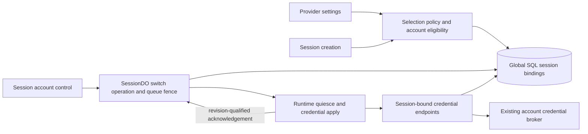

# Provider account switching and session-start distribution

**Status:** Proposed design; no product changes implemented.

**Date:** 2026-09-20.

**Scope:** Connected model-provider accounts: ChatGPT/OpenAI, xAI, and Claude/Anthropic.

**Review revision:** Account switching now explicitly owns lifecycle/alarm outcomes, including
bounded planned-disconnect grace and switch-only boot failures. See Section 7, “Lifecycle and alarm
ownership.” This is a design revision, not an implemented feature.

**Visual overview:**
[Account switching and distribution](../artifacts/provider-account-rotation-overview.html).

**Companion implementation plan:**
[Work packages, acceptance gates, and rollout](provider-account-rotation-implementation-plan.md).

## 1. Recommendation

Ship two independently useful capabilities:

1. **Switch the account used by an existing session.** A user can stop a quota-blocked turn, select
   another compatible account, and continue in the same session, with the same workspace and
   conversation. Switching affects this session only.
2. **Random account selection for new sessions.** An administrator can configure a provider's
   eligible account pool and select one account uniformly at random when each session is created.
   The selected account remains pinned until explicitly switched.

Use **fixed account** as the migration/default behavior. Start with random rather than round robin:
random satisfies the load-spreading requirement without a shared allocator. Section 6 specifies
round robin if predictable assignment order is subsequently required.

**Do not make automatic prompt replay part of the first release.** Switching credentials and
resuming work are separate actions. A turn can modify files or invoke external tools before a later
model request hits a limit. Replaying the original prompt is not an exactly-once continuation.
Section 9 describes bounded, opt-in automatic fallback for future work.

The difficult part is not choosing another account. It is proving that the previous execution has
stopped and the running harness has adopted the new credentials before allowing another prompt. A
database update, token refresh, WebSocket reconnect, or change to the installation default does not
establish that guarantee.

### First-release contract

| User action                                    | Result                                                                                                              |
| ---------------------------------------------- | ------------------------------------------------------------------------------------------------------------------- |
| Switch from subscription account A to B        | Same provider, model, harness, Open Inspect session, workspace, and harness conversation; subsequent work uses B    |
| Stop and switch during an active/retrying turn | Pause queue dispatch, settle/contain the old execution, replace credentials, then offer Continue                    |
| Select Random in provider settings             | New unpinned sessions choose once from the configured eligible pool                                                 |
| Explicitly select an account for a new session | Preserve that exact selection; random policy does not override it                                                   |
| Change the installation policy/default         | Existing session bindings do not change                                                                             |
| No usable alternative exists                   | Remain paused with a clear reason; allow another connection or later retry, never silently change billing/auth mode |

## 2. Scope, terminology, and evidence

### Research baseline

Inspected public checkout **`222f1c002f1ba9ff7624090e1424b7e556b772f6`** and compared relevant
provider-account/runtime paths with production checkout
**`041780a2a4eb0a7fc08f6851068c3167f5b870f5`**. These are local checkout revisions, not a claim
about the live deployment. Public is the source baseline for this proposal; Claude runtime files
differ between those revisions.

The toolchain pins [OpenCode 1.18.29](../../packages/sandbox-images/toolchain.json) and
[Claude Agent SDK 0.2.152](../../packages/sandbox-runtime/pyproject.toml). Upstream behavior below
uses the pinned OpenCode source and official Claude SDK documentation; current documentation is not
a substitute for testing the installed SDK/image.

Research included source, schemas, tests, local architecture guidance, and the separate proposed
[provider-account usage visibility design](provider-account-usage.md). No production credentials,
authenticated inference requests, quota exhaustion experiments, deployments, or product changes were
performed. Cross-account conversation resumption is an implementation validation gate, not a
capability claimed to have been live-tested here.

### Terms and product boundaries

- **Provider account:** a connected model-provider credential, not a Sandbox Provider account.
- **Selection policy:** how an unpinned new session chooses an account.
- **Binding:** the concrete account/auth mode selected for one session and provider.
- **Switch:** change that binding and apply it to the running harness.
- **Credential refresh:** rotate tokens for the same account; existing broker responsibility.
- **Fallback:** choose an alternative after a failure. Manual switching ships first; automatic
  selection is a separate opt-in policy.

Provider accounts are currently **installation-wide** resources. `createdBy` is attribution, not
ownership. This proposal follows that model: installation-wide policy, session-specific selection.
It does not invent private per-user account ownership, team ACLs, or a synchronized user-preference
store. Browser-local explicit account preferences remain supported.

### Goals

- Recover quota-blocked sessions without abandoning their work.
- Make the account actually in use visible and changeable by an authorized session collaborator.
- Spread new-session assignments across deliberately selected subscriptions.
- Preserve current fixed defaults, explicit pins, unattended API-key policy, and child inheritance.
- Keep recovery portable across supported sandbox providers and Worker/Node control-plane hosts.

### Non-goals

- Changing model/provider/harness as part of account switching.
- Moving automatically from subscription credentials to a potentially billable API key.
- Token-level load balancing, guaranteed quota availability, or equal token/cost consumption.
- Bypassing provider restrictions, purchasing credits, or changing subscription/billing settings.
- Guaranteed replay of arbitrary tool side effects or automatic recovery from a lost workspace.
- Requiring quota polling, a usage relay, a new Durable Object class, or new infrastructure.

## 3. What the code does today

| Area                     | Current behavior and evidence                                                                                                                                                                                                                                                                                                                               | Design consequence                                                                                                              |
| ------------------------ | ----------------------------------------------------------------------------------------------------------------------------------------------------------------------------------------------------------------------------------------------------------------------------------------------------------------------------------------------------------- | ------------------------------------------------------------------------------------------------------------------------------- |
| Accounts and permissions | Accounts have `active`, `disabled`, or `reconnect_required` status; account routes distinguish human read/manage permissions. [Schema](../../packages/shared/src/types/provider-accounts.ts), [routes](../../packages/control-plane/src/routes/model-provider-accounts.ts), [RBAC](../../packages/shared/src/rbac.ts)                                       | Quota availability must not be encoded as credential validity. Session recovery must not require installation-admin permission. |
| Selection                | Explicit account/API key overrides installation default. Unattended API-key policy and absent-default legacy behavior are preserved. [Resolver](../../packages/control-plane/src/session/provider-account-resolution.ts), [eligibility](../../packages/control-plane/src/model-provider-accounts/selection-policy.ts)                                       | Extend this server-side resolver; do not choose randomly in React or the sandbox.                                               |
| Pinning                  | Session creation persists a complete three-provider auth snapshot before DO initialization and sandbox warming. [Initialization](../../packages/control-plane/src/session/initialize.ts), [SessionIndexStore](../../packages/control-plane/src/db/session-index.ts)                                                                                         | Policy changes alone cannot repair an existing session. Binding writes need a new explicit contract.                            |
| Defaults                 | One required account per provider plus `unattended_mode`; a SQL trigger protects the fixed default against disable/archive. [Migration 0064](../../terraform/d1/migrations/0064_provider_accounts.sql), [store](../../packages/control-plane/src/db/provider-account-defaults.ts)                                                                           | Random requires a deliberate schema/trigger migration, not a new authentication mode.                                           |
| OAuth delivery           | OpenAI/xAI sandbox endpoints derive the account from the session binding. The broker coordinates encrypted credential refresh and durable claims. [Routes](../../packages/control-plane/src/routes/model-provider-accounts.ts), [broker](../../packages/control-plane/src/auth/model-provider-account-broker.ts)                                            | Keep sandbox callers unable to request arbitrary account IDs. Existing refresh fences do not fence mutable session bindings.    |
| OpenCode credentials     | Broker instances cache access tokens and account metadata until near expiry; no explicit invalidation operation exists. [Plugin](../../packages/sandbox-runtime/src/sandbox_runtime/plugins/provider-token-broker.js)                                                                                                                                       | Rebinding D1 or restarting only the bridge leaves stale credentials in the OpenCode process.                                    |
| Claude credentials       | `open()` resolves a credential; SDK connections reuse the held credential. The runtime endpoint delivers the stored setup-token secret. [Harness](../../packages/sandbox-runtime/src/sandbox_runtime/harness/claude.py), [endpoint](../../packages/control-plane/src/routes/provider-runtime-credentials.ts)                                                | Disconnect/recreate the SDK client with refetched credentials and the existing conversation ID.                                 |
| Quota failures           | Claude rate-limit events become warning strings. OpenCode errors become generic messages; retry status is not a durable provider-recovery state. [Claude](../../packages/sandbox-runtime/src/sandbox_runtime/harness/claude.py), [OpenCode stream](../../packages/sandbox-runtime/src/sandbox_runtime/harness/opencode_stream.py)                           | Manual switching cannot depend on perfect error classification. Add typed observations for reliable banners/automation.         |
| Completion and queue     | Failed turns terminalize; completion pumps queued prompts. Failed sessions remain promptable. [Handler](../../packages/control-plane/src/session/sandbox-events/execution.handler.ts), [activity rules](../../packages/shared/src/types/session-activity.ts)                                                                                                | Repeated attempts can use the same exhausted account. Recovery requires a separate durable dispatch hold.                       |
| Stop                     | Existing stop coordination fences subsequent dispatch while stopping, but normal Stop ultimately allows queued work to continue. Runtime stop does not itself prove all execution has ceased. [Coordinator](../../packages/control-plane/src/session/execution-stop-coordinator.ts), [bridge](../../packages/sandbox-runtime/src/sandbox_runtime/bridge.py) | Build Stop and switch as one serialized operation; do not ask users to race Stop against a dropdown change.                     |
| Warm sessions            | Home may create a real session before the first prompt. Warm identity currently includes provider-selection identity. [Hook](../../packages/web/src/hooks/use-warm-draft-session.ts), [selection helper](../../packages/web/src/lib/provider-selection.ts)                                                                                                  | Select once for the warm session; no second draw on first prompt.                                                               |
| Other entry points       | Scheduler resolves one binding snapshot per invocation and shares it across fan-out. Children inherit the parent's snapshot. [Scheduler](../../packages/control-plane/src/scheduler/scheduler.ts), [child spawn](../../packages/control-plane/src/routes/session-child-spawn.ts)                                                                            | Move random allocation to each launched session while freezing invocation policy; keep child inheritance explicit.              |

### Supported account-switch matrix

The [harness catalog](../../packages/shared/src/harnesses.ts) is authoritative:

| Harness      | Connected-account switching in scope                       | Excluded                                                 |
| ------------ | ---------------------------------------------------------- | -------------------------------------------------------- |
| OpenCode     | OpenAI → another OpenAI account; xAI → another xAI account | Anthropic subscription accounts; cross-provider switches |
| Claude Agent | Anthropic → another Anthropic account                      | OpenAI/xAI accounts; changing harness                    |

API-key and legacy scoped-OAuth sessions keep their current behavior in V1. Moving one into managed
account mode changes launch/auth configuration and requires separate support; do not imply that an
account-only switch endpoint can perform that migration.

## 4. User experience

### Provider settings

For each provider add **New-session account selection**:

- **Fixed account** — current behavior, with a named default.
- **Random from selected accounts** — an explicit checklist of accounts, at least one active member
  when saving. Newly connected accounts are not automatically added.

Keep **Automated authentication** separate:

- **Use subscription-account selection policy**.
- **API key** — retains existing unattended behavior.

Explain that random distributes session assignments, not measured usage. An active account may still
be quota-limited. A single-member pool is valid and deterministic. If two stored credentials belong
to the same subscription/quota pool, selecting between them does not create extra capacity;
deduplicate verified external identities where existing account contracts support that, but do not
claim identity verification for identity-less Claude setup tokens.

Keep existing creation controls: **Use installation policy**, a named account, or **API key**.
Rename the current ambiguous “No account” label when touching that UI. Existing browser-local
explicit pins remain pins; tell users to select Use installation policy to participate in random
selection. No new personal policy store is needed.

### Existing session

Show **Account: Engineering ChatGPT** near model selection, from server-projected binding state, not
the current installation default. The account menu offers **Switch account** even when no recognized
quota error exists. Only compatible, authorized accounts are actionable; unavailable accounts may be
shown with reasons.

When a recognized hard provider limit occurs, show a persistent banner:

> Engineering ChatGPT reached a provider limit. Your work is preserved. Switch accounts or try again
> after the limit resets.

Use a reset time only when it is known. Unknown quota/reset information must remain unknown. Keep
this distinct from sandbox provisioning errors and Open Inspect's session cost-budget banner.

Switching shows **Stopping current turn → Switching account → Ready to continue**. While a switch is
pending, retain queued prompts and prevent new dispatch. Users may compose/enqueue further messages,
but the UI must visibly show that execution is paused.

After a blocked or interrupted turn, provide explicit choices:

- **Continue**: submit a new continuation message against the preserved conversation, or resume
  already queued work in order. Show which will happen before the action.
- **Stay paused**: account is changed, but nothing executes yet.

Do not silently resubmit the failed message. Record the original failure and account change in the
Session Event Stream. A continuation can still decide to revisit earlier actions; the guarantee is
that the platform itself does not replay the old execution.

If the session was idle with no pending work, a successful switch simply makes the next newly
submitted prompt use the new account. Switching never changes installation policy or the user's
new-session preference.

Empty/error cases are actionable: no other account, disabled/reconnect-required target, unsupported
runtime, unknown stop outcome, failed credential acquisition, or all alternatives exhausted. A
Settings link is shown only when appropriate to the caller's permissions. Do not offer Reconnect as
a universal fix for subscription exhaustion.

## 5. Architecture and invariants



- **Control-plane policy** owns account eligibility, pool membership, and allocation.
- **Global SQL** owns the concrete per-session binding, as today. Use the existing
  [SqlDatabase port](../../packages/control-plane/src/db/sql-database.ts), supporting D1 and Node
  SQLite; do not introduce a Worker-only allocator/store.
- **SessionDO** owns switching, execution/queue admission, operation progress, and effective-runtime
  confirmation. It serializes session changes, not installation-wide allocation.
- **Credential broker** retains token refresh, encryption, and account-lifecycle fencing. Selection
  must not duplicate those mechanisms.
- **Runtime/harness** owns stopping execution, replacing local credentials, and retaining transcript
  and process state. A sandbox cannot select an arbitrary new account itself.
- **Web** displays projections and submits user intent. It neither allocates nor handles secrets.

Required invariants:

1. At most one executing prompt and one account transition per session at a time.
2. After human route admission, a dispatch hold is durable before the switch operation's
   asynchronous account/binding validation, stop, binding write, or reload.
3. No new prompt dispatch until the runtime confirms the expected binding revision and old execution
   is quiescent. WebSocket `ready` alone is insufficient.
4. Database binding revision, credential version, sandbox generation, and socket identity are
   distinct fences; none substitutes for another.
5. Account changes preserve conversation identity, workspace files, queued work, accumulated cost,
   budget exhaustion, permissions, and message history.
6. Account quota observations never directly set `reconnect_required` or disable an account.
7. Uncertain apply/stop outcomes remain visibly paused and reconcilable; never report false success.
8. Switching does not revoke a token already delivered to another process. This design prevents
   overlapping authorized execution, not provider-side credential revocation or malicious-sandbox
   exfiltration. Preserve existing secret boundaries without claiming to strengthen them implicitly.
9. Every switch-driven boot/restart has a durable lifecycle owner. Its failures settle the switch,
   not the pending queue head. Independent alarms cannot bypass that ownership or its preservation
   policy; explicit archive/cancel and externally imposed resource limits remain distinct outcomes.

## 6. New-session selection

### Precedence

Apply existing auth/harness validation, then:

1. Explicit account or API key wins; invalid explicit input errors rather than silently choosing
   something else.
2. A child session inherits its parent's captured binding; it does not reroll.
3. For unpinned unattended work, `unattendedMode: api_key` wins over account distribution.
4. Otherwise apply the installation's configured fixed/random account policy where the harness
   supports that provider/auth mode.
5. With no configured policy, preserve existing no-default legacy/API-key resolution exactly.

Pool members must match the provider, be active and unarchived, and be usable by the chosen harness
with an available adapter. Reuse the existing eligibility policy. Do not fetch quota or decrypt
every candidate just to choose one. Revalidate the chosen account at durable allocation and again at
credential issuance/dispatch; an account can become unavailable after selection.

For configured random pools, **zero eligible members is an explicit account-unavailable error**, not
permission to fall back to API keys or legacy secrets. A future confirmed shared cooldown can filter
candidates, but quota lookup is not a prerequisite. V1 cannot promise avoidance of an exhausted
account whose quota is unknown.

### Random allocation

The control plane loads the eligible set and makes one uniform draw using an injectable RNG. Persist
the result and `selectionSource: installation_random` alongside the session in the existing creation
transaction. Include policy revision as provenance. Inject deterministic RNGs in tests; do not write
flaky statistical distribution tests.

Make allocation stable for a given creation/session ID. If a durable binding already exists, return
it on retry instead of drawing again; guard initialization/retry paths against overwriting the
allocation. The current creation writer upserts bindings and treats duplicate session IDs as an
error, so an idempotent lookup/claim boundary is explicit new work, not an existing guarantee. This
does not promise deduplication of two separate create requests that receive different session IDs;
any caller creation key must bind them to the same ID before allocation.

Re-renders, first prompt submission, WebSocket reconnects, snapshot restore, token refresh, and
model changes never reroll an existing provider binding. Continue creating the current complete
provider snapshot; random balances provider-slot assignments, including initially unused slots, not
actual requests or tokens.

### Entry-point details

| Entry point                  | Required behavior                                                                                                                                                                                                                                                                                           |
| ---------------------------- | ----------------------------------------------------------------------------------------------------------------------------------------------------------------------------------------------------------------------------------------------------------------------------------------------------------- |
| Web warm session             | Draw when the real session is created. First prompt reuses it. Warm identity uses policy revision and relevant eligibility state, never a browser-generated random result. Policy changes may retire an unsubmitted warm draft using existing behavior, but cannot mutate it in place.                      |
| Slack/GitHub/Linear          | Existing server-derived unattended origin applies the same resolver; no account selection in each bot.                                                                                                                                                                                                      |
| Automation                   | Freeze pins and policy configuration/revision for an invocation, but allocate a concrete unpinned account separately for each new session after its run/session claim. Do not share one random result across the fan-out. Recheck live account eligibility without silently adopting a new policy revision. |
| Agent-created child          | Copy the parent's current committed binding when admitted; serialize admission against parent switching. Existing children remain independent and are not rotated recursively.                                                                                                                              |
| Explicit API-key/account pin | No draw, no cursor advancement, no automatic override.                                                                                                                                                                                                                                                      |

### Round robin, if added

Use the same pool/eligibility contract with stable account-ID ordering. Persist a cursor and a
revision **per installation/provider policy**, not per Worker, browser, or session. Record a unique
allocation by `(session_id, provider)`.

A SQL-store operation must atomically choose the next eligible member, advance the cursor, and
persist the allocation. Implement with a tested transaction/CAS pattern supported by both SQL
adapters; losers retry with a bounded budget, and repeated calls for the same allocation return the
original result. Do not read the cursor and later perform an unconditional write. Pool revision
changes invalidate an old allocator snapshot; deleted/disabled members are skipped
deterministically.

Account `lastUsedAt` is broker activity with throttled writes, not an allocator cursor. Never use it
for round robin. No advance for explicit pins, inherited children, or reuse of an existing binding.
Abandoned warm sessions and unused provider slots still count as allocations. Label this **balanced
assignments**, not balanced tokens, capacity-aware routing, or guaranteed even concurrent load.

Random needs none of this shared coordination; defer the cursor/table until the ordered mode is
actually being implemented.

## 7. Safely switching an existing session

### Binding revision and durable operation

Add a monotonic `bindingRevision` to each session/provider binding, initialized to 1. Changing
accounts increments it; refreshing a token for the same account does not. The DO stores a durable
operation with operation ID, actor, provider, source/target account, expected/target revisions,
current phase, deadline, sandbox generation, and sanitized outcome. Use server-chosen deadlines.

The global SQL binding is authoritative for credential issuance. The DO's operation/projection
tracks desired versus runtime-applied state; it is not an independent account-selection authority.
There is no transaction spanning global SQL, DO storage, and runtime. Use an idempotent state
machine and reconciliation, not a claim of atomic cross-system switching.

```mermaid
stateDiagram-v2
    [*] --> Quiescing: persist operation and queue hold
    Quiescing --> Applying: validate target and CAS binding
    Quiescing --> Failed: no binding change
    Applying --> Applied: matching runtime acknowledgement
    Applying --> Reconcile: timeout or lost connection
    Reconcile --> Applying: retry same operation and revision
    Reconcile --> Applied: prove target is already applied
    Applied --> [*]: publish result; continue only as authorized
```



Failed/reconcile states retain the recovery hold when execution/account state is uncertain or a
provider block remains. They expose retry/change-target actions rather than an indefinite spinner.

### Protocol

1. **Admit and fence.** A human-authenticated session endpoint requires session lifecycle authority
   and provider-account read/use eligibility. After route admission, perform synchronous
   shape/local-state checks and claim the durable DO operation, lifecycle ownership, and queue hold
   before yielding. An already-claimed destructive lifecycle action must settle first; do not try to
   take ownership after a provider stop request has been issued. Then validate the authoritative SQL
   binding/revision, account eligibility, runtime capability, and same-provider/account-mode target
   asynchronously. On rejection before any mutation, restore the prior hold state; do not erase a
   preexisting provider block. Repeated operation IDs with identical intent return existing
   progress; reusing an ID for different intent or a competing switch returns 409.
2. **Quiesce.** If a turn is active, extend the existing stop coordinator with a persisted
   rotation-specific **quiesce-only/fail-paused** policy, and retain the new recovery hold after its
   ordinary stop fence clears. Today's coordinator terminates the whole sandbox on some stop
   delivery/alarm failures or timeout; both immediate and alarm recovery paths must honor the new
   policy instead of inheriting that escalation. Runtime must cancel/join the prompt task, drain its
   terminal outcome, stop vendor retries, and prove the relevant harness/tool process tree is no
   longer executing. An abort HTTP response or SDK interrupt acknowledgement alone is insufficient.
   Handle already-completed and late-completion races idempotently. If containment cannot be proved,
   do not commit a new binding or start more work.
3. **Prepare target.** Revalidate eligibility and prepare credentials through the existing
   control-plane broker/static-secret validation path, without exposing them to the browser or
   arbitrary-account sandbox requests. This may refresh OAuth credentials but does not make a paid
   inference probe or prove remaining quota/model entitlement. Keep the old binding if preparation
   fails. Recheck account lifecycle and expected binding after all awaits.
4. **Commit binding.** CAS the global SQL row from the expected account/revision to the target,
   incrementing `bindingRevision` and recording operation ID/actor/time. Include target eligibility
   in the guarded write. Record binding change and its audit/outbox fact atomically in that SQL
   transaction. Guard the audit/outbox insertion by the winning operation/revision: a zero-row CAS
   does not itself abort a SQL batch and must not create a success record. Advance the DO operation;
   if the process dies between these steps, the operation ID on the SQL row identifies the committed
   result during reconciliation.
5. **Apply runtime.** Send a revision-qualified command to apply the binding. The runtime obtains
   credentials only for the committed binding, discards stale local clients/cache, and restores the
   same harness conversation in the same workspace. Commands are idempotent. Runtime acknowledges
   the operation, provider, sandbox generation, binding revision, and harness-session identity only
   after the reconfiguration is complete.
6. **Confirm.** Validate acknowledgement against current sandbox/socket authority and the durable
   operation, recheck session/account state, and project the effective binding. A queued dispatch
   must compare the applied revision again after async auth preflight and before its processing
   claim/send. Archive/cancel and a superseding operation win over late acknowledgements.
7. **Continue deliberately.** A blocked/interrupted session remains held until the user's Continue
   or Resume queued work action; atomically consume that intent and clear only this recovery hold.
   Reuse normal prompt admission/deduplication for a new continuation. Never clear independent
   budget/stop/lifecycle fences or replay a terminalized message. An idle switch with no pending
   work needs no separate resume action.

The local stop/join/containment guarantee is a real prerequisite. Existing stop methods are not
sufficient as-is; implement typed outcomes and bounded escalation. Escalation that would terminate
the entire sandbox or sacrifice work is not an invisible substitute for a successful local switch.

### Lifecycle and alarm ownership

**Review finding addressed:** a queue hold and a fail-paused stop coordinator do not govern the
independent heartbeat, inactivity, connecting, and boot-budget paths. Today the
[lifecycle manager](../../packages/control-plane/src/sandbox/lifecycle/manager.ts) may snapshot/stop
on those paths, and the [alarm handler](../../packages/control-plane/src/session/alarm/handler.ts)
treats the current pending queue head as the owner of a boot. A switch-driven boot has no such
prompt owner. Leaving these paths unchanged could terminate the workspace or fail a queued message
that never ran.

#### Persist the owner before starting lifecycle work

Keep the switch coordinator inside SessionDO; do not create a second sandbox lifecycle manager.
Extend the existing lifecycle seam with a small explicit work-owner contract:

```ts
type LifecycleWorkOwner =
  | { kind: "prompt"; messageId: string }
  | { kind: "provider_switch"; operationId: string };
```

Persist the owner with the sandbox generation and current lifecycle attempt. For switch operations,
the existing operation row also records phase, expected/target binding revisions, absolute operation
deadline, current phase deadline, and optional planned-disconnect deadline. Runtime messages use
canonical wire correlation names. Ordinary prompt-owned boots capture their actual message ID at
admission; the alarm handler must not infer an owner from whichever prompt happens to lead the queue
later.

A switch claims the existing generation before quiescence. A switch-driven spawn/resume reserves and
records its destination generation/attempt before provider I/O; a same-sandbox service restart keeps
the generation and changes its operation phase. Owner transfer and queue hold changes are local
transactional DO writes. No credentials live in this record.

Lifecycle results carry the observed owner, generation, and reason. The DO validates those fields
against current persisted state before settling anything. All destructive lifecycle entry points
consult this ownership/preservation policy, not just `handleAlarm()`. Claim lifecycle intent before
external I/O and revalidate after awaits and immediately before a subsequent stop/shutdown action.
An alarm already awaiting snapshot/provider work cannot resume and stop a newly owned or replaced
generation. Conversely, a switch cannot cancel a destructive provider call that has already begun:
it waits for that action to settle and re-evaluates the surviving workspace/capability.

#### One alarm scheduler, owner-specific outcomes

Use the existing
[earliest-deadline scheduler](../../packages/control-plane/src/session/alarm/scheduler.ts). Persist
operation/phase/grace deadlines before arming them; rehydrate and reassert the earliest outstanding
deadline after each delivery. Do not add a separate timer loop or cancel unrelated budget,
execution, or terminal-projection work sharing the DO alarm slot.

| Condition                                              | Owner-aware behavior                                                                                                                                                                                                                                 |
| ------------------------------------------------------ | ---------------------------------------------------------------------------------------------------------------------------------------------------------------------------------------------------------------------------------------------------- |
| Planned bridge disconnect during local restart         | Persist grace before requesting the restart. Only that operation/generation and declared restart phase receive grace. Prefer keeping bridge heartbeats alive when only OpenCode restarts. No synthetic heartbeat or general stale-runtime exemption. |
| Missing heartbeat within planned grace                 | Retain queue hold and report restart progress; do not invoke generic heartbeat termination. Grace ends at the earlier of its fixed deadline and the absolute operation deadline; retries/reconnects do not extend either.                            |
| Unexpected heartbeat loss or grace expiry              | Set `needs_reconciliation`, retain dispatch hold, and verify runtime/containment state. The switch coordinator owns this failure; do not fall through into generic snapshot-then-stop or fresh spawn.                                                |
| Inactivity while quiescing/applying                    | Defer ordinary inactivity shutdown until the bounded operation settles. Do not rewrite user-activity timestamps to keep the sandbox artificially active.                                                                                             |
| Connecting/boot/phase deadline during switch-only boot | Record a switch failure/reconciliation outcome for the captured operation and generation. Keep all undispatched prompts pending and in order. Never call `failPendingMessage()` merely because a queue head exists.                                  |
| Ordinary prompt-owned boot timeout                     | Preserve existing prompt failure semantics, but target the captured owning message rather than a later queue head.                                                                                                                                   |
| Stop-confirmation or old processing deadline           | Use the same persisted quiesce-only/fail-paused policy. Settle only the execution that actually ran; no whole-sandbox escalation inherited through another alarm branch.                                                                             |
| Archive/cancel or authoritative security revocation    | Take precedence, fence the switch, and follow the explicitly authorized lifecycle action. Late credentials, provider results, or ACKs cannot reopen the session or commit a new binding.                                                             |

For example, if pending prompt P is waiting while operation S boots a suspended sandbox, a boot
timeout returns `{ owner: provider_switch(S), generation, reason }`. It updates S to a visible
failure; P stays pending. A normal boot owned by P can still fail P under its existing policy.

#### Deadline expiry is not permission to destroy the workspace

The absolute deadline bounds **active recovery attempts**, not preservation authority. On expiry,
stop retrying automatically and persist an actionable recovery state. Do not delete the ownership
record and thereby allow the next generic alarm to destroy the sandbox. The operation may settle,
but its recovery hold and preservation requirement remain until an explicit, fenced handoff.

For `needs_reconciliation` or **Stay paused**, ordinary retention can proceed only through a
state-preserving path: provider-supported persistent suspension whose contract preserves the
workspace, or a typed successful checkpoint of the current quiescent generation with resumable
conversation/runtime evidence. An old snapshot, skipped/in-flight/failed snapshot, or the current
`triggerSnapshot(): Promise<void>` is not such proof. Failed preservation records
`preservation_unavailable` and does not authorize automatic destructive stop. This is a narrow
requirement for switch/recovery-owned work, not a redesign of every ordinary lifecycle path.

Do not promise indefinite compute or immunity to a provider's hard lifetime/eviction limits. Expose
the known retention deadline and preservation status, and warn when work cannot be guaranteed beyond
it; do not renew a switch lease forever. Existing operator resource policy or explicit user
termination remains possible, with an accurately reported outcome. An externally lost sandbox
becomes `workspace_unavailable`, never a successful switch or silent fresh conversation.

After a healthy applied ACK, release the active lifecycle owner only in a transaction that records
the applied revision and the remaining recovery/continuation hold. A user who resumes hands control
back to ordinary lifecycle policy; a user who stays paused uses the preservation policy above.
Reconcile/cancel ownership and deadlines after eviction from durable state, and discard old-owner
results after archive/cancel, a new lifecycle attempt, or sandbox replacement.

### Credential issuance must also be versioned

Both `access-token` and `runtime-credential` endpoints currently read the binding before
asynchronous work. Add expected binding revision and runtime generation/capability context. Check
them before acquisition and immediately before returning; reject changed bindings with a typed
stale-binding response. Return the bound account identity and revision alongside the existing
credential payload. Runtime must reject any response that does not match its current
operation/revision, including an old in-flight refresh completing after local cache invalidation.

An endpoint must never accept `targetAccountId` as authority from a sandbox. Only the authenticated
human/authorized policy-driven DO operation may change the SQL binding. Persisted sandbox ID,
generation, and active-socket checks continue to apply; add appropriate generation-bound issuance
validation for HTTP requests rather than trusting a supplied revision header alone.

`credentialVersion` continues to fence reconnect/refresh of an account. `bindingRevision` fences
which account this session uses. Cached credentials must be keyed/fenced by both relevant
identities. Ordinary OAuth refresh must not produce a visible account switch.

### Runtime-specific implementation

| Harness      | Recommended V1 application path                                                                                                                                                                                         | Required proof                                                                                                                                                                                                                     |
| ------------ | ----------------------------------------------------------------------------------------------------------------------------------------------------------------------------------------------------------------------- | ---------------------------------------------------------------------------------------------------------------------------------------------------------------------------------------------------------------------------------- |
| OpenCode     | Add a narrow supervisor-coordinated restart of the OpenCode service inside the existing sandbox after quiescence, then reattach/resume its existing local session. Restart bridge as needed, but never only the bridge. | Old process and relevant descendants stopped; broker caches and account-specific request metadata reconstructed; local OpenCode database/session ID and repository files retained; credential acquisition reports target revision. |
| Claude Agent | Drain/stop the old query, disconnect/reap SDK client, refetch managed credential, rebuild options, reconnect with the persisted exact session ID.                                                                       | Old client cannot issue requests; new options use B; transcript remains in the same config/work directory; resume does not silently create a new conversation; per-query cost baseline is reset without losing accumulated cost.   |

The supervisor already owns OpenCode process start/stop and crash recovery, but **no authenticated
account-switch restart operation exists**. Add a closed operation, not an arbitrary process-control
API. Coordinate it with supervision so an intentional restart is not counted as a crash and no
competing watcher starts a second process. See
[supervisor](../../packages/sandbox-runtime/src/sandbox_runtime/supervisor.py),
[OpenCode server](../../packages/sandbox-runtime/src/sandbox_runtime/opencode_server.py), and
[harness contract](../../packages/sandbox-runtime/src/sandbox_runtime/harness/base.py).

A live broker-invalidation hook could avoid OpenCode restart later, but only after proving that it
invalidates all SDK/provider/account metadata and rejects late refreshes. Restarting the local
service is the simpler initial correctness boundary; benchmark disruption during the implementation
spike. A generic service health check is not proof of target-account application: force a
session-bound credential acquisition and revision-qualified runtime acknowledgement without issuing
inference, then validate the actual request's account metadata in the controlled acceptance test.

Claude's official SDK documents explicit-ID conversation resumption and interrupt/drain semantics.
That supports this approach, but does not promise cross-account resumption for every credential or
plan; test the pinned runtime before enabling it.
[Sessions](https://code.claude.com/docs/en/agent-sdk/sessions),
[Python SDK](https://code.claude.com/docs/en/agent-sdk/python)

### Recovery, disconnects, and older images

- Before binding commit, a failed operation leaves the original binding. Explicitly cancel the
  transition/resume only when old runtime state is known; a quota block can remain.
- After binding commit, never decrement revision or automatically claim rollback. A lost ACK may
  mean the new account is already loaded. Query/reapply the same operation; another target is a new
  guarded operation after the prior runtime is reconciled/quiescent.
- On DO eviction/restart, reconstruct from the persisted operation plus SQL operation/revision.
  Bound each phase; timeout becomes a durable `needs_reconciliation` outcome and visible action.
- On runtime reconnect, report applied binding revisions and conversation identity. Generic `ready`
  cannot clear a transition or quota hold. Ignore stale observations/ACKs from old revisions,
  replaced sandbox generations, or inactive sockets.
- For a suspended session with no running process, the **switch reconciler**, not the blocked prompt
  queue, explicitly drives a supported state-preserving boot/resume without dispatch. Bind the
  resulting sandbox generation to the operation and require revision-qualified readiness before
  releasing the hold. Use bounded boot/apply deadlines and a visible failure state. This avoids
  deadlocking on the existing queue pump, which normally initiates sandbox startup but is now
  fenced. A fresh initial boot is allowed only if no prior workspace exists; otherwise enforce the
  preservation requirement below. A persistent resumed process still needs reconfiguration; waking
  it is not a credential reload.
- Negotiate `providerAccountSwitchV1` support per harness/runtime. Unsupported older live images get
  an explicit unavailable/upgrade-needed result. Do not silently change a binding that their
  credential protocol cannot honor.
- Do not substitute generic sandbox recreation. Current snapshot initiation can skip or swallow
  failures, and restore may fall back to a fresh workspace. A future checkpointed fallback needs
  typed successful checkpoint evidence, exact generation, transcript/filesystem preservation, and
  compatible restored runtime; it must never silently fresh-spawn.
  [Lifecycle manager](../../packages/control-plane/src/sandbox/lifecycle/manager.ts),
  [restore decisions](../../packages/control-plane/src/sandbox/lifecycle/decisions.ts)

## 8. Provider-limit observations and recovery state

Add a bounded shared normalized observation, rather than parsing arbitrary rendered error text:

```ts
type ProviderFailureKind =
  | "quota_exhausted"
  | "rate_limited"
  | "authentication_failed"
  | "provider_unavailable"
  | "unknown";

interface ProviderFailureObservation {
  provider: SubscriptionProviderId;
  bindingRevision: number;
  messageId: string;
  kind: ProviderFailureKind;
  scope: "account" | "model" | "request" | "unknown";
  retryAfterMs?: number;
  resetAtMs?: number;
  // Closed provider-specific codes only; never arbitrary response bodies.
  providerCode?: string;
}
```

Wire correlation uses the repository's canonical boundary names (`message_id`, `request_id`, etc.);
the sketch above is an internal DTO. Add shared contracts first under
[ADR 0002](../adr/0002-shared-session-contracts-and-correlation-boundary.md). Include normalized
failure in the terminal outcome so the DO can atomically persist the provider hold **before** the
completion handler pumps queued work. A mid-turn hard-rejection event may initiate stop/hold, but
cannot itself claim execution settlement. Approaching-limit warnings do not stop work.

| Evidence                                              | Handling                                                                                                         |
| ----------------------------------------------------- | ---------------------------------------------------------------------------------------------------------------- |
| Structured subscription/account exhaustion            | Hold affected work; offer switch and reset information where available                                           |
| Request-rate 429, temporary overload, network failure | Existing bounded retry/backoff; do not automatically churn accounts                                              |
| Expired/revoked credential                            | Preserve existing refresh/reconnect policy; manual switch is available but quota classification is inappropriate |
| Model-specific entitlement/limit                      | Explain the model restriction; do not mark every model/account exhausted                                         |
| Open Inspect cost budget exhausted                    | Existing budget remediation only; account switching cannot bypass it                                             |
| Unknown/text-only error                               | Show ordinary error plus manual account control; no automatic fleet-wide state change                            |

The pinned OpenCode retry module groups several throttling/transient errors together and honors
retry headers; that is not a reliable subscription-exhaustion classifier. Inspect structured
provider error data at the plugin/harness boundary before it is flattened; where unavailable, leave
classification unknown.
[Pinned retry code](https://github.com/anomalyco/opencode/blob/16747470f976aca3d362ad730bcd3fe82ecc2c9a/packages/opencode/src/session/retry.ts),
[pinned error representation](https://github.com/anomalyco/opencode/blob/16747470f976aca3d362ad730bcd3fe82ecc2c9a/packages/opencode/src/session/message-v2.ts)

Claude exposes structured rate-limit status/type/reset metadata, which our harness currently reduces
to a warning. Preserve normalized information and distinguish approaching-limit from rejected,
without forwarding SDK raw payloads.
[Official RateLimitEvent/RateLimitInfo reference](https://code.claude.com/docs/en/agent-sdk/python#ratelimitevent)

### Cooldown and trust

Start with **session-local** failure/attempt evidence tied to the actual dispatched binding
revision. The sandbox is lower-trust than the control plane: an authenticated sandbox report is
attributable, not independently proven provider truth. Validate provider, scope, bounded timestamps
and codes; derive account identity from the binding, not a caller-supplied account ID.

Do not let one sandbox mark a shared account disabled, reconnect-required, or unavailable to the
whole installation. Account-wide temporary routing exclusions need trusted control-plane provider
evidence (for example, a validated future usage observation), expiry, provenance, and independent
account-lifecycle fencing. Passing a cooldown/reset time only makes an account eligible for another
attempt; it does not prove quota has replenished.

The separate usage-visibility proposal can later decorate account choices with cached values.
Neither live polling nor its optional relay is on the creation/switch critical path. Unknown,
unsupported, stale, or failed usage reads are not zero quota. This proposal deliberately extends
routing separately from that document's informational-only contract.

## 9. Optional automatic fallback

Implement only after manual switching, structured errors, and runtime application are reliable.
Default is **manual**. Opt-in policy may allow **select another account on confirmed quota block**
within an explicitly approved same-provider pool. Capture the permitted fallback policy/revision
with the session; later widening of installation settings must not silently widen an existing
session's account authority. Always recheck current account eligibility.

For one recovery episode:

1. Persist the quota hold and terminal outcome before dispatching anything else.
2. Choose an eligible alternative not already attempted for this episode; exclude the current
   account. An explicit pinned session does not opt into fallback merely because its provider has
   random new-session selection.
3. Run the exact same DO switch protocol, with a system actor bound to the session's previously
   authorized policy. The runtime report cannot nominate an arbitrary account or expand the pool.
4. Apply a small configured maximum number of account changes and total recovery deadline, persisted
   across restarts. Attempt each candidate at most once per episode; no A → B → A loops.
5. Exhaustion, uncertain failure, or no candidates leaves a visible manual-recovery state.

Initial automation should mean **automatic account selection/application, not automatic replay**.
After an inference failure, keep continuation explicit. Unattended workflows can report that they
are paused with an alternative ready; fully autonomous turn continuation is separate work. A later
implementation may resume an undispatched queued message when the failure is proven pre-dispatch,
but “no tokens seen” or “no tools displayed” is not proof that execution never happened.

Do not switch on every 429, auth refresh error, timeout, or transient provider outage. Do not add
API-key, cross-provider, cross-harness, or paid-overage fallback under this option.

## 10. Data model and API changes

### Persistence

| Store                                | Proposed change                                                                                                                                                                                                                                                                                                            |
| ------------------------------------ | -------------------------------------------------------------------------------------------------------------------------------------------------------------------------------------------------------------------------------------------------------------------------------------------------------------------------- |
| Existing provider-default policy row | Generalize with `selection_mode` (`fixed` or `random`), `policy_revision`, a configured/tombstone flag, nullable fixed `provider_account_id`, and existing `unattended_mode`/audit fields. Fixed requires an account; random requires no fixed-account ID. A separate membership table holds the explicitly selected pool. |
| Policy members                       | Composite provider/account FK and uniqueness, bounded membership list, transactional replacement with policy revision CAS. No named/global pool abstraction is needed for one policy per provider.                                                                                                                         |
| `session_model_provider_auth`        | Add binding revision, allocation policy provenance, last switch operation ID, update time/actor. Keep auth mode/account/provider constraints and inherited source. Do not overwrite original selection provenance; distinguish allocation from latest switch.                                                              |
| DO session storage                   | Recovery hold, pending switch operation, lifecycle work owner/generation/attempt, absolute/phase/planned-disconnect deadlines, preservation status, last applied revisions, sanitized failure, continuation intent, and bounded idempotency history. Include recovery state in snapshots and event replay.                 |
| Global audit/outbox                  | Transactional switch record keyed by session/operation; existing audit infrastructure where suitable, otherwise one narrow table. Never store credentials or raw provider responses.                                                                                                                                       |
| Later round robin                    | Durable cursor/allocation records only when that mode ships.                                                                                                                                                                                                                                                               |
| Later automatic fallback             | Frozen allowed pool/policy, episode ID, attempted accounts, deadline, bounded local cooldown evidence.                                                                                                                                                                                                                     |

Use a new shared SQL migration, rebuilding the existing default table as needed for SQLite
nullability/check constraints. Migrate all old rows to configured `fixed`, revision 1, with
identical account and unattended behavior. Supply SQL defaults for these new fields so existing
first-account insert code remains compatible during rollout. Update the existing protect-default
trigger to apply only to configured fixed policies; random members may become unavailable and are
filtered at allocation. Emptying a pool through later lifecycle changes is allowed but yields a
clear no-eligible-account state, not a hidden replacement account. Clearing policy retains a
tombstoned provider row and increments its revision; the resolver treats it as no configured policy.
Recreating it or auto-defaulting the next eligible first account increments that retained revision
rather than resetting to 1. This prevents stale settings writes and warm-session identity ABA after
delete/recreate. Update first-account auto-default creation to understand tombstones without
overwriting a configured random policy. Preserve foreign keys/triggers and verify both global SQL
engines.

Policy revision CAS and all dependent membership replacement/audit statements must share one atomic
batch **and** be conditional on its winning revision/mutation token. A stale CAS affecting zero rows
is not a database error: unconditional subsequent deletes/inserts would still execute. Test that a
losing write leaves policy, membership, and audit entirely unchanged.

### Proposed HTTP surface

Names below are proposed additions, not existing APIs.

| Endpoint                                            | Contract                                                                                                                                                       |
| --------------------------------------------------- | -------------------------------------------------------------------------------------------------------------------------------------------------------------- |
| `GET /model-provider-account-routing`               | Read normalized fixed/random policy and revision, with existing account-read permission                                                                        |
| `PUT /model-provider-account-routing/:provider`     | Manage policy/pool/unattended mode with `expectedPolicyRevision`; human manager only                                                                           |
| `GET /sessions/:id/provider-auth`                   | Current bindings, applied revisions, switch capabilities, operation/recovery state; no secrets                                                                 |
| `POST /sessions/:id/provider-auth/:provider/switch` | `{ operationId, targetAccountId, expectedBindingRevision }`; validates lifecycle authority and returns accepted operation/current state                        |
| `POST /sessions/:id/provider-auth/resume`           | Explicitly resume queued work or atomically submit a deduplicated new continuation against an applied revision; never retry an old terminal message implicitly |

Snapshots/WebSocket updates expose the same sanitized state so reload/reconnect can recover
progress. Reuse the existing human-authenticated BFF and signed user context, with private/no-store
responses. Plain bot/service or sandbox credentials cannot call the human switch/settings endpoints.
A future policy-driven automatic path is internal and separately constrained; do not grant services
blanket account-management authority.

Return stable error codes for stale revision, operation conflict, ineligible target, unsupported
auth mode/runtime, stop not confirmed, and apply outcome unknown. HTTP acceptance does not mean the
account is already active; the UI waits for applied state.

Keep existing explicit-selection DTOs unchanged for V1. Strategy belongs to installation policy, not
`ProviderAuthMode`. Introduce a versioned/normalized routing DTO rather than pretending random has a
single default account. Existing defaults endpoints remain compatibility-only for fixed policies:
once a provider has a non-fixed policy, reject incompatible legacy reads/writes with an
upgrade-required response rather than invent a default or silently overwrite the pool. Guard legacy
DELETE as well as PUT; clearing a fixed policy must use the tombstoned revision semantics above.
Deploy new readers first, and guard old Make default/unattended-mode actions from accidental policy
downgrade.

## 11. Delivery plan and verification

### Phase 0 — focused runtime feasibility

Using explicitly selected test accounts and disposable test sessions during implementation, prove:

- A → B on OpenCode preserves exact session ID/history and an uncommitted sentinel file; next
  provider request uses B's token **and** account-specific routing metadata.
- A → B on Claude preserves its transcript/session ID, uses B after reconnect, and keeps aggregate
  cost correct across the new SDK query baseline.
- A switch during provider retry/stream/tool execution cannot overlap a later prompt; bounded stop
  failure produces paused reconciliation, not a second executing process.
- A target accepted by the credential broker may still fail model entitlement/quota; that failure
  remains recoverable and is not misreported as a successful inference.

Keep tokens out of logs, fixtures, commands, and reports. These live probes were not performed for
this design. If a harness cannot preserve conversation across accounts, do not advertise support;
manual/random functionality for proven harnesses can ship independently.

### Phase 1 — random new-session policy

Implement policy migration/DTO/store, resolver, per-session scheduler allocation, Settings, creation
controls, and warm identity. Default all existing installations to fixed. This can ship without any
runtime-switch capability and without quota telemetry.

### Phase 2 — manual in-session switching

Implement binding revisions and version-aware credential issuance; DO queue/recovery protocol;
owner-aware lifecycle/alarm results and bounded restart grace; preservation-aware pause; runtime
quiesce/apply capability; snapshot projection; account control and Continue UI. Enable per harness
only after Phase 0 and concurrency tests pass. Manual switching works without classifier coverage.
Do not claim that already-running old images gain support through a control-plane deploy.

### Phase 3 — structured provider recovery

Preserve normalized errors through harness → bridge terminal outcome → DO snapshot/timeline. Add
hard-limit queue holds, known reset information, and session-local attempted-account state. Enable
provider-specific classifications only with pinned fixtures and runtime evidence; unknown remains
manual.

### Phase 4 — optional extensions

Add bounded opt-in automatic account fallback and, if needed, transactional round robin. Trusted
shared cooldowns and autonomous continuation are separate, explicitly validated additions.

### Required implementation tests

| Area                    | Acceptance cases                                                                                                                                                                                                                                                                                                                  |
| ----------------------- | --------------------------------------------------------------------------------------------------------------------------------------------------------------------------------------------------------------------------------------------------------------------------------------------------------------------------------- |
| Selection               | Existing precedence unchanged; absent defaults retain legacy behavior; explicit pins/API keys override distribution; inactive/wrong-provider/unsupported accounts excluded; zero/one/many candidates; pool membership opt-in; account disabled between draw and commit; deterministic injected RNG                                |
| Creation                | Same allocation ID does not reroll; no orphan allocation/binding on SQL failure; warm reuse vs policy revision; first prompt/reconnect/restore do not draw; automation fan-out gets separate choices; child capture serialized with parent switch; no child cascade                                                               |
| Switching               | Active and idle; queued prompts; competing tabs; duplicate operation IDs; stale revision; account disabled/reconnected during every await; expired credentials; original binding retained before commit; ambiguous apply after commit; cancellation/archive wins; budget remains exhausted                                        |
| Issuance                | Old binding read followed by switch while refresh/decrypt awaits; stale sandbox generation; arbitrary target rejected; late plugin refresh cannot reinstall A; credential-version and binding-revision fences remain distinct; no browser/event credential leakage                                                                |
| Runtime                 | Quiescence includes retry loops and relevant tool descendants; stop HTTP errors are not success; intentional restart does not race crash supervision; OpenCode process really replaced; Claude old client drained/reaped; transcript/files preserved; new-account request headers verified; cost baseline preserved               |
| Recovery                | DO eviction at every operation phase; lost command/ACK; duplicate terminal event; reconnect reports stale applied revision; old provider error after switch ignored; timeout exposes bounded failure; unsupported old image; no fresh-spawn fallback or silent transcript reset                                                   |
| Lifecycle ownership     | Heartbeat loss during and after planned grace; inactivity during apply; switch-only boot expiry retains queued prompts; normal prompt-owned boot still fails only its owner; snapshot awaiting while a switch is admitted; stop already in flight; archive/cancel during provider awaits; stale generation result rejected        |
| Deadlines and retention | Earliest alarm survives eviction and competing deadlines; retries cannot extend grace/absolute deadline; expired switch cannot fall through to generic destructive cleanup; failed/skipped checkpoint blocks stop; verified persistent suspension/checkpoint permits retention handoff; external hard expiry is reported honestly |
| UX/RBAC                 | Member can switch authorized session but not installation policy; viewer/service/sandbox rejected; binding comes from snapshot; reload retains progress; keyboard-accessible selector/banner; empty pool; unknown/stale quota; explicit Continue; old-client policy guards                                                        |
| Classification/fallback | Quota vs short 429 vs auth vs model cap vs own budget; reset units and bounded timestamps; malformed/raw data rejected; one sandbox cannot poison global eligibility; attempted set and deadline survive restarts; no loop, spend change, or failed-prompt replay                                                                 |
| SQL/rollout             | Real D1/workerd and Node SQLite migrations, FK/trigger preservation, policy CAS and failed batches; mixed old/new readers and runtime capabilities; round-robin contention/idempotency only if implemented                                                                                                                        |

Extend existing focused suites rather than build a parallel harness: provider-account resolution and
foundation/atomicity tests; session message-queue and sandbox-event processor tests; WebSocket
sandbox integration tests; runtime bridge-stop/reconnection/ACK and Claude harness tests;
provider-token broker tests; provider-settings and warm-session UI tests. Build shared first for
dependent TS checks. Test matrices above are requirements for implementation, not claimed results of
this doc.

### Rollout and rollback

1. Deploy additive schema/read compatibility and defaults migration before enabling new writes.
2. Deploy version-aware credential endpoints, snapshots, and runtime capability reporting; feature
   flags remain off. New DTO clients must understand fixed and random before settings enablement.
3. Enable random per installation, then manual switching per verified harness/runtime, then typed
   automatic behaviors independently.
4. Use separate kill switches for random allocations, new switch requests, and auto-fallback.
   Stopping new requests must not abandon already committed operations: retain reconciliation and
   version-aware issuance until they settle. Existing bindings remain pinned.
5. Never roll back to binaries that ignore binding revisions while switched sessions are live.
   Disable the feature first and drain/reconcile transitions; keep backward-compatible readers and
   migrations. Do not revert a random policy to an arbitrary fixed account during rollback.

Observe assignment counts by provider/strategy, switch attempts/outcomes and phase latency,
reconciliation timeouts, blocked-session duration, stale-revision rejections, and fallback
exhaustion. Correlate audit records with session/operation IDs; keep account IDs out of
high-cardinality metric labels and all tokens/raw provider bodies out of telemetry. Define success
as same-session recovery with no lost workspace/transcript, no overlapping dispatch, and no implicit
prompt replay.

## 12. Decisions and remaining gates

| Decision/gate                            | Recommendation                                                                                                           |
| ---------------------------------------- | ------------------------------------------------------------------------------------------------------------------------ |
| Random or round robin first?             | Random. Ordered allocation is optional, not required for this request.                                                   |
| Per-user or installation policy?         | Installation policy, matching today's account ownership and Settings permissions.                                        |
| All accounts or selected pool?           | Explicit selected pool; new connections do not silently become routing targets.                                          |
| Automatic fallback by default?           | No. Manual switch first; opt-in bounded account selection later, independent from replay.                                |
| API-key fallback?                        | Not automatic and not included in V1 account switching. Preserve existing explicit API-key creation/unattended settings. |
| Reuse current Stop/restart unchanged?    | No. Prove quiescence, keep queue held, and acknowledge applied revision.                                                 |
| Full sandbox restart?                    | Not the default. Preserve the existing sandbox and restart/reconfigure only the necessary harness service.               |
| Old active sessions?                     | Capability-gated. Do not promise lossless upgrade of old snapshots/runtimes through this feature.                        |
| Cross-account conversation continuation? | Required live/pinned-runtime feasibility gate for each supported harness/provider combination.                           |
| Quota health dependency?                 | None for V1. Active means selectable credentials, not guaranteed remaining allowance.                                    |

The design keeps the existing tier boundaries: policy and credentials in the control plane,
execution and application in the runtime, and user intent/projection in web. It adds only the state
necessary to coordinate a real account transition and a small creation-time selection policy. It
does not turn account settings into a scheduler, a generic proxy, or a new sandbox lifecycle.
