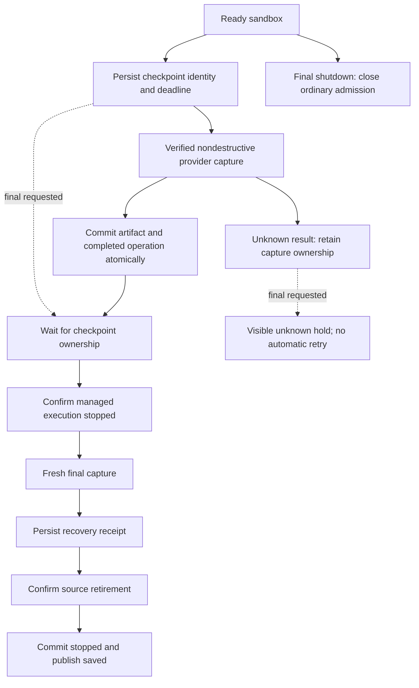

# C2: checkpoint operations without lifecycle overloading

## Scope

C2 builds on the lifecycle ownership ports and final-shutdown recovery flow already on `main`. It
extends the existing `SandboxShutdownCoordinator` and validated singleton `sandbox_preservation`
record. It does not add another coordinator, journal, SQL table, or independently writable admission
flag.

## Model

An ordinary checkpoint leaves the sandbox status `ready`. Completion never restores a remembered
status, so a concurrent cancellation, failure, or replacement cannot be rewritten to ready.

The nested checkpoint record includes a version, operation ID, generation, provider and object
handle, runtime version, reason, absolute deadline, nondestructive guarantee, and phase. Completion
carries the artifact and timestamp; uncertainty carries a safe error. Publication validates
operation, generation, provider object, and current source identity.

## Behavior

| Situation                                          | Ordinary work and application access          | Capture or replacement              |
| -------------------------------------------------- | --------------------------------------------- | ----------------------------------- |
| Ready, no checkpoint                               | Normal policy                                 | Allowed                             |
| Nondestructive checkpoint active                   | Remains available                             | Serialized                          |
| Checkpoint result unknown                          | Remains available while source is still ready | Held                                |
| Final waiting/draining/prepared/capturing/retiring | Held; cached credentials are withdrawn        | Final owner only                    |
| Final failed/unknown                               | Held                                          | Explicit supported recovery only    |
| Verified saved final receipt                       | Existing restore policy                       | Restore without silent substitution |

Final shutdown requested during an ordinary checkpoint enters the durable `waiting_for_checkpoint`
phase. Waiting has its own deadline. The preparation stop budget begins only after the earlier
operation settles, and every budget remains bounded by the provider hard expiry. Restart, ambiguity,
or an exhausted wait produces a visible hold rather than overlapping provider operations.

Heartbeat recovery uses the same checkpoint owner. Destruction follows only a completed capture. The
coordinator synchronously claims retirement for the exact completed heartbeat operation, generation,
provider, and object. If final shutdown already owns the source, heartbeat recovery does not destroy
or detach it.

## Outcome classification

`SandboxCheckpointOutcome` distinguishes:

- `saved`: the provider result and local snapshot record were durably committed.
- `held`: another owner, unsupported capability, readiness, or lifecycle policy prevents capture.
- `failed`: failure occurred before provider invocation, so retry may be safe.
- `unknown`: provider invocation may have happened, so automatic retry is unsafe.

Alarm scheduling precedes provider invocation. A failure or elapsed deadline before invocation
releases the reservation. Once invocation can have occurred, timeout, throw, late result, and
unconfirmed result retain unknown ownership. A broadcast failure cannot downgrade an already
committed receipt.

Ordinary capture requires `snapshotStopsSandbox: false`. Modal and OpenComputer declare that
capability. Destructive or unspecified snapshot semantics are routed through final shutdown or held.
A provider that nevertheless reports `sourceStopped` closes admission and records an unknown result.

## Application access boundary

Final ownership withdraws access from the application:

- the control plane emits `sandbox_access_changed`;
- access reads check lifecycle admission before and after secret decryption;
- the web hook is disabled during every non-running shutdown phase;
- cached credentials, terminal URLs, and tunnel URLs are cleared and masked;
- late responses cannot repopulate a held view.

This is not an all-writer freeze. Previously issued provider credentials, independently opened
connections, detached processes, and arbitrary repository servers are not revoked by the application
gate. Runtime preparation confirms managed agent execution stopped; it does not prove that every
possible filesystem writer stopped. Live-capture providers can therefore observe an external write
during capture, and writes after capture but before retirement may be absent from the recovery
point.

The accepted C2 scope preserves existing provider capture and stop behavior. Provider-wide write
fencing remains a separate enhancement and is not a C2 release requirement.

## Compatibility and rollout

- No production path writes the legacy `snapshotting` status.
- A legacy `checkpointInFlight` marker fails closed.
- Malformed, unsupported, or inconsistent checkpoint metadata fails closed in the repository
  decoder.
- Operation-unaware binaries can erase nested checkpoint ownership when rewriting the singleton. Do
  not roll back to such a binary while active or unknown operations exist.
- Provider canaries remain a release gate for Modal/OpenComputer concurrent capture, destructive
  snapshot providers, retained-state providers, interrupted capture, final retirement, and restore.

## Verification

Deterministic coverage includes:

- checkpoint ownership persistence and malformed-state rejection;
- ordinary-work admission during nondestructive capture;
- serialization against final shutdown and fresh post-wait preparation budgets;
- absolute deadlines, restart, late completion, and pre/post-provider error classification;
- heartbeat/final retirement races;
- access denial before and after decryption;
- cache withdrawal on held phases, 409 responses, reconnect, and late requests;
- lifecycle-manager and composed Workerd wiring.

Live-provider canaries and deployment are separate from these repository checks.

### Main-port validation

After porting C2 onto the merged C1 and current shutdown/recovery architecture:

- control-plane unit: **5,090 passed** across 319 files;
- Workerd integration: **1,321 passed, one skipped** across 110 files;
- web unit: **1,816 passed** across 206 files;
- shared unit: **942 passed** across 58 files;
- control-plane and web typechecks and lint passed;
- control-plane Worker and Node builds passed;
- formatting and both sandbox-boundary enforcement tests passed.

No live-provider canary or deployment was performed.
