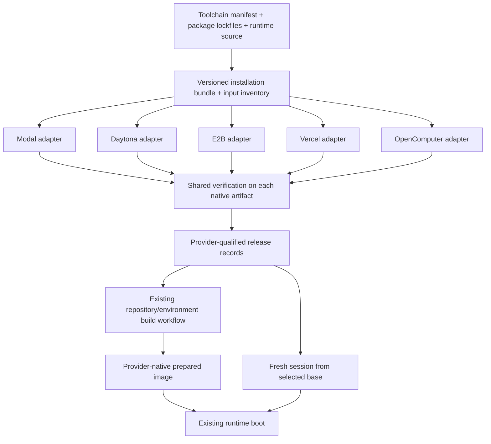

# Sandbox image and dependency consolidation

**Status:** Implemented shared native-build path; deployment promotion remains an explicit operator
action. Shared OCI distribution remains optional future work.

**Date:** 2026-09-06

**Source baseline:** upstream `main`, `265a5997cf5d2a929344bdecd671ce9972349b36`.

### Implementation decisions

- The operator interface and rollout commands are documented in
  [packages/sandbox-images/README.md](../../packages/sandbox-images/README.md).
- Release history uses a Git-tracked selection lock instead of adding a new hosted metadata service.
  Candidate files and CI artifacts are not the durable promotion record; promotion must be reviewed
  and committed before deployment.
- The frozen build-tool environment builds the runtime wheel inside the candidate image. Runtime and
  build tools use separate virtual environments, avoiding incompatible transitive pins while
  preserving the runtime package's existing lock unchanged.
- Both OS families have native-amd64 reference-image CI. Every provider adapter independently gates
  its output on a fresh native restore and verification. No production artifacts have been built or
  promoted during implementation.

## 1. Recommendation

Create one **sandbox image specification and installation bundle**, consumed by thin provider-native
builders. Keep the existing provider-neutral runtime and repository setup lifecycle. Make image
contents, dependency resolution, validation, and rebuild identity shared; keep provider allocation,
launch, snapshot, and credential transport provider-specific.

The intended maintenance experience is:

1. Change a tool version in one manifest, or a Python/JavaScript dependency in its owning package
   manifest.
2. Regenerate the affected lockfiles with one repository-root command.
3. Review a plan showing changed packages, affected provider targets, and rebuild reasons.
4. Build and verify candidates using the same installation bundle.
5. Promote verified provider artifacts; keep the previous artifacts available for rollback.

**Consolidate the recipe first; share built OCI layers where the integration supports them.** One
physical image for every provider is not a prerequisite. Conversely, separate provider outputs must
not mean separate dependency lists or installation programs.

This is a build/packaging boundary, not a new sandbox lifecycle framework, package manager, or
hosted image-management service.

## 2. Scope and evidence

The review traced the five implementations selected by
[the sandbox provider factory](../../packages/control-plane/src/sandbox/provider-factory.ts), their
build entrypoints, Terraform inputs, runtime boot, and repository/environment image selection. An
isolated worktree was created from freshly fetched upstream; neither the active `public/` checkout
nor `prod/` was modified. This describes upstream source behavior, **not an audit of currently
deployed artifacts**. No provider builds, deployment changes, or paid smoke tests were run.

### Current provider build paths

| Provider     | Image construction in this checkout                                                                                                                                                                                                                                                                    | Important differences to retain                                                                                                                                                     | Repository/environment prebuilds                                                                  |
| ------------ | ------------------------------------------------------------------------------------------------------------------------------------------------------------------------------------------------------------------------------------------------------------------------------------------------------ | ----------------------------------------------------------------------------------------------------------------------------------------------------------------------------------- | ------------------------------------------------------------------------------------------------- |
| Modal        | [Python image chain](../../packages/modal-infra/src/images/base.py); eager build through [deploy.py](../../packages/modal-infra/deploy.py)                                                                                                                                                             | Debian slim/Python 3.12; root runtime; native Modal image construction and deployment                                                                                               | Supported through the existing image-build workflow                                               |
| Daytona      | [Python toolchain builder](../../packages/daytona-infra/src/toolchain.py) and [bootstrap CLI](../../packages/daytona-infra/src/bootstrap.py)                                                                                                                                                           | `python:3.12-slim-bookworm`; root-oriented paths; named snapshot; current forced rebuild deletes the old name first                                                                 | Not supported by current image-build policy; ordinary sessions use persistent lifecycle semantics |
| E2B          | Legacy Dockerfile plus [Template SDK builder](../../packages/e2b-infra/build-template.py)                                                                                                                                                                                                              | Debian/Python 3.12; non-root `user`; build-time environment is not sufficient for the current launch integration; inert template start command and explicit runtime launch via envd | Supported, including provider-specific snapshot sanitization                                      |
| Vercel       | [TypeScript-generated shell bootstrap](../../packages/control-plane/src/sandbox/providers/vercel/bootstrap.ts), [temporary-sandbox builder](../../packages/control-plane/src/sandbox/providers/vercel/base-snapshot.ts), and [CLI](../../packages/control-plane/scripts/build-vercel-base-snapshot.ts) | Current integration uses `node24`, `dnf`, Python 3.12, source-built desktop tools, and privileged runtime launch                                                                    | Supported through filesystem snapshots                                                            |
| OpenComputer | [TypeScript image builder](../../packages/opencomputer-infra/src/build-template.ts)                                                                                                                                                                                                                    | Provider base image; `/home/sandbox`, user-owned Python/npm prefixes, `/app` symlink, proxy CA and network setup                                                                    | Supported through provider checkpoints                                                            |

The authoritative prebuild capability list is
[provider-policy.ts](../../packages/control-plane/src/image-builds/provider-policy.ts), which
includes Modal, Vercel, OpenComputer, and E2B. [IMAGE_PREBUILD.md](../IMAGE_PREBUILD.md) still
describes E2B prebuilds as disabled; use executable policy for this design and correct that
documentation during implementation.

### What is already consolidated

- **Runtime behavior:** `packages/sandbox-runtime` owns supervisor, bridge, repository
  synchronization, hooks, agent configuration, tools, skills, and auxiliary services. Do not copy or
  replace this subsystem.
- **Compatibility policy:**
  [runtime_manifest.json](../../packages/sandbox-runtime/src/sandbox_runtime/runtime_manifest.json)
  owns runtime generation and separate minimum-compatible/minimum-rebuild generations. Python and
  TypeScript already consume it, although Daytona retains its own version literal.
- **Repository/environment prebuild orchestration:**
  [image-builds/](../../packages/control-plane/src/image-builds/workflow.ts) owns build
  registration, callbacks, durable finalization, artifact fencing, and cleanup. Provider adapters
  translate operations. Do not introduce a parallel orchestrator for these builds.
- **Repository dependencies:**
  [RepositoryBoot](../../packages/sandbox-runtime/src/sandbox_runtime/repository_boot.py) and
  [RepositoryHooks](../../packages/sandbox-runtime/src/sandbox_runtime/repository_hooks.py) already
  provide shared `.openinspect/setup.sh` and `.openinspect/start.sh` semantics.

### Concrete duplication and drift

| Concern                | Evidence in the reviewed source                                                                                                                                                                                                                                                                                                                                                                                                                                                                         | Consequence                                                                                                                                                   |
| ---------------------- | ------------------------------------------------------------------------------------------------------------------------------------------------------------------------------------------------------------------------------------------------------------------------------------------------------------------------------------------------------------------------------------------------------------------------------------------------------------------------------------------------------- | ------------------------------------------------------------------------------------------------------------------------------------------------------------- |
| Tool versions          | OpenCode `1.18.29`, code-server `4.109.5`, and agent-browser `0.21.2` are repeated in all five builders                                                                                                                                                                                                                                                                                                                                                                                                 | A routine upgrade requires coordinated edits across Python, Dockerfile, and generated shell/TypeScript                                                        |
| Dependency resolution  | Builders repeat Python runtime dependencies instead of installing one locked runtime package; several use `pnpm@latest`, unversioned Bun/uv, and unpinned npm transitive dependencies                                                                                                                                                                                                                                                                                                                   | An unchanged recipe can resolve different contents on a later rebuild; the runtime's `uv.lock` does not govern these image installs                           |
| OS and service tooling | Browser/desktop package lists are repeated; ttyd is installed explicitly by Modal, Vercel, and OpenComputer but not the Daytona/E2B recipes                                                                                                                                                                                                                                                                                                                                                             | Service availability is not enforced by a common image contract; omission in a recipe is not proof that a provider base lacks the executable                  |
| Plugin staging         | Modal, Vercel, and OpenComputer populate `/app/opencode-deps`; Daytona and E2B do not. Modal also seeds the root global config directory                                                                                                                                                                                                                                                                                                                                                                | Different providers can pay dependency installation costs at first use. Existing runtime staging only fills missing destinations and preserves user manifests |
| Filesystem/environment | PATH, Python discovery, npm module paths, credential-helper shims, and wrapper installation are assembled independently                                                                                                                                                                                                                                                                                                                                                                                 | Permissions and subprocess imports behave differently, particularly for non-root runtimes                                                                     |
| Build success          | Several OpenComputer/Vercel installs are best-effort; Modal permits an OpenCode version probe to fail; E2B has a different readiness probe                                                                                                                                                                                                                                                                                                                                                              | Successful provisioning does not consistently prove the promised tools actually run                                                                           |
| Rebuild inputs         | [Daytona](../../terraform/environments/production/daytona.tf) hashes only Python/JS/TS; [Vercel](../../terraform/environments/production/vercel.tf) uses similar suffix filtering, excluding bundled JSON/Markdown/shell assets. E2B/OpenComputer use broader policies; Modal hashes runtime source but not the runtime package's own dependency manifests                                                                                                                                              | A runtime manifest, skill, wrapper, or dependency-only change need not invalidate every affected provider image                                               |
| Reported identity      | [E2B](../../packages/control-plane/src/sandbox/providers/e2b-provider.ts), [Vercel](../../packages/control-plane/src/sandbox/providers/vercel/provider.ts), and [OpenComputer](../../packages/control-plane/src/sandbox/opencomputer-rest-client.ts) supply `SANDBOX_VERSION` from control-plane code; [bridge](../../packages/sandbox-runtime/src/sandbox_runtime/bridge.py) and [build completion](../../packages/sandbox-runtime/src/sandbox_runtime/supervisor.py) report that environment variable | A new control plane can label an older retained artifact with a newer version. The configuration value is not evidence of installed contents                  |

### Current vendor capabilities versus repository integration

Provider documentation was checked separately from source inspection:

- Modal supports Dockerfile and registry inputs, subject to image/entrypoint constraints. This
  allows shared OCI layers without replacing Modal's provider responsibilities.
  [Modal documentation](https://modal.com/docs/guide/existing-images)
- Daytona documents snapshot creation from images and Dockerfiles. Its current repository builder
  can first consume shared installation files without a lifecycle/API migration.
  [Daytona documentation](https://www.daytona.io/docs/snapshots/)
- E2B exposes its Template SDK; this repository already imports a Dockerfile and adds
  copy/start/readiness steps through that SDK. Preserve this split until tested against the pinned
  SDK. [E2B SDK reference](https://docs.e2b.dev/sdk-reference/python-sdk/v2.7.0/template)
- **Vercel now documents custom OCI images through Vercel Container Registry, including digest
  references.** The repository's `dnf` bootstrap is not evidence that Vercel is permanently limited
  to that OS or cannot use a common image. Adopting the newer image path needs a
  client/launch/snapshot compatibility spike.
  [Vercel image documentation](https://vercel.com/docs/sandbox/concepts/images)
- OpenComputer documents a provider-base declarative builder and named snapshots. Arbitrary OCI
  import is not established by the reviewed integration or this documentation; use shared
  installation files on its base until verified.
  [OpenComputer templates](https://docs.opencomputer.dev/sandboxes/templates)

## 3. Ownership model

Four layers need different owners and update policies:

| Layer                        | Owner                                                   | Contents                                                                                                                     | When it changes                             |
| ---------------------------- | ------------------------------------------------------- | ---------------------------------------------------------------------------------------------------------------------------- | ------------------------------------------- |
| Provider substrate           | Provider build adapter                                  | Base OS reference, runtime user, privilege mechanism, CA/network requirements, native builder settings                       | Provider integration/base changes           |
| OpenInspect image            | Shared `sandbox-images` package                         | Toolchain, locked runtime dependencies, runtime payload, built-in tools/skills/plugins, service binaries, image verification | Product/runtime/dependency release          |
| Repository/environment image | Existing `image-builds` subsystem and repository owners | Ordered repository checkouts, setup hooks, project dependencies and caches                                                   | Existing scope/branch/secret/rebuild policy |
| Session state                | Existing sandbox runtime and control plane              | Fresh credentials, model/MCP configuration, managed skills, worktree state, running processes                                | Session creation/resume/configuration       |

The Modal **function image** in [app.py](../../packages/modal-infra/src/app.py) is separate from its
sandbox image. It needs provider/server dependencies such as Modal and FastAPI, not the entire
agent/browser toolchain. Share the runtime package artifact if useful; keep its dependency group and
lifecycle separate.



### Non-goals

- Changing the deployment-wide provider selection model, or enabling simultaneous production
  providers.
- Making snapshots portable between providers or changing pause/resume/termination semantics.
- Adding Daytona repository prebuild support as part of deduplication.
- Automatically upgrading project dependencies or installing dependencies from arbitrary lockfiles
  discovered in a repository.
- Making every tool or process run as the same UID on every provider.
- Adding a user-facing image-profile marketplace, arbitrary installation DSL, or new management UI.

## 4. Proposed source layout and interfaces

```text
packages/sandbox-images/                 # New build-time owner
  README.md
  pyproject.toml / uv.lock               # Shared planning/packaging CLI dependencies
  toolchain.json                        # Human-edited tool versions and artifact pins
  targets.json                          # Explicit OS/user/capability target mapping
  locks/
    runtime-<target>.txt                 # Generated, hashed runtime Python closure
    tools/package.json                  # Generated from toolchain.json
    tools/package-lock.json             # Locked toolchain npm closure
    plugins/package.json                # Generated plugin staging manifest
    plugins/package-lock.json           # Locked staging closure
  install/
    install.sh                          # Fixed phase order; small dispatcher
    os/debian.sh
    os/amazon-linux.sh                  # Current Vercel integration only
    languages.sh
    tools.sh
    runtime.sh
    filesystem.sh
  src/                                  # Validate, lock, plan, pack, build orchestration
  verify/                               # Common executable image conformance probes
  Dockerfile                            # Local Debian reference build using the bundle
```

Keep the existing `modal-infra`, `daytona-infra`, `e2b-infra`, and `opencomputer-infra` packages as
thin adapters during migration. Move Vercel **build-only** bootstrap/orchestration into
`packages/vercel-infra`; leave live sandbox REST/lifecycle code in `control-plane`. First separate
its shared launch constants from the installer module so runtime code does not import a build
package. Avoid duplicating the Vercel REST implementation merely to relocate a file; extract a
narrow transport module only if both consumers actually need it.

The shared CLI should initially be Python 3.12 with standard-library planning/packaging code,
fitting the existing image-build toolchain. It can invoke the existing Python and Node build
entrypoints as subprocesses. Do not rewrite provider SDK integrations into one language to achieve a
uniform command.

### Single sources of truth

- `toolchain.json`: exact OpenCode, code-server, agent-browser, ttyd, Bun, pnpm, uv, and
  source-built desktop tool versions/checksums. Derive the OpenCode plugin version from the OpenCode
  version; it is not a separately editable pin. Record release-specific constraints such as the
  existing OpenCode minimum-version requirement here with its rationale.
- `sandbox-runtime/pyproject.toml` and `uv.lock`: runtime Python requirements and resolution. Export
  a production dependency closure, with hashes and target markers, for image installation. Do not
  copy the requirements into provider recipes. Build-only SDK dependencies remain in provider/CLI
  lockfiles.
- npm tool and plugin lockfiles: generated owning manifests plus reviewed, committed dependency
  resolution. Ordinary builds run frozen installs, not lock updates. Installed versions and native
  binary execution must be checked, not just manifest text.
- Existing `runtime_manifest.json`: runtime compatibility policy only. Keep its current home and
  imports. Do not invent a second generation counter in the image package.
- `targets.json`: explicit supported target records, not arbitrary provider-conditioned installation
  snippets. The first release supports the existing Linux/amd64 integrations. Record the actual OS
  family/version during verification; reject unknown combinations rather than guessing.

Exact OS-package replay requires stable repositories/base references, not just an input hash. Pin
base digests where available and record resolved OS package versions everywhere. Where provider
bases or OS repositories remain mutable, label the build as non-hermetic and retain the tested
artifact. Do not claim byte-for-byte reproducibility from a manifest alone. Full OS repository
mirroring is outside the initial scope.

### Thin adapter contract

Each adapter accepts a **prepared bundle path and validated target**, and returns a structured build
result. It owns:

1. Native allocation/image construction and copying the bundle into the build environment.
2. Provider base selection, resource settings, root/sudo invocation, and provider-only CA/network
   prerequisites.
3. Invocation of the shared installer and verifier; native artifact finalization/readiness polling.
4. Provider artifact reference and cleanup of temporary build resources.

It must not own OpenCode versions, repeat pip/npm dependency lists, generate credential-helper
bodies, or duplicate shared OS package groups. OS package-name differences live in the two OS
installers, not in five adapters. OpenComputer-specific proxy/DNS work remains an adapter concern
and must not run on every Debian image.

Adapters exchange data, not generated shell source. An illustrative result shape is:

```typescript
type ImageBuildResult = {
  provider: "modal" | "daytona" | "e2b" | "vercel" | "opencomputer";
  providerScope: string; // Non-secret account/project/region identity
  artifact: { kind: string; ref: string }; // Native, provider-qualified handle
  target: string;
  recipeDigest: string;
  runtimeVersion: string;
  inventoryDigest: string;
  verification: { passed: boolean; reportPath: string };
};
```

This is a **build-time** interface, separate from `SandboxProvider` and `ImageBuildAdapter`. Define
supported artifact kinds as a closed provider-discriminated type during implementation. Do not pass
build credentials in the result.

Keep provider/registry credentials in the build runner's provider-specific authentication channel,
outside the installation bundle and image layers. Base artifacts contain no repository checkout or
session secrets. Repository/environment snapshots may contain private source or setup outputs and
must retain their existing scope and sanitization controls; never promote them into a shared base
image registry as an incidental optimization.

## 5. Installation and runtime contract

### Installation phases

1. **Validate substrate:** identify OS/architecture and build/runtime users; fail early for
   unsupported targets.
2. **Install OS requirements:** common package groups mapped to OS names; provider-required source
   builds remain explicit in the relevant OS installer.
3. **Install language/tool dependencies:** exact reviewed versions and lockfiles; downloads
   checksum-verified where separately distributed. Permit only required package lifecycle scripts.
   Preserve OpenComputer's executable OpenCode check and its known install-script requirement.
4. **Install runtime payload:** build one wheel from the exact runtime source, including JSON, shell
   files, JS/TS tools, Markdown skills, and companion assets. Install without dependency
   re-resolution using the locked runtime closure. Make Python module discovery work independently
   of an inherited `PYTHONPATH`.
5. **Establish filesystem contract:** shared shims, built-in tool assets, plugin staging trees,
   readable runtime files, and target-user-owned writable directories.
6. **Verify and record:** execute conformance probes as the actual runtime user; write installed
   identity/inventory only after all required checks succeed.

The wheel is a packaging improvement, not a path migration. Retain `/app/sandbox_runtime` as a
compatibility view of the installed package and `/app/opencode-deps` as the staging path until all
consumers are migrated. Install into one supported Python environment per target and provide fixed
executable shims for the selected interpreter. On non-root targets, create system-owned paths at
build time. Do not depend on boot-time writes to `/usr/local/bin` succeeding.

A frozen bundle is safe to retry only on a disposable candidate image: same inputs must either
converge or fail with a phase-specific error. A completion marker is not sufficient to skip
verification. Interrupted builds never become release candidates. This installer is not a
repair/upgrade command for live sessions.

### Filesystem and environment responsibilities

Preserve these existing runtime contracts first:

- `/workspace` remains the logical repository workspace. Provider-owned physical paths may use a
  deliberate compatibility mapping; do not rely on a provider SDK's default workdir to change
  `RuntimeConfig`'s `/workspace` default.
- `/app/opencode-deps` contains matching manifest, lockfile, and modules for built-in plugins.
  Build/cache native npm contents **per target**, not on the developer's macOS host or across
  incompatible Linux distributions.
- `python`/`python3`, Node, Bun, OpenCode, code-server, `gh`, and configured service binaries must
  resolve in a non-login shell. Include system administration paths where the target contract
  promises those tools.
- `/usr/local/bin/gh` remains the authentication wrapper, with the real CLI at `/usr/bin/gh`. The
  SCM helper retains `credential.useHttpPath=true` and its existing control-plane credential broker.
- Runtime `HOME`, npm cache/prefix, browser cache, temporary directories, and SCM credential cache
  must be writable by the runtime user. Keep provider-specific CA settings and trust roots intact.

The target's non-secret environment defaults are generated from one target record and used by both
image verification and provider launch configuration. Provider adapters still decide how those
values reach the process: Docker/SDK image `ENV` is not assumed to propagate. Session identifiers
and secrets continue through the existing authenticated creation/refresh channels and retain
system-over-user precedence. In particular, do not move E2B secrets into logged process-start
command arguments or per-command environment fields.

### Required versus optional capabilities

Keep one standard OpenInspect image initially. Define and verify its required agent, repository,
editor, terminal, and browser/desktop capabilities. A provider target may declare an explicit
unsupported capability to preserve an intentional current limitation, with a documented reason and
disabled product behavior; silent installation failure is not an exception mechanism.

Probe actual browser launch/screenshot and terminal/editor startup, not only `command -v`. Tools
required by the selected capability set must fail the build if missing. Optional features produce a
structured unsupported result rather than a misleading successful installation. Avoid introducing
multiple user-selectable profiles until there is a concrete size/startup requirement.

### Repository hooks and dynamic dependencies

Do not move project setup into the base installer. Preserve current boot policy:

| Boot mode                                    | Repository setup hook                             | Start hook                                              |
| -------------------------------------------- | ------------------------------------------------- | ------------------------------------------------------- |
| Fresh session                                | Runs in repository order; failure is a warning    | Runs; primary failure is fatal, secondary failures warn |
| Repository/environment image build           | Runs in repository order; failure fails the build | Does not run                                            |
| Session from prepared repo/environment image | Skipped                                           | Runs with the existing failure policy                   |
| Session snapshot restore                     | Skipped                                           | Runs with the existing failure policy                   |

Persistent process resume is provider-specific and must not be converted into a new boot solely for
this consolidation. Preserve boot-mode precedence, callback binding, secret refresh, and hook
timeouts.

There are also deliberately dynamic dependencies in
[OpenCodeServer](../../packages/sandbox-runtime/src/sandbox_runtime/opencode_server.py): configured
local MCP servers can trigger npm installation, and repository OpenCode manifests/plugins can bring
their own dependencies. Therefore the promise is **no first-boot downloads for OpenInspect-owned
tooling**, not zero network access or zero project dependency installation.

Keep dynamic MCP packages outside the immutable platform toolchain. Give them a runtime-user-owned
install/cache prefix, preserve configured package specs and existing warning policy, and report that
cost separately. Version-pinning policy for user-supplied MCP commands is a separate product
decision. Continue to materialize session-managed skills at runtime.

Keep the platform executable prefix distinct from that dynamic prefix so installing an MCP package
cannot accidentally replace the OpenInspect-owned OpenCode/tool binaries. Preserve command
resolution through explicit paths or a controlled PATH; this is dependency isolation, not a new
security boundary against arbitrary code running with the same sandbox privileges.

Never overwrite user `.opencode/package.json`, lockfiles, or `node_modules` to enforce platform
pins. Preseed pristine global/workspace locations using the existing behavior; report a collision
instead of silently replacing a foreign dependency tree. A common verifier should exercise both
pristine and user-owned configurations.

## 6. Build identity, provenance, and compatibility

### Three different identities

1. **Recipe digest:** what we intended to build. Hash normalized relative paths, file bytes,
   executable modes/symlink targets, target configuration, dependency locks, relevant adapter/build
   scripts and SDK locks, and the declared provider base reference. This replaces hand-maintained
   Terraform suffix filters and ordinary cache-buster edits.
2. **Installed inventory:** what the build actually installed. Record runtime source revision,
   recipe digest, runtime generation, OS/base details, architecture, effective paths/user, resolved
   dependency versions, and capability verification results. Its digest can differ across builds if
   upstream inputs are not hermetic.
3. **Provider artifact reference:** the concrete image/template/snapshot produced by a particular
   provider account/project/region. This remains opaque and provider-qualified, even when two
   artifacts share a recipe.

Derive a `baseReleaseId` in the external release record from provider scope, exact artifact
reference, and inventory digest. It identifies a tested realization of the recipe; it is not
embedded recursively into the artifact that determines it. A deliberately requested OS/base refresh
may produce a new inventory and release under the same recipe digest. Expose that as an explicit
rebuild operation and show the resolved inventory diff before promotion. Ordinary builds reuse
verified artifacts; they must not silently refresh floating inputs.

Use one input-inventory function for both packaging and hashing. Include all bundled runtime files,
not a suffix allowlist. Exclude caches, virtualenvs, generated outputs, `.git`, and developer-local
files; stage from declared source roots in a clean release checkout. Include lockfiles, build-system
metadata, source-built patches, shell wrappers, and skill assets. Normalize timestamps/order for
bundle output. Keep a source commit as provenance, not the only cache key: unrelated documentation
edits need not rebuild images.

A dependency-only change must invalidate every consuming target. An Amazon Linux-only installer
change should invalidate that target, not Debian targets. Changes to common inputs invalidate all
targets. Hash provider SDK lockfiles and infrastructure builder scripts only into their consumers;
keep control-plane service deployment hashes separate from image-content hashes.

### Baked identity is authoritative for installed contents

Write a non-secret `/app/openinspect-image.json` into each new image and preserve it in derived
repository images and session snapshots. Add one runtime reader used by bridge registration and
image-build completion. A control-plane expectation may be sent separately, but must never overwrite
the installed version.

The baked record contains installation-time identity and probe results. The subsequent native
fresh-spawn report belongs in the external release record: verification must not modify a finalized
artifact and then claim the original artifact was tested.

The baked file is inventory/provenance, **not a security attestation from an untrusted session**.
Deployment approval relies on the trusted build record and conformance report. Build callbacks
retain their current authentication, provider-session binding, one-time acceptance, and finalization
fencing.

Compatibility remains independent from recipe identity:

- `minimumCompatibleGeneration` controls whether an artifact may boot under the control plane.
- `minimumRebuildGeneration` controls proactive replacement of otherwise usable older images.
- A new recipe digest does not automatically mean protocol incompatibility. A tool update can
  trigger rebuilds without invalidating all existing sessions.
- An expected-artifact versus installed-identity mismatch is a provisioning error; do not relabel
  the image or silently install an update inside it.

Expected identity follows the artifact actually selected, including a compatible older prepared
image, not automatically the newest desired base release. Otherwise the mismatch check would
accidentally prohibit the compatible rollout window.

### Integrating prepared images

Extend existing `image_builds` persistence additively with `base_recipe_digest`, `base_release_id`,
and the target used for a build; retain its existing provider, artifact, runtime version, ordered
repository fingerprint, and SHA provenance. Capture the expected base identity when planning the
build, then compare completion metadata to it. Preserve the accepted metadata through durable
finalization. Old in-flight callbacks remain readable during rollout.

The planner owns the provider-qualified base release binding; the runtime reports its baked
recipe/inventory identity. Resolve the release binding from trusted build state, not a caller's
claim that it belongs to a particular provider artifact.

The repository fingerprint is **not** an image-content hash: it represents the ordered
repository/branch set and must keep its existing semantics. Existing scope-secret changes already
invalidate prepared images; do not hash secret values into a public release identifier. If a later
cache design needs secret/config revisions, use non-secret revision identifiers.

After target rollout, the scheduler can rebuild a prepared image whose base release differs from the
selected release, independently of repository branch movement. This also covers an explicit OS
refresh with an unchanged recipe. Spawn can continue to use an older compatible image during this
rebuild, preserving the current base-image fallback. Do not require all repositories to finish
rebuilding before deploying a compatible tooling update.

Legacy rows without base identity are explicitly unknown. They remain subject to existing
generation/provenance checks and are queued for replacement; do not backfill identity from today's
provider default. Unknown ownership or unparseable compatibility remains fail-closed. Adding this
metadata does not authorize redirecting old session handles to another provider.

## 7. Build, release, deployment, and rollback

### Repository-root workflow

Proposed commands below are interfaces to implement, **not commands available today**:

```bash
npm run sandbox:images -- lock
npm run sandbox:images -- plan --provider all
npm run sandbox:images -- build --provider e2b
npm run sandbox:images -- verify --artifact release-candidate.json
```

`plan` is local and credential-free; `build` provisions only the selected provider. `all` on a build
must mean an explicitly configured build matrix, not silently provisioning every vendor. The plan
reports target, dependency diff, recipe digest, affected input paths, and whether the operation
builds, reuses, or requires manual-artifact verification. Build logs separate phase durations,
verification failures, provider handles, and cleanup status.

The first implementation should produce release records as durable deployment/CI artifacts, not
introduce a database-backed base-image service. Each record includes exact provider scope/reference,
full digests, verification report, source revision, and prior-release reference. Deployment
configuration selects a record; maintain selected/prior records in durable deployment state so they
are not lost with an expiring CI job. A JSON output left only on a runner is not sufficient.

### Candidate construction and promotion

1. Resolve inputs and build an immutable candidate name/reference. If a shortened digest is used in
   a name, verify the full digest before reuse.
2. Record allocated build handles immediately. Poll native completion and run verification against
   the finalized artifact, including a fresh sandbox created from it.
3. Save the successful release record. A partial multi-provider build does not promote failed
   targets or change the deployment default.
4. Deploy compatible control-plane readers/launch support if not already present, then select the
   verified artifact using existing provider configuration boundaries.
5. Retain the previous artifact and cleanup obligations. Temporary builders and failed candidates
   are cleaned up using provider-specific permanent-destruction semantics, not an assumed universal
   `stop` operation.

Use a deployment lock per provider scope and serialize promotion. Retrying a candidate must check
native readiness and stored full identity, not just name existence. On ambiguous create/finalize
outcomes, reconcile known handles before issuing another expensive create. Track unresolved
resources durably for later cleanup; `finally` alone does not cover a crashed runner or
allocation-before-persistence failure.

### Terraform changes

- Replace the five custom source-hash programs with the shared planner's deterministic target
  digest. Account for every new manifest, lockfile, installer, verification, and adapter input.
- Terraform remains the initial deployment entrypoint. Existing module scripts call the shared CLI;
  do not add a separate competing image deploy path.
- Change Daytona away from deleting its current named snapshot before building. Generate a candidate
  name, verify it, and update `DAYTONA_BASE_SNAPSHOT` only after success.
- For E2B, distinguish a release-specific artifact/reference from a reusable human alias; verify
  pinned SDK support before relying on exact build-ID selection. Unique per-release template names
  are the fallback. Preserve envd direct launch and the inert captured start process.
- E2B currently has an explicit **worker-before-template** dependency for direct-boot migration. Do
  not mechanically reverse it. First ship a worker that supports both retained and new artifacts
  without selecting an unbuilt reference; then build/verify candidates; finally promote. This staged
  sequence also avoids the current first-enable window where configuration can reference a
  nonexistent template.
- For Vercel, persist/select the verified snapshot ID rather than resolving an arbitrary newest
  snapshot by a reusable name. For OpenComputer, retain content-derived names and record returned
  checkpoint/snapshot identity. Modal must still eagerly build the dynamic sandbox image before
  deploying functions that use it; keep its separate function-image deployment contract.
- Manual artifact overrides remain supported only with a matching target/identity verification
  record for new releases. Do not quietly stamp a manually supplied artifact with the current
  manifest version. Existing legacy overrides need an explicit audit/rebuild path during migration.
- Add `packages/sandbox-images/**` and any new Vercel build package to workflow path filters and
  package checks. Verify both the workflow trigger and downstream Terraform/module digest; either
  alone is insufficient.

### Rollback and retained state

Rollback selects the previous **tested control-plane/artifact combination**, without rebuilding old
source against today's registries. A control-plane-only rollback is allowed only if it accepts the
installed generation/launch contract. Do not lower compatibility floors blindly to make a rollback
pass.

Do not mutate, bulk-upgrade, or delete active session filesystems during an image release. Existing
session restore/resume must either remain supported by the staged rollout or require a separately
planned drain/recovery process. Fresh/prebuilt-image rejection can fall back to a verified base; an
incompatible session snapshot containing user work must not be discarded under that fallback rule.

Retain selected/prior artifacts and anything referenced by active sessions, prepared images, or
cleanup obligations. Provider-native dependencies can outlive a name change. Start base-artifact
deletion as an explicit reference-audited operation, not a new broad garbage collector. Keep
credentials for previous provider-owned resources until their cleanup backlog is empty.

## 8. Verification strategy

Tests must prove the shared contract, not just assert that generated scripts contain matching
version strings.

| Check                       | Evidence required                                                                                                                                                                                       |
| --------------------------- | ------------------------------------------------------------------------------------------------------------------------------------------------------------------------------------------------------- |
| Manifest/lock consistency   | One editable version per tool; plugin/CLI pin agreement; frozen runtime/tool closure; valid target/generation values                                                                                    |
| Packaging/hash coverage     | A skill asset, JSON manifest, shell wrapper, dependency lock, or executable-bit change invalidates affected targets; caches and unrelated docs do not; packed inventory matches hashed inventory        |
| Local reference image       | Installer executes on supported OS substrates; runtime wheel includes assets; Python import works without `PYTHONPATH`; binaries execute and report locked versions                                     |
| Native provider artifact    | Fresh sandbox from final artifact passes verification as its real runtime user, through the same env/launch transport as production                                                                     |
| Agent and tools             | OpenCode starts; a fixture plugin loads; built-in staging avoids platform package downloads in a pristine config; foreign repository manifests remain untouched                                         |
| Runtime services            | Editor, terminal, browser screenshot, and required desktop components function; provider port/proxy integration remains intact                                                                          |
| Credentials and permissions | `gh` wrapper/helper resolve and broker through existing authorized test paths; no need to write privileged shims at boot; caches/workspace writable; image inventories/logs contain no injected secrets |
| Lifecycle modes             | Fresh, prepared-image boot, snapshot restore, persistent resume where supported, and image-build completion retain hook ordering/timeout/failure semantics and callback fencing                         |
| Skew and failures           | Old artifact/new worker, new artifact/compatible prior worker, mismatched baked identity, failed build, retry, promotion failure, and rollback produce defined outcomes                                 |
| Deployment integration      | Manifest-only changes trigger each affected workflow/module; candidate failure leaves the selected artifact unchanged                                                                                   |

Run local schema/packaging/reference checks on pull requests. Real provider tests require configured
test accounts, bounded time/resources, tagged disposable artifacts, and tracked permanent cleanup.
Use one shared conformance harness invoked by provider drivers; local Docker tests cannot establish
envd, provider CA, VM snapshot, or native resume behavior.

Measure before and after on the same provider/resources: build duration and cache-hit behavior,
image size where observable, create-to-bridge-ready time, first-prompt latency, dependency-download
time, and failure phase. No performance gain is claimed by this design without those measurements.

## 9. Migration plan and completion gates

Each phase should be reviewable and deployable on its own. Avoid combining provider lifecycle fixes
with dependency pin updates unless required to preserve the selected contract.

| Phase                                           | Work                                                                                                                                                                         | Exit gate                                                                                                                                   |
| ----------------------------------------------- | ---------------------------------------------------------------------------------------------------------------------------------------------------------------------------- | ------------------------------------------------------------------------------------------------------------------------------------------- |
| 1. Inventory and shared inputs                  | Add image package, target records, centralized tool pins, lock/export command, deterministic inventory/planner. Make existing builders read shared pins and runtime manifest | One dependency change produces a correct affected-target plan; all bundled file types participate in hashing; no lifecycle changes          |
| 2. Shared Debian installation                   | Extract installer from Modal; convert Daytona and E2B to consuming the bundle; package runtime and seed dependencies with target-user permissions                            | Native smoke checks pass for all three; no duplicated Debian/tool/Python install lists; preserve E2B direct boot and Modal eager build      |
| 3. Remaining adapters                           | Convert OpenComputer using its existing base/user/CA contract. Move and convert Vercel build-only bootstrap, retaining Amazon Linux target initially                         | Five builders invoke common phases and conformance checks; provider-only exceptions are explicit                                            |
| 4. Truthful identity and prepared-image refresh | Add baked identity reader, additive build metadata, reader-first rollout, expected/observed matching, recipe-aware rebuild scheduling                                        | Version no longer comes solely from control-plane injection; legacy callbacks/rows and retained artifacts have tested migration behavior    |
| 5. Unified release operations                   | Wire all Terraform hashes/scripts/CI paths to planner; immutable candidates and durable release records; promotion/rollback and cleanup accounting                           | Dependency-only release and failed-build rollback rehearsed; no selected artifact is deleted to rebuild in place                            |
| 6. Optional shared OCI distribution             | Evaluate/publish the common Debian image for compatible providers; test Vercel VCR migration and provider-required overlays                                                  | Verified registry auth, digest mapping, launch/env/ports/snapshots and rollback; remove obsolete installers only after consumers leave them |

Locking currently floating dependencies can change behavior. During phases 1–3, inventory a
known-good artifact where available and preserve observed versions; where unavailable, treat first
resolution as an explicit dependency change with a reviewed lock diff and native tests. Do not
advertise the initial freeze as behavior-neutral.

The phases are logical delivery boundaries, not a mandate to ship a partially migrated safety
contract. In particular, truthful identity, compatibility readers, and promotion must be staged
together when a provider cannot safely mix old and new artifacts.

### Definition of done for the consolidation

- A routine OpenCode upgrade edits one authoritative tool version and generated locks, not five
  provider recipes.
- Runtime Python dependencies come from the runtime package and its lock; provider SDKs remain
  outside sandbox dependency groups.
- Every provider consumes the same installation phases, payload inventory, and verification
  contract, with named OS/user exceptions.
- Built-in tools and plugin staging do not require ad hoc first-boot platform dependency downloads.
- Bundled asset and dependency-only changes rebuild all consumers without a manual cache-buster
  hunt.
- Every promoted artifact has truthful installed identity, a native smoke report, and a retained
  rollback reference.
- Repository hooks, secret transport, image finalization, and retained-session lifecycle contracts
  remain intact.

## 10. Alternatives and decisions still requiring evidence

| Alternative                                       | Assessment                                                                                                                                                                                                                                                                                                |
| ------------------------------------------------- | --------------------------------------------------------------------------------------------------------------------------------------------------------------------------------------------------------------------------------------------------------------------------------------------------------- |
| Version JSON only                                 | Useful phase 1, insufficient end state: installation order, package lists, filesystem setup, and verification can still drift                                                                                                                                                                             |
| One giant shell script with provider switches     | Centralizes text but mixes unrelated OS and provider lifecycle responsibilities; use fixed phases, OS installers, and thin adapters instead                                                                                                                                                               |
| One Dockerfile/OCI image immediately              | Attractive for shared build caching and dependency reuse. Modal/Daytona and Vercel's newer image API make it credible, but it does not remove provider launch/user/snapshot constraints or establish OpenComputer import support. Keep it as a compatible output of the shared recipe, not a prerequisite |
| Generic declarative build DSL/transpiler          | Adds a second abstraction over SDKs/Dockerfile without eliminating OS commands or native semantics; unnecessary for five adapters                                                                                                                                                                         |
| Install/repair the platform on every session boot | Adds registry/network dependencies and changes retained session contents; incompatible with immutable image releases and predictable startup                                                                                                                                                              |
| Devcontainers/Nix as mandatory runtime layer      | Could serve particular repository workflows, but would add a new execution/build contract across every provider. No codebase evidence requires that expansion to solve this duplication                                                                                                                   |

Bounded implementation investigations:

1. **Vercel OCI path:** prove the current client migration, VCR access, UID/home assumptions, Python
   executable, port access, snapshot restoration, and rollback. If this eliminates the Amazon Linux
   branch before phase 3 without broad lifecycle work, prefer that simplification.
2. **E2B identity:** verify immutable artifact selection with the pinned SDK/API and sanitization
   behavior; use release-specific names if aliases cannot be pinned safely.
3. **OpenComputer substrate:** record the actual base OS/Node/npm versions and evaluate arbitrary
   OCI support separately. Preserve documented code-local CA/network requirements until native tests
   prove they are unnecessary.
4. **Capability baseline:** confirm whether terminal/editor/browser support is promised on every
   enabled provider. The recipe inventory exposes omissions but does not prove current deployed
   availability.
5. **Retained artifacts:** inventory active manual overrides and session/prebuild generations before
   enforcing new identity requirements. No production configuration or old artifact contents were
   inspected in this design task.

These investigations choose adapter details; they do not block the central decision: **one owner for
image contents and dependency resolution, one contract for verification, and provider-specific
ownership of execution and artifacts.**
