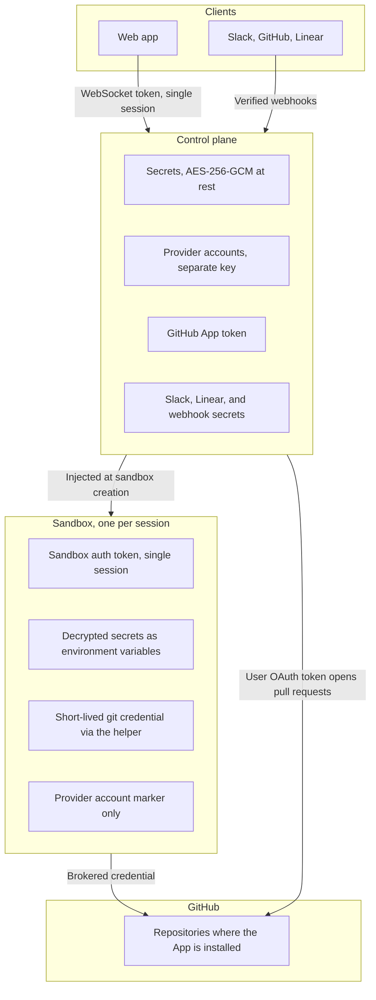

This page states what OpenInspect trusts, what it does not, and what you should decide before letting a whole organization use it.

## One trusted organization

OpenInspect is designed for a single trusted organization. A deployment is one workspace, and everyone admitted to it shares the same source-control App installation.

- The App installation defines repository reach. Any active user whose role permits repository use can start a session on any repository the App is installed on.
- There are no per-user repository checks. OpenInspect does not compare a user's personal GitHub permissions with a repository before creating a session.
- The trust boundary is the organization, not the individual user.

If your users should not all see the same repositories, OpenInspect in its current form is the wrong fit; you would need per-tenant App installations, access validation at session creation, and tenant isolation in the data model.

## Identity and admission

Sign-in is GitHub, Google, or both. After the provider verifies identity and email, the deployment's admission rules decide whether the person joins: by GitHub username, verified email, verified email domain, or active membership in an allowed GitHub organization. Admission is checked at sign-in only; suspension is the immediate revocation tool. Details are in [Workspace access and roles](/administration/workspace-access).

## Roles are product capabilities

The four roles (Owner, Administrator, Member, Viewer) decide which OpenInspect features a person can use: create sessions, manage settings, view the audit log, and so on. They are not repository ACLs. A Viewer can read every session in the workspace, and a Member can prompt every session, because sessions are workspace resources rather than private ones.

## Token architecture

| Token              | Purpose                                                   | Scope                                       |
| ------------------ | --------------------------------------------------------- | ------------------------------------------- |
| GitHub App token   | Mints brokered git credentials for clone, fetch, and push | All repositories where the App is installed |
| User OAuth token   | Create pull requests as the user, identify the user       | Repositories the user has access to         |
| Sandbox auth token | Authenticates sandbox-to-control-plane calls              | A single session                            |
| WebSocket token    | Authenticates a client's live connection                  | A single session                            |
| Managed LLM token  | Short-lived OpenAI or xAI model access                    | The provider account pinned to the session  |

Where each credential lives, and what crosses each boundary:

Git credentials are brokered on demand. Fresh and prebuilt-image sandboxes fetch a short-lived credential through the control plane by way of a git credential helper rather than carrying a token embedded in the environment or the remote URL. The helper authorizes HTTPS requests for the configured source-control host, so setup and start scripts that clone other private repositories available to the installation keep working. Snapshot restores may still receive an environment-token fallback so older snapshots can boot; Modal snapshot restores mint a fresh fallback token on restore.

Pull requests are opened with the prompting user's GitHub OAuth token when they signed in with GitHub, which gives correct attribution and means they can only open pull requests where they have write access. Users who signed in with Google carry no source-control token, so their pull requests fall back to the App identity.

## Secrets and provider accounts

- Secrets live at global, repository, or environment scope. A session receives global secrets plus its target's secrets; repository secrets override global ones with the same key, and environment secrets do not inherit repository secrets. See [Secrets](/configure/secrets).
- Values are encrypted with AES-256-GCM before storage, decrypted only at sandbox creation, and injected as environment variables. Saved values are never returned to the browser or the API; only key names are visible.
- Variables set by the control plane always take precedence over user-defined secrets.
- OpenAI, xAI, and Claude subscription credentials are provider accounts, not generic secrets. They are encrypted with a separate key, stay in the control plane, are never returned to the browser, and are never injected into sandboxes as plain secrets. A sandbox in account mode receives only a marker and requests short-lived access from the control plane. See [Provider accounts](/models/provider-accounts).
- Administrative permissions control who can configure secrets and provider accounts; role-based read access never exposes their values.

## Sandbox boundaries

- Each session runs in its own isolated sandbox with a full development environment. The sandbox holds the session's auth token, the session's secrets, and whatever the agent writes.
- Snapshots contain workspace state. Anything on disk when a snapshot is taken comes back on restore, including files a setup script or the agent wrote.
- Prebuilt images capture what `setup.sh` writes. Image builds run with the same secrets a session gets; a credential written to disk (an `.npmrc`, a `.env`, a downloaded key) is baked into the image and served to every session that boots from it, even after you rotate the secret. Read secrets from the environment at runtime instead. Environment-secret changes invalidate that environment's image automatically; repository and global secret changes do not. Treat a scope's image as no less sensitive than the scope's secrets. See [Prebuilt images](/configure/prebuilt-images).
- On the Claude Agent harness, the Claude credential is held in process memory and never written to disk, so a snapshot carries no credential and a restore re-fetches it. Code the agent runs, and hooks a repository's `.claude/` settings register, run as children of the agent process and can read that credential, the same way code can read the sandbox token and user secrets under either harness. This same-sandbox exposure is accepted by design; the wrapper prevents accidental spread (OpenCode, code-server, the terminal, and user shells never see the Claude token), not deliberate exfiltration by code the agent chooses to run. See [Agent harnesses](/models/agent-harnesses).

## Untrusted input in integrations

Content that arrives from outside the workspace is treated as data, not instructions:

- **GitHub.** Webhooks are verified and duplicate deliveries are deduplicated. Review prompts wrap the PR title, author, branches, and description as untrusted; comment-triggered prompts wrap the triggering comment. Review-thread file and diff context, and GitHub content the agent later reads itself, are not separately transformed. The bot ignores bot-authored comments and, by default, requires write, maintain, or admin repository access from the triggering user, or an explicit user allowlist.
- **Slack.** Requests are verified. Bot tokens stay server-side and never reach sandboxes. Slack identity linking is best-effort and is not used to approve repository access. Channel message triggers mean any member of a watched channel can start a run, and the message text reaches the agent; prefer a Slack user allowlist and small, trusted channels.
- **Linear.** Webhooks are verified; client credentials and runtime tokens stay server-side. Issue titles, descriptions, comments, and agent prompts are sent to the coding agent, so do not put secrets in them.
- **Inbound webhooks and PR feedback.** Automation webhook payloads and autofix feedback are wrapped as untrusted data before they reach the agent. See [Inbound webhooks](/automations/inbound-webhooks) and [GitHub](/integrations/github).

## Human approval remains authoritative

OpenInspect opens pull requests; it does not merge them. Branch protection, required reviews, and CI stay in force exactly as your repository configures them. When a pull request is opened as the prompting user, GitHub will not let that user approve their own work.

Attribution is not authorization. Commits carry the prompting user as author, and sessions record their creator and participants, but those labels record who asked for the work. Whether the work is accepted is decided by your review process, not by OpenInspect.

## Pre-production checklist

| Decision                            | What to do                                                                                                                                                                                                                                  |
| ----------------------------------- | ------------------------------------------------------------------------------------------------------------------------------------------------------------------------------------------------------------------------------------------- |
| Restrict admission                  | Configure at least one allowlist (GitHub usernames, email domains, exact emails, or GitHub organizations). Do not enable open access. Deploy behind your organization's SSO or VPN where possible.                                          |
| Limit the App installation          | Install the GitHub App with **Select repositories**, not all repositories. The installation scope is the reach of every session.                                                                                                            |
| Least-privilege roles               | Keep most people as Members; grant Administrator only to people who manage settings, secrets, and members. Keep a second Owner so the last one is never stuck.                                                                              |
| Review integration trigger gates    | GitHub: repository scope and the trigger-user rule. Slack: channel invitations, user allowlists on channel triggers. Linear: repository scope.                                                                                              |
| Choose secret scopes deliberately   | Put shared model keys at global scope, repository-specific credentials at repository scope, and keep long-lived secrets out of `setup.sh` writes.                                                                                           |
| Keep branch protection              | Required reviews and CI are your merge gate. OpenInspect never bypasses them.                                                                                                                                                               |
| Decide on sandbox tools and autofix | Sandbox terminal, code server, VNC, and tunnel ports are configurable per scope ([Sandbox settings](/configure/sandbox-settings)). PR Feedback Autofix is off by default; if you enable it, set the review-bot allowlist and attempt limit. |
| Review provider retention           | Sandboxes, snapshots, and prebuilt images live with your sandbox provider. Check its retention and your timeout settings, and remember images carry whatever setup wrote to disk.                                                           |

## Next steps

- [Workspace access and roles](/administration/workspace-access)
- [Audit log](/administration/audit-log)
- [Deployment overview](/administration/deployment)
