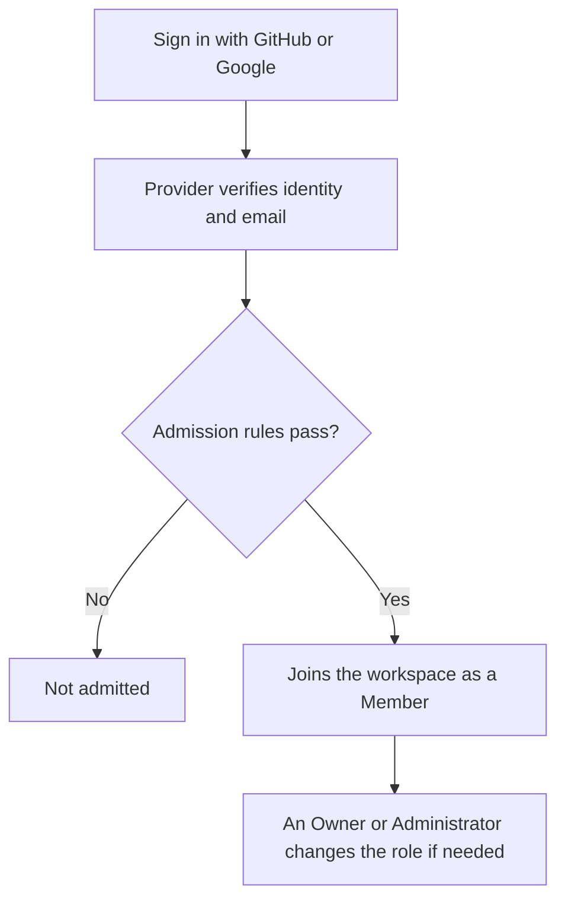

This page explains who can get into your workspace, what each role permits, and how to change or suspend a member from Settings › Workspace access.

<Callout type="info" title="One workspace, one trusted organization">
  An OpenInspect deployment is a single workspace. The source-control App installation defines which
  repositories the workspace can reach. Roles control which OpenInspect features a person can use;
  they are not per-repository access lists. See [Security and trust
  model](/administration/security).
</Callout>

## Signing in and admission

A deployment can offer GitHub sign-in, Google sign-in, or both. The sign-in page shows only the providers the operator configured.

Signing in has two stages:

1. Your identity provider verifies your identity and email address.
2. The deployment's admission rules decide whether you may join the workspace.

Admission can be limited by any of the following, depending on how the deployment is configured:

| Allowlist kind              | What it matches                       |
| --------------------------- | ------------------------------------- |
| GitHub username             | The signed-in GitHub login            |
| Verified email address      | An exact address                      |
| Verified email domain       | Any address on the domain             |
| Allowed GitHub organization | Active membership in the organization |

These rules are checked at sign-in. Removing someone from an allowlist or from a GitHub organization does not end an existing browser session. When access must be revoked immediately, suspend the member (see [Suspension](#suspension)).

Signing in does not make anyone an Owner or Administrator. Every admitted user has exactly one workspace role, and new users receive the Member role by default.

## Roles

OpenInspect has four built-in roles.

| Capability                                        | Owner | Administrator | Member | Viewer |
| ------------------------------------------------- | :---: | :-----------: | :----: | :----: |
| View repositories and environments                |  Yes  |      Yes      |  Yes   |  Yes   |
| Use repositories and environments in sessions     |  Yes  |      Yes      |  Yes   |   No   |
| Manage shared settings, integrations, and secrets |  Yes  |      Yes      |   No   |   No   |
| Create sessions                                   |  Yes  |      Yes      |  Yes   |   No   |
| View every session                                |  Yes  |      Yes      |  Yes   |  Yes   |
| Collaborate in and manage sessions                |  Yes  |      Yes      |  Yes   |   No   |
| View automations                                  |  Yes  |      Yes      |  Yes   |  Yes   |
| Create automations                                |  Yes  |      Yes      |  Yes   |   No   |
| Manage and trigger own automations                |  Yes  |      Yes      |  Yes   |   No   |
| Manage and trigger any automation                 |  Yes  |      Yes      |   No   |   No   |
| View and manage workspace members                 |  Yes  |      Yes      |   No   |   No   |
| View the audit log                                |  Yes  |      Yes      |   No   |   No   |
| Transfer workspace ownership                      |  Yes  |      No       |   No   |   No   |
| View analytics                                    |  Yes  |      Yes      |  Yes   |  Yes   |
| View provider accounts                            |  Yes  |      Yes      |  Yes   |   No   |
| View image-build history                          |  Yes  |      Yes      |  Yes   |  Yes   |
| Manage personal skill profiles                    |  Yes  |      Yes      |  Yes   |   No   |

**Owner.** Full access to the workspace. Only Owners can grant or remove the Owner role or suspend and restore another Owner. The final active Owner cannot be suspended or demoted, so the workspace cannot lose all ownership by accident.

**Administrator.** Runs the workspace day to day: members, sessions, automations, repositories, environments, provider accounts, integrations, secrets, and the audit log. Administrators cannot transfer ownership, change who holds the Owner role, or suspend and restore an Owner.

**Member.** Creates and uses sessions, collaborates in existing sessions, uses shared repositories and environments, and creates automations. Members manage and manually trigger the automations they own but cannot modify someone else's automation or change shared configuration. They can view [analytics](/administration/analytics).

**Viewer.** Read-only access to shared workspace resources: sessions, automations, analytics, repositories, environments, skills, and MCP servers. Viewers cannot create or prompt sessions, access sandboxes, manage personal skill profiles, trigger automations, or change shared configuration.

## How session access works

Sessions are workspace resources, not private resources owned by their creator.

- Anyone with session read access can view every session in the workspace.
- Anyone with collaboration access can prompt and contribute to every session.
- Anyone with lifecycle access can stop, retry, archive, and restore every session.
- Anyone with sandbox access can use supported sandbox tools in every session.

The creator shown on a session is attribution, not an access list. Participant labels identify who contributed but grant nothing. The **Mine** filter on the Sessions page is a convenience for finding your own sessions, not a security boundary.

Creating a session also requires permission to use the selected repository or environment. A role can therefore view an existing session without being allowed to create a new one.

New HTTP requests reflect role changes and suspension immediately. Live browser connections to a session are rechecked at least every five minutes, so an open connection can remain for up to five minutes after access changes. Nobody needs to recreate the session.

## How automation access works

Automation definitions and run history are visible workspace-wide to any role with automation read access. Creating, changing, and manually triggering automations follow ownership rules: Members manage and trigger their own, Administrators and Owners manage and trigger any, Viewers only inspect.

Ownership follows the signed-in account that created the automation, not a display name or an external provider username.

| Run type                   | Runs under whose authority                                                                                                                                                                                                                                      |
| -------------------------- | --------------------------------------------------------------------------------------------------------------------------------------------------------------------------------------------------------------------------------------------------------------- |
| Scheduled and event-driven | The automation owner. At run time the owner must still be active and allowed to create sessions and use every selected repository or environment. If not, the run does not start.                                                                               |
| Manual (**Trigger Now**)   | The person who clicked **Trigger Now**, even when an Administrator or Owner triggers someone else's automation. The requester must be allowed to trigger it and to create the resulting session; their identity and linked source-control credentials are used. |

## Bots and integrations

The Slack, GitHub, and Linear integrations act on behalf of a workspace user when they handle that user's request. Their effective access is limited by both the acting user's current role and the integration's fixed set of allowed operations. An integration cannot bypass a suspended user or perform workspace administration just because the acting user is an Owner. Calls that do not identify an acting user are denied unless a specific integration route explicitly permits that operation.

Integrations also apply their own ingress rules. The GitHub integration, for example, can require an allowed trigger user or sufficient repository collaborator access before it sends a request to OpenInspect. See [Integrations](/integrations).

## Suspension

There is no action to remove a member from the workspace; suspension is the way to take someone's access away. Suspending a member disables their access without deleting their account or historical attribution. After suspension:

- New browser and bot operations are denied.
- Existing browser sign-in sessions are invalidated.
- Live browser session connections close within five minutes.
- Scheduled and event-driven automations the member owns no longer pass run authorization.
- Existing session history and authorship remain intact.

Suspension does not stop a sandbox that is already executing. An Administrator or Owner can stop or archive that session separately.

## Managing members

Owners and Administrators manage members from Settings › Workspace access. The page lists each member with their display name, email, assigned role, and a **Suspend** or **Restore** button, followed by a Roles section showing each role, its description, and how many members hold it.

<Steps>
<Step>
### Review members and roles

Open Settings › Workspace access. Each row shows the member's current role. The Roles section below lists the built-in roles with their assignment counts.

</Step>
<Step>
### Change a member's role

Choose a new role from the drop-down on the member's row. The change is applied immediately and recorded in the [audit log](/administration/audit-log). Only an Owner sees the Owner option, and only an Owner can change another Owner's role.

</Step>
<Step>
### Suspend or restore a member

Click **Suspend** to disable access, or **Restore** to reinstate a suspended member. The button is disabled for an Owner when you are not an Owner yourself, and for the last active Owner.

</Step>
</Steps>

Rules that apply regardless of who is signed in:

- Only an Owner can assign or remove the Owner role or suspend and restore another Owner.
- The last active Owner cannot be suspended or demoted. Promote a second Owner first.

### Initial Owner bootstrap

The first person to sign in receives the Member role and is not promoted automatically. On a new deployment, the intended Owner signs in once, and a deployment operator runs the Owner bootstrap command with that person's user ID. This is an operator step; see the [self-hosting guide](https://github.com/ColeMurray/background-agents/blob/main/docs/GETTING_STARTED.md) and [Deployment overview](/administration/deployment).

## Troubleshooting

<Accordions>
  <Accordion title="A removed person can still use the workspace">
    Allowlists and GitHub organization membership are checked only at sign-in, so an existing
    browser session continues. Suspend the member from Settings › Workspace access to cut access
    now.

</Accordion>
  <Accordion title="The role drop-down or Suspend button is disabled for a member">
    The member is an Owner and you are an Administrator, or the member is the last active Owner. Ask
    an Owner to make the change, or promote another Owner first.

</Accordion>
  <Accordion title="A scheduled automation stopped running after a role change">
    Scheduled and event-driven runs execute under the owner's authority. If the owner was suspended
    or lost session-creation or repository-use permission, runs do not start. Restore the permission
    or have another user recreate the automation.

</Accordion>
</Accordions>

## Next steps

- [Audit log](/administration/audit-log)
- [Security and trust model](/administration/security)
- [Multiplayer and sharing](/sessions/multiplayer-and-sharing)
