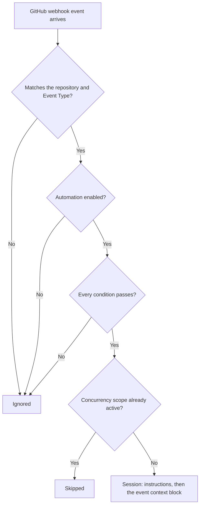

A GitHub Event automation starts a session when a supported webhook event arrives for its repository and every configured condition passes.



## Prerequisites

- The GitHub bot must be deployed and the GitHub App subscribed to the event you want, with the repository permission that event needs. This is an operator task; see [GitHub integration](/integrations/github).
- The repository must be installed on the GitHub App so it appears in the picker.

The GitHub bot's own scope settings (who may trigger bot workflows, and in which repositories) do not gate automations. Automations are matched separately by repository, event type, enabled state, and conditions.

## One repository, one event type

Under **Repository Configuration**, select exactly one repository. With none selected, the form says "Repository-scoped triggers require exactly one repository". Environments cannot be targeted ("Repository-scoped triggers cannot target environments"), and multi-repository fan-out is not available for event triggers.

Under **Event Type**, choose one of:

| Event Type             | Fires when                                   | Conditions offered                            |
| ---------------------- | -------------------------------------------- | --------------------------------------------- |
| PR Opened              | A pull request was opened                    | Head branch, Target branch, Label, Actor      |
| PR Updated             | New commits were pushed to a pull request    | Head branch, Target branch, Label, Actor      |
| PR Closed              | A pull request was closed or merged          | Head branch, Target branch, Label, Actor      |
| Issue Comment          | A comment was added to an issue or PR        | Actor                                         |
| Review Comment         | A review comment was added to a pull request | Head branch, Target branch, Actor             |
| Check Suite Completed  | A CI check suite finished running            | Head branch, Actor, Conclusion                |
| Workflow Run Completed | A GitHub Actions workflow run finished       | Head branch, Actor, Conclusion, Workflow Name |
| Issue Opened           | A new issue was opened                       | Label, Actor                                  |
| Issue Labeled          | A label was added to an issue                | Label, Actor                                  |

Each event type offers only the conditions its payload can answer. Changing the event type removes conditions the new type cannot answer and the form says which were removed ("Removed Label, not available for this event type."). Paths are never offered: GitHub webhook payloads carry no file list, so there is no path-pattern filtering for any GitHub event.

## Conditions

Conditions are optional. When you add any, every condition must pass before a run starts.

| Condition     | How it matches                                                                                                                                     |
| ------------- | -------------------------------------------------------------------------------------------------------------------------------------------------- |
| Head branch   | The PR source branch (or the branch of a check suite or workflow run) matches one of the listed patterns. Globs such as `feature/*` are supported. |
| Target branch | The PR merge base matches one of the listed patterns (PR and review-comment events only).                                                          |
| Label         | Any of the listed labels is present on the PR or issue; matching ignores case.                                                                     |
| Actor         | The GitHub login that triggered the event is in the list (**include**) or not in the list (**exclude**); matching ignores case.                    |
| Conclusion    | Equals the chosen value.                                                                                                                           |
| Workflow Name | Equals the workflow name exactly, for example `CI`.                                                                                                |

Every list-type condition needs at least one entry; an empty one blocks saving.

### Workflow Run Completed

Use this event to react to GitHub Actions results. It requires the GitHub App's read-only Actions permission and the **Workflow runs** event subscription.

- **Workflow Name** matches the workflow's name exactly.
- **Conclusion** is one of `success` (the default), `failure`, `neutral`, `cancelled`, `timed_out`, `action_required`, `stale`, or `skipped`.

The agent's context block includes the workflow name, conclusion, and run id, plus the workflow file path, branch, short commit SHA, and run URL when GitHub supplies them. Each rerun attempt is deduplicated separately, so a rerun of the same workflow run is admitted once per attempt, while all attempts of one run share a concurrency scope.

### Check Suite Completed

**Conclusion** offers the same values as workflow runs plus `startup_failure`. Existing automations created with the older **Check Conclusion** condition keep working; new automations use **Conclusion**. The context block includes the conclusion, branch, short commit SHA, and the numbers of any pull requests attached to the suite.

## What the agent receives

The session prompt is your instructions, then a context block wrapped in a `user_context` tag, then a guardrail line telling the agent the block is untrusted. The block always names the event and repository, then event-specific facts:

| Event                  | Context                                                                                                                             |
| ---------------------- | ----------------------------------------------------------------------------------------------------------------------------------- |
| Pull request events    | PR number and title, author, head and base branch, merged or closed status, labels, and the first 500 characters of the description |
| Issue events           | Issue number and title, author, labels, and the first 500 characters of the body                                                    |
| Issue Comment          | Issue or PR number and title, commenter, and the first 500 characters of the comment                                                |
| Review Comment         | PR number and title, reviewer, file path, the first 500 characters of the comment, and up to 1,000 characters of the diff hunk      |
| Check Suite Completed  | Conclusion, branch, commit, attached pull requests                                                                                  |
| Workflow Run Completed | Workflow name, run id, conclusion, workflow file, branch, commit, run URL                                                           |

Instructions from the **Review new PRs** template show the pattern of reading the PR with the GitHub CLI, which is authenticated in the sandbox:

```text
A pull request was opened; its number and details are shown in the event
context. Review it using the GitHub CLI.

1. Read the changes with `gh pr diff <number>`.
2. Assess them for correctness bugs, security issues, missing tests, and
   deviations from the project's conventions.
3. Post your feedback as a review on the existing PR with
   `gh pr review <number> --comment --body "..."`.

Do not open a new pull request; comment on the existing one.
```

## Concurrency and deduplication

Event firings are keyed per event rather than per automation, so unrelated events can run at the same time:

| Event                  | Concurrency scope | Deduplication                   |
| ---------------------- | ----------------- | ------------------------------- |
| Pull request events    | Per PR number     | Per PR, action, and head commit |
| Issue events           | Per issue number  | Per issue and action            |
| Issue Comment          | Per comment       | Per comment                     |
| Review Comment         | Per PR number     | Per comment                     |
| Check Suite Completed  | Per check suite   | Per check suite                 |
| Workflow Run Completed | Per workflow run  | Per run attempt                 |

A second event that lands in an active concurrency scope is skipped rather than queued.

## Troubleshooting

| Symptom                                               | Cause                                                                                                      | Fix                                                                                              |
| ----------------------------------------------------- | ---------------------------------------------------------------------------------------------------------- | ------------------------------------------------------------------------------------------------ |
| Events never start a run                              | The GitHub App is not subscribed to the event, lacks the permission, or the webhook worker is not deployed | Ask an operator to complete the GitHub bot setup; see [GitHub integration](/integrations/github) |
| The form will not save                                | No event type selected, or a list condition is empty                                                       | Select an **Event Type**; give every condition at least one value                                |
| A condition disappeared after changing the event type | The new event type cannot answer it                                                                        | Expected; the form lists what was removed                                                        |
| Workflow runs fire on success and failure             | No **Conclusion** condition                                                                                | Add **Conclusion** set to `failure`                                                              |
| A rerun did not fire                                  | It was a redelivery of the same attempt, or the run's concurrency scope was still active                   | Rerun the workflow so GitHub sends a new attempt                                                 |

## Next steps

- [GitHub integration](/integrations/github)
- [Slack message triggers](/automations/slack-messages)
- [Automation templates](/automations/templates)
