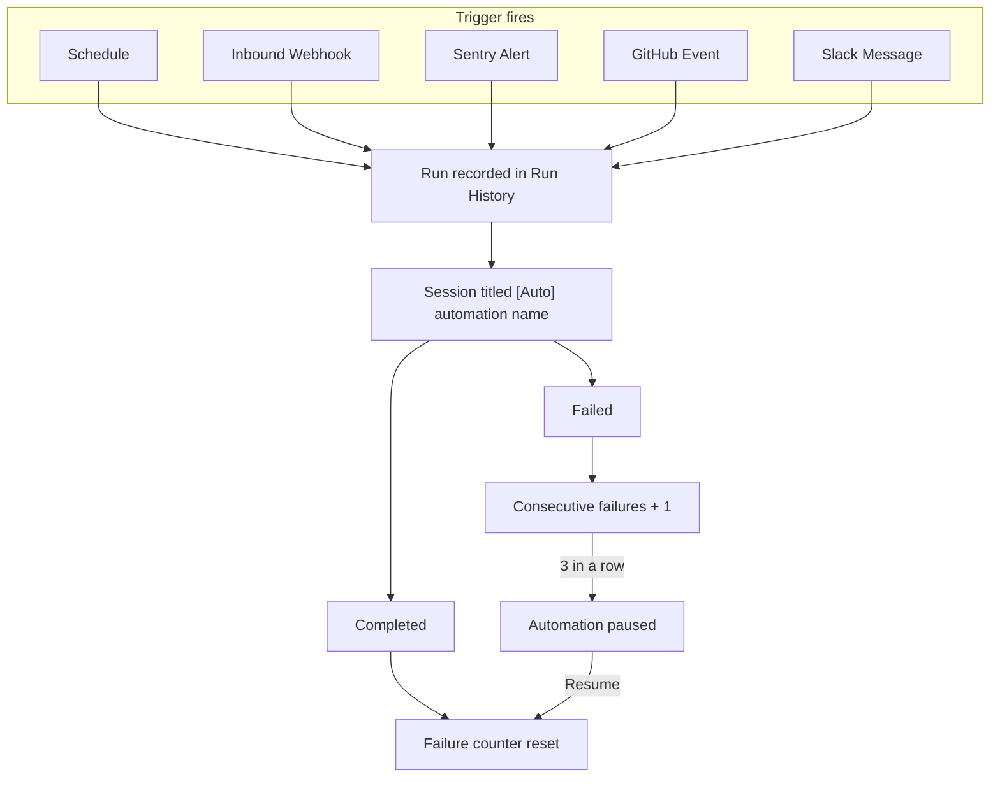

An automation stores a repository selection, a model, and a set of instructions once, then starts a new session every time its trigger fires.

## What an automation does

Each firing creates an ordinary session. The session clones the configured repository, runs your instructions on the OpenCode or Claude Agent harness you chose, and can open a pull request like any other session. Sessions started by an automation are titled `[Auto] <automation name>` and appear in the sessions list alongside interactive sessions.

Every trigger type follows the same path from firing to outcome, and repeated failures pause the automation:

Open **Automations** in the sidebar to see every automation in the workspace, or click **Browse templates** to start from a pre-built idea.

## Trigger types

| Trigger         | Fires when                                                                    | Availability                                    |
| --------------- | ----------------------------------------------------------------------------- | ----------------------------------------------- |
| Schedule        | A cron schedule comes due                                                     | Available                                       |
| Inbound Webhook | Any system sends an authenticated HTTP `POST`                                 | Available                                       |
| Sentry Alert    | A Sentry Custom Integration delivers a new error, regression, or metric alert | Available                                       |
| Slack Message   | Someone posts a matching message in a watched Slack channel                   | Available                                       |
| GitHub Event    | A pull request, issue, comment, check suite, or workflow run event arrives    | Available when the GitHub bot is deployed       |
| Linear Event    | Linear issue activity                                                         | Planned (shown as "Soon" in the trigger picker) |

The trigger type is fixed after creation. To change it, create a new automation.

## Common use cases

- Nightly or weekly dependency updates that open a pull request.
- Reacting to a deploy or incident webhook from your own tooling.
- Triaging new [Sentry issues](/automations/sentry-alerts) and opening a fix PR.
- Reviewing pull requests as they open.
- Recurring reports posted back to Slack.

<Cards>
  <Card
    title="Create your first automation"
    href="/automations/first-automation"
    description="A step-by-step tutorial for a weekly scheduled automation."
  />
  <Card
    title="Schedules"
    href="/automations/schedules"
    description="Presets, custom cron expressions, timezones, and Trigger Now."
  />
  <Card
    title="Inbound webhooks"
    href="/automations/inbound-webhooks"
    description="Trigger from any system with a JSON POST and JSONPath filters."
  />
  <Card
    title="GitHub event triggers"
    href="/automations/github-events"
    description="Pull request, issue, comment, and CI events with conditions."
  />
  <Card
    title="Slack message triggers"
    href="/automations/slack-messages"
    description="Watch channels and reply in-thread."
  />
  <Card
    title="Sentry alerts"
    href="/automations/sentry-alerts"
    description="New errors, regressions, and metric alerts."
  />
  <Card
    title="Multi-repository automations"
    href="/automations/multi-repository"
    description="Fan one scheduled firing out across up to 10 repositories."
  />
  <Card
    title="Automation templates"
    href="/automations/templates"
    description="Pre-filled starting points in the Templates gallery."
  />
</Cards>

## Who can create and manage automations

Everyone with automation read access, Viewers included, sees every automation and its run history. Members create automations and manage and trigger their own; Administrators and Owners manage and trigger any. Scheduled and event-driven runs execute under the owner's authority, while a **Trigger Now** run executes under the authority of the person who clicked it. The full role table and run-authority rules are in [Workspace access](/administration/workspace-access#how-automation-access-works).

## Automation statuses

The badge on each automation shows one of three states:

| Status   | Meaning                                                                                                      |
| -------- | ------------------------------------------------------------------------------------------------------------ |
| Enabled  | Ready to fire on its trigger.                                                                                |
| Degraded | Enabled but has recent consecutive failures. The badge shows the count, for example "Degraded (2 failures)". |
| Paused   | Not firing. Either paused by a person or auto-paused after repeated failures.                                |

## Run statuses

Each firing appears as one row in the automation's **Run History**:

| Status          | Meaning                                                                      |
| --------------- | ---------------------------------------------------------------------------- |
| Starting        | A session is being created for this run.                                     |
| Running         | At least one session is executing.                                           |
| Completed       | Every session finished successfully.                                         |
| Failed          | Every session failed. The failure reason is shown on the row.                |
| Partial failure | A multi-repository firing where some repositories completed and some failed. |
| Skipped         | The firing was skipped because a previous run was still active.              |

Click **View session** on a row to open the session with its full output and artifacts.

## Concurrency

Scheduled and manual triggers allow one active run per automation: a schedule slot that comes due during an active run is recorded as **Skipped**, and **Trigger Now** is rejected. Event-driven triggers use per-event concurrency keys, so unrelated events (for example two different pull requests) can run at the same time. The scheduled rules are in [Schedules](/automations/schedules#one-active-run-at-a-time); event rules are on each trigger's page.

## Auto-pause after failures

An automation that fails three consecutive times is paused automatically. Scheduled and manual runs both count. Runs that outlive their execution budget count as failures too. Skipped firings count neither way.

Click **Resume** to re-enable the automation. Resuming resets the failure counter and, for schedules, computes the next run from the current moment. A successful **Trigger Now** while paused also resets the counter without resuming.

## Execution timeout

Each run's session has an execution budget: the sandbox timeout in effect for the run's repository or environment (see [Sandbox settings](/configure/sandbox-settings)), otherwise the operator's `EXECUTION_TIMEOUT_MS`, otherwise 2 hours. The session fails the prompt at the budget, and the run fails with it. If that completion never reaches the scheduler, a sweep fails the run with reason `execution_timeout` after an additional grace period of 100 minutes. A run that reports success after the sweep already declared it lost is corrected back to Completed, but the failure strike already counted stays until the next fully successful firing.

## Limits

| Limit                                        | Value                                                                                                         |
| -------------------------------------------- | ------------------------------------------------------------------------------------------------------------- |
| Automation name                              | 200 characters                                                                                                |
| Instructions                                 | 15,000 characters                                                                                             |
| Repositories and environments per automation | 10 combined (schedule triggers only; event triggers take 0 or 1 repository)                                   |
| Minimum schedule interval                    | 15 minutes                                                                                                    |
| Inbound webhook payload                      | 64 KB                                                                                                         |
| Sentry webhook payload                       | 256 KB                                                                                                        |
| Concurrent runs per automation               | 1 for scheduled and manual triggers                                                                           |
| Consecutive failures before auto-pause       | 3                                                                                                             |
| Run execution timeout                        | The session's execution budget (2 hours by default), plus a 100-minute sweep grace before `execution_timeout` |

## Next steps

- [Create your first automation](/automations/first-automation)
- [Automation templates](/automations/templates)
- [Reference: statuses](/reference/statuses)
