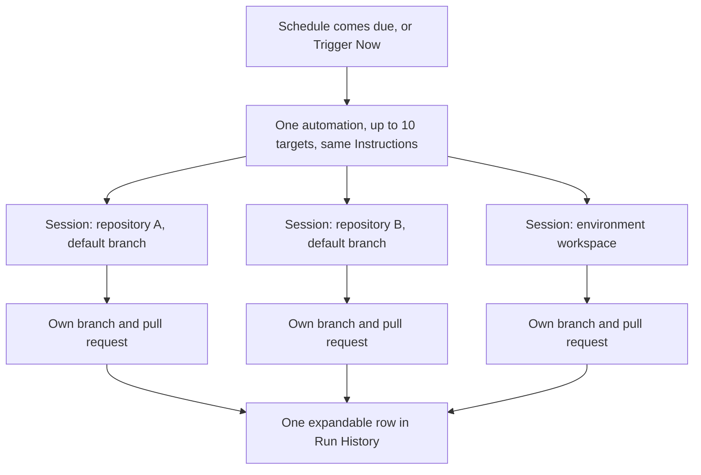

A scheduled automation can target several repositories at once; every firing then runs the same instructions in one session per repository.

## Scheduled automations only

Multi-target selection is available only when **Trigger Type** is **Schedule** (and for **Trigger Now** on such an automation). Event triggers (GitHub, Sentry, Inbound Webhook, Slack) take zero or one repository; the form rejects a wider selection with "Multi-target selections require a schedule trigger." An event arrives scoped to one repository, and fanning it out to unrelated repositories has no defined meaning yet.

## How a firing fans out

- Select up to **10** repositories and environments combined under **Repository Configuration**. The picker label shows the count, for example "3 repositories" or "2 repositories + 1 environment".
- Each firing starts one independent session per target, and all of them launch concurrently.
- Each repository session clones its own repository on that repository's **default branch**. The **Branch** field is only shown for a single-repository selection; there is no per-repository branch override in the multi-select.
- Every session receives the same **Instructions**. There are no per-repository instructions.
- Each session owns its branch, artifacts, and pull request. There is no combined cross-repository PR.
- An environment target launches one session that opens that environment's full workspace instead of a single repository. See [Environments](/configure/environments).

If one repository cannot be resolved when the firing starts (for example the GitHub App lost access), only that repository's run fails and the others continue. If every target fails to resolve, the firing finishes immediately as Failed.

## Changing the selection mid-flight

You can add or remove repositories at any time, including while a firing is in progress. Each run snapshots its repository and branch when it starts, so:

- In-flight sessions are unaffected.
- Run history always shows the repositories a firing actually used.
- The next firing uses the new selection.

Duplicate repositories in the selection are rejected on save rather than silently merged.

## Run history

A single-repository firing renders as a flat row. A multi-repository firing renders as one expandable row summarizing its targets, for example "10 repositories" followed by "8 completed, 1 failed, 1 running" and the total duration. Expand the row to see each repository with its own status badge, branch, duration, session title, failure reason if any, and **View session** link.

The row's status is derived from its children:

| Children                             | Row status          |
| ------------------------------------ | ------------------- |
| Any still starting or running        | Starting or Running |
| All completed                        | Completed           |
| All failed                           | Failed              |
| A mix of completed and failed        | Partial failure     |
| No children (the firing was skipped) | Skipped             |

## Auto-pause counting

Multi-repository firings count toward the same three-strike auto-pause as single-repository ones:

- A firing with **any** failed repository counts as one failure. A weekly sweep that fails the same repository every week is still broken.
- The failure is counted when the first repository fails, not when the last one finishes.
- The counter resets only when a firing finishes with **every** repository completed. Partial failures never reset it.
- Skipped firings count neither way.
- Auto-pause stops future firings but never cancels repository sessions that already started; siblings run to completion.

## Trigger Now

**Trigger Now** fires across the full current selection, one session per target, under the authority of the person who clicked it. It is rejected while a firing is active and does not move the scheduled next run. There is no "re-run failed repositories only" action; a manual trigger always starts a fresh firing across the whole selection.

## Troubleshooting

| Symptom                                                         | Cause                                                                      | Fix                                                                                            |
| --------------------------------------------------------------- | -------------------------------------------------------------------------- | ---------------------------------------------------------------------------------------------- |
| "Multi-target selections require a schedule trigger"            | You selected more than one target on an event trigger                      | Keep one repository, or create a schedule automation                                           |
| "At most 10 repositories and environments combined"             | The selection exceeds the cap                                              | Split the set across two automations                                                           |
| One repository fails every firing while the rest complete       | That repository is inaccessible or its default branch does not build       | Open the failed row's **View session**; fix access or remove the repository from the selection |
| The automation paused itself although most repositories succeed | Any failed repository counts a strike, and partial success never resets it | Fix or remove the failing repository, verify with **Trigger Now**, then **Resume**             |

## Next steps

- [Schedules](/automations/schedules)
- [Environments](/configure/environments)
