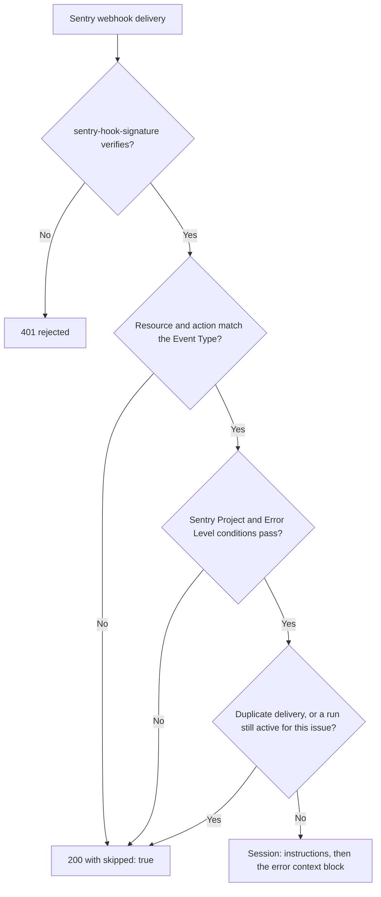

A Sentry Alert automation receives signed webhooks from a Sentry Custom Integration and starts a session for the errors or alerts you select.



## Prerequisites

- A Sentry Custom Integration (an internal integration in your Sentry organization) whose webhook you can point at OpenInspect. You need its **Client Secret**.
- Zero or one repository on the automation. Multi-repository fan-out is not available for event triggers.

## Fields

| Field                | What it does                                                                                                                                                 |
| -------------------- | ------------------------------------------------------------------------------------------------------------------------------------------------------------ |
| Event Type           | Which Sentry event starts a run (see below). Only that event type is matched; others are acknowledged and ignored.                                           |
| Sentry Client Secret | The Custom Integration's client secret, required when you create the automation. It is encrypted at rest and used to verify the signature on every delivery. |
| Conditions           | Optional filters on the project and level (see below).                                                                                                       |

### Event types

| Event Type              | Fires when                                    | Sentry webhook resource                                          |
| ----------------------- | --------------------------------------------- | ---------------------------------------------------------------- |
| New error               | A new error is seen for the first time        | `issue` (action `created`) or `event_alert`                      |
| Error regression        | A previously resolved error has returned      | `event_alert` (action `regression`, or issue status `regressed`) |
| Metric alert (critical) | A metric alert crossed its critical threshold | `metric_alert` (action `critical`)                               |

Other Sentry resources and actions (for example issue `resolved` or a metric alert returning to `warning`) are skipped with `{ "ok": true, "skipped": true }` and never start a run.

## Set up the Sentry webhook

<Steps>
<Step>
### Create the automation

Choose **Trigger Type** › **Sentry**, select an **Event Type**, paste the **Sentry Client Secret**, and click **Create Automation**. The form notes that the secret "will be encrypted and stored securely."

</Step>
<Step>
### Copy the Sentry Webhook URL

After creation the detail page shows a **Sentry Webhook URL** of the form `https://<your-worker-url>/webhooks/sentry/<automation-id>` with a **Copy** button. The page's hint says "Paste this URL into your Sentry Custom Integration webhook settings."

</Step>
<Step>
### Configure the Custom Integration

In Sentry, open the Custom Integration, set its webhook URL to the value you copied, and enable the webhooks for the resource your event type needs (issue, issue alert, or metric alert). Sentry signs each delivery with the client secret in the `sentry-hook-signature` header, and OpenInspect rejects deliveries whose signature does not verify.

</Step>
<Step>
### Rotate the secret when needed

If you rotate the client secret in Sentry, click **Update Secret** on the automation's detail page and paste the new value. Deliveries signed with the old secret are rejected once it is updated.

</Step>
</Steps>

## Conditions

| Condition      | How it matches                                                                                                                           |
| -------------- | ---------------------------------------------------------------------------------------------------------------------------------------- |
| Sentry Project | The issue's project slug is one of the listed slugs. Metric alerts carry no project, so this condition never matches a metric alert.     |
| Error Level    | The issue level is one of the listed values. The picker suggests `warning`, `error`, and `fatal`. Metric alerts report level `critical`. |

When you add conditions, every condition must pass before a run starts.

## What the agent receives

The prompt is your instructions, then a context block, then a guardrail line saying the block is untrusted. The block's content depends on the delivery:

| Delivery                             | Context                                                                                                                                                                                                  |
| ------------------------------------ | -------------------------------------------------------------------------------------------------------------------------------------------------------------------------------------------------------- |
| Issue webhook (`issue` resource)     | Error title, project slug, level, short issue id, first seen, event count, culprit, and issue URL                                                                                                        |
| Issue alert (`event_alert` resource) | Error type and message, project, level, short issue id, first seen, event count in the last 24 hours, culprit, the top 5 stack frames (most recent first, with file, line, and function), and event tags |
| Metric alert                         | Alert title, trigger label, start time, alert URL, and the alert description                                                                                                                             |

Deliveries are deduplicated per Sentry issue (per issue and last-seen time for regressions, per alert rule and start time for metric alerts). A second delivery for an issue whose run is still active is skipped.

## Example instructions

```text
A Sentry error was reported; its details are in the event context.
Investigate the root cause in this codebase: trace the stack trace to the
responsible code, determine why the error occurs, and identify the correct
fix.

Implement a minimal fix and open a pull request that explains the root
cause and the change. If the issue cannot be safely fixed automatically,
open a pull request with a clear write-up of the root cause and a
proposed approach instead.
```

The **Investigate Sentry issues** template pre-fills this trigger with a **New error** event type and similar instructions.

## Request limits and responses

| Item                                        | Value                                                                |
| ------------------------------------------- | -------------------------------------------------------------------- |
| Maximum payload                             | 256 KB                                                               |
| `401`                                       | Missing or invalid `sentry-hook-signature`                           |
| `404`                                       | Automation not found, or not a Sentry automation                     |
| `413`                                       | Payload larger than 256 KB                                           |
| `400`                                       | Body is not valid JSON                                               |
| `200` with `skipped: true`                  | Delivery was for a resource or action the automation does not handle |
| `200` with `triggered` and `skipped` counts | Delivery was matched against the automation                          |

## Troubleshooting

| Symptom                                                | Cause                                                                                                    | Fix                                                                                    |
| ------------------------------------------------------ | -------------------------------------------------------------------------------------------------------- | -------------------------------------------------------------------------------------- |
| Sentry reports `401` from the webhook                  | The client secret on the automation does not match the integration's secret                              | Click **Update Secret** and paste the current secret                                   |
| Deliveries succeed but no run starts                   | The delivery's action does not match the **Event Type**, a condition failed, or the automation is paused | Check the event type, the project slug and level conditions, and the automation status |
| A Sentry Project condition never matches metric alerts | Metric alerts carry no project                                                                           | Remove the project condition on metric-alert automations                               |
| `413`                                                  | Sentry payloads with large stack traces exceed 256 KB                                                    | Rare; reduce event payload size in Sentry if it recurs                                 |

## Next steps

- [Inbound webhooks](/automations/inbound-webhooks)
- [Automation templates](/automations/templates)
