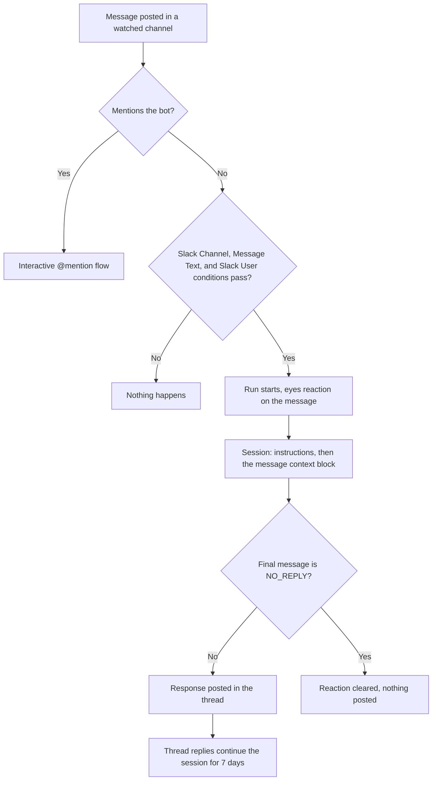

A Slack Message automation watches one or more channels and starts a session when a message matches its conditions, without anyone mentioning the bot.



## How this differs from @mention sessions

Mentioning the bot in Slack starts an explicit, interactive session for the person who asked. A Slack Message automation fires on ordinary channel traffic that matches conditions you define, runs the automation's saved instructions, and posts its result back into the message's thread. Messages that mention the bot are handled by the interactive flow and never double-fire as triggers. See [Slack integration](/integrations/slack) for the interactive flow.

## Prerequisites

The Slack app needs more than the standard @mention setup. An operator must:

- Subscribe the app to the `message.channels` event (public channels) and, for private channels, `message.groups`.
- Grant the bot token scopes `channels:history` and, for private channels, `groups:history`. Channel listing in the web form also needs `channels:read` and `groups:read`.
- Invite the bot to every channel to watch. The bot only sees messages in channels it is a member of.

Slack automations take zero or one repository. Multi-repository fan-out is not available.

## Conditions

A Slack automation must have a **Slack Channel** condition; the form blocks saving with "Slack triggers require at least one Slack Channel condition." The other conditions are optional. A message starts a run only when every condition passes. Conditions match against the triggering message's text only, never against thread history.

| Condition     | Required | How it matches                                                                                                                                                                                                                                                                              |
| ------------- | -------- | ------------------------------------------------------------------------------------------------------------------------------------------------------------------------------------------------------------------------------------------------------------------------------------------- |
| Slack Channel | Yes      | The message was posted in one of the selected channels. Pick channels by name from the list; if the list cannot load, type channel ids such as `C0123ABCD`. Channels the bot has not joined are marked "bot not in channel".                                                                |
| Message Text  | No       | The message text matches. Modes: **contains** (substring), **exact** (whole message), or **regex** (regular expression). A **Case-insensitive** checkbox sets the `i` flag. Regex patterns are limited to 200 characters and the `i` and `m` flags; an invalid pattern is rejected on save. |
| Slack User    | No       | The posting user's Slack id (for example `U0123ABCD`) is in the list (**include**) or not in the list (**exclude**).                                                                                                                                                                        |

Without a **Message Text** condition, every message in the watched channels starts a run. The bot-mention token is stripped before matching.

## Text-only ingestion

Only the message text reaches the agent (up to 8 KB). Attachments are not forwarded: a `file_share` message is matched on its text like any other, and an image-only message with no text triggers nothing. Use an @mention or DM when the agent needs image input.

## Thread context

When the triggering message is a reply, the agent also receives the thread it belongs to: up to 20 messages posted before the trigger, with the thread's opening message kept alongside the most recent replies. Each message is truncated to 1,024 characters and carries its Slack timestamp and a speaker identity. The history is passed as JSON and labelled untrusted, so the agent reads it as a record of a conversation rather than as instructions.

The thread is fetched only after a run is admitted, so unmatched messages, thread follow-ups, and skipped or duplicate firings cost nothing. If Slack cannot be read, the run starts without history rather than failing.

## What the agent receives

The prompt is your instructions, then a context block, then a guardrail line. The block says which channel and user the message came from, includes a permalink when Slack returns one, includes any thread history, and wraps the message text in a `user_content` tag.

## Run feedback

- The triggering message gets an eyes reaction while the run is in flight.
- When the run finishes, the agent's final response is posted as a reply in the message's thread, with links to any pull requests it opened and to the web session, and the reaction is cleared.
- A failed run posts a short failure notice in the thread instead.

### Declining to reply

If the agent's entire final message is `NO_REPLY` (or empty), nothing is posted and only the reaction is cleared. Because every reply in a watched thread wakes the automation, an automation on a busy channel would otherwise answer messages that need nothing from it. The agent answers everything it is woken for unless told otherwise, so put the sentinel in the instructions:

```text
If the message needs nothing from you, reply with exactly NO_REPLY and
nothing else.
```

A run that opened a pull request or produced other artifacts always posts.

## Thread replies continue the session

Every reply in a thread continues the same session, during the run and after it finishes, for up to 7 days after the thread's first trigger. The reply is queued as a follow-up prompt on that session (re-spawned from a snapshot if it had gone idle), gets its own eyes reaction, and the agent posts its response in the thread. A follow-up does not need to match the trigger conditions: conditions gate new runs, not replies that continue a thread.

Two edge cases:

- A reply that races the very first trigger before its session exists gets an ephemeral "a run is already active" notice instead of being queued.
- A reply more than 7 days after the first trigger starts a fresh run.

Attachments on thread replies are not forwarded either.

## Threat model

Channel triggers widen who can start a coding session. Before enabling one:

- Any member of a watched channel can start a run by posting a matching message. Treat each watched channel as a list of people authorized to run the automation against its repository.
- Prefer an allowlist: add a **Slack User** condition with **include** so only specific people can trigger it, and keep watched channels small.
- Message text reaches the agent as part of the prompt. Scope the instructions defensively and rely on the deployment's repository access boundary.
- Regex conditions run without a per-match timeout. Patterns are length-capped and validated on save, but a pathological pattern is the author's responsibility.

## Troubleshooting

| Symptom                                              | Cause                                                                                                                      | Fix                                                                    |
| ---------------------------------------------------- | -------------------------------------------------------------------------------------------------------------------------- | ---------------------------------------------------------------------- |
| "Couldn't list Slack channels" in the channel picker | The Slack app lacks `channels:read` / `groups:read`, or has no bot token                                                   | Type channel ids manually, or ask an operator to add the scopes        |
| "The bot isn't a member of some selected channels"   | The bot was not invited                                                                                                    | Invite the bot to each watched channel                                 |
| Messages in the channel start nothing                | The app is not subscribed to `message.channels` / `message.groups`, lacks history scopes, or the message mentioned the bot | Complete the Slack app setup; mentions go to the interactive flow      |
| An image posted in the channel starts nothing        | Slack automations ingest text only                                                                                         | Add text to the message, or use an @mention                            |
| The automation replies to every message              | No **Message Text** condition and no `NO_REPLY` instruction                                                                | Add a text condition, and tell the agent when to reply with `NO_REPLY` |
| The form refuses a regex                             | The pattern exceeds 200 characters, uses a flag other than `i` or `m`, or does not compile                                 | Shorten or fix the pattern                                             |

## Next steps

- [Slack integration](/integrations/slack)
- [Automation templates](/automations/templates)
