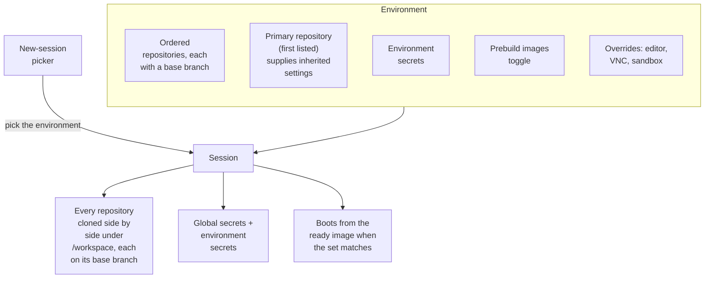

This page shows how to create an environment, what a session launched from one receives, and how environments interact with secrets, prebuilt images, and integrations.

## What an environment is

An environment is a named, reusable set of repositories: the thing you reach for when the same multi-repository workspace comes up again and again (a frontend plus its API, a service plus its shared library). Environments are managed under Settings › Environments and appear at the top of the new-session picker.

An environment defines:

| Part                    | Details                                                                                                                                                                                                                                 |
| ----------------------- | --------------------------------------------------------------------------------------------------------------------------------------------------------------------------------------------------------------------------------------- |
| Ordered repository list | Up to 10 repositories, each with a base branch. The base branch defaults to the repository's default branch. Two repositories with the same name cannot be in one environment, because each is checked out at `/workspace/<repo-name>`. |
| Primary repository      | The first repository in the list. It supplies the sandbox and editor settings that the environment inherits unless you override them.                                                                                                   |
| Environment secrets     | Sessions launched from the environment receive global secrets plus the environment's secrets.                                                                                                                                           |
| Prebuilt images         | Optional. The whole environment (all clones, all setup scripts) is built ahead of time so sessions boot from the image.                                                                                                                 |
| Settings overrides      | Per-environment overrides for the code editor, VNC desktop, and sandbox settings.                                                                                                                                                       |

How a session picks all of that up:

A name is limited to 200 characters and a description to 2,000.

## Create an environment

<Steps>
<Step>
### Open the form

Go to Settings › Environments and click **New environment**. You need the `environments.manage` permission to see the button.

</Step>
<Step>
### Name it and pick repositories

Fill in **Name** (for example `full-stack`) and an optional **Description**. Under **Repositories**, select the repositories to include. Every selected repository gets a row showing its base branch; the first row carries the **primary** badge. Use the up and down controls to reorder rows, **Remove** to drop one, and the branch picker on each row to change its base branch.

</Step>
<Step>
### Decide on prebuilds

Turn on **Prebuild images** if you want an image with every repository cloned and every `setup.sh` already run. Saving with the toggle on starts a build immediately. See [Prebuilt images](/configure/prebuilt-images).

</Step>
<Step>
### Save and add secrets

Click **Create environment**. The page opens the new environment's **Secrets** tab, where you add environment secrets or import them from a member repository (see [Secrets](#secrets) below).

</Step>
</Steps>

Editing an environment later shows three tabs, each gated by its own permission: **Configuration** (`environments.manage`), **Secrets** (`environments.secrets.manage`), and **Overrides** (`integrations.read` to view, `environments.settings.manage` to change).

The environment list shows each environment's name, its repositories, its description, the image build status, the prebuild toggle, a **Rebuild image** button, **Edit**, and **Delete** (which asks you to **Confirm**).

## Use an environment from the picker

Environments appear at the top of the new-session picker, alongside single repositories. Pick one and the session clones every repository into one workspace, with each repository on the base branch the environment defines. There is no per-repository branch selector for an environment session; the branches come from the environment.

The picker also offers **Multiple repositories**, the ad-hoc counterpart. An ad-hoc set has the same workspace shape (each repository cloned side by side, one PR per repository possible) but it is not saved anywhere: it has no environment secrets, gets global secrets plus each selected repository's secrets instead, and never uses prebuilt images. The picker says so under the selection and links to Settings › Environments so you can save the set as an environment.

## Secrets

A session launched from an environment receives global secrets plus the environment's secrets, and nothing else. The repositories inside the environment do not contribute their repository secrets. Environments are curated, so a key added to a repository never silently lands in every environment containing it. The picker states this under an environment selection.

To reuse a repository secret in an environment, open the environment's **Secrets** tab and use **Import from a repository**:

1. Pick a source repository. Only repositories that belong to the environment are offered.
2. Tick the keys to copy.
3. Click the **Import** button (its label shows how many keys are selected).

Values are copied on the control plane and never displayed. Imports are copies: if you later rotate the value on the repository, re-import it or update the environment secret directly. The alternative is to move the key to global scope. See [Secrets](/configure/secrets) for scopes and limits.

<Callout type="warn" title="Saving secrets rebuilds the image">
  When prebuilds are enabled, changing an environment's secrets retires the existing ready image and
  triggers a rebuild. See [Secrets and images](/configure/prebuilt-images#secrets-and-images) for
  what a setup script must not write to disk.
</Callout>

## Prebuilt images

With **Prebuild images** on, the environment's image is built from all repositories at their base branches, running each repository's `.openinspect/setup.sh` in position order. Sessions launched from the environment start from that image and skip `setup.sh`. Details, statuses, and timeouts are on [Prebuilt images](/configure/prebuilt-images).

Two environment-specific rules:

- **Editing the set retires the image.** Every image records the ordered list of repositories and their base branches. Changing a repository, the order, or a base branch means the image no longer matches; sessions fall back to a normal boot until the rebuild finishes.
- **Saving a prebuild-enabled environment triggers a build.** So does changing its secrets, toggling prebuilds on, or clicking **Rebuild image** on the environment row.

## Sessions snapshot the environment

A session copies the environment's repository set at creation time. Editing or deleting the environment afterwards never changes what an existing session works on. If the source environment is gone, the session's Repositories and Pull requests sidebar section shows an "Environment deleted" notice; the session itself keeps working.

An edit does affect new sessions and the prebuilt image, as described above.

## Integrations can target environments

| Integration                    | How an environment is used                                                                                                                                                                                                                                                                                               |
| ------------------------------ | ------------------------------------------------------------------------------------------------------------------------------------------------------------------------------------------------------------------------------------------------------------------------------------------------------------------------ |
| [Slack](/integrations/slack)   | Routing rules under Settings › Integrations › Slack map a keyword to a repository or an environment. A channel can also be associated with an environment (up to 50 channels per environment). A rule whose environment was deleted shows "Deleted environment" and is ignored until it points at something that exists. |
| [GitHub](/integrations/github) | A repository can carry a default environment. When the GitHub bot starts a session for that repository and the default environment contains it, the session launches the environment instead of the single repository.                                                                                                   |
| [Linear](/integrations/linear) | Team and project mappings can point at an environment by its stable `env_…` id, optionally filtered by label. A mapping whose environment was deleted is skipped and resolution falls through to the next target.                                                                                                        |

Sessions started by integrations run on the OpenCode harness.

## Per-environment overrides

The **Overrides** tab layers environment-specific settings above the primary repository's settings. Anything left unset inherits from the primary repository. Overrides apply to sessions launched from the environment and to its image builds.

| Override    | Options                                                                                                                                                                                                                                                                       |
| ----------- | ----------------------------------------------------------------------------------------------------------------------------------------------------------------------------------------------------------------------------------------------------------------------------- |
| Code Editor | Inherit, Enabled, Disabled. Whether sessions get the browser-based editor.                                                                                                                                                                                                    |
| VNC Desktop | Inherit, Enabled, Disabled. Whether sessions get a remote desktop.                                                                                                                                                                                                            |
| Sandbox     | The same fields as [Settings › Sandbox](/configure/sandbox-settings) (tunnel ports, terminal, child-session limits, CPU and memory, timeouts, build timeout, session cost limit). Inherited values are shown as the current settings; saving pins only the fields you change. |

## Troubleshooting

<Accordions>
<Accordion title="A session from the environment is missing a repository secret">
Repository secrets do not flow into environment sessions. Import the key on the environment's Secrets tab, or move it to global scope.
</Accordion>
<Accordion title="The environment's session did not use the prebuilt image">
Check that the prebuild toggle is on and the status on the environment row is **Ready**. If the environment was edited (repositories, order, or base branches) after the image was built, the image is retired until the rebuild completes. Ad-hoc **Multiple repositories** sessions never use prebuilt images, even when an environment with the same repositories exists.
</Accordion>
<Accordion title="The session sidebar says Environment deleted">
The environment the session was created from no longer exists. The session keeps its own copy of the repository set and continues to work. Create a new environment if you want to launch that set again.
</Accordion>
<Accordion title="Prebuilds are paused for this deployment">
This notice appears on a Daytona deployment while the operator has not opened prebuild admission. Toggles still record what you want; existing images keep working, but no new build starts until an operator enables it. See [Sandbox providers](/configure/sandbox-providers).
</Accordion>
<Accordion title="Cannot add a second repository with the same name">
Repositories in one environment are deduplicated by name because each is checked out at `/workspace/<repo-name>`. Two forks named `api` cannot share an environment.
</Accordion>
</Accordions>

## Next steps

- [Prebuilt images](/configure/prebuilt-images)
- [Secrets](/configure/secrets)
- [Repository lifecycle scripts](/configure/lifecycle-scripts)
