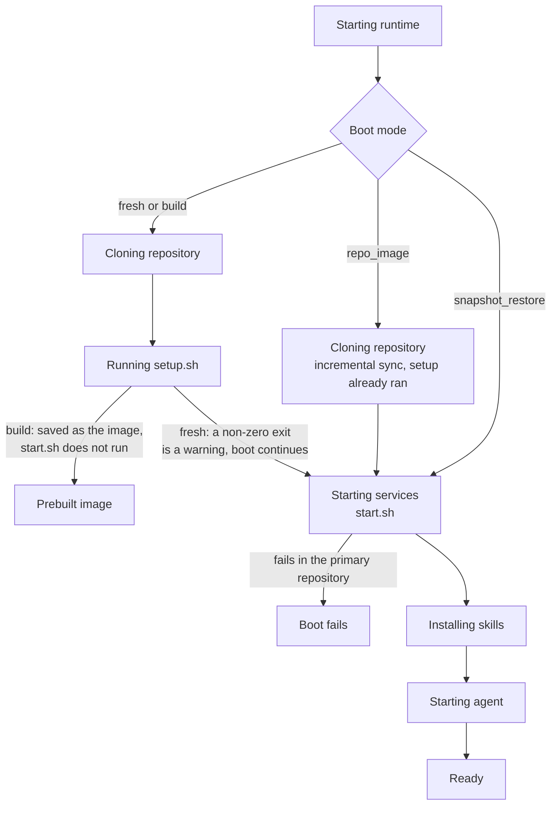

This page explains the two optional scripts a repository can ship under `.openinspect/`, when each one runs, what happens when one fails, and what the scripts can rely on.

A repository can define two startup scripts. OpenInspect runs them with `bash`, from the repository's checkout directory, as part of the sandbox boot. Both are optional. A missing script is skipped without any effect on the boot.

| Script                  | Purpose                                                                                   | Typical contents                                                 |
| ----------------------- | ----------------------------------------------------------------------------------------- | ---------------------------------------------------------------- |
| `.openinspect/setup.sh` | Provisioning. Runs once per fresh workspace to make the repository buildable.             | Install dependencies, run code generation, compile, warm caches. |
| `.openinspect/start.sh` | Runtime startup. Runs on every session boot to bring up whatever the agent needs running. | Start databases, queues, or dev servers.                         |

## Example scripts

Install dependencies and build once:

```bash
# .openinspect/setup.sh
#!/bin/bash
set -euo pipefail
npm install
uv pip install --python python3 -r requirements.txt
npm run build
```

Start services every session:

```bash
# .openinspect/start.sh
#!/bin/bash
set -euo pipefail
docker compose up -d postgres redis
```

The sandbox is Debian Linux with Node.js 22, Python 3.12, Bun, git, the GitHub CLI, and build-essential preinstalled, plus npm, pnpm, and uv. There is no `pip` command; install Python packages with `uv pip`. Anything else your scripts need, they must install. See [Sandbox environment](/reference/sandbox-environment) for the full list of tools and variables.

## When each script runs

The runtime boots a sandbox in one of four modes. The mode is exposed to both scripts as `OPENINSPECT_BOOT_MODE`.

| Boot mode                                              | `OPENINSPECT_BOOT_MODE` | `setup.sh`                         | `start.sh`   |
| ------------------------------------------------------ | ----------------------- | ---------------------------------- | ------------ |
| Fresh session (no snapshot, no prebuilt image)         | `fresh`                 | Runs                               | Runs         |
| Prebuilt image build                                   | `build`                 | Runs                               | Does not run |
| Session start from a prebuilt image                    | `repo_image`            | Skipped (already ran in the build) | Runs         |
| Snapshot restore (follow-up prompts, resumed sessions) | `snapshot_restore`      | Skipped                            | Runs         |

The order within a boot is: git sync, then `setup.sh` (fresh and build only), then `start.sh` (every non-build boot), then managed skills, then the agent harness. In the session header you see these as "Cloning repository", "Running setup.sh", "Starting services", "Installing skills", and "Starting agent".

The same phases, by boot mode:



Because `start.sh` also runs after a snapshot restore, it runs in a workspace that already contains whatever the previous run left behind: installed dependencies, built artifacts, and running-state files. Write it so that it works in that situation as well as on a fresh clone. See [Prebuilt images](/configure/prebuilt-images) for how image builds fit in.

## Multi-repository sessions

In a session with several repositories (an [environment](/configure/environments) or an ad-hoc set), each repository is cloned into `/workspace/<repo-name>`. Git sync clones all of them concurrently as one phase. Then:

1. `setup.sh` runs for every repository in position order, one after another, so a later repository's setup can rely on an earlier one's.
2. `start.sh` runs as a second pass in the same order.

Each `setup` and `start` phase names the repository it is running for, as in "Running setup.sh for acme/api". Each script runs with its own repository's checkout as the working directory.

## Failure semantics

| Situation                                                                 | Effect                                                                                      |
| ------------------------------------------------------------------------- | ------------------------------------------------------------------------------------------- |
| `setup.sh` exits non-zero in a fresh session                              | Reported as a warning. The boot continues without it.                                       |
| `setup.sh` exits non-zero in a prebuilt image build                       | The build fails. For environment builds the error names the repository whose script failed. |
| `start.sh` exits non-zero in the session's first (primary) repository     | The boot fails. The session does not start from a half-started runtime.                     |
| `start.sh` exits non-zero in a later repository of a multi-repository set | Reported as a warning. The boot continues.                                                  |

When a script fails, the process group it started is terminated. The session header's status popover says which phase failed and names the repository when available. Failure reports keep the phase, the repository, and error or warning metadata, but the scripts' stdout and stderr are discarded rather than collected or shown. Image builds report neither, because there is no session to report to. If you need to see a script's output, run it yourself from the session's terminal.

## Timing

There is no per-script timeout. Two outer bounds apply:

- **Boot budget.** Measured from sandbox creation until the agent is ready. It is 30 minutes by default and is set by the deployment operator (`SANDBOX_BOOT_TIMEOUT_MS`). When the budget runs out the sandbox is failed, the prompt that was waiting fails with the phase that was running, and the next prompt starts a new sandbox. No snapshot is taken, so a half-provisioned workspace never becomes a restore point.
- **Build timeout.** Image builds are bounded by the build timeout sandbox setting (30 minutes by default, one hour maximum). See [Prebuilt images](/configure/prebuilt-images#timeouts).

Scripts can apply their own command-specific deadlines (for example `timeout 300 npm ci`) when a step is known to hang.

## What the scripts can rely on

### Boot mode

`OPENINSPECT_BOOT_MODE` is set to `build`, `fresh`, `repo_image`, or `snapshot_restore`. Use it to skip work that only makes sense in one mode:

```bash
# .openinspect/start.sh
#!/bin/bash
set -euo pipefail
if [ "$OPENINSPECT_BOOT_MODE" = "snapshot_restore" ]; then
  docker compose restart postgres
else
  docker compose up -d postgres
fi
```

### Secrets

Secrets from [Settings › Secrets](/configure/secrets) are injected into the sandbox as environment variables at spawn time, so both scripts can read them. A session gets global secrets plus its target's secrets: the repository's secrets for a single-repository session, or the environment's secrets for a session launched from an environment. Image builds get exactly the same set the scope's sessions would get. System variables always take precedence over user-defined secrets.

### Git credentials for other repositories

Git operations inside a script authenticate through a credential helper that the sandbox uses on demand. The helper authorizes HTTPS requests to the configured SCM host, so a script can clone another private repository on the same host when the shared app installation has access to it.

### Tunnel URLs

When the session's [sandbox settings](/configure/sandbox-settings) list `tunnelPorts` (up to 10 ports), the resolved public URLs are written to `/workspace/.tunnels.env` before `start.sh` runs:

```text
# /workspace/.tunnels.env
TUNNEL_SANDBOX_ID=sandbox-acme-app-1783614336426
TUNNEL_3000=https://abc123-3000.modal.host
TUNNEL_5173=https://abc123-5173.modal.host
```

The file is plain `KEY=value`, so it works with `node --env-file=/workspace/.tunnels.env`, `bun --env-file=...`, `docker compose --env-file=...`, or a `source` line in the script. `TUNNEL_SANDBOX_ID` names the sandbox the URLs belong to; on a restore, a file left over from a previous sandbox is cleared before new URLs are written.

The runtime waits up to 30 seconds (`TUNNEL_WAIT_TIMEOUT_SECONDS`) for fresh URLs before running `start.sh`. If they are not resolved in time, `start.sh` runs without a fresh file. The session UI still receives the URLs separately and shows them in the Tunnel URLs sidebar section. The file is not written in build mode or when no tunnel ports are configured.

## Preinstalling local MCP packages

Local [MCP servers](/configure/mcp-servers) launched with `npx` are installed at session start unless the exact version is already in the sandbox. To take that install out of startup, pin the same version in the MCP command and in a `npm install --global` line in `setup.sh`, then rebuild the prebuilt image. The full recipe is under [Startup cost of local servers](/configure/mcp-servers#startup-cost-of-local-servers).

## Guidance

- **Make `setup.sh` deterministic.** Pin versions and use lockfiles. In an image build, its result is captured and served to every session until the next rebuild.
- **Make `start.sh` idempotent.** It runs on fresh boots, prebuilt-image boots, and restores. Check whether a service is already running before starting it, or use commands that tolerate an existing instance.
- **Do not write long-lived secrets to disk in `setup.sh`.** Anything it persists is captured in the prebuilt image and outlives a rotation. Read secrets from the environment at runtime; see [Secrets and images](/configure/prebuilt-images#secrets-and-images).
- **Use `set -euo pipefail`.** The runtime only sees the exit code, so make the script fail loudly instead of continuing past a broken step.
- **Front-load work into `setup.sh`** when prebuilt images are enabled. Dependencies, builds, warmed caches, and large downloads done there are paid once per build instead of once per session.

## Troubleshooting

<Accordions>
  <Accordion title="setup.sh keeps failing in image builds">
    The build status shows **Failed** with the error next to the repository under Settings › Images,
    or on the environment's row under Settings › Environments. For an environment build, the error
    names which repository's script failed. A setup failure that a fresh session would only warn
    about fails a build outright. Test the script in the sandbox environment (Debian Linux with
    Node.js, Python, and common dev tools) rather than only on your machine, and check the build
    timeout if the script simply runs long. The scheduler retries on its next run, so transient
    network failures resolve on their own.

</Accordion>
  <Accordion title="start.sh fails after a snapshot restore">
    `start.sh` runs on every non-build boot, including restores where the workspace already holds
    the previous run's state. If it fails in the primary repository the boot fails; the header's
    status popover names the phase but shows no script output. Open the session's terminal and run
    `bash .openinspect/start.sh` to see the output, then make the script tolerate an existing state
    (or branch on `OPENINSPECT_BOOT_MODE`).

</Accordion>
  <Accordion title="A service is not reachable on its tunnel URL">
    Check that the port is listed in `tunnelPorts` under Settings › Sandbox (or the repository or
    environment override) and that the service binds to that exact port. If `start.sh` started
    before the URLs were resolved (the runtime waits 30 seconds, then continues), the script saw no
    fresh `/workspace/.tunnels.env`; the URLs are still shown in the session's Tunnel URLs sidebar
    section, and a process the agent starts later can read the file.

</Accordion>
  <Accordion title="Session boots without dependencies even though setup.sh exists">
    The session started from a snapshot restore or a prebuilt image, where `setup.sh` is skipped by
    design. If the prebuilt image is stale, trigger a manual rebuild from Settings › Images or the
    environment row. If the script failed in a fresh session, the header reported a warning and the
    boot continued.

</Accordion>
</Accordions>

## Next steps

- [Prebuilt images](/configure/prebuilt-images)
- [Environments](/configure/environments)
- [Sandbox settings](/configure/sandbox-settings)
