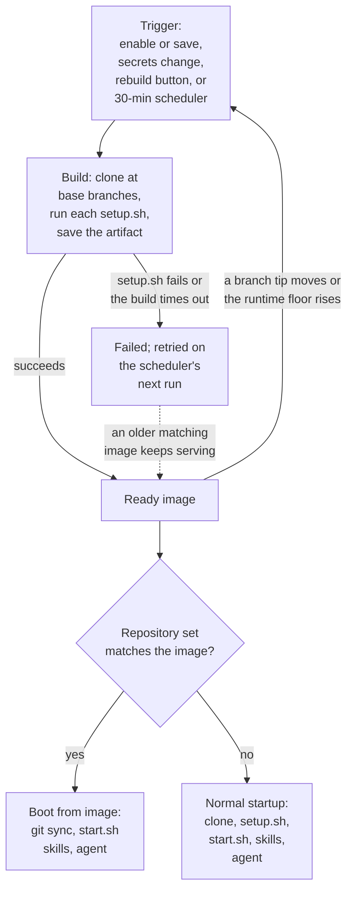

This page explains what a prebuilt image contains, how to enable one for a repository or an environment, what the statuses mean, when images are rebuilt, and what a session does with one.

## Why prebuilt images

Without one, every new session has to clone the repositories, install dependencies, and run `.openinspect/setup.sh`. For a large repository that takes anywhere from 30 seconds to several minutes. A prebuilt image does that work ahead of time and keeps the result as a provider artifact. A new session starts from the artifact and only pulls the commits pushed since it was built.

One image-build subsystem serves two kinds of scope:

| Scope                                  | What is built                                                                 | Where you enable it                               |
| -------------------------------------- | ----------------------------------------------------------------------------- | ------------------------------------------------- |
| Repository                             | A one-repository set on its default branch                                    | Settings › Images                                 |
| [Environment](/configure/environments) | The environment's ordered set of up to 10 repositories at their base branches | The **Prebuild images** toggle on the environment |

From trigger to session start, an image moves through these states:

## Where the artifact lives

The artifact is stored by the deployment's sandbox provider:

| Provider         | Artifact                                                                                                                                                                                                                                                                                                                            |
| ---------------- | ----------------------------------------------------------------------------------------------------------------------------------------------------------------------------------------------------------------------------------------------------------------------------------------------------------------------------------- |
| Modal            | Modal image                                                                                                                                                                                                                                                                                                                         |
| Vercel Sandboxes | Vercel snapshot                                                                                                                                                                                                                                                                                                                     |
| OpenComputer     | Checkpoint                                                                                                                                                                                                                                                                                                                          |
| E2B              | Snapshot                                                                                                                                                                                                                                                                                                                            |
| Daytona          | Snapshot. Requires the operator to open prebuild admission first. While it is closed, Settings › Images and Settings › Environments show "Prebuilds are paused for this deployment. Existing images keep working; new builds start once an operator enables them." Toggles still record intent, and the rebuild button is disabled. |

You cannot change the provider yourself; see [Sandbox providers](/configure/sandbox-providers).

## Enable prebuilt images

### For a repository

1. Open Settings › Images.
2. Find the repository.
3. Turn on its toggle.

The first build starts immediately. Repository images are built for the default branch only. You need the `repositories.images.manage` permission to change toggles or trigger builds.

### For an environment

1. Open Settings › Environments and create or edit the environment.
2. Turn on **Prebuild images**.
3. Save.

Saving with the toggle on starts the first build. The environment row also has a **Rebuild image** button. The toggle needs `environments.manage`; the rebuild button needs `environments.images.manage`.

## Statuses

Settings › Images (for repositories) and each environment row (for environments) show the latest build of the scope:

| Status                        | Meaning                                                                  | What the row shows                                                          |
| ----------------------------- | ------------------------------------------------------------------------ | --------------------------------------------------------------------------- |
| **Ready** (green)             | An image is available.                                                   | When it was built, the primary repository's commit, and the build duration. |
| **Building** (amber, pulsing) | A build is in progress.                                                  | When the build started.                                                     |
| **Failed** (red)              | The last build failed. The scheduler retries on its next run.            | The error message; hover it to read the full text.                          |
| **No image**                  | Prebuilds are enabled but no build has completed yet.                    | Nothing else.                                                               |
| **Disabled**                  | Prebuilds are off for this scope.                                        | Nothing else.                                                               |
| **Status unavailable**        | The environment has prebuilds on but the build feed could not be loaded. | Nothing else.                                                               |

### Picker annotations

The new-session picker annotates prebuild-enabled repositories and environments so a broken prebuild is visible where you launch sessions:

| Annotation          | Meaning                                                      |
| ------------------- | ------------------------------------------------------------ |
| `prebuilt`          | An image matching the current repository set is ready.       |
| `prebuild building` | A build is in progress.                                      |
| `prebuild failed`   | The last build failed.                                       |
| `prebuilds on`      | Enabled, but no build has completed for the current set yet. |

Options with prebuilds disabled carry no annotation. A repository's annotation reflects its default-branch image and does not change when you pick a different branch in the picker.

## When images are rebuilt

Every image records the ordered repositories and base branches it was built for, the commit each repository was built at, and the sandbox runtime version. A scheduler runs every 30 minutes and rebuilds a scope when:

- there is no current image (just enabled, the repository set or a base branch was edited, or the previous build failed);
- any repository's branch tip has moved since the ready image was built;
- the image was built on a sandbox runtime older than the current rebuild floor.

Builds also start immediately, outside the schedule, when you:

- enable prebuilds for a repository;
- save a prebuild-enabled environment;
- change an environment's secrets (this also retires the existing ready image before the rebuild, so a rotated value cannot keep serving);
- click the rebuild button next to a repository in Settings › Images or on an environment row.

Only one build runs per scope at a time. A trigger while a build is in flight does nothing. On a Daytona deployment every trigger, including the scheduler, starts a build only while admission is open.

## What a build does

1. Clones every repository in the scope at its base branch (concurrently for an environment).
2. Runs each repository's `.openinspect/setup.sh`, if present, one after another in position order, so a later repository's setup can rely on an earlier one's.
3. Refreshes OpenCode's model catalog, so sessions from the image resolve models as of the build. This step is best-effort; a failure is logged and the build continues.
4. Saves the sandbox as the provider artifact.

A failing `setup.sh` fails the whole build, and for environment builds the error names the repository. `.openinspect/start.sh` does not run in a build. Build-time secrets are exactly what the scope's sessions get: global plus repository secrets for a repository, global plus environment secrets for an environment.

Everything the setup scripts install (dependencies, build artifacts, caches) is captured in the artifact. See [Repository lifecycle scripts](/configure/lifecycle-scripts).

## Timeouts

| Bound                | Value                                                                                                                                                                                                                                            |
| -------------------- | ------------------------------------------------------------------------------------------------------------------------------------------------------------------------------------------------------------------------------------------------ |
| Build timeout        | The scope's resolved build-timeout sandbox setting (`buildTimeoutSeconds`): global defaults, overridden by the primary repository's settings and, for environments, the environment's own overrides. Default 30 minutes. Covers clone and setup. |
| Ceiling              | One hour, whatever the setting says.                                                                                                                                                                                                             |
| Vercel               | Execution is capped at 35 minutes, because Vercel limits sandbox lifetime to 45 minutes.                                                                                                                                                         |
| Finalization reserve | Build sandboxes get an additional ten minutes for callback delivery and snapshot or checkpoint finalization.                                                                                                                                     |

Do not worry much about build duration. Builds run in the background and sessions always get the last successfully built image. A 10-minute build is worthwhile if it saves 10 minutes on every session start.

## What happens at session start

A session boots from the ready image when the image's repository set matches the session's own: same repositories, same order, same base branches. For a single-repository session that means the default branch.

1. The sandbox starts from the saved artifact, with code and dependencies already present.
2. A fast git sync pulls the commits pushed since the build, per repository.
3. `setup.sh` is skipped. No "Running setup.sh" phase appears.
4. `start.sh` runs for per-session startup. If it exists and fails in the primary repository, startup fails instead of continuing with a broken runtime.
5. Managed skills are installed and the agent starts.

If no matching ready image exists (disabled, first build not finished, no successful build yet, a non-default branch selected, or the environment edited after the image was built), the session falls back to the normal startup flow. A failed rebuild does not retire the image it was replacing: an older ready image that still matches keeps serving sessions until a newer build succeeds. If the saved artifact itself fails to restore, the image is marked failed and the session retries from the base image. You are never blocked from starting a session.

<Callout type="info" title="Ad-hoc multi-repository sessions never use prebuilt images">
  Picking **Multiple repositories** in the new-session picker always does a full clone plus setup
  for each repository, even if an environment with the same repositories exists. Save the set as an
  environment and enable prebuilds there.
</Callout>

## Secrets and images

Image builds run `setup.sh` with the same secrets a session would get. Anything the script persists to disk (an `.npmrc`, a `.env` file, a downloaded credential) is captured in the image and re-served to every session that boots from it, even after you rotate the secret.

- Read secrets from the environment at runtime instead of writing them into files during setup. They are injected fresh on every session.
- Changing an environment's secrets invalidates that environment's image automatically and triggers a rebuild, so a revoked value cannot keep serving from an old image.
- Rotating repository or global secrets does not invalidate images. Stale on-disk material persists until the next commit-triggered rebuild.

OpenInspect's own build plumbing never writes a credential into the image; what a setup script does with the values in its environment is the script's decision. Treat a scope's prebuilt image as no less sensitive than the scope's secrets.

## Optimizing setup.sh

The more work you front-load into `.openinspect/setup.sh`, the faster sessions start:

- Install all dependencies (`npm install`, `uv pip install --python python3 -r requirements.txt`, `bundle install`).
- Run build steps (`npm run build`, `cargo build`, code generation, compiled assets).
- Warm caches, for example by running the test suite once.
- Pre-download large resources such as models or datasets.

## Troubleshooting

<Accordions>
  <Accordion title="Build keeps failing">
    Read the error next to the **Failed** status, on Settings › Images for a repository or on the
    environment's row. Common causes: a failing `setup.sh` (test it in the sandbox environment,
    which is Debian Linux with Node.js, Python, and common dev tools; for environment builds the
    error names the repository), or the build timeout (30 minutes by default; environment builds run
    one setup script per repository, so large environments reach it sooner). Transient failures such
    as network errors resolve on the next scheduled run.

</Accordion>
  <Accordion title="Session is not using the prebuilt image">
    For a repository: prebuilds must be enabled in Settings › Images, the status must be **Ready**,
    and the session must be on the default branch. For an environment: the toggle must be on, the
    status **Ready**, the environment unedited since the build, and the session launched by picking
    the environment, not **Multiple repositories**.

</Accordion>
  <Accordion title="Image seems stale">
    Images are rebuilt every 30 minutes when new commits are detected. The image's model catalog is
    as old as the image, so a newly published model reaches a quiet repository only on its next
    rebuild. Updating the shared sandbox toolchain does not refresh images either. Click the rebuild
    button next to the repository or environment to rebuild now.

</Accordion>
  <Accordion title="Rebuild button is disabled">
    The button is disabled while prebuilds are off for the scope, while a build is already running
    (Settings › Images), or while a Daytona deployment's admission is closed.

</Accordion>
</Accordions>

Toggling prebuilds off returns new sessions to the normal startup flow. Existing sessions are not affected.

## Next steps

- [Repository lifecycle scripts](/configure/lifecycle-scripts)
- [Environments](/configure/environments)
- [Sandbox settings](/configure/sandbox-settings)
