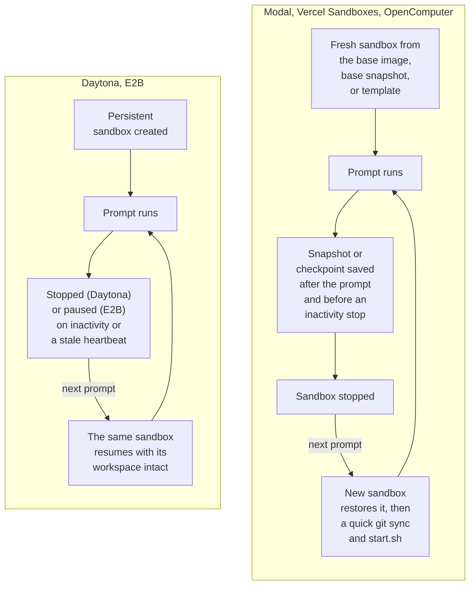

This page compares the sandbox providers a deployment can run on and lists the differences you will notice as a user or administrator.

The provider is chosen by the deployment operator (`sandbox_provider` in the deployment configuration) and applies to every session. Users cannot switch providers from the app. Setup instructions live in the repository docs linked at the end of this page.

Every provider runs the same sandbox runtime: Debian Linux with Node.js 22, Python 3.12, git, the package managers, `agent-browser` with headless Chromium, and the OpenCode and Claude Agent harnesses. The differences are in how sandboxes start, how saved state is kept, and which [sandbox settings](/configure/sandbox-settings) the provider honors.

## Comparison

|                                | Modal                                                   | Daytona                                                                          | Vercel Sandboxes                                              | OpenComputer                                                  | E2B                                                                                   |
| ------------------------------ | ------------------------------------------------------- | -------------------------------------------------------------------------------- | ------------------------------------------------------------- | ------------------------------------------------------------- | ------------------------------------------------------------------------------------- |
| Startup model                  | Fresh sandbox from the base runtime image; near-instant | Persistent sandbox created from a base snapshot                                  | Fresh sandbox from a base-runtime snapshot                    | Fresh sandbox from a managed template                         | Fresh sandbox from a managed template                                                 |
| Saved-state model              | Filesystem snapshot restore                             | Persistent sandbox: stopped on inactivity or stale heartbeat, then started again | Filesystem snapshot restore                                   | Checkpoint restore; OpenComputer owns hibernation and wake-up | Persistent sandbox: paused on inactivity, resumed on the next prompt                  |
| Prebuilt images                | Yes (Modal image)                                       | Yes, once the operator opens admission (snapshot)                                | Yes (snapshot)                                                | Yes (checkpoint)                                              | Yes (snapshot)                                                                        |
| CPU and memory settings        | Yes                                                     | No                                                                               | Yes, mapped to vCPUs                                          | No                                                            | No                                                                                    |
| Sandbox timeout setting        | Yes                                                     | No                                                                               | Yes                                                           | Yes                                                           | Yes                                                                                   |
| Lifetime limits in the sources | None stated                                             | None stated                                                                      | 45-minute sandbox lifetime; image builds capped at 35 minutes | None stated                                                   | Operator-set TTL (default 2 hours; about 1 hour on the Hobby tier); auto-pause at TTL |

"Yes" for CPU and memory means the `cpuCores` and `memoryMib` fields under Settings › Sandbox take effect. On providers marked "No", those fields are dropped from the session's effective settings. The same applies to `sandboxTimeoutMs` where the timeout column says "No". The settings page hides the fields the current provider cannot honor.

Saved state matters for follow-up prompts: on Modal, Vercel, and OpenComputer a resumed session restores a snapshot or checkpoint, then runs a quick git sync and `start.sh`. On Daytona and E2B the same sandbox is stopped or paused and later resumed in place, with the workspace as it was.

The two saved-state models side by side:

## Modal

- Sessions start from the base runtime image and restore from filesystem snapshots taken after each completed prompt and before inactivity shutdown.
- Prebuilt images are stored as Modal images and follow the shared build lifecycle.
- CPU, memory, and sandbox timeout settings all apply.

## Daytona

- Sandboxes are persistent. On inactivity or a stale heartbeat the control plane stops the sandbox, and the next prompt starts the same sandbox again.
- Prebuilt images are captured as snapshots from a stopped build sandbox. New builds and prebuilt-image boots are admitted only after the operator opens admission (`daytona_prebuilds_enabled`, off by default). Until then Settings › Images and Settings › Environments show "Prebuilds are paused for this deployment"; toggles still record intent and existing images keep working.
- CPU, memory, and sandbox timeout settings are not honored; sandbox memory is inherited from the deployment's base snapshot.

## Vercel Sandboxes

- Fresh sessions start from a base-runtime snapshot the deployment builds, or from a prebuilt-image snapshot when one matches.
- Saved state is a filesystem snapshot; inactive sessions are snapshotted and stopped.
- `cpuCores` is the requested vCPU count and `memoryMib` a minimum memory request converted at 2 GB per vCPU. Requests between supported sizes (1, 2, 4, or 8 vCPUs) round up; requests above 8 vCPUs or 16 GB fail with a provider error. With both fields unset, Vercel's default (2 vCPU, 4 GB) applies.
- Vercel limits a sandbox to 45 minutes, so image-build execution is capped at 35 minutes to leave room for finalization.

## OpenComputer

- Sessions start from a managed template. OpenComputer owns hibernation and wake-up, so OpenInspect does not stop these sandboxes itself in normal operation.
- Prebuilt images are stored as checkpoints and restored for matching sessions.
- The sandbox timeout setting applies; CPU and memory settings do not.
- A deployment-wide Anthropic key, when configured, is available in these sandboxes; a secret of the same name in Settings › Secrets overrides it.

## E2B

- Sessions start from a managed template. Idle sessions are paused after the shared inactivity timeout (10 minutes by default) rather than destroyed, and the next prompt resumes the paused sandbox with its workspace intact. If E2B has dropped the sandbox in the meantime, a fresh one is spawned.
- The sandbox TTL is set by the operator (2 hours by default; the E2B Hobby tier caps runtime at about 1 hour). With auto-pause on, reaching the TTL pauses the sandbox instead of killing it. Agent activity inside the sandbox does not extend the TTL.
- Prebuilt images are snapshots of a build sandbox and boot like any other session.
- The sandbox timeout setting applies; CPU and memory settings do not. Template size is set by the operator.
- E2B sandboxes take every model API key from Settings › Secrets; there is no deployment-wide key.

## Provider setup

Provider selection and credentials are operator tasks documented in the repository:

- [Getting started (all providers)](https://github.com/ColeMurray/background-agents/blob/main/docs/GETTING_STARTED.md)
- [Vercel Sandbox provider](https://github.com/ColeMurray/background-agents/blob/main/docs/VERCEL_SANDBOX_PROVIDER.md)
- [OpenComputer provider](https://github.com/ColeMurray/background-agents/blob/main/docs/OPENCOMPUTER_PROVIDER.md)
- [E2B sandbox provider](https://github.com/ColeMurray/background-agents/blob/main/docs/E2B_SANDBOX_PROVIDER.md)
- [Daytona prebuilds and admission](https://github.com/ColeMurray/background-agents/blob/main/docs/IMAGE_PREBUILD.md#daytona-prebuilds)

When switching providers, keep the previous provider's credentials configured until its pending image cleanup has drained; cleanup runs against the provider each build was recorded on.

## Next steps

- [Sandbox settings](/configure/sandbox-settings)
- [Prebuilt images](/configure/prebuilt-images)
- [Deployment](/administration/deployment)
