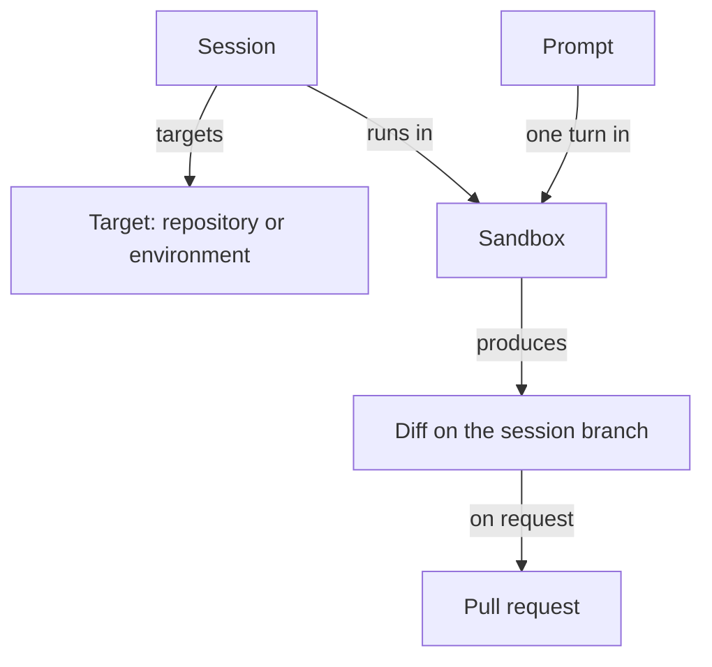

This page defines the terms you will meet everywhere else in these docs.

## Session

A session is the unit of work: one conversation with the agent about one target. It is a durable record that holds your prompts, the event timeline, artifacts, participants, and a reference to the current sandbox. It survives your browser closing and outlives any single sandbox. Every session is visible to the whole workspace, and anyone with collaboration access can prompt it. A session can be archived and later restored.

Learn more: [Session page](/sessions/session-page), [Lifecycle and statuses](/sessions/lifecycle-and-statuses).

## Sandbox

A sandbox is the isolated runtime where the agent actually works: a Linux environment with Node.js, Python, git, a headless browser, and the agent harness. The deployment's configured sandbox provider creates it. A sandbox boots fresh (clone, `setup.sh`, `start.sh`), from a prebuilt image (setup already done), or from a snapshot of a previous sandbox for the same session (dependencies and branch already in place). A session has many sandboxes over its life; the sandbox is disposable, the session is not.

Learn more: [Sandbox providers](/configure/sandbox-providers), [Sandbox environment](/reference/sandbox-environment).

## Target

The target is what the sandbox works on, chosen when the session is created: a single repository at a chosen branch, an ad-hoc set of up to 10 repositories, a saved environment, or no repository at all. In any multi-repository target the first repository is the primary; it decides which per-repository settings apply and wins secret key collisions. Each repository is cloned into its own directory under `/workspace`.

Learn more: [Quickstart](/getting-started/quickstart), [Environments](/configure/environments).

## Environment

An environment is a saved, named repository set with a base branch per repository. It carries its own secrets (global secrets plus the environment's, never the member repositories' secrets) and can have prebuilt images so sessions boot in seconds. Sessions snapshot the environment at creation; editing or deleting the environment later does not change what an existing session works on.

Learn more: [Environments](/configure/environments), [Prebuilt images](/configure/prebuilt-images).

## Prompt and follow-up

A prompt is one message to the agent, optionally with images. While a prompt is running, further prompts are queued and run in order once the current one finishes. **Stop** ends the running prompt; queued prompts still run afterwards. A queued prompt can be removed from the queue before it starts. Cancelling a session is different: it ends the session, stops its sandbox, and the session accepts no more prompts.

Learn more: [Follow-ups and stopping](/sessions/follow-ups-and-stopping).

## Harness

The harness is the agent program that runs inside the sandbox. **OpenCode** is the default and runs every enabled model. **Claude Agent** runs Anthropic models only and can use a connected Claude account instead of an API key. Every session runs on exactly one harness, chosen at creation and fixed for its life; child sessions inherit it. Slack, GitHub, Linear, and automation launches run on OpenCode.

Learn more: [Agent harnesses](/models/agent-harnesses).

## Model and provider account

The model is the language model behind the harness, chosen per session from the set enabled under Settings › Models, with a reasoning effort where the model supports one. A provider account is a connected subscription (OpenAI, xAI, or Anthropic) that a session can use instead of an API key. When both exist, the composer lets you follow the deployment default, pick an account, or use the API key.

Learn more: [Choosing a model](/models/choosing-a-model), [Provider accounts](/models/provider-accounts).

## Managed skill

A managed skill is a reusable instruction file, with optional supporting files, stored in the workspace and assigned to repositories, environments, or everything. At session creation you choose **All applicable**, **None**, or a personal profile; the matching skills are installed into the sandbox before the agent starts and pinned at their current revision for that session.

Learn more: [Managed skills](/configure/managed-skills).

## Automation

An automation starts a new session without a person typing a prompt. Its trigger is a cron schedule or an event: an inbound webhook, a GitHub event, a Slack message, or a Sentry alert. The automation carries the target, harness, model, and instructions for the sessions it creates, and its run history shows each session it started.

Learn more: [Automations](/automations).

## Integration

Integrations connect OpenInspect to the tools where work already happens. Slack starts sessions from mentions and messages and posts results back. GitHub reviews pull requests, answers @mentions, and can feed pull request feedback back into the session that opened it. Linear starts sessions from issue activity. Sessions created this way are the same sessions you see on the web.

Learn more: [Integrations](/integrations).

## Artifact

An artifact is an output the session recorded: a pull request, a screenshot, a video, a preview, or a pushed branch. Pull request artifacts track their state (draft, open, merged, closed) and appear in the sidebar; screenshots and videos appear under **Media**.

Learn more: [Reviewing changes](/sessions/reviewing-changes).

## Participant and attribution

A participant is anyone who has joined a session. Every prompt is tagged with its author, and the commits the agent makes for that prompt are authored as that person, with OpenInspect as the committer. A pull request is created as the prompting user when they signed in with GitHub, otherwise as the GitHub App. Participation records who contributed; it does not grant or remove access.

Learn more: [Multiplayer and sharing](/sessions/multiplayer-and-sharing).

## Workspace and roles

A deployment is one workspace, and the GitHub App installation defines the repositories available to it. Every admitted user has exactly one of four roles: **Owner**, **Administrator**, **Member**, or **Viewer**. Members create and prompt sessions and manage their own automations. Administrators also manage shared settings, integrations, secrets, and members. Owners additionally control who holds the Owner role. Viewers have read-only access. New users start as Members.

Learn more: [Workspace access](/administration/workspace-access).

## How the concepts fit together

A session owns a target and a series of prompts. Each prompt runs as a turn inside the session's current sandbox, and the result is a diff on the session branch and, when you ask for one, a pull request.

## Session status vs sandbox status

The two are independent. Session status is the durable state of the conversation; sandbox status is the state of the current sandbox. A session can be `completed` with a live sandbox still attached, or `active` with no sandbox at all.

| Level   | Values                                                                                                | Accepts new prompts                                                       |
| ------- | ----------------------------------------------------------------------------------------------------- | ------------------------------------------------------------------------- |
| Session | `created`, `active`, `completed`, `failed`, `archived`, `cancelled`                                   | `created`, `active`, `completed`, `failed`; not `archived` or `cancelled` |
| Sandbox | `pending`, `spawning`, `connecting`, `warming`, `ready`, `stale`, `snapshotting`, `stopped`, `failed` | A prompt waits for `ready`; a stopped or failed sandbox is replaced       |

Each prompt also has its own status: `pending`, `processing`, `completed`, or `failed`.

Learn more: [Statuses reference](/reference/statuses).

## Next steps

- [Quickstart](/getting-started/quickstart)
- [When to delegate](/prompting/when-to-delegate)
- [Glossary](/reference/glossary)
