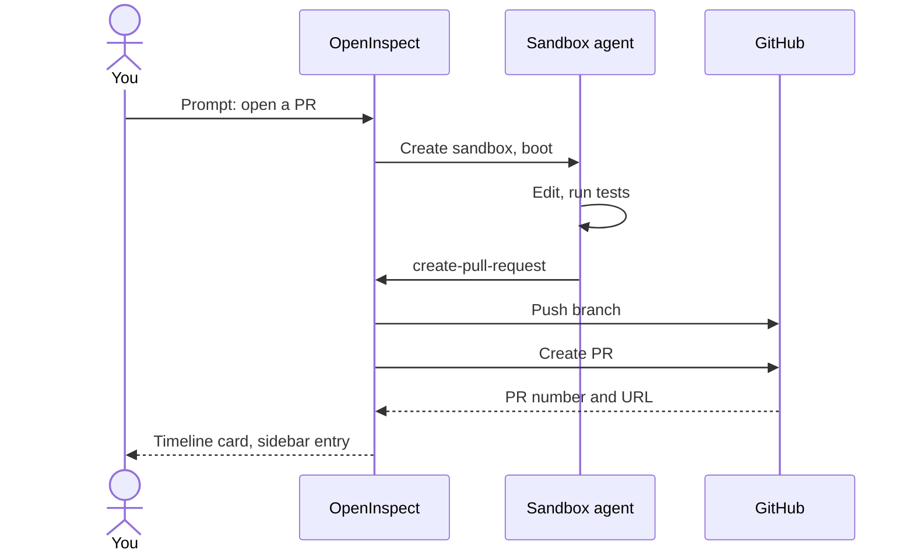

This page walks through the first pull request a session opens for you, from the prompt to the review checklist.

## Prerequisites

- A session targeting at least one repository. Sessions started with **No repository** cannot open pull requests.
- The GitHub App is installed on that repository. The App is what pushes the branch.
- To have the pull request authored as you, sign in with GitHub. Google sign-ins have no GitHub token, so their pull requests are authored by the App.

## Pick a low-risk first task

Choose something you could review in five minutes and would be comfortable merging or closing without discussion: a copy fix, a missing test for an existing function, a small refactor with a clear before and after, or a dependency pin. The goal of the first pull request is to see the whole loop, not to ship a feature.

## Ask for the pull request

Say explicitly that you want a pull request and what its title should communicate. The agent commits on the session's branch, pushes, and opens the pull request itself.

```text
The README's "Local development" section still tells people to run `npm run dev` from the repository root, but that script moved to packages/web. Update the instructions to `npm run dev -w @open-inspect/web`, check the rest of the section for other stale commands, and then open a pull request titled "docs: fix local development commands in README". In the PR body, list each command you changed and why.
```

If you want a draft, say so ("open it as a draft pull request"). Otherwise the pull request is opened ready for review.

## How the agent creates it



The agent uses a built-in `create-pull-request` tool. The sandbox's `gh` wrapper refuses `gh pr create` and points the agent back to the tool, so pull requests always go through the same path:

1. The tool reads the current branch in the repository and sends the title, body, optional base branch, optional target repository (for multi-repository sessions), and the draft flag to the control plane.
2. The control plane pushes the branch with the GitHub App's push credentials. If the session has no named branch yet, it generates one from the session ID (`open-inspect/<session id>`), so every session's work lands on its own branch.
3. The control plane creates the pull request. When the prompting user signed in with GitHub, the pull request is created with that user's OAuth identity, so it appears authored by them and they cannot approve their own work. Otherwise it is created as the GitHub App.
4. The body gets a footer, "Created with" followed by the deployment's app name, linking back to the session.
5. The pull request is recorded as a session artifact and appears in the sidebar.

Commits are attributed to the person who sent the prompt, with OpenInspect as the committer.

### Draft or ready, and labels

- The agent passes `draft: true` only when you ask for a draft. Otherwise the pull request is ready for review.
- Under Settings › Source control, **Always use draft mode** ("Always open pull and merge requests as drafts") forces every pull request to a draft regardless of what the agent asked. **Repository Overrides** can set a single repository to "always draft" or "ready unless requested".
- **Pull request label** applies one label to every pull request a session creates. Leave it blank for no label. Repository overrides can replace it.

See [Source control](/configure/source-control).

## What the timeline shows

The `create-pull-request` call renders as a card in the session timeline. Its summary line changes as the call progresses:

| Summary                           | Meaning                                                                                                                 |
| --------------------------------- | ----------------------------------------------------------------------------------------------------------------------- |
| **Creating pull request**         | The push and creation are in flight.                                                                                    |
| **Opened pull request #N**        | Created. The status badge reads **Open** or **Draft**, and the footer reads "Ready for review" or "Draft pull request". |
| **Updated pull request #N**       | An existing open pull request on the same branch received new commits. The footer reads "Latest commits pushed".        |
| **Create pull request completed** | The call finished with output the card could not classify; the raw output is shown below the card.                      |
| **Create pull request failed**    | The call failed. The card shows the error message under "Couldn't create pull request".                                 |

Expand the card to see the title, the head and base branches ("feature-branch into main"), the body with a "Show full description" toggle, and an **Open PR** button.

## Updating the pull request or opening another

Ask for more changes in the same session and the agent keeps working on the same branch. When it calls `create-pull-request` again from that branch, the open pull request is updated with the latest commits rather than duplicated; the timeline shows **Updated pull request #N**.

To get a second, separate pull request, the agent creates a new branch, commits, and calls the tool again. For a stacked pull request it passes the first pull request's head branch as the base. If the agent tries to reuse a branch that already has an open pull request from a different checkout, the call fails with a message naming that pull request; ask the agent to check out that branch to update it or to create a new branch.

In a multi-repository session, pushes and pull requests are per repository. The tool requires the `repo` argument ("owner/name") in those sessions, and one prompt can produce one pull request in each repository.

## Tracking it from the sidebar

The right sidebar lists every pull request the session created, oldest first, with its number, head branch (when there are several), and a status badge (draft, open, merged, or closed). Multi-repository sessions list them under each repository. The **Sync PR status** button asks GitHub for the current state; updates also arrive from GitHub webhooks, so the badge flips to merged shortly after you merge.

## Optional follow-on: PR Feedback Autofix

An administrator can enable **PR Feedback Autofix** under Settings › Integrations › GitHub. When it is on, a human review or comment on an open pull request that a session created is queued into that session as a follow-up prompt, and the agent addresses the feedback on the same branch. The timeline marks these turns "Resumed by PR feedback". It is off by default. See [GitHub integration](/integrations/github).

## Review it like any other pull request

Nothing about an agent-authored pull request bypasses your repository's process. Before approving:

1. **Base and head.** Confirm the base is the branch you intended (the session's base branch unless the agent was told otherwise) and the head is the session branch shown in the sidebar.
2. **Checks.** Wait for CI. The agent's own test run in the sandbox is evidence, not a substitute.
3. **Diff.** Read the whole diff on GitHub or in the session's **Changes** panel. Look for unrelated files, dropped tests, and changes to configuration or lockfiles you did not ask for.
4. **Evidence.** Match the pull request body against the timeline: the commands the agent ran, their output, and any screenshots under **Media**.
5. **Session link.** The footer links back to the session so reviewers can read the full trajectory.

Branch protection, required reviews, and required status checks apply exactly as they would to a colleague's pull request. When the pull request was authored as you, you cannot approve it yourself.

## Troubleshooting

<Accordions>
  <Accordion title="Create pull request failed: Pull requests require a repository context">
    The session was started with **No repository**, so there is nothing to push to. Start a new
    session against the repository and ask again.

</Accordion>
  <Accordion title="Create pull request failed: this session spans multiple repositories">
    The agent omitted the `repo` argument in a multi-repository session. Tell the agent which
    repository the pull request is for ("open the pull request in acme/api").

</Accordion>
  <Accordion title="Create pull request failed: Failed to push branch, or the sandbox is still starting">
    The push was rejected or the sandbox was not ready. If the message says the sandbox is still
    starting or disconnected, wait for the header to show the sandbox as ready and ask again.
    Otherwise check the branch on GitHub: the App's push was rejected, and the error text names the
    reason.

</Accordion>
  <Accordion title="Create pull request failed: An open pull request already exists for branch ...">
    The branch already carries an open pull request that was created from a different checkout, so
    pushing over it would overwrite that pull request. Ask the agent to check out that branch to
    update it, or to create a new branch for a separate pull request.

</Accordion>
  <Accordion title="Create pull request failed: A pull request is already being created for ...">
    Two calls raced for the same repository. Wait for the first to finish; the timeline will show
    its result.

</Accordion>
  <Accordion title="The agent ran gh pr create and got an error">
    The `gh` wrapper in the sandbox disables `gh pr create` and `gh pr new` with the message "use
    the create-pull-request tool to open a pull request". Ask the agent to use the tool; it normally
    does without prompting.

</Accordion>
  <Accordion title="The pull request is authored by the GitHub App instead of me">
    You signed in with a provider other than GitHub, or your GitHub token could not be retrieved.
    Sign in with GitHub and send the next request that creates a pull request; existing pull
    requests keep their author.

</Accordion>
</Accordions>

## Next steps

- [Reviewing changes](/sessions/reviewing-changes)
- [Source control settings](/configure/source-control)
- [GitHub integration](/integrations/github)
