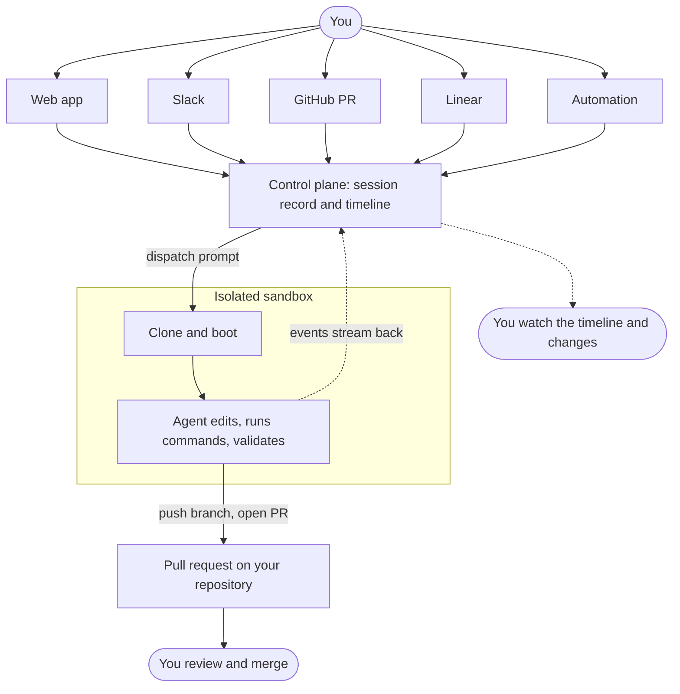

OpenInspect is a background coding agent. You describe a piece of work, the agent runs it in an isolated cloud sandbox with a full development environment, and you come back to review the result: a response, a diff, and usually a pull request.

The agent does not need you to stay connected. Send a prompt from the web app, Slack, a GitHub pull request, a Linear issue, or an automation, close the tab, and check the session later. Several people can watch and prompt the same session at the same time, and every commit is attributed to the person who asked for it.

## Start here

<Cards>
  <Card
    title="Quickstart"
    href="/getting-started/quickstart"
    description="Sign in, start a session against a repository, and read the first result."
  />
  <Card
    title="Your first pull request"
    href="/getting-started/first-pull-request"
    description="Ask the agent for a pull request, see how it is created, and review it like any other."
  />
  <Card
    title="Writing prompts that work"
    href="/prompting/writing-prompts"
    description="Give the agent a bounded task, the context it needs, and a definition of done."
  />
  <Card
    title="Automations"
    href="/automations"
    description="Start sessions on a schedule or when a webhook, GitHub, Slack, or Sentry event arrives."
  />
</Cards>

## One lifecycle

Every session, whether it starts from the web composer, a Slack message, or an automation, follows the same path.
Every session, whether it starts from the web composer, a Slack message, or an automation, follows the same path.

1. **Choose a target.** A single repository and branch, an ad-hoc set of up to 10 repositories, a saved environment, or no repository at all.
2. **Describe the work.** One prompt with the goal, the constraints, and how the agent should prove it is done. Images can be attached.
3. **The agent works in a sandbox.** OpenInspect creates an isolated sandbox, clones the repositories, runs the repository's setup and start scripts, installs managed skills, and starts the agent. Your prompt waits until the sandbox reports ready.
4. **Monitor the timeline.** Tool calls, file edits, commands, and the agent's text stream into the session page as they happen. Follow-up prompts are queued in order; you can stop the running one.
5. **Review evidence and changes.** Read the final response, open **Changes** for the diff compared with session start, and check the tests, screenshots, or other verification the agent produced.
6. **Iterate, open a pull request, or take over.** Send another prompt on the same branch, ask for a pull request, or open the sandbox terminal and code server and finish the work yourself.

## Capability map

| Area           | What it covers                                                                                                              | Start with                                           |
| -------------- | --------------------------------------------------------------------------------------------------------------------------- | ---------------------------------------------------- |
| Sessions       | The session page, follow-ups and stopping, reviewing diffs, sandbox tools, sharing, child sessions, statuses, and recovery. | [Session page](/sessions/session-page)               |
| Prompting      | When to delegate, how to write a prompt the agent can finish, templates, and workflow recipes.                              | [When to delegate](/prompting/when-to-delegate)      |
| Configuration  | Lifecycle scripts, environments, prebuilt images, secrets, sandbox settings, source control, skills, MCP servers.           | [Lifecycle scripts](/configure/lifecycle-scripts)    |
| Models         | Choosing a model and reasoning effort, the two agent harnesses, and provider accounts.                                      | [Choosing a model](/models/choosing-a-model)         |
| Automations    | Sessions started by a schedule, an inbound webhook, a GitHub event, a Slack message, or a Sentry alert.                     | [Automations](/automations)                          |
| Integrations   | Slack, GitHub (reviews, mentions, PR Feedback Autofix), and Linear.                                                         | [Integrations](/integrations)                        |
| Administration | Workspace access and roles, the audit log, analytics, data controls, security, and deployment.                              | [Workspace access](/administration/workspace-access) |

## Where people stay in control

The agent proposes changes; it does not merge them. Pull requests it opens are ordinary pull requests on your repository, authored as the person who asked for them when that person signed in with GitHub. Branch protection, required reviews, status checks, and your merge policy apply exactly as they do to a pull request a colleague opened. Every session is visible to the workspace, every prompt is attributed to its author, and administrators can read the audit log to see who did what.
