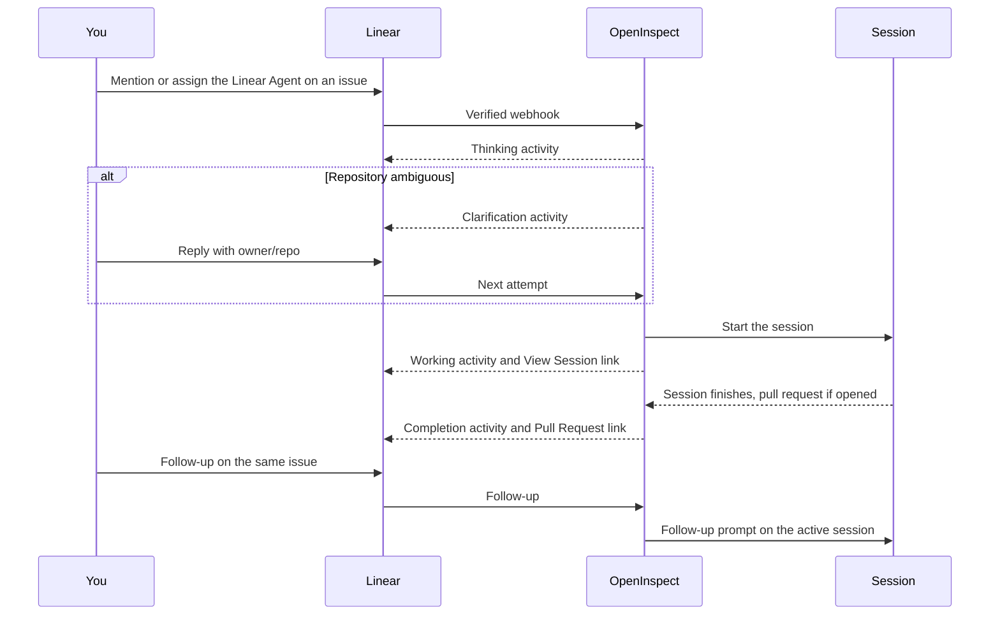

Mention or assign the Linear Agent on an issue to start a session, then use Linear for progress, results, and follow-ups.

This page is for people using Linear day to day. Installing the Linear OAuth app and deploying the worker is operator work; see the [Linear bot setup guide](https://github.com/ColeMurray/background-agents/blob/main/packages/linear-bot/README.md) in the repository.

## Quick start

1. Open the Linear issue you want OpenInspect to work on.
2. Mention the agent in a comment:

   ```text
   @OpenInspect please implement this issue and open a pull request
   ```

3. Or assign the issue to the Linear Agent when the issue already explains the work.
4. Include `owner/repo` if the issue could match more than one repository.
5. Use **View Session** to watch the full session.
6. Send follow-ups through the same active Linear Agent session.

Linear shows the session as agent activities while the work runs elsewhere:



## What Linear can do

| Workflow                    | How it works                                                             |
| --------------------------- | ------------------------------------------------------------------------ |
| Start from an issue mention | Mention the Linear Agent on an issue                                     |
| Start from assignment       | Assign the issue to the Linear Agent                                     |
| Continue active work        | Send a follow-up through the same active Linear Agent session            |
| Stop or cancel work         | Stop or cancel the Linear Agent session to stop the OpenInspect session  |
| Resolve the repository      | Let OpenInspect infer the repository, or include `owner/repo` when asked |
| Follow progress             | Watch Linear activities or open the full session with **View Session**   |

Only a mention or an assignment starts work. Regular issue comments continue work only when they are part of an active Linear Agent session.

## Start, continue, or stop work

### From a mention

Mention the Linear Agent on an issue. OpenInspect uses the issue and recent comments as context, and the triggering comment becomes the instruction, so say what you want done:

```text
@OpenInspect can you fix the failing invite flow described above?
```

### From assignment

Assign the issue to the Linear Agent when the title and description already describe the work. Assignment works best when the issue includes a clear title and description, acceptance criteria or the expected result, the target repository if it is ambiguous, and whether the agent should open a pull request.

### Follow-ups

Follow-up prompts on an issue with an active session go to that session. When available, OpenInspect adds recent agent output as context.

Issue-to-session mappings are kept for 7 days. If the mapping has expired, or the previous session was stopped or cancelled, a new Linear Agent request may start a new session.

### Stop or cancel

Stopping or cancelling the Linear Agent session stops the OpenInspect sandbox session and clears the issue's session mapping.

## Repository selection

Before starting, OpenInspect chooses a repository from the Linear project, team, labels, issue text, comments, and repository metadata. If the issue could match more than one repository, name it in the issue or the trigger comment:

```text
Please handle this in acme/billing-api.
```

If OpenInspect asks for clarification, reply with `owner/repo`; that answer is used on the next attempt.

Administrators can map Linear projects or teams to repositories, and those mappings can point at an environment instead of a single repository, so an issue opens the environment's full workspace. Mapping setup is in the [Linear bot setup guide](https://github.com/ColeMurray/background-agents/blob/main/packages/linear-bot/README.md).

If the resolved repository is outside the Linear **Repository Scope**, Linear shows an error and no session starts.

## What Linear shows

| Activity            | What it means                                                   |
| ------------------- | --------------------------------------------------------------- |
| Thinking            | OpenInspect is analyzing the issue or choosing a repository     |
| Working             | A session has started                                           |
| Tool progress       | Optional updates for file reads, edits, and commands            |
| Clarification       | OpenInspect needs more information, usually the repository name |
| Completion or error | The session finished, failed, or could not continue             |

When a session starts, Linear receives a **View Session** link. If the agent opens a pull request, Linear receives a **Pull Request** link when the session finishes. Live output, logs, artifacts, and file changes are in the web session.

OpenInspect changes an issue's status at most once, when a person starts a session:

| Issue state before                          | What OpenInspect does                                                                                              |
| ------------------------------------------- | ------------------------------------------------------------------------------------------------------------------ |
| Unstarted, session started by a person      | Moves the issue to the team's first `started` workflow state, only after the initial prompt reaches a live sandbox |
| Unstarted, session started by an automation | Nothing                                                                                                            |
| Already started, completed, or cancelled    | Nothing                                                                                                            |
| Any state, on a follow-up                   | Nothing; follow-ups never change status                                                                            |

OpenInspect does not change labels, assignee, priority, or project; pull request workflow changes stay with Linear's GitHub integration.

## Settings › Integrations › Linear

| Setting                                    | What it controls                                                                                                                                         |
| ------------------------------------------ | -------------------------------------------------------------------------------------------------------------------------------------------------------- |
| Default model and Default reasoning effort | Model and reasoning depth for Linear-started sessions                                                                                                    |
| Repository Scope                           | **All repositories** (Linear events can run against every accessible repository) or **Selected repositories** (only the allowlist)                       |
| Issue Session Instructions                 | Custom instructions appended to agent prompts for all Linear issue sessions (coding standards, preferred tools, PR conventions); up to 10,000 characters |
| Allow user model preferences               | Whether admin-managed user preferences can override the model                                                                                            |
| Allow model labels (model:\*)              | Whether a `model:*` issue label can choose the model                                                                                                     |
| Emit tool progress activities              | Whether Linear shows intermediate file and command activity                                                                                              |
| Repository Overrides                       | Per-repository model, effort, tool updates, user preference override, and label model override                                                           |

With no settings configured, all accessible repositories are in scope, user preferences and model labels are allowed, and tool progress is on.

Model selection uses this priority, highest first:

1. A `model:*` issue label, when allowed.
2. The Linear user's preference, when allowed. These preferences are admin or API managed, not set from a Linear screen.
3. The repository override, then the global Linear default.
4. The deployment default model.

## Admin and safety notes

- Linear webhooks are verified before OpenInspect acts on them.
- Linear client credentials, access tokens, webhook secrets, and callback secrets stay server-side. Access tokens are cached and replaced automatically.
- Linear does not provide Git credentials. Repository access comes from the deployment's source-control integration, such as the GitHub App installation.
- **Repository Scope** controls which resolved repositories can receive Linear-started sessions.
- Issue titles, descriptions, comments, and agent prompts are sent to the agent. Do not put secrets in them.

## Troubleshooting

<Accordions>
  <Accordion title="The agent does not appear in Linear">
    The Linear OAuth app must be installed in the workspace with the agent scopes needed for
    mentions and assignment. That is operator setup; see the [Linear bot setup
    guide](https://github.com/ColeMurray/background-agents/blob/main/packages/linear-bot/README.md).

</Accordion>
  <Accordion title="A request does not start">
    Make sure you mentioned or assigned the Linear Agent on an issue, and that the issue resolves to
    a repository OpenInspect can access. If nothing starts even then, an operator can check the
    worker logs for a client-credentials failure; the diagnosis steps are in the repository's
    [Linear integration
    guide](https://github.com/ColeMurray/background-agents/blob/main/docs/integrations/LINEAR.md).

</Accordion>
  <Accordion title="OpenInspect asks which repository to use">
    Reply with `owner/repo`. To avoid future prompts, name the repository in the issue or ask an
    administrator to map the project or team.

</Accordion>
  <Accordion title="I see progress in Linear but need full logs">
    Open **View Session**. Linear shows status and completion activity; transcripts, artifacts, and
    file changes live in the web session.

</Accordion>
  <Accordion title="Linear stays Working after the web session completes">
    Linear leaves Working only when the bot delivers a terminal response or error activity. A
    completion that was skipped does not repair itself later: send another follow-up through the
    same Agent session to produce a new terminal activity, or start a new Agent session if the
    mapping has expired. The log-based diagnosis for operators is in the repository's [Linear
    integration
    guide](https://github.com/ColeMurray/background-agents/blob/main/docs/integrations/LINEAR.md).

</Accordion>
  <Accordion title="The wrong model was used">
    Repository overrides, user preferences, and `model:*` labels all affect selection, in the
    priority order above. Changes apply to new Linear-started sessions.

</Accordion>
  <Accordion title="The wrong repository was used">
    Check project and team mappings, issue labels, repository metadata, and **Repository Scope**.
    For an ambiguous issue, include the intended `owner/repo` in the issue or the trigger comment.

</Accordion>
  <Accordion title="The agent is active in too many repositories">
    Limit the source-control installation to the intended repositories, or set **Repository Scope**
    to **Selected repositories**.

</Accordion>
</Accordions>

## Next steps

- [Follow-ups and stopping a session](/sessions/follow-ups-and-stopping)
- [Choose a model](/models/choosing-a-model)
- [Configure environments](/configure/environments)
