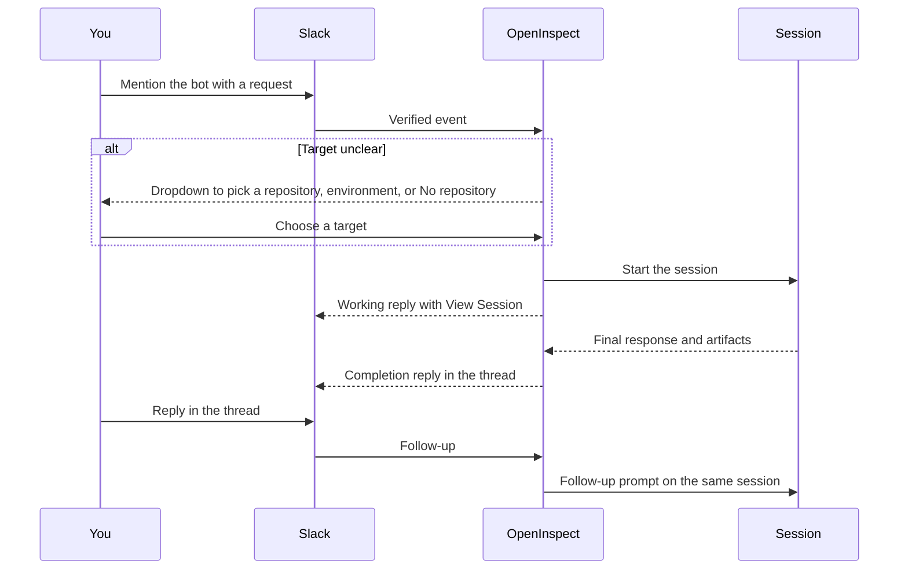

Mention the OpenInspect bot in a channel or DM it, pick a target if asked, and continue the session by replying in the same Slack thread.

This page is for people using Slack day to day. Installing the Slack app and deploying the worker is operator work; see [Getting started](https://github.com/ColeMurray/background-agents/blob/main/docs/GETTING_STARTED.md) in the repository.

## Quick start

<Steps>
<Step>
### Invite the bot

Invite the OpenInspect Slack app to any channel where you want to use it.

</Step>
<Step>
### Send a request

In a channel, mention the bot. In a DM, just type the request.

```text
@OpenInspect fix the failing checkout tests in acme/web
```

</Step>
<Step>
### Pick a target if asked

If OpenInspect cannot tell which repository you mean, choose a repository, an environment, or **No repository** from the dropdown.

</Step>
<Step>
### Follow the work

Use **View Session** to open the full web session while the agent works. Reply in the same thread to continue the session.

</Step>
</Steps>

The whole exchange stays in one Slack thread:



## What Slack can do

| Workflow                       | How it works                                                              |
| ------------------------------ | ------------------------------------------------------------------------- |
| Start from a channel           | Invite the bot, then `@mention` it with a request                         |
| Start from a DM                | Send the bot a direct message                                             |
| Continue a session             | Reply in the same Slack thread                                            |
| Send images to the agent       | Attach PNG, JPEG, WebP, or GIF images to an interactive request           |
| Forward a message              | Share another Slack message with the bot; text, images, and source travel |
| Pick the session target        | Use a repository, environment, or empty sandbox                           |
| Set personal defaults          | Use the Slack app's **Home** tab for model, reasoning effort, and branch  |
| Follow the result              | Read the completion reply or open the full session with **View Session**  |
| Review generated media         | Charts, screenshots, and small recordings can be attached to the thread   |
| Ask the agent to post to Slack | Enable agent notifications, then explicitly ask the agent to post         |
| Auto-trigger from a channel    | Watch a channel so matching messages start an automation                  |

There are no slash commands. In channels, interactive requests need an `@mention`. Ordinary channel messages can only start work through a [Slack message automation](/automations/slack-messages).

## Starting a session

### From a channel

Invite the bot first, then mention it. Name the repository when the request could apply to more than one:

```text
@OpenInspect update the billing docs in acme/api
```

OpenInspect picks a target in this order: a matching [routing rule](#routing-rules), then a channel association, then a classifier that looks at your message, the channel, and recent thread context. The classifier can pick an environment as well as a repository, and it can pick **No repository** when the task does not need a codebase. If the match is unclear, OpenInspect asks you to choose in the thread.

### From a DM

Open a direct message with the bot and send the request. No mention is needed; if you include one, it is stripped before the request reaches the agent.

To continue a DM session, reply in the thread Slack created for that request. A new top-level DM is a new request and may start target selection again.

### Model and reasoning flags

Start a request with `!model` or `!reasoning` to override your App Home defaults:

```text
@OpenInspect !model anthropic/claude-sonnet-4-6 !reasoning max investigate the flaky test
```

| Where you use the flags              | Effect                                                                                                                                                                           |
| ------------------------------------ | -------------------------------------------------------------------------------------------------------------------------------------------------------------------------------- |
| On the request that starts a session | They become that session's defaults. Every follow-up in the thread keeps them. The "Starting work..." acknowledgement names the model when it differs from your App Home default |
| On a follow-up in an existing thread | They apply to that one request only. The session's defaults do not change                                                                                                        |

A running session's defaults cannot be changed. To go back to your defaults for good, start a new session in a new thread. Both flags accept a space or a colon before the value (`!model:openai/gpt-5.6-sol`, `!reasoning:high`), and all flags must appear together at the start of the request. Models must be enabled under Settings › Models, and the reasoning value must be supported by the model.

### Image attachments

Attach PNG, JPEG, WebP, or GIF images to a DM, to a channel request that mentions the bot, or to an interactive thread follow-up, with instructions or on their own (for example a screenshot with "fix the visible error"). Limits: at most six images per message, 10 MiB each. Images on earlier messages in the thread can also be forwarded as context; the current request's images take priority within the six-image limit.

- If OpenInspect asks you to choose a target, choose normally; the images are retrieved after you pick and sent with the saved request.
- If some images cannot be read, the rest still reach the agent and the bot posts a warning in the thread. If an image-only request loses every image, nothing is sent.
- Remote files hosted outside Slack and non-image attachments are not forwarded.

<Callout type="info" title="Slack app scope">
  Inbound images need the Slack app's `files:read` scope, and a reinstall after adding it.
</Callout>

### Forwarded messages

Share (forward) another Slack message to a DM, to a channel request that mentions the bot, or to a thread follow-up. Add a comment such as "deal with this" and the comment becomes the instruction; forward without a comment and the shared message is the whole request.

The agent receives the forwarded text with links as written, its images (same six-image, 10 MiB limits), and its author, source channel, permalink, channel id, and timestamp. You can forward up to ten messages per request; each is truncated at 4,000 characters. Link previews are skipped.

### Target dropdowns

Dropdowns show the repositories and environments accessible to the deployment plus **No repository** (an empty sandbox). They belong to the pending thread, not to a personal repository list. OpenInspect keeps the original request for one hour; once you choose, the session starts with that request and thread context.

In shared channels, only the original requester can choose. If the dropdown has expired, send the request again and name the target.

## Threaded conversations

A top-level request starts a thread. Reply in that thread to send follow-ups to the same session, in channels and in DMs alike. Image attachments on channel follow-ups must accompany an `@mention`; in a DM thread no mention is needed.

The thread stays connected to the session for about 7 days. Replying after that, or outside the thread, may start target selection again and create a new session.

Each follow-up includes up to ten recent thread messages posted after the previous prompt and before the new one, encoded as untrusted records with speaker and timestamp. The bot adds an eyes reaction while it works on a follow-up and removes it when the completion reply is posted.

## What gets posted back

When a request is accepted, OpenInspect posts a working reply in the thread and adds a **View Session** button once the web session exists. When the agent finishes, the completion reply contains:

- The agent's final response, shortened if it is too long for Slack
- Created artifacts such as pull requests or branches
- A few key tool actions, such as edits or commands
- The final status, model, session target, and reasoning effort when available
- A **View Session** button

If the agent created a branch but no pull request, Slack may also show a **Create PR** button. Detailed event logs stay in the web session.

Generated PNG, JPEG, WebP, or MP4 session artifacts are attached to the completion: at most five files, 10 MiB per file, 25 MiB total. Anything beyond that stays available through **View Session**. Files merely written into the repository are not uploaded. Media delivery needs the Slack app's `files:write` scope and a one-time reinstall.

## App Home preferences

Open the OpenInspect app in Slack and go to the **Home** tab.

| Setting          | What it controls                                       |
| ---------------- | ------------------------------------------------------ |
| Model            | The model used when you start a new session from Slack |
| Reasoning effort | Reasoning depth, shown for models that support it      |
| Branch           | A global branch override for new Slack sessions        |
| Branch by repo   | A branch override for one repository                   |

The model list comes from the models enabled under Settings › Models. Branch priority is: repository-specific override, then global override, then the repository default branch. Preferences are per Slack user and affect new sessions only. A `!model` or `!reasoning` flag overrides them for the session it starts, or for a single follow-up, without changing them.

## Settings › Integrations › Slack

Administrators manage these workspace-wide Slack settings.

### Routing rules

Map keywords to repositories or environments under **Routing rules** so common requests route without guessing. With `frontend → acme/web-app` and `api → acme/backend`:

```text
@OpenInspect fix the frontend nav bug        (routes to acme/web-app)
@OpenInspect add the new api endpoint         (routes to acme/backend)
```

| Rule                           | Behavior                                                                         |
| ------------------------------ | -------------------------------------------------------------------------------- |
| Whole words, case-insensitive  | `api` matches "the api is down" but not "rapidly"                                |
| Channels and DMs               | Rules apply everywhere, which helps in DMs where there is no channel association |
| Rules beat channel association | An explicit keyword wins over the channel's default repository                   |
| Ambiguity asks, never guesses  | Two keywords for two repositories open the picker seeded with those candidates   |
| Stale targets are ignored      | A rule whose repository is no longer accessible becomes inert                    |
| Active threads are not moved   | A keyword in a thread reply does not change that session's repository            |

### Session instructions

Set workspace-wide instructions under **Session Instructions**. They are appended to the first prompt of every new Slack-started session as an `## Additional Instructions` section, for standing guidance such as coding standards, preferred tools, or PR conventions. They apply to new sessions only, and are limited to 10,000 characters. Linear has the equivalent **Issue Session Instructions**.

### Agent notifications

Interactive sessions always get their thread replies. Agent notifications are separate: with them enabled, the agent can post an extra message to a channel when you explicitly ask:

```text
When you finish, post a short summary to #eng-updates.
```

1. Turn on **Enable agent notifications**.
2. Invite the OpenInspect bot to every channel agents may post to. Channel membership is the access boundary; remove the bot to remove access.
3. Optionally add repository overrides to inherit, force on, or force off notifications per repository.

Changes apply to new sessions. Slack can still reject missing, archived, inaccessible, or rate-limited targets.

The **Mentions policy** setting is workspace-wide and controls direct user mentions like `<@U123>`:

| Policy | Result                                                                              |
| ------ | ----------------------------------------------------------------------------------- |
| Allow  | Direct user mentions are posted to Slack                                            |
| Escape | Mentions are rewritten as literal text like `@U123`; Slack does not notify the user |
| Strip  | Mentions are removed                                                                |

Broadcast tokens (`@channel`, `@here`, `@everyone`, and subteam mentions) are always stripped from agent notifications.

## Channel message triggers

An automation can start a session when someone posts a matching message in a watched channel, with no mention. Those runs take the message text only (attachments and forwarded bodies are not read), and every thread reply continues the same session for 7 days. See [Slack message triggers](/automations/slack-messages) for conditions, setup, and the threat model.

## Admin and safety notes

- Slack bot tokens stay server-side and are never sent to sandboxes.
- Slack requests are verified before OpenInspect acts on them.
- Slack-created sessions use deployment-level repository access: the repositories shown are those the GitHub App installation can reach, not a per-user list. Slack identity linking is best-effort and does not grant repository access.
- To restrict what Slack sessions can touch, limit the GitHub App installation and invite the bot only into trusted channels.
- Bot messages are ignored, so the bot does not respond to itself.
- Notification text is sanitized and shortened to fit Slack block limits; extremely large raw inputs are rejected.

## Troubleshooting

<Accordions>
  <Accordion title="The bot does not respond in a channel">
    Check that the bot has been invited and that your message mentions it. An ordinary channel
    message only starts a session when it matches a Slack message automation. If setup was just
    changed, an operator should confirm the event subscriptions and interactivity URLs.

</Accordion>
  <Accordion title="DMs do not start sessions">
    The Slack app needs the direct message event subscription configured by an operator. Once it is,
    send a plain DM; no mention is required.

</Accordion>
  <Accordion title="OpenInspect asks which target to use">
    Choose a repository, environment, or **No repository** from the dropdown, or resend the request
    naming the target. The dropdown expires after one hour.

</Accordion>
  <Accordion title="A follow-up started a new session">
    Reply inside the original thread. Mappings last about 7 days, so older threads need a fresh
    request.

</Accordion>
  <Accordion title="An attached image did not reach the agent">
    The app needs the `files:read` scope and a reinstall after it was added. Use PNG, JPEG, WebP, or
    GIF images up to 10 MiB, at most six per message, and mention the bot in channels. The bot may
    also need `channels:history` (public) or `groups:history` (private) to recover file details
    Slack omits from mention events. `files:write` does not grant inbound access.

</Accordion>
  <Accordion title="A forwarded message did not reach the agent">
    The same `channels:history` or `groups:history` scopes let the bot recover a forwarded message's
    content, and images inside it need `files:read`.

</Accordion>
  <Accordion title="The wrong model or branch was used">
    Open the **Home** tab and check your model, reasoning effort, and branch. Repository-specific
    branch overrides beat the global override. Changes apply to new sessions.

</Accordion>
  <Accordion title="The agent could not post a notification">
    In Settings › Integrations › Slack, confirm agent notifications are enabled for the repository
    and that the bot is in the target channel. If Slack rate-limits the post, the web session may
    show retry timing.

</Accordion>
  <Accordion title="The completion looks short">
    Completion replies are shortened to fit Slack limits. Open the web session for the full
    transcript, tool output, screenshots, and artifacts.

</Accordion>
</Accordions>

## Next steps

- [Start automations from channel messages](/automations/slack-messages)
- [Follow-ups and stopping a session](/sessions/follow-ups-and-stopping)
- [Choose a model](/models/choosing-a-model)
