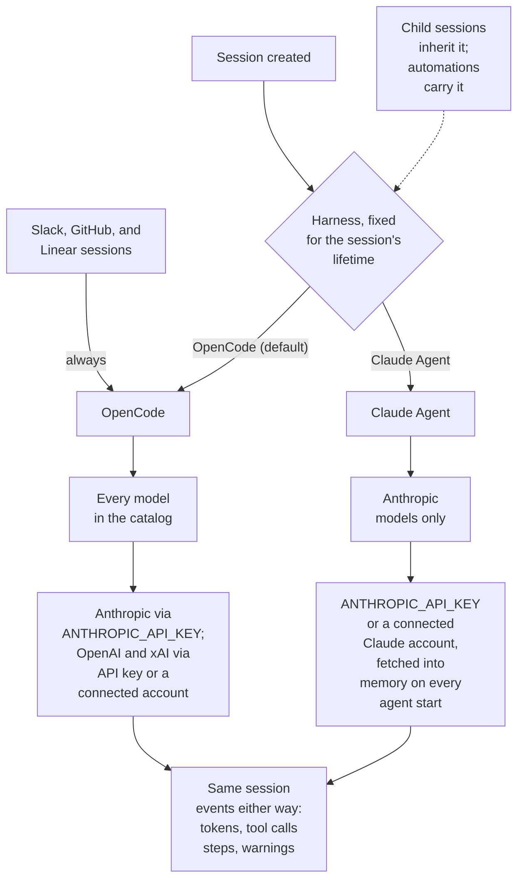

This page explains what an agent harness is, how OpenCode and Claude Agent differ, and what to expect from a Claude Agent session.

## One harness per session

The agent harness is the coding agent that runs inside the sandbox. Every session runs on exactly one harness, chosen when the session is created and fixed for its lifetime, like the base branch.

- Child sessions inherit their parent's harness.
- An automation carries a harness for the sessions it creates.
- Sessions started by Slack, GitHub, and Linear run on OpenCode.
- OpenCode is the default harness.

How the harness choice shapes a session:

Both harnesses emit the same session events (tokens, tool calls, steps, warnings), so the session page, timeline, and diff work the same way on either one.

## Comparison

|                                | OpenCode                                                             | Claude Agent                                                                                         |
| ------------------------------ | -------------------------------------------------------------------- | ---------------------------------------------------------------------------------------------------- |
| Models                         | Every model in the catalog                                           | Anthropic models only                                                                                |
| Anthropic authentication       | `ANTHROPIC_API_KEY` only                                             | `ANTHROPIC_API_KEY` or a connected Claude account                                                    |
| OpenAI and xAI authentication  | API key or a connected account                                       | Not applicable (cannot run those models)                                                             |
| Repository instruction files   | The repository's `.opencode/` directory and `.openinspect/setup.sh`  | Reads the repository's `CLAUDE.md` natively; loads `.claude/` settings, hooks, and agents            |
| Sub-agents                     | The `task` tool; the timeline groups a sub-agent's activity under it | The `Agent` tool; returns only when the sub-agent has finished, grouped in the timeline the same way |
| Follow-up prompts              | Queue until the running turn completes                               | Queue until the running turn completes                                                               |
| Resume after a sandbox restore | By session id                                                        | By session id                                                                                        |

<Callout type="info" title="Installation default Anthropic account">
  A default Claude account set under Settings › Accounts (provider accounts) takes effect only on
  Claude Agent sessions. OpenCode sessions, and the bot and integration sessions that run on
  OpenCode, keep using `ANTHROPIC_API_KEY`, so setting a default never breaks a session that cannot
  use it.
</Callout>

## Choose a harness in the composer

1. Open the model control in the new-session composer. It reads `<harness>: <model> <effort>`.
2. Choose **Agent**, then **OpenCode** or **Claude Agent**. Your last choice is remembered for the next new session.
3. Choose **Model**. The list is filtered to enabled models the chosen harness can run. If none of the enabled models can run on the harness, the composer says `No enabled models can run on Claude Agent.` and blocks submission until you enable one or switch harness.
4. Choose **Effort** if the model supports it, then send your prompt.

Switching harness drops any provider authentication pin the new harness cannot honor (for example a connected Claude account selected for a session you then switch to OpenCode), so you never submit a selection the server would refuse.

Once the session exists, the **Agent** row disappears. Per-message model overrides on the session page are limited to models the harness can run; an override outside that set is rejected with an error such as `Model "openai/gpt-5.5" cannot run on the Claude Agent harness.` rather than replaced.

## Claude Agent sessions

Claude Agent runs Anthropic models through the Claude Agent SDK inside the sandbox. It is the harness that can use a connected Claude subscription instead of an API key.

<Callout type="info">
  Model availability under a Claude subscription is controlled by Anthropic. Confirm the account you
  connect can use the selected model before rolling it out broadly.
</Callout>

### How the credential reaches the sandbox

- The session's Anthropic authentication choice (a connected account or the API key) is fixed when the session is created, before any sandbox starts.
- The platform holds the credential. Nobody signs in inside a sandbox, and the token is never shown in the browser.
- On every start of the agent (fresh spawn, supervised restart, or snapshot restore), the sandbox fetches the token from the control plane and keeps it in memory only. Nothing is written to disk, so a snapshot carries no credential and a restore fetches again.
- The `claude` process sees the ordinary sandbox environment (user secrets, proxies, session context) plus exactly one Anthropic credential: the connected account's token in account mode, or `ANTHROPIC_API_KEY` in key mode, never both. OpenCode, code-server, the terminal, and user shells never see the Claude token.

Code the agent runs from Bash, and any hooks the repository's `.claude/` settings register, run as children of the `claude` process and inherit its environment. That is the same exposure as the sandbox token and user secrets under either harness.

### Tools served to the agent

OpenInspect's own tools are served to Claude Agent in-process as the `oi` MCP server:

| Tool                                                                                         | Available                                               |
| -------------------------------------------------------------------------------------------- | ------------------------------------------------------- |
| Child session tools (`spawn-child`, `send-child-prompt`, `get-child-status`, `cancel-child`) | Always                                                  |
| `upload-media`                                                                               | Always                                                  |
| `create-pull-request`                                                                        | When the session has a repository                       |
| `slack-notify`                                                                               | When agent notifications are enabled for the repository |

Session MCP servers configured under Settings › MCP Servers are passed through unchanged.

### Sub-agents

Background sub-agents are disabled. An `Agent` tool call returns only when its sub-agent has finished, and several sub-agents launched in one message still run concurrently. This keeps a turn from ending before delegated work is done. As a second guard, the harness ignores the result of any turn it did not submit.

### Privacy settings

The harness disables the underlying agent's commit, pull request, and session-link attribution. It also disables nonessential Anthropic traffic, error reporting, feedback and surveys, and both Anthropic and OpenTelemetry usage telemetry. Model requests and OpenInspect's own per-turn cost accounting are unaffected.

### Skills and repository settings

Managed skills and the bundled skills are staged in a per-sandbox Claude configuration directory (`~/.openinspect/claude/skills`). The repository's `.claude/` settings, hooks, and agents load from the project, the same trust boundary as `.openinspect/setup.sh` and `.opencode/` under OpenCode. See [Managed skills](/configure/managed-skills).

### Cost reporting

Claude Agent reports the SDK's client-side cost estimate per turn (the running total at turn end minus the total at turn start, reset when the agent process restarts). Under a subscription the figure is informational, but a session spend limit still applies to it as configured. See [Spend limits](/sessions/spend-limits).

## When a bound Claude account changes

| Change in Settings › Accounts | Effect on sessions bound to that account                                                                                                            |
| ----------------------------- | --------------------------------------------------------------------------------------------------------------------------------------------------- |
| **Disable**                   | The next prompt fails before a sandbox spawns, with guidance to reconnect the account. The next start of the agent on any bound session is refused. |
| **Archive**                   | The next prompt fails with guidance to start a new session with another account or an API key. An archived account cannot be reconnected.           |
| **Reconnect**                 | The account stays active with the new credential. Bound sessions carry on, and their next agent start fetches the new token.                        |
| Recorded expiry approaching   | The account is fenced to **Reconnect required**; the next prompt fails with reconnect guidance.                                                     |

In every case a sandbox that already holds a token keeps it in memory until it exits (inactivity timeout, hard timeout, or a stop), so a turn already running finishes on the old token. To end that sooner, stop the session from the session page. A runtime authentication failure fails the prompt with reconnect guidance and posts an error event; quota and rate-limit warnings keep the account active and appear on the timeline.

## Troubleshooting

<Accordions>
  <Accordion title="The composer offers no connected Claude account">
    The Agent row is set to OpenCode. The authentication control says `OpenCode runs Anthropic on
    its API key; connected accounts are not offered.` Switch to Claude Agent before choosing the
    account.

</Accordion>
  <Accordion title='Prompt fails with "cannot use a connected anthropic account"'>
    The session's harness is OpenCode and its Anthropic authentication was set to an account. Select
    an API key for that session, or create a new session on Claude Agent.

</Accordion>
  <Accordion title="A Claude Agent prompt fails asking you to reconnect the account">
    The bound account is disabled, fenced for expiry, or hit an authentication failure at runtime.
    Reconnect it under Settings › Accounts (provider accounts) and send the prompt again. If the
    account is archived, start a new session with another account or an API key.

</Accordion>
</Accordions>

## Next steps

- [Provider accounts and API keys](/models/provider-accounts)
- [Choosing a model and reasoning effort](/models/choosing-a-model)
- [Child sessions](/sessions/child-sessions)
