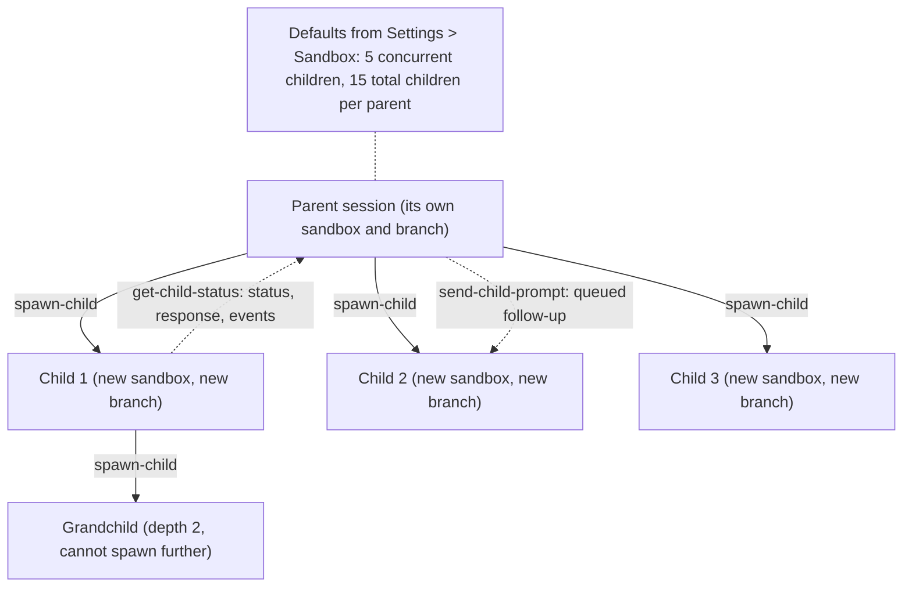

This page explains what child sessions are, how the agent creates and coordinates them, and what to expect when you review their work.

## What a child session is

A child session is a full session that the agent starts from inside another session. The child gets its own sandbox and its own branch, receives a prompt written by the parent agent, and runs independently. The parent continues working while its children run, and it can check on them, send them follow-ups, or cancel them.

Children are useful when a task splits into parts that do not touch the same files: one child per package in a monorepo, one per migration, or one per independent bug. Each child produces its own diff and, if asked, its own pull request.

A child starts with the repository, not the conversation. It knows nothing about the parent's prompt or findings beyond what the parent writes into the child's prompt.

## The child-session tools

The agent has four tools for working with children. They are available on both harnesses.

| Tool                | Arguments                                                                                                                                                                              | What it does                                                                                                                                                  |
| ------------------- | -------------------------------------------------------------------------------------------------------------------------------------------------------------------------------------- | ------------------------------------------------------------------------------------------------------------------------------------------------------------- |
| `spawn-child`       | `title` (shown in the UI), `prompt` (the child's full instructions), optional `model` in `provider/model` form, optional `reasoning` (`none`, `low`, `medium`, `high`, `xhigh`, `max`) | Creates the child in a new sandbox and returns its ID immediately. The parent does not wait for it.                                                           |
| `send-child-prompt` | `childId`, `prompt`                                                                                                                                                                    | Queues a follow-up on a direct child. The prompt runs after the child's current work; it does not interrupt a running turn.                                   |
| `get-child-status`  | optional `childId`; optional `includeResponse`, `includeTrajectory`, `trajectoryLimit`, `trajectoryCursor`, `includeEventData`                                                         | Without a `childId`, lists every child with counts. With one, returns that child's status and, on request, its final response or a page of its event history. |
| `cancel-child`      | `childId`, optional `cancelNested` (default true)                                                                                                                                      | Stops the child's sandbox and sets its status to `cancelled`. Nested children are cancelled with it unless `cancelNested` is false.                           |

`spawn-child` returns as soon as the child is queued, so a parent can start several children in a row and then continue its own work. The tool instructions tell the agent to check status only when it needs a result rather than polling.



## What a child inherits

| Property                           | Behavior                                                                                                                                                                                                |
| ---------------------------------- | ------------------------------------------------------------------------------------------------------------------------------------------------------------------------------------------------------- |
| Repository and environment         | The parent's primary repository and, for environment-launched parents, the same environment. Because secrets are scoped by repository and environment, the child sees the same secrets the parent does. |
| Branch                             | A new branch cut from the parent's base branch. Children do not share the parent's working branch.                                                                                                      |
| Harness                            | Always the parent's harness (OpenCode or Claude Agent).                                                                                                                                                 |
| Model and reasoning effort         | The parent's, unless `spawn-child` overrides them. An override must be an enabled model that the harness supports, and the reasoning effort must be valid for that model.                               |
| Provider authentication            | Inherited from the parent, so a session running on a connected subscription passes that to its children.                                                                                                |
| Managed skills                     | The parent's pinned skills, at the same revisions.                                                                                                                                                      |
| Sandbox settings, code-server, VNC | Resolved from the child's repository and environment, so a child on the same repository gets the same tools as its parent.                                                                              |
| Automation                         | If the parent was started by an automation run, the child is linked to the same run.                                                                                                                    |

## Limits

Two limits come from Settings › Sandbox, under "Limit agent-spawned child sessions to prevent runaway sandbox usage.":

- **Max concurrent child sessions** (default 5): how many of a parent's children can be running at once. A `spawn-child` beyond this fails with "Maximum concurrent children (N) reached".
- **Max total child sessions** (default 15): how many children a parent can create over its lifetime, counting finished ones. Beyond this the tool fails with "Maximum total children (N) reached".

Both can be set globally, per repository, or per environment. See [sandbox settings](/configure/sandbox-settings).

Nesting is also limited. A child can spawn its own children, but a grandchild cannot spawn further ("Maximum spawn depth (2) exceeded"). The limits apply per parent, so the tree can still grow wide if you allow it; keep the totals modest.

## Follow-ups, cancellation, and archiving

- A follow-up the parent sends with `send-child-prompt` enters the child's normal queue and runs after the child's current turn. Follow-ups you type into the child's own page behave the same way.
- A `completed` or `failed` child can be prompted again, by the parent or by you. Its sandbox restores from its snapshot when one is available.
- A `cancelled` child is terminal. It cannot be prompted again by anyone. If the work is still needed, spawn a new child.
- An archived child must be unarchived (from its page or Settings › Data Controls) before it accepts prompts, including follow-ups from the parent.

Cancelling a child does not affect the parent.

## Where children appear

- **The left sidebar.** Children are nested under their parent, indented one level per generation. A child without a title is listed as "Sub-task".
- **The Sessions page.** Children are marked "Sub-task" next to their creator and origin; hovering the mark shows the parent session ID.
- **The parent's sidebar.** The **Child sessions** section lists each child with its title, a status badge (`active`, `completed`, `failed`, `cancelled`, and so on), the state of its pull request if it opened one, and when it was last active. Click a row to open the child.
- **The child's sidebar.** The Metadata section shows a **Parent session** link back to the parent.

The Child sessions section refreshes live as children change status.

## Asking for parallel decomposition

Children are spawned only when your prompt explicitly asks for child sessions. Words like "sub-agent" or "sub-task" make the Claude Agent harness use its in-process Agent tool instead, which runs inside the parent's sandbox. Say "child session" when you want separate sandboxes and branches:

```text
Split this into child sessions, one per package: packages/api, packages/web,
and packages/worker. Each child should replace the deprecated `request`
library with `undici` in its package, run that package's tests, and open a
draft pull request titled "chore(<package>): migrate request to undici".
Do not change shared code. When all three have finished, summarize each
child's PR link and any test failures.
```

Give each child everything it needs in the prompt: the exact files or packages, the definition of done, the tests to run, and whether to open a PR. The child cannot ask the parent for clarification.

## Reviewing children's work

Each child has its own branch and, if it opened one, its own pull request. Review each PR on its own using the [review checklist](/sessions/reviewing-changes); the parent's timeline tells you how the work was divided, but the diffs live in the children. Open each child from the Child sessions section to read its timeline and Changes panel.

When children touch related code, check the PRs against each other before merging: two children that both edit a shared file will conflict, and neither knows about the other's change.

## Troubleshooting

<Accordions>
  <Accordion title="The agent did not create child sessions">
    The prompt has to ask for "child sessions" explicitly. Rephrase using that term. If the agent
    reports "Maximum concurrent children" or "Maximum total children", raise the limits under
    Settings › Sandbox or wait for running children to finish.

</Accordion>
  <Accordion title="A child ignored the parent's follow-up">
    The follow-up is queued behind the child's current turn, exactly like a follow-up you send
    yourself. Open the child and look at its queued prompt stack. If the child is cancelled, it will
    never run; if it is archived, unarchive it first.

</Accordion>
  <Accordion title="The parent cannot see send-child-prompt">
    The tool is installed when a sandbox starts from a runtime image that includes it. A parent
    restored from an older snapshot keeps the older runtime; start a new session to get the current
    tools.

</Accordion>
</Accordions>

## Next steps

- [Follow-ups, stopping, and cancelling](/sessions/follow-ups-and-stopping)
- [Reviewing changes and evidence](/sessions/reviewing-changes)
- [Sandbox settings](/configure/sandbox-settings)
