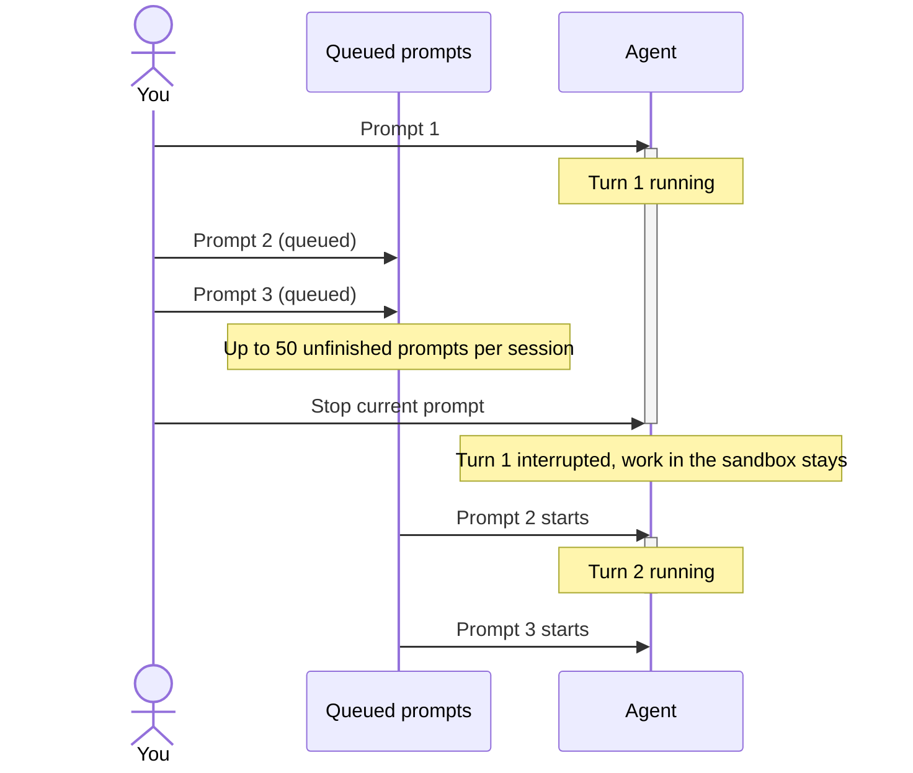

This page explains what happens when you send another prompt into a session that is already working, how to stop a turn, and which session states can still be prompted.

## Sending a follow-up while a turn runs

You can send a prompt at any time. If the agent is still working on an earlier prompt, the new one is queued and runs after the current turn ends. Prompts run in the order you sent them:

```text
Prompt 1 (processing) -> Prompt 2 (queued) -> Prompt 3 (queued)
```

Both harnesses behave the same way here: OpenCode and Claude Agent hold follow-ups until the running turn finishes. A follow-up never interrupts the agent mid-turn.



A session may hold at most 50 unfinished (pending or processing) prompts; see [Limits](/reference/limits).

While a turn runs the composer placeholder changes to "Add a follow-up..." and the send button reads "Queue". Queued prompts stack above the composer under "Queued prompts", in run order. Each row has a "Remove queued prompt" button if you have the `sessions.lifecycle` permission. Removing a prompt puts its text back in the composer so you can edit it and send it again.

A prompt sent while the sandbox is still booting waits until the sandbox is ready, then dispatches. The header shows the boot phase while you wait.

## What a good follow-up contains

The agent already has the conversation and the workspace. A useful follow-up adds something it does not have: new information, a concrete correction, or the next step.

```text
The failing test is tests/billing/test_proration.py::test_partial_month, not the
one you changed. Revert the edit to invoice_totals.py, then fix the rounding in
proration.py so the partial-month amount is rounded half-up to two decimals.
Run the billing tests before you finish.
```

Avoid restating the original task or sending "any update?" style prompts. They queue behind the running turn and cost a full turn to answer. See [writing prompts](/prompting/writing-prompts).

## Stopping the current prompt

While a prompt is running, a red stop button appears in the composer for people with `sessions.lifecycle`. Its tooltip reads "Stop current prompt; queued prompts will continue", and that is exactly what it does:

- The running turn is interrupted.
- Anything already committed or written in the sandbox stays as it is.
- Prompts in the queue are not removed. The next queued prompt starts.

If you want the session to go quiet, remove the queued prompts first, then stop the running turn. Stopping is the right move when the agent is heading in the wrong direction and you want to redirect it with a corrected prompt.

## Cancelled sessions

`cancelled` is a terminal session status. A cancelled session cannot be prompted again, and its sandbox is stopped.

Today only child sessions reach this status: the parent agent cancels a child with its `cancel-child` tool, and nested children are cancelled with it by default. There is no cancel button on the session page for a session you started yourself; stop the turn and archive the session instead. See [child sessions](/sessions/child-sessions).

## Resuming completed or failed sessions

A session whose last turn ended (`completed`) or whose last turn or boot failed (`failed`) still accepts prompts. Send a new prompt and the session picks up where it left off:

- If the sandbox stopped after inactivity, a new one is restored from the latest snapshot and the branch, commits, and installed dependencies come back with it. The header shows "Starting..." and then the boot phases while this happens.
- If no usable snapshot exists (for example the boot itself failed, since no snapshot is taken from a failed boot), the sandbox boots fresh from the repository.

A prompt you type before the sandbox is ready waits and then runs. If the session failed because of the sandbox rather than the task, see [recover from a failed run](/sessions/recover-from-failed-run).

## Archived sessions

Archiving files a session away; it does not delete anything. The composer's send button is disabled on an archived session. To prompt it again, restore it first, either with the "Unarchive" button on the session page or from Settings › Data Controls, which lists archived sessions and restores them. Restoring needs the `sessions.lifecycle` permission.

## When to start a new session instead

A follow-up keeps the agent's context, the branch, and the sandbox state. That is usually what you want, but not always.

| Situation                                                                                               | Action                                                                                |
| ------------------------------------------------------------------------------------------------------- | ------------------------------------------------------------------------------------- |
| The agent is still on task and you have a correction or new detail.                                     | Send a follow-up.                                                                     |
| The agent is going the wrong way right now.                                                             | Stop the current prompt, then send a corrected follow-up.                             |
| You want the session to go idle.                                                                        | Remove queued prompts, then stop the current prompt.                                  |
| The session is completed or failed and the work should continue.                                        | Send a follow-up; the sandbox restores from its snapshot.                             |
| The session is archived.                                                                                | Unarchive it (session page or Settings › Data Controls), then prompt.                 |
| The session is cancelled.                                                                               | Start a new session. Cancelled is terminal.                                           |
| The target changed (different feature, different repository, different base branch).                    | Start a new session. Follow-ups cannot change the repository set or the base branch.  |
| The sandbox environment is corrupted (broken dependencies, half-applied migration, wrong global state). | Start a new session so the agent gets a clean workspace.                              |
| The conversation contains misleading context (a wrong assumption the agent keeps building on).          | Start a new session with a corrected prompt rather than arguing it out in follow-ups. |
| You want the newest managed skills.                                                                     | Start a new session; skills are pinned when a session is created.                     |

## Troubleshooting

<Accordions>
  <Accordion title="Follow-up seems ignored">
    The follow-up is queued behind the running turn, not lost. Look at the "Queued prompts" stack
    above the composer; your prompt runs when the current turn ends. If the sandbox is still
    booting, the header names the phase in progress and the prompt dispatches once the sandbox is
    ready. If you want the follow-up to run now, stop the current prompt.

</Accordion>
  <Accordion title="Stopped but work continued">
    Stop only ends the running turn. A prompt that was already queued started next, which is what
    the button's tooltip warns about. Remove the remaining queued prompts with "Remove queued
    prompt", then stop again if a turn is still running.

</Accordion>
  <Accordion title="Send is disabled">
    The session is archived or cancelled, the session's cost limit is reached (the composer says so
    and tells you to raise or remove the limit), the selected model is unavailable, or you are a
    Viewer. Viewers can read sessions but cannot prompt them.

</Accordion>
</Accordions>

## Next steps

- [Lifecycle and statuses](/sessions/lifecycle-and-statuses)
- [Recover from a failed run](/sessions/recover-from-failed-run)
- [Child sessions](/sessions/child-sessions)
