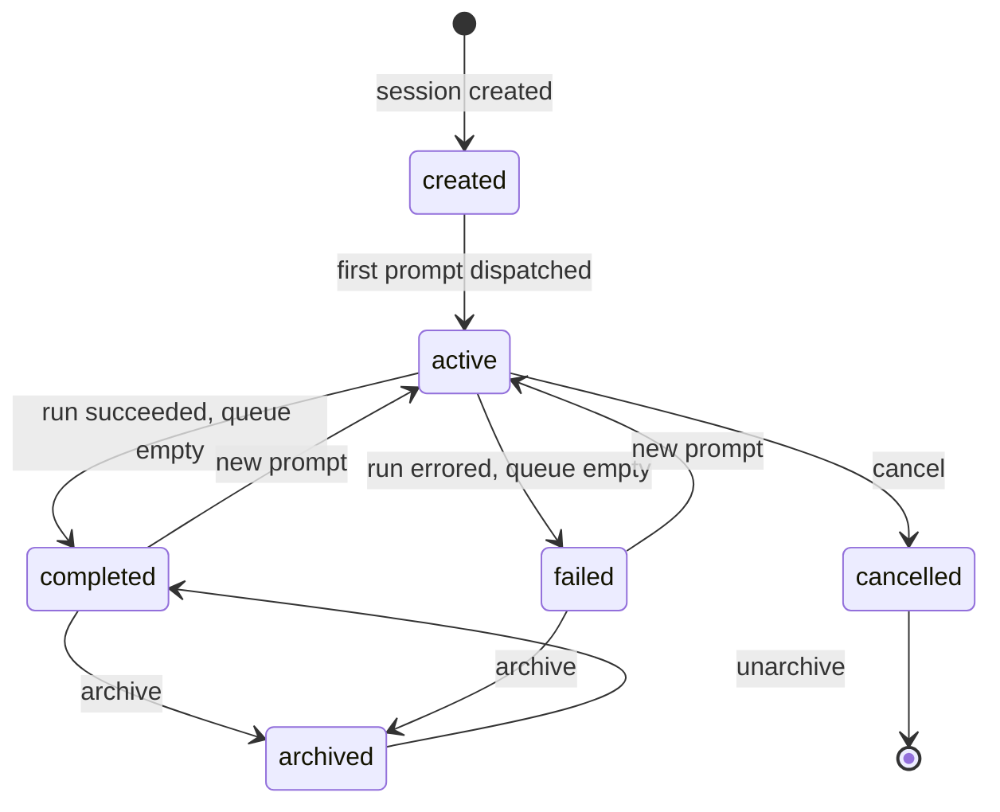
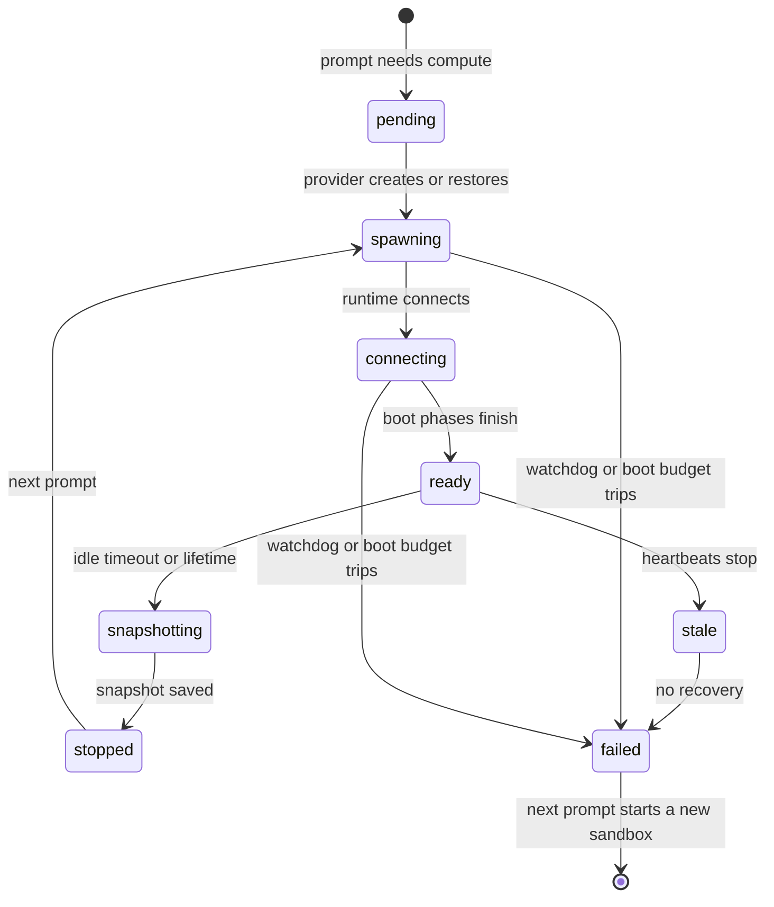

This page explains what a session's status tells you, what the separate sandbox status tells you, and what happens to your work when a sandbox boots, idles out, or fails.

## Two levels of status

A session has two independent statuses:

- The **session status** describes the conversation: whether a prompt is running, whether the last run succeeded, and whether the session is still open. It is durable and survives any number of sandboxes.
- The **sandbox status** describes the current compute attached to the session. A session goes through many sandboxes over its life.

They do not line up one to one. A `completed` session can still have a live sandbox attached, and an `active` session can have none yet (for example, while the first sandbox is being created).

## Session statuses

| Status      | Label in the Sessions list | Meaning                                                    | Can accept a prompt                        |
| ----------- | -------------------------- | ---------------------------------------------------------- | ------------------------------------------ |
| `created`   | Draft                      | The session exists but no prompt has been dispatched yet.  | Yes                                        |
| `active`    | Active                     | A prompt is pending or processing.                         | Yes (it is queued behind the running turn) |
| `completed` | Completed                  | The last run finished successfully and nothing is queued.  | Yes                                        |
| `failed`    | Failed                     | The last run ended in an error and nothing is queued.      | Yes                                        |
| `archived`  | Archived                   | You archived the session. It is hidden from the inbox.     | No, restore it first                       |
| `cancelled` | Cancelled                  | The session was cancelled. Unfinished prompts were closed. | No                                         |

After every run the status settles by itself: back to `active` when more prompts are queued, otherwise `completed` or `failed` depending on the outcome. A session that was cancelled or archived in the meantime stays that way.

How these statuses reach the sidebar inbox is covered in [Inbox, sessions list, and search](/sessions/inbox-and-search). In short: an unread finished turn puts the session under Needs attention, an `active` session sits under In progress, and everything else is under Recent.

## Sandbox statuses

The session header and right sidebar show the sandbox status with these labels:

| Status         | Label         | What it means                                                           |
| -------------- | ------------- | ----------------------------------------------------------------------- |
| `pending`      | Pending       | Waiting for the sandbox to start.                                       |
| `warming`      | Warming...    | Preparing sandbox capacity.                                             |
| `spawning`     | Starting...   | Creating or restoring the sandbox.                                      |
| `connecting`   | Connecting... | The runtime has connected and the boot is under way.                    |
| `ready`        | Ready         | The sandbox is available and prompts dispatch.                          |
| `snapshotting` | Saving...     | A sandbox snapshot is being saved.                                      |
| `stopped`      | Stopped       | The sandbox stopped after inactivity and restarts with the next prompt. |
| `stale`        | Unresponsive  | The sandbox runtime stopped responding.                                 |
| `failed`       | Failed        | The sandbox could not start or recover.                                 |

Sandbox tools such as the terminal and code server are usable only while the sandbox is `ready`.

## How a sandbox boots

A prompt sent during a boot waits and dispatches as soon as the sandbox is ready. The session header names the current phase while it runs: "Starting runtime", "Cloning repository", "Running setup.sh", "Starting services", "Installing skills", "Starting agent". Multi-repository sessions add the repository name, as in "Running setup.sh for acme/api".

There are three boot paths.

| Path             | When it is used                                                                                     | Phases you see                                                                                                        |
| ---------------- | --------------------------------------------------------------------------------------------------- | --------------------------------------------------------------------------------------------------------------------- |
| Fresh start      | First sandbox for a repository with no prebuilt image and no snapshot                               | Cloning, setup.sh, services, skills, agent                                                                            |
| Prebuilt image   | The repository or environment has a Ready image (see [Prebuilt images](/configure/prebuilt-images)) | Cloning (an incremental sync), services, skills, agent. Setup already ran when the image was built                    |
| Snapshot restore | A later prompt in a session that already has a saved snapshot                                       | Services, skills, agent. The restored checkout, including uncommitted work, is kept and the session branch is fetched |

Script failures behave differently by phase:

- A non-zero exit from `.openinspect/setup.sh` is reported as a warning and the boot continues.
- A `.openinspect/start.sh` failure in the session's first repository ends the boot. On a prebuilt image start, a failing `start.sh` fails the start immediately.
- The header's status popover says which phase failed and, when available, which repository. Script output is not collected or shown.

See [Lifecycle scripts](/configure/lifecycle-scripts) for what the scripts can do.

## Boot bounds

There is no fixed limit on how long `setup.sh` or `start.sh` may run. Three bounds apply instead:

| Bound            | Default    | What it covers                                                                                                          |
| ---------------- | ---------- | ----------------------------------------------------------------------------------------------------------------------- |
| Connect watchdog | 4 minutes  | From sandbox creation until the runtime first connects. This is the provider launching the container, not your scripts. |
| Boot budget      | 30 minutes | From sandbox creation until the sandbox is ready. Your operator can change it with `SANDBOX_BOOT_TIMEOUT_MS`.           |
| Heartbeat        | 90 seconds | A runtime that stops sending heartbeats during boot is treated as dead.                                                 |

When any of these trips:

1. The sandbox is marked failed and its credentials are revoked.
2. The prompt that was waiting fails, and the error names the phase that was running (for example, that the boot exceeded 30 minutes while running `setup.sh`).
3. No snapshot is taken, so a half-provisioned workspace never becomes the restore point.
4. Your next prompt starts a new sandbox.

<Callout type="info" title="Older snapshots">
  A snapshot taken by a runtime from before phase reporting still restores, but it reports no phases
  and the whole boot has to finish inside the 4-minute connect watchdog.
</Callout>

## Inactivity and lifetime

Two timers end a sandbox that is not failing:

- **Inactivity.** An idle sandbox is snapshotted and stopped after the inactivity timeout (your operator sets `SANDBOX_INACTIVITY_TIMEOUT_MS`; the default is 10 minutes). The sandbox shows Stopped and restarts on your next prompt.
- **Lifetime.** Settings › Sandbox has a **Session Timeout (minutes)** field that requests a lifetime for each sandbox. Leave it blank to inherit a parent setting or the provider default. The field appears only for providers that honor it (Modal, Vercel, OpenComputer, E2B; not Daytona).
- **Final snapshot buffer.** Also under Settings › Sandbox, **Final snapshot buffer (minutes)** reserves time before provider expiry to stop work, preserve the filesystem, and retire the sandbox. Default 10 minutes, minimum 5.

Settings › Sandbox values can be set globally and overridden per repository and per environment. See [Sandbox settings](/configure/sandbox-settings).

## When your work is saved

A snapshot is taken:

- after each prompt completes successfully,
- before the sandbox is stopped for inactivity or reaches its lifetime,
- when the control plane explicitly requests one.

A snapshot is never taken on a failed boot, and the runtime refuses a snapshot request while it is still booting.

Snapshots include installed dependencies, built artifacts, and workspace state, which is why follow-up prompts are much faster than the first one.

### Providers without snapshots

Not every provider restores from a saved filesystem:

| Provider                    | Resume model                                                                                                                                               |
| --------------------------- | ---------------------------------------------------------------------------------------------------------------------------------------------------------- |
| Modal, Vercel, OpenComputer | Saved filesystem state (snapshot or checkpoint) is restored into a new sandbox.                                                                            |
| Daytona, E2B                | The sandbox is persistent. It is stopped (Daytona) or paused (E2B) on inactivity or a stale heartbeat, and the same sandbox is resumed on the next prompt. |

The status labels are the same on both models. See [Sandbox providers](/configure/sandbox-providers).

## Sandbox warming

When you start typing in the new-session composer, OpenInspect begins warming a sandbox for the selected target and model, so it may already be ready by the time you send the prompt. Changing the target or model starts a new warm-up and retires the previous one. The sandbox shows Warming... while this happens.

## Archive, restore, and cancel

- **Archive** a session from its row menu in the sidebar. The dialog reads "Archive this session? You can restore archived sessions from Settings > Data Controls." Archived sessions leave the inbox and cannot be prompted.
- **Restore** an archived session under Settings › Data Controls with **Unarchive**, or find it on the Sessions page with the Lifecycle filter set to Archived. Restoring requires lifecycle permission. Archived child sessions must also be restored before a parent can send them a follow-up.
- **Cancel** is terminal. A cancelled session closes any unfinished prompts and does not accept new ones. To continue that work, start a new session.
- **Delete** is not available: the web app has no delete control, so sessions are archived, not deleted, and an archived session can always be restored from Settings › Data Controls.

## Troubleshooting

| Symptom                                                             | Cause                                                   | Fix                                                                                                           |
| ------------------------------------------------------------------- | ------------------------------------------------------- | ------------------------------------------------------------------------------------------------------------- |
| The prompt failed with a message naming a boot phase                | The boot budget, connect watchdog, or heartbeat tripped | Send the prompt again; it starts a new sandbox. If `setup.sh` is slow, shorten it or enable a prebuilt image. |
| The Sessions page says Completed but the session header shows Ready | Session and sandbox statuses are separate levels        | Nothing is wrong. The sandbox stays attached until it idles out.                                              |
| The session shows Stopped                                           | The sandbox idled past the inactivity timeout           | Send a prompt. The sandbox restores from its last snapshot or resumes in place.                               |
| A follow-up is refused on an archived session                       | Archived sessions do not accept prompts                 | Unarchive it under Settings › Data Controls, then send the prompt.                                            |

## Next steps

- [Inbox, sessions list, and search](/sessions/inbox-and-search)
- [Recover from a failed run](/sessions/recover-from-failed-run)
- [Sandbox settings](/configure/sandbox-settings)
