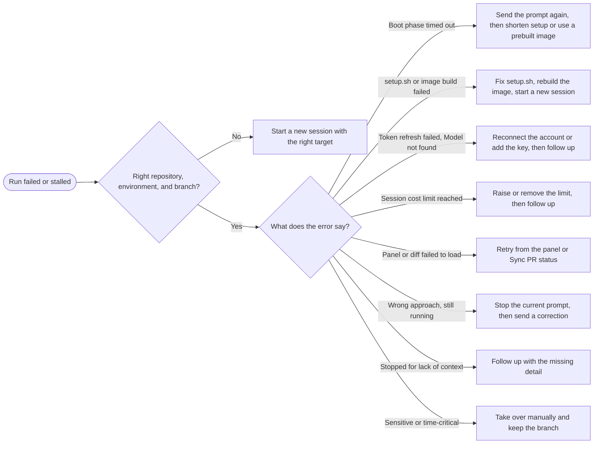

Most failed runs are recovered inside the same session; this page tells you which action fits which failure.

## First, keep the evidence

Before you retry anything, note:

- the session URL (use **Copy link** in the header; it copies `/session/<id>`),
- the error text shown in the timeline or the header's status popover, including any boot phase it names,
- roughly when it happened.

A failed session is not lost. Its status is `failed`, it still accepts prompts, and its last successful snapshot is kept. See [Session lifecycle and statuses](/sessions/lifecycle-and-statuses).

## Decision table

| Situation                                                                            | Recommended action                                                           |
| ------------------------------------------------------------------------------------ | ---------------------------------------------------------------------------- |
| The agent stopped because it lacked context (a missing file, an unclear requirement) | Follow up with the missing detail.                                           |
| The agent is taking the wrong approach and the environment is healthy                | Stop the current prompt, then send a corrective follow-up.                   |
| The diff or a panel failed to load, or the UI shows a transient error                | Retry from the panel.                                                        |
| The run failed on provider authentication (expired account, missing API key)         | Reconnect the account or add the key, then follow up.                        |
| `setup.sh` failed or the prebuilt image build keeps failing                          | Fix `.openinspect/setup.sh`, rebuild the image, start a new session.         |
| The session targets the wrong repository, environment, or branch                     | Start a new session with the right target.                                   |
| The boot timed out                                                                   | Send the prompt again; it starts a new sandbox. Then look at setup duration. |
| The session cost limit was reached                                                   | Raise or remove the limit, then follow up.                                   |
| The change is sensitive or time-critical                                             | Take over manually and keep the branch.                                      |

The same decisions as a flowchart:



## Follow up with missing context

When the agent asks a question or stops short because something was unclear, reply in the same session. The workspace, installed dependencies, and the conversation so far are all still there, and the follow-up restores from the last snapshot.

```text
The API base URL lives in packages/web/.env.example as NEXT_PUBLIC_API_URL. Use that,
and keep the retry logic you already wrote.
```

See [Follow-ups and stopping](/sessions/follow-ups-and-stopping).

## Stop and correct

If the environment is fine but the plan is wrong:

1. Click the stop button in the composer ("Stop current prompt; queued prompts will continue").
2. Send a follow-up that names what to keep and what to change.

Both harnesses hold follow-ups until the running turn completes, so stopping first is what makes the correction take effect immediately.

## Retry a transient failure

- **Changes panel.** When the diff could not be refreshed, the panel shows a notice with a **Retry** button. A file that reads "This patch is too large to display safely." or "This binary file changed" has no text diff to show; review it in the pull request or the terminal instead.
- **Pull request status.** Use **Sync PR status** in the Pull requests section of the right sidebar to refresh a PR whose state looks stale.

## Reconnect an account or add a key

Symptoms: "Token refresh failed", "Model not found", or a prompt that fails in the queue with reconnect guidance.

1. For a provider account (OpenAI, xAI, Anthropic under the Claude Agent harness), open Settings › Accounts and use **Reconnect** on the account. Reconnect must authenticate the same provider identity; if the identity changed, connect a new account. A Claude Agent session whose account was archived cannot be reconnected; start a new session.
2. For API-key mode, add the provider's key under Settings › Secrets in the session's scope (global, the repository, or the environment). New secrets apply to new sandboxes only, so send a prompt after the current sandbox has stopped or start a new session.
3. Send the follow-up.

See [Provider accounts](/models/provider-accounts) and [Secrets](/configure/secrets).

## Fix a setup script or image build

A non-zero `setup.sh` exit is reported as a warning and the boot continues, so a session can start with a broken environment and fail later. A failing `start.sh` in the first repository ends the boot.

1. Read the error next to the failed build under Settings › Images (repository scope) or on the environment's row under Settings › Environments. The message names which repository's script failed.
2. Fix `.openinspect/setup.sh`. Common causes are commands that do not exist in the sandbox (Debian Linux with Node.js, Python, and common dev tools) and builds that exceed the 30-minute build limit.
3. Trigger a rebuild with the refresh button next to the repository or environment, and wait for **Ready**.
4. Start a new session. The old session keeps its snapshot of the broken environment.

See [Lifecycle scripts](/configure/lifecycle-scripts) and [Prebuilt images](/configure/prebuilt-images).

## Wrong target or branch

Repositories, environment, and base branch are fixed when a session is created. Start a new session with the right target and reuse your prompt. If the old session already pushed useful work, mention its branch in the new prompt so the agent can build on it.

## Boot timed out

The error names the phase, for example that the boot exceeded 30 minutes while running `setup.sh`. Nothing from that boot was snapshotted.

1. Send the prompt again. The next prompt starts a new sandbox.
2. If it happens again in the same phase, shorten `setup.sh` or enable a prebuilt image so setup runs at build time instead of on every boot.
3. If setup legitimately needs longer than 30 minutes, ask your operator about the boot budget (`SANDBOX_BOOT_TIMEOUT_MS`).

## Spend limit reached

The timeline shows `Session cost limit reached: $X of $Y. Execution stopped.` and the composer is blocked. The session owner opens the **Budget** section in the right sidebar, clicks **Edit limit**, and raises or removes the limit. Queued prompts dispatch again and a follow-up runs as usual. See [Session spend limits](/sessions/spend-limits).

## Take over manually

When the fix is sensitive or the deadline is close, finish it yourself and keep what the agent produced:

1. If the agent already opened a pull request or pushed its branch, fetch that branch and continue locally. The branch and PR are listed in the Pull requests section of the right sidebar.
2. If nothing was pushed, ask the agent to push its current branch, or use the terminal (when sandbox tools are enabled) to inspect and push the working tree yourself. See [Sandbox tools](/sessions/sandbox-tools).
3. Archive the session once your branch carries the work, so it leaves the inbox.

## Escalation checklist for operators

If none of the above works, give your operator:

- the session ID and a link,
- the timestamp of the failure,
- the boot phase or error text shown (for example "Sandbox boot exceeded 30 minutes while running setup.sh for acme/api"),
- the target: repository or environment, and base branch,
- the harness and model,
- what you already retried and what happened.

Never paste secrets, tokens, or the contents of `.env` files into an escalation.

Operators can trace the failure with the [debugging playbook](https://github.com/ColeMurray/background-agents/blob/main/docs/DEBUGGING_PLAYBOOK.md), which has scenarios for a sandbox that does not connect, a sandbox stuck booting, a failed spawn, a failed snapshot restore, and Slack messages that get no response.

## Next steps

- [Troubleshooting](/sessions/troubleshooting)
- [Follow-ups and stopping](/sessions/follow-ups-and-stopping)
- [Session lifecycle and statuses](/sessions/lifecycle-and-statuses)
