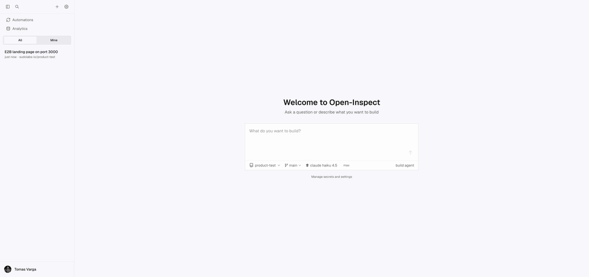
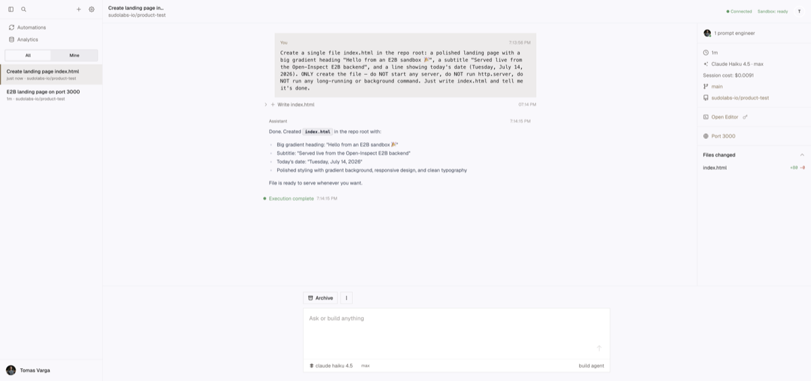
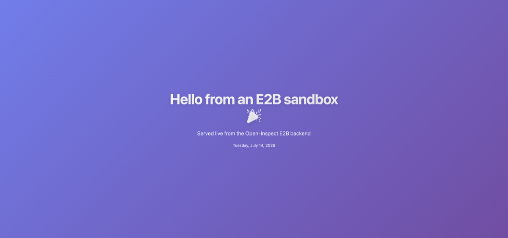

# E2B sandbox backend — live demo

End-to-end, through the real dashboard against a **deployed** control-plane and a **real**
[E2B](https://e2b.dev) cloud sandbox — nothing mocked:

1. Type a prompt on `sudolabs-io/product-test` → the session spawns an E2B sandbox
   (`● Connected · Sandbox: ready`).
2. The agent (`Claude Haiku 4.5`) writes `index.html` in the cloned repo and finishes cleanly
   (`● Execution complete`).
3. The UI surfaces the sandbox's public `*.e2b.app` URLs — code-server on `8080-…`, and the **Port
   3000** preview.
4. Opening the preview shows the page served live from the sandbox.

| Session (completed)               | Preview served from the sandbox       |
| --------------------------------- | ------------------------------------- |
|  |  |

> The static file server on port 3000 is started out-of-band (via the E2B SDK) rather than by the
> agent: opencode's `bash` tool blocks until a launched process exits, so asking the agent to run a
> foreground/daemon `http.server` leaves its turn spinning — an agent-side behaviour, independent of
> the sandbox provider. Keeping the server out of the agent turn lets the agent complete cleanly
> while still demonstrating a live preview from the real E2B box.

A higher-quality screen capture (`e2b-ui-demo.mp4`) sits next to this file.
